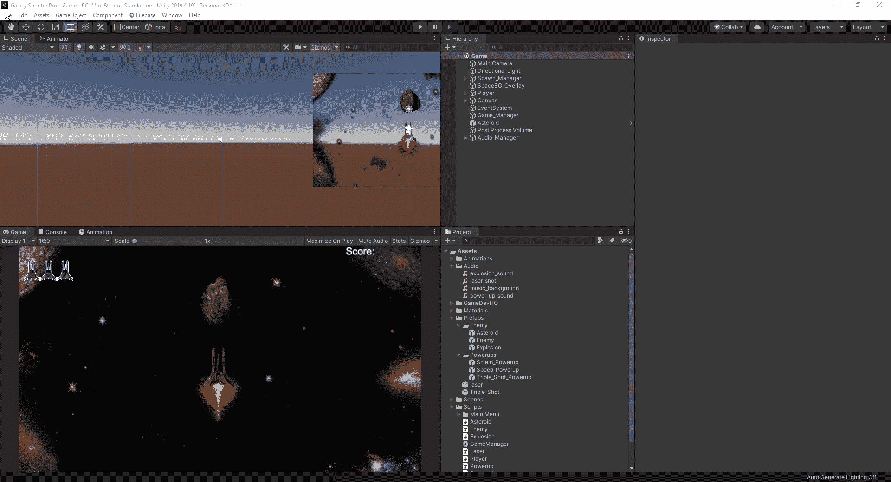
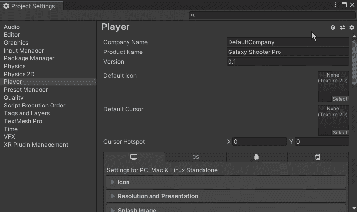
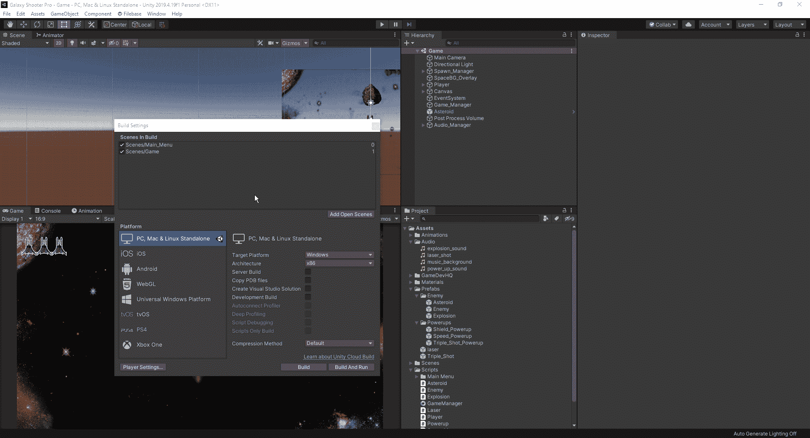
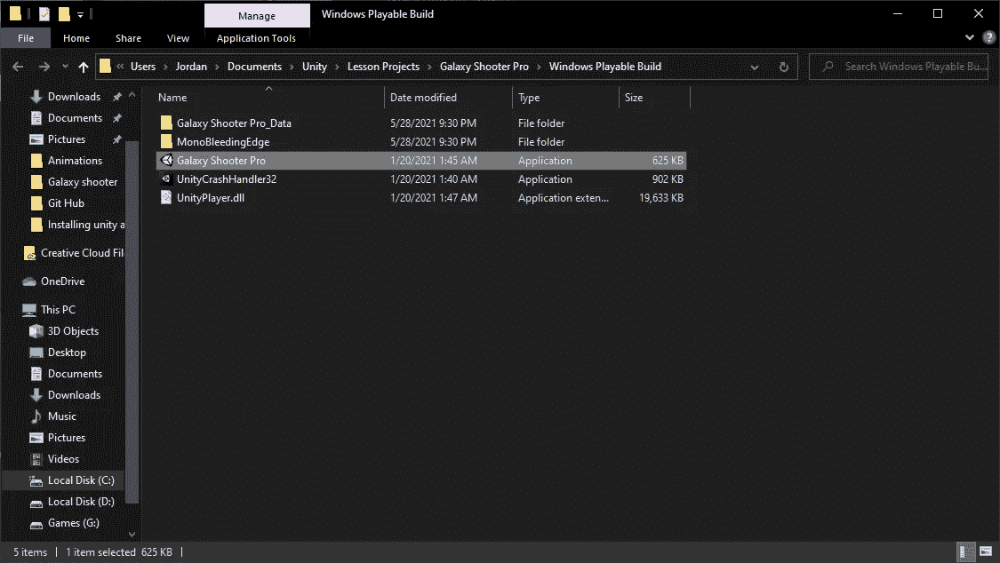
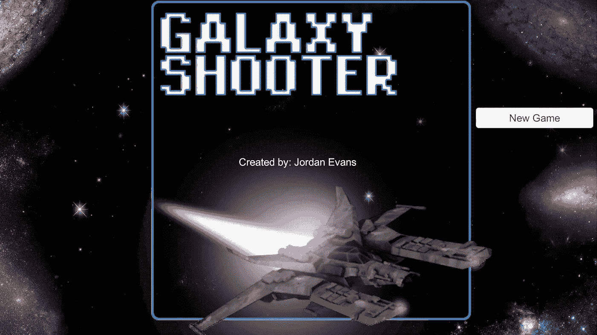

# 如何构建、测试您的 Unity 游戏

> 原文：<https://medium.com/nerd-for-tech/how-to-build-test-your-unity-game-1200b3f77c70?source=collection_archive---------41----------------------->

现在我们已经有了一个可玩的游戏，我们可以期待创造一个可玩的游戏版本。首先，我们只需进入 Unity 编辑器中的文件和构建设置:

从这里，我们可以进入我们的播放器设置，并检查各种不同的设置工作。我们必须确保，如果我们把它设置为全屏，我们实现了一个 esc 键功能，因为 Unity 没有默认设置。

正如我们从上面看到的，我们可以把公司的名字改成我们想要的名字，也可以把游戏的分辨率改成你想要的样子。我们现在可以关闭此窗口，并在构建设置菜单上选择构建:

一旦构建完成，你就可以打开保存它的文件夹，里面有游戏的可用版本。然后我们可以启动游戏，第一次尝试。

当你第一次打开游戏时，你会看到这个快速加载屏幕:

然后，一旦游戏完全加载，我们将看到我们之前制作的主屏幕:

现在我们已经为我们的游戏做了一个构建，我们可以期待着学习如何在网络上托管游戏，这样我们就可以让人们自己尝试它。