# 如何建立你的 LinkedIn 个人资料以获得大量工作机会

> 原文：<https://medium.com/nerd-for-tech/how-to-build-your-linkedin-profile-to-get-lots-of-job-offers-804f14aaaf98?source=collection_archive---------0----------------------->

## 如你所见，我得到了软件开发、全栈工程和机器学习方面的工作机会。不用动一根手指

就在今天，我收到了另一封 LinkedIn DM，是一个想招聘软件工程师的人发来的。这是一个非常有利可图的职位。我不用浪费时间在网上申请，而是可以跳过排队，直接去面试。

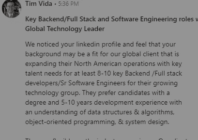

这是他们的首席执行官，直接向我发出采访邀请。我在我的 Twitter 和 Instagram 上分享了我遇到的所有招聘人员/招聘联系人(包括这位),所以确保你跟着我去那里找到工作机会。

我们都知道，尽管对软件工程师的需求越来越大，但在任何科技公司找到工作都很难。*噩梦般的艰难。*这些面试令人困惑，因为它们有大量的级别和无限大的问题池。这就是为什么我创建了[每日简讯《编码采访变得简单》。](https://codinginterviewsmadesimple.substack.com/)

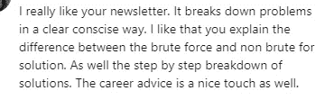

我的时事通讯是游戏中最好的，这是有原因的。不要错过它。

然而，大多数人甚至从未到达这里。他们在简历筛选阶段被公司拒绝。*在数百万申请谷歌的人中，不到 1%的人能进入面试阶段*。这可能是由许多原因造成的。ATSs 可能很残酷，竞争很大，招聘人员甚至不会仔细检查你的简历(这实际上是他们的工作)。获得推荐是可能的，但仍然非常困难。这些都不利于你的机会。

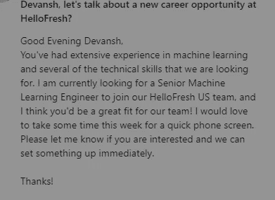

然而，事实并非如此。有一种方法可以成倍增加你获得面试的机会。在这里，你可以看到，使用本文中讨论的技术导致了亚马逊招聘人员的接触。

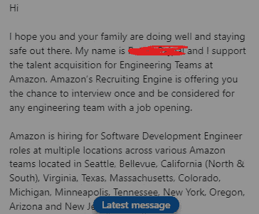

那么这个魔法是什么，你如何开始使用它呢？让我们开始吧。

# 利用平台

让我们把事情搞清楚。对优秀的开发人员有巨大的需求。强调好的一面。这意味着很多事情:

1.  有很多招聘人员在寻找工程师。他们在 LinkedIn 和其他招聘平台上寻找候选人。如果没有对软件开发人员的巨大需求，庞大的招聘行业就不会存在。简单明了。
2.  **公司讨厌误报**。他们宁愿不雇佣某个人，也不愿雇佣一个糟糕的开发者。这就是为什么他们在招聘过程中会如此无情。
3.  你没有得到面试机会的原因是因为在线申请的竞争。因为有这么大的量，你会因为非常武断的原因被裁掉，通常不是因为你自己的过错。

现在你可以让你的简历变得友好，试着穿过所有的障碍，获得面试机会。或者你可以耍点小聪明。使用此处的计划跳过排队，直接进入电话屏幕/面试。

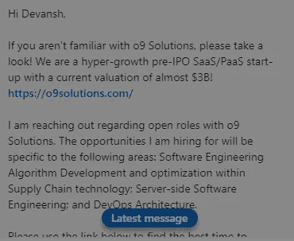

LinkedIn 是一个很好的工具，因为很多招聘人员/专业人士用它来寻找和联系专业人士。把它想象成一个搜索工作相关活动的谷歌。有效地使用我们的 LinkedIn，我们可以在 LinkedIn 搜索中排名很高，得到很多点击和报价。无需花钱购买昂贵的服务和顾问。让我们来看看 LinkedIn 个人资料的各个方面，以及如何让你的个人资料变得令人惊叹。我将引用我的个人资料，[可以在这里找到。](https://www.linkedin.com/in/devansh-devansh-516004168/)请务必在那里与我联系，了解我的最新内容。

照片由 [Cytonn 摄影](https://unsplash.com/@cytonn_photography?utm_source=medium&utm_medium=referral)在 [Unsplash](https://unsplash.com?utm_source=medium&utm_medium=referral) 上拍摄

# 技能和认可

这绝对是你投资回报率最高的一步棋。对于那些不知道的人，LinkedIn 为所有用户提供了一个选项来突出他们擅长的技能。该部分应该如下所示

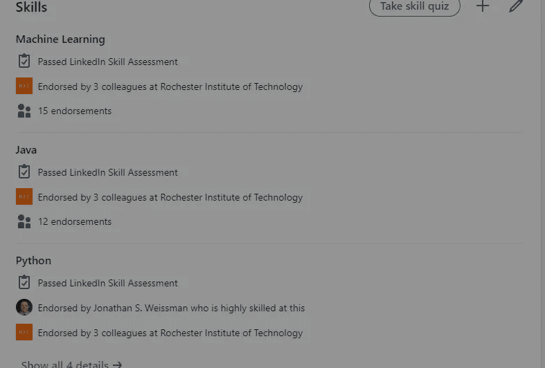

技能评估是游戏规则的改变者。

选择你有丰富经验的技能，并列出来。包括编程语言、版本控制、框架和技能。由于我在人工智能领域工作，我的技能部分非常适合 Python、人工智能、数学和数据处理。你的将取决于你的领域。一旦你用大量相关技能填充了你的个人资料(尽量避免软技能)，开始剔除 LinkedIn 技能评估中的这些技能。尽你所能，因为这些技能非常重要。做得好会给你很高的排名。例如，你可以看到在 Python 评估中，我将参加评估的所有人(300 万人)排在前 5%。这是可实现的最高百分比，正因为如此，我在招聘人员搜索中排名很高。

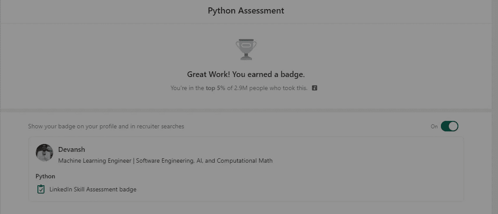

除了技能测验，开始向你的人际网络中的人寻求支持。这将有助于你在排名很高。

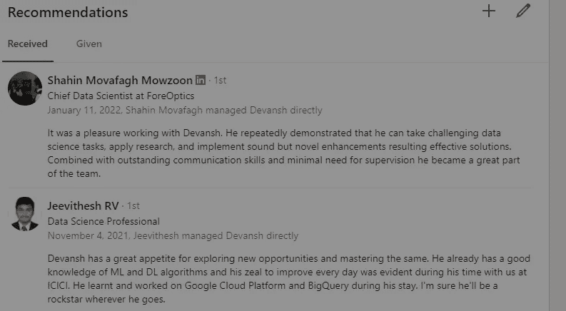

然而，这只是第一步。它将只允许您的个人资料开始在搜索中弹出。然而，下一步是确保合适的人开始联系你。这一点甚至更加重要，因为招聘人员和相关人员只会在浏览你的个人资料后才会联系你。让我们来看看如何让你的个人资料更上一层楼。

# LinkedIn 个人资料提示

先把低垂的果实敲掉吧。弄一张个人资料图片，一张封面图片，把你的标题改成好听的。前两个很简单。网上有很好的指南，可以免费向你展示细节，但基本思路是这样的:

1.  你的个人资料图片要光线好，脸露的清楚，要专业。它不需要模型层，只是不可怕。所以，如果你没有我的美貌，也不要担心。
2.  你的横幅应该代表你是什么。我的是一个简单的黑色背景，我的中间链接，以及文本“机器学习和技术，让所有人都简单。”

这些都无法说服招聘人员主动联系你。他们只是确保你不会被跳过。接下来是你的标语。这很重要，因为它有两个目的。它提升了你的个人资料**和**将是招聘人员在他们的搜索中看到的。

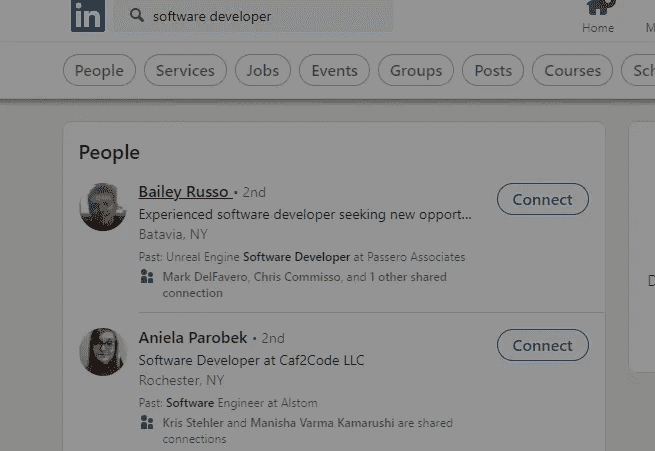

我看到人们犯了把标语写得太长的错误。这是一个巨大的错误，你将受到非常严厉的处罚。相反，我建议用下面的模板保持简单:

职位名称|一些你想突出的技能。

例如，我的标题是:

软件工程师|机器学习、人工智能和计算数学

这有效地概括了我带来的东西。为自己做同样的事。

专业提示:拥有大量人脉是在 LinkedIn 上排名靠前的好方法。然而，利用你的人脉才是真正能帮助你更上一层楼的。我将很快报道它，所以请关注我以保持更新。

与此同时，确保你总是更新你在 LinkedIn 上的所有角色。你可以在每个职位的描述中加入比简历更多的细节，但是要记住，写得太多会让招聘人员不知所措。保持内容要点的格式，类似于你的简历(任务、技术堆栈和数字影响)。

现在我们将进入你个人资料的最后一个超级有影响力的部分。这就是你的“关于”部分。让我们开始吧。

# 关于部分

“关于”部分可以拆分为多个部分。每一部分都建立在前面的基础上，增加了招聘人员应该联系你的理由。让我们开始吧

## 电梯推销术

“关于”部分的第一步应该是电梯推介。这是对你的技能以及你能带来什么的简单概括。我的电梯推销看起来像这样:

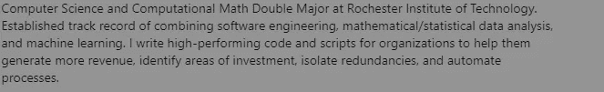

注意随处可见的图案。对我来说，它是数学、ML 和理论 CS。找出你的优势。

## 职业总结

接下来，我们要在我们的职业总结中工作。这将告诉招聘人员/观众你在整个职业生涯中做了什么。在总结的第二部分，你要突出一两个你想强调的优点。看看我的。

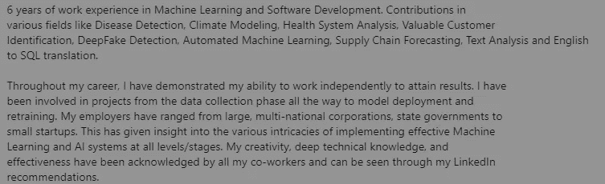

我非常重视自己的独立性和工作能力。这也是为什么我强调自己的独立工作能力，以及在端对端机器学习方面的经验。基于你想从你的职业生涯中得到什么，这会让你看起来不一样。我还强调我经历的多样性，以鼓励不同类型的雇主去接触。

## 显著的成就

你也想用切实的结果来支持你的陈述。这是下一部分的切入点。

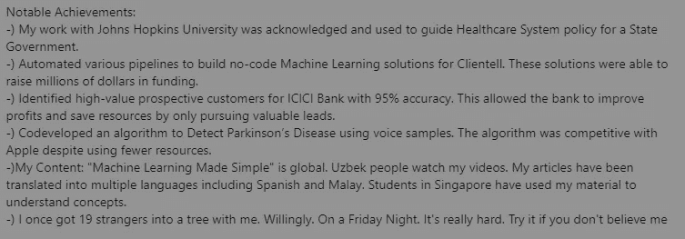

在可能的情况下，您希望展示可量化的结果。我喜欢以更轻松的方式结束(但仍然是真的，而且是我引以为豪的事情！！)，于是树社。

## 技能

这是你的“关于”部分的纯 SEO 部分。用你想展示的技能填满它。你也可以用它来展示你的多样性。然而，根据我的经验，这是 about 中最不重要的部分，应该放在最后。

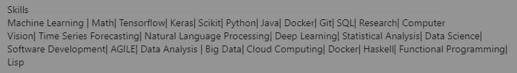

就这样，我要结束了。不要害怕尝试一下你的个人资料。我所提供的只是你可以使用的坚实基础。实施我在这篇文章/邮件中分享的建议，你会看到很多招聘人员对你的 DMs 感兴趣。

为了帮助我写更好的文章和了解你[填写这份调查(匿名)](https://forms.gle/7MfQmKhEhyBTMDUD7)。最多花 3 分钟，让我提高工作质量。请务必使用我的社交媒体链接来获得更多反馈。所有反馈都有助于我提高。

很明显，一旦你得到了面试机会，你就需要在面试中胜出。我的每日时事通讯，[编码采访变得简单](https://codinginterviewsmadesimple.substack.com/)涵盖了算法设计、数学、最近的科技事件、软件工程等主题，让你成为更好的开发者。 [**我目前正在进行全年八折优惠，所以一定要去看看。**](https://codinginterviewsmadesimple.substack.com/subscribe?coupon=1e0532f2)

我创建了[编码面试，使用通过指导多人进入顶级科技公司而发现的新技术，使面试变得简单](https://codinginterviewsmadesimple.substack.com/p/faqs-and-about-this-newsletter?r=4tnbw&s=w&utm_campaign=post&utm_medium=web)。时事通讯旨在帮助你成功，避免你在 Leetcode 上浪费时间。[您可以阅读常见问题解答并在此了解更多信息](https://codinginterviewsmadesimple.substack.com/p/faqs-and-about-this-newsletter?r=4tnbw&s=w&utm_campaign=post&utm_medium=web)

如果你也有任何有趣的工作/项目/想法给我，请随时联系我。总是很乐意听你说完。

以下是我的 Venmo 和 Paypal 对我工作的金钱支持。任何数额都值得赞赏，并有很大帮助。捐赠解锁独家内容，如论文分析、特殊代码、咨询和特定辅导:

https://account.venmo.com/u/FNU-Devansh

贝宝:【paypal.me/ISeeThings 

# 向我伸出手

使用下面的链接查看我的其他内容，了解更多关于辅导的信息，或者只是打个招呼。另外，查看免费的罗宾汉推荐链接。我们都得到一个免费的股票(你不用放任何钱)，对你没有任何风险。**所以不使用它只是失去免费的钱。**

查看我在 Medium 上的其他文章。:[https://rb.gy/zn1aiu](https://rb.gy/oaojch)

我的 YouTube:[https://rb.gy/88iwdd](https://rb.gy/88iwdd)

在 LinkedIn 上联系我。我们来连线:[https://rb.gy/m5ok2y](https://rb.gy/f7ltuj)

我的 insta gram:[https://rb.gy/gmvuy9](https://rb.gy/gmvuy9)

我的推特:[https://twitter.com/Machine01776819](https://twitter.com/Machine01776819)

如果你正在准备编码/技术面试:[https://codinginterviewsmadesimple.substack.com/](https://codinginterviewsmadesimple.substack.com/)

获得罗宾汉的免费股票:[https://join.robinhood.com/fnud75](https://www.youtube.com/redirect?redir_token=QUFFLUhqa0xDdC1jTW9nSU91WXlCSFhEVkJ0emJvN1FaUXxBQ3Jtc0ttWkRObUdfem1DZzIyZElfcXVZNGlVNE1xSUc4aVhSVkxBVGtHMWpmei1lWWVKNzlDUXVJR24ydHBtWG1PSXNaMlBMWDQycnlIVXNMYjJZWjdXcHNZQWNnaFBnQUhCV2dNVERQajFLTTVNMV9NVnA3UQ%3D%3D&q=https%3A%2F%2Fjoin.robinhood.com%2Ffnud75&v=WAYRtSj0ces&event=video_description)