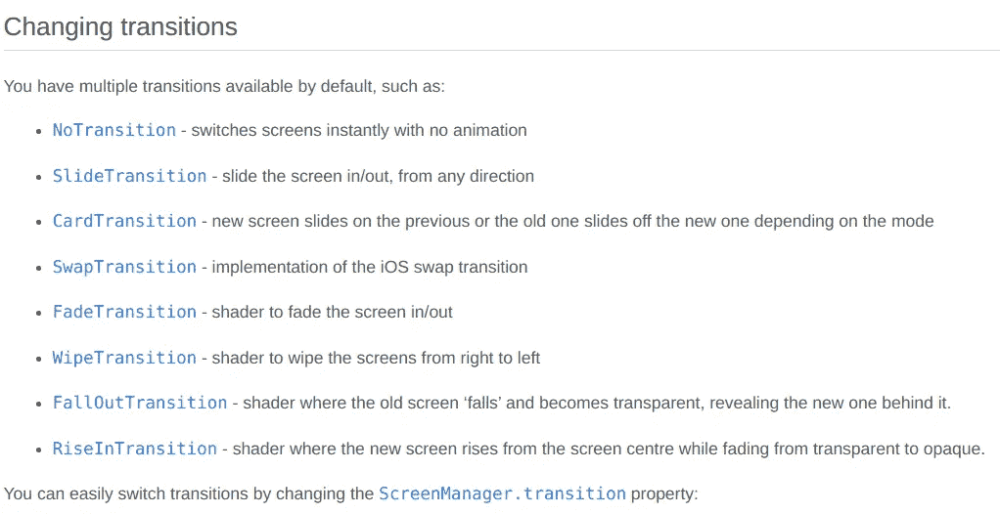

# 如何更改 Kivy 中的屏幕过渡

> 原文：<https://medium.com/nerd-for-tech/how-to-change-the-screen-transition-in-kivy-b05fbfe82d81?source=collection_archive---------2----------------------->

默认的过渡是 SlideTransition，但是有许多不同的类型。您也可以指定 NoTransition。

因为幻灯片切换是默认的，所以没有必要导入任何东西。您需要将所有其他过渡导入到。kv 文件放在您的文件的顶部。

这是一个来自 Kivy 屏幕管理器页面的截图，带有可用的过渡:[https://kivy.org/doc/stable/api-kivy.uix.screenmanager.html](https://kivy.org/doc/stable/api-kivy.uix.screenmanager.html)



在的屏幕管理器中使用此语法。kv 文件改变默认过渡:

```
#: import WipeTransition kivy.uix.screenmanager.WipeTransition<ScreenManager>:
    transition: WipeTransition()
```

您可以更改文件中的过渡。* *重要:一旦您更改了一个位置的过渡，它将应用于所有后续的过渡，除非您专门再次更改它。**

```
#: import WipeTransition kivy.uix.screenmanager.WipeTransition<ExampleScreen>: GridLayout:
        cols: 1 Button:
            text: "Change the Direction of Default SlideTransition":
            on_release:
                root.manager.transition.direction = "right"
                root.manager.current = "new_screen" Button:
            text: "Change Transition Type"
            on_release:
                root.manager.transition = WipeTransition()
                root.manager.current = "new_screen"
```