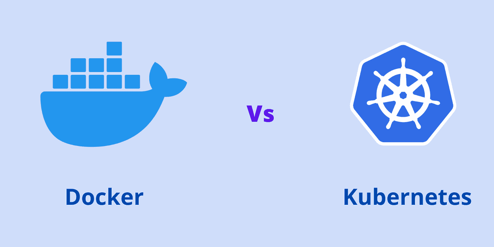
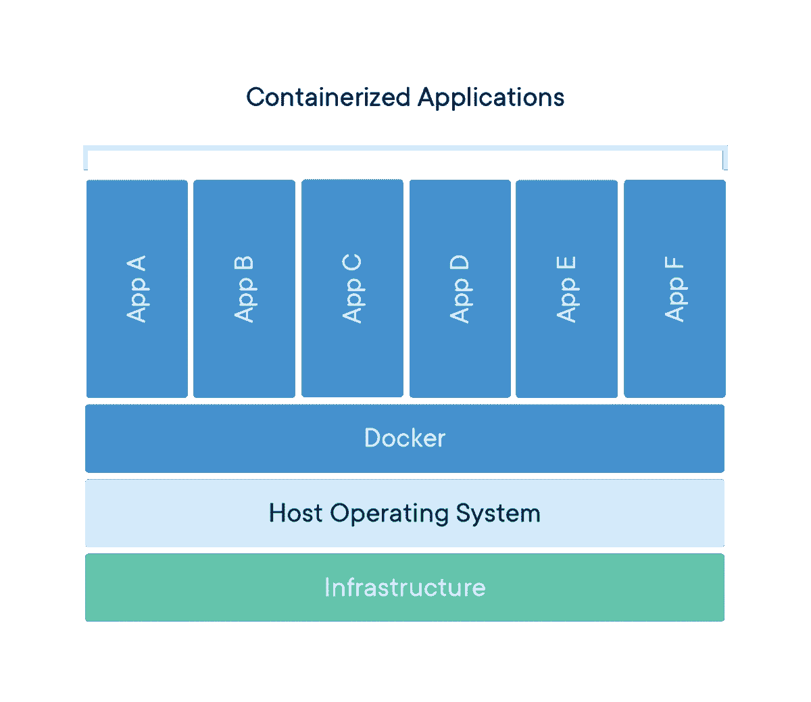
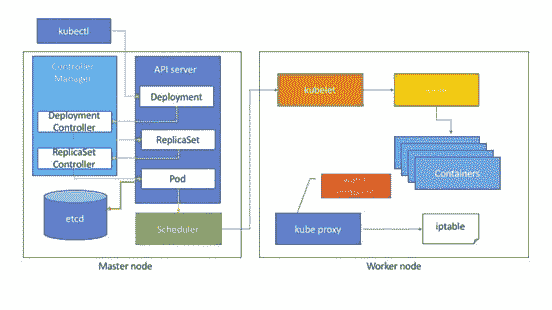

# 如何在 Kubernetes 和 Docker 之间选择

> 原文：<https://medium.com/nerd-for-tech/how-to-choose-between-kubernetes-and-docker-e16321a7d2f?source=collection_archive---------7----------------------->

DevOps 是一套实践/概念，它结合了各种工具来减少开发人员和运营团队之间的差距/问题。DevOps 的目标是通过自动化从本地开发服务器到生产服务器的代码部署，使其变得容易且没有错误，从而减少**开发人员**和**系统管理员**所面临的问题。

如果您是 DevOps 新手或者正在学习 DevOps，您将会在 DevOps 社区中听到两种不同的术语:

> ***Docker 和 Kubernetes***

这两个工具在 DevOps 工作区变得非常流行。许多人经常对使用 **Docker** 和 **Kubernetes** 感到困惑。这是因为许多人不明白什么时候使用 Docker，什么时候使用 Kubernetes。

为了理解使用 Docker 和 Kubernetes 的案例，首先，我们需要知道开发和生产团队在哪里面临一个问题，是什么类型的问题。理解现存的问题是决定我们是否需要 Docker 和 Kubernetes 的关键。第二，我们总是把两者都当成竞争对手的工具。然而，事实并非如此。Kubernetes 和 Docker 是不同的工具。这篇文章包含一个第三方附属链接。

在本文中，我们将讨论以下主题:

1.  [Docker 是什么？](https://www.docker.com/)
2.  我什么时候使用 Docker？
3.  [什么是 Kubernetes？](https://www.openlogic.com/blog/what-is-kubernetes)
4.  我什么时候用 Kubernetes？

# Docker 是什么？

[图像来源](https://www.docker.com/sites/default/files/d8/styles/large/public/2018-11/container-what-is-container.png?itok=vle7kjDj)

首先，我们必须了解传统应用程序开发中的问题领域。从那里，我们就很容易理解为什么要创建 Docker，以及需要在哪里使用它。

假设您正在本地机器上创建一个在您的系统上运行良好的 web 应用程序。但是，当您试图将项目从开发机器转移到测试和生产服务器机器时，您会遇到一些错误——应用程序的一部分可能无法在测试或生产环境中正常工作。

让我们来看一个场景。假设您正在生成一个 PDF，作为应用程序开发的一部分。要生成 PDF，您需要为 PDF 安装第三方库。您可以在本地机器上安装 PDF 库来测试 PDF 生成。它在本地开发机器上运行良好。但是，当您将代码移动到测试和生产服务器时，您未能指导团队或者操作团队未能安装 PDF 库(这种情况经常发生在开发人员身上)。因此，您没有在您的测试和生产服务器上安装 PDF 库，因此 PDF 没有得到渲染。这就成了一个大问题。

开发者会说:“它在我的机器上运行得很好。我不对这个错误负责。”

*运营团队会说:“你必须指导我们解决这个问题。是你造成的，那就整改吧。”*

这是一个经常发生的问题，为了解决这个问题或弥合开发者和运营团队之间的鸿沟，Docker 应运而生。

通过使用 Docker，我们可以创建一个虚拟工作空间( [**容器**](https://www.docker.com/resources/what-container) )并开发您的应用程序(ERP、CRM 等)。)在 Docker 容器内。这个容器装满了你所有的依赖项。您可以从本地开发服务器轻松地将这个容器发布/托管到任何环境(比如测试和生产服务器),而不会有任何问题。因此，使用 Docker 可以自动解决代码/应用程序部署问题，而不会出现任何错误。

# 我什么时候使用 Docker？

使用 Docker，您可以将应用程序从本地开发服务器转移到生产服务器，而不会出现任何错误。强烈建议所有应用程序开发都使用 Docker。Docker 提供了如此多的工具(软件如 NodeJS，PHP，Java，任何数据库等)作为图像。

因此，您可以使用 Docker 轻松安装所需的软件，并为应用程序开发创建一个容器。数据库非常适合 Docker。您可以轻松地将数据库容器从一台机器移动到另一台机器，没有任何问题。如果你正在开发一个复杂的软件应用程序，那么 Docker 将通过自动化代码部署来挽救你的生命。

# 什么是 Kubernetes？

您可以使用 Docker 轻松创建一个容器并托管它。假设您有一个使用 Docker 容器创建的 NodeJS 应用程序，它运行在云服务器上。现在你的应用程序获得了更多的浏览量。这增加了服务器的负载。

一个 NodeJS 实例无法处理所有负载。因此，通过使用 docker run 命令来处理负载，您可以毫不费力地部署 NodeJS 的另一个实例。但是，您现在必须观察您手动添加的每个容器的性能和健康状况。如果负载进一步增加，您必须手动添加更多的容器。

如果容器失败/崩溃，您必须手动修复它。

您通过使用 Docker 解决了部署问题。但是，您不能使用 Docker 自动修复多个容器的故障/崩溃。如果服务器负载增加，您也无法自动添加更多的容器。

为了解决这个问题，Kubernetes 应运而生。通过使用 Kubernetes，您可以轻松地部署 1000 个容器并轻松地管理它们。

> 简单来说，创建 Kubernetes 是为了处理 Docker 上创建的容器。

[图片来源](https://miro.medium.com/max/700/1*yhDiqDdgl6OgmwLnTWeEdg.jpeg)

# 我什么时候用 Kubernetes？

1.  当您想要监控多个容器的健康和性能时。
2.  在一个命令中部署 1000 个容器。
3.  检测集装箱的故障/损坏并修复。
4.  放大和缩小容器的数量。
5.  用于跨集群托管的容器之间的高级联网。
6.  自定义容器的部署。
7.  支持所有云服务环境:许多云提供商提供内置的 Kubernetes 服务。
8.  在一个命令中升级所有容器。
9.  如果出现问题，回滚容器更新。
10.  以支持多种认证和授权服务。

# 总结:

这篇文章清楚地解释了 Docker 和 Kubernetes 的用法。Docker 是一个容器，用于将代码/应用程序从本地开发服务器传送/托管到任何环境(测试和生产服务器)，而不会出现任何错误。另一方面，Kubernetes 用于通过管理容器来编排容器。简单地说，Kubernetes 通过管理和自动监控单台机器或整个集群中的容器来处理大量容器。

所以 Docker 和 Kubernetes 不是为了同一个目的而创建的。它们是**用来简化应用部署的不同工具**。Docker 和 Kubernetes 一起使用可以解决复杂应用程序开发过程中出现的问题。

希望这篇文章对你有帮助。

感谢阅读。