# 如何通过第一轮数据分析师面试:第 2 部分

> 原文：<https://medium.com/nerd-for-tech/how-to-clear-data-analyst-interview-round-1-part-2-437abad73e?source=collection_archive---------22----------------------->


在 [**上一篇文章**](/nerd-for-tech/how-to-clear-the-data-analyst-interview-round-1-99010a1f93fd) 中，我分享了我在第一轮数据分析师访谈中被问到的问题，我想写第二部分，因为我在过去几天接受了更多的访谈，并被一些我想分享/记录的非常聪明的问题所困惑。

如果你打算在任何领域追求你的职业生涯，哪怕是稍微接近数据科学的领域，你必须精通你的 SQL 技能。我个人会推荐你练习所有这些问题。如果你能从上一篇文章中回答出这些问题，你将 100%被第一轮面试选中。

# 问题 1

**语句**:使用以下连接后，输出中将出现多少行

1.  左连接
2.  右连接
3.  内部连接
4.  外部连接

> 我将使用 pandas 来显示表并确定行数，因为我发现它比在数据库中创建新表更容易操作。

**给出的表格**

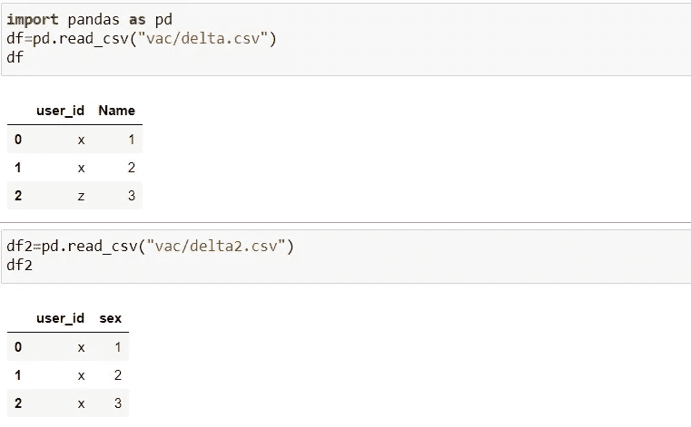

**回答:**

左连接:

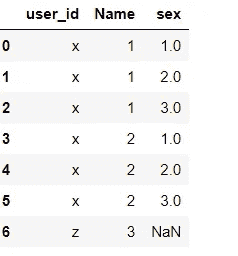

右连接:

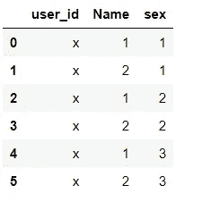

内部联接:

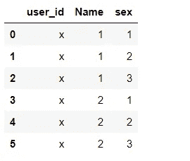

外部联接:

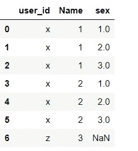

这是一个棘手的问题，因为我们有一个有很多重复的值“x ”,我在回答这个问题时完全糊涂了，所有的答案都错了。诀窍是表 1 中的每个“x”都将与表 2 中的 3 个“x”连接起来。这就是为什么 left join 有 7 行。

# 问题 2

**语句**:UNION 和 UNION ALL 的区别是什么，也给出下面的表在应用 UNION 运算后的输出？

**给出的表格**

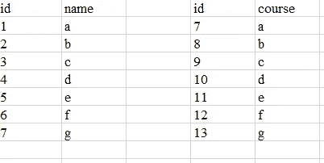

**回答** : **Union** 将按行连接两个表，但只添加唯一的行值，而 **union all** 将添加所有的行。

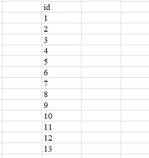

> 除了表 2 中的 id 7，所有 id 都将显示。

# 问题 3

**表给定**

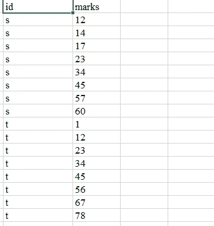

**说法**:找出分数不随时间增长的同学。(我不确定这是否是确切的问题陈述，但我希望您理解其中的问题)表名是“marks”

**回答**:

```
select distinct answer
from 
(select 
case 
    when diff<0 then "id"
end as answer
from (select *,
marks-lag(marks,1)
over(partition by id) as diff
from marks)a) b
```

**说明**:我们在这里使用了**窗口**功能**滞后**。首先，我会试着找出标记和滞后值的区别。滞后值是上面一行的行值，所以我可以减去上面一行的值来评估分数是否在递增。为了说明检查下面的照片。

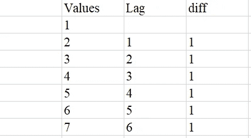

然后我们将使用“case when”来查找是否有 diff 小于 0(负值)的值，当我们找到该值时，我们将在列中添加值“id”。

接下来，我们将输出 case-when 列中所有不同的 id 值。

> 接下来采访中提出的几个问题可以在编码平台上找到，所以我在那里解决了它们。所有问题都是自测题，测试你的 SQL 函数知识。

# 问题 4

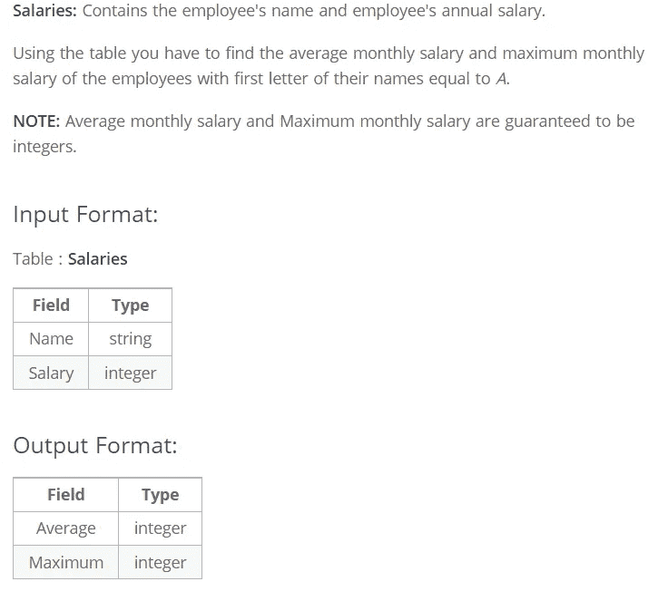

**答案:**

```
select floor(avg(salary)), floor(max(salary))
from salaries
where substr(name,1,1)="a";
```

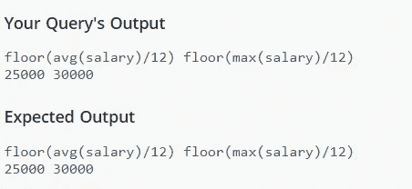

# 问题 5

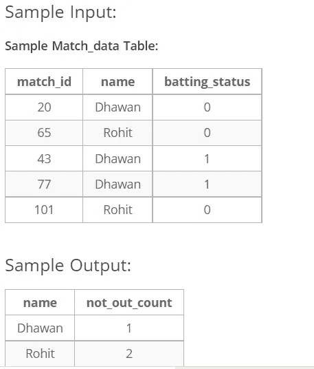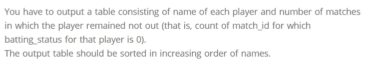

**回答:**

```
select name, count(name)
from match_data
where batting_status=0
group by name
order by name;
```

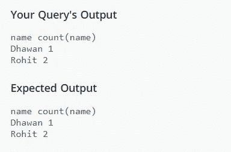

# 问题 6

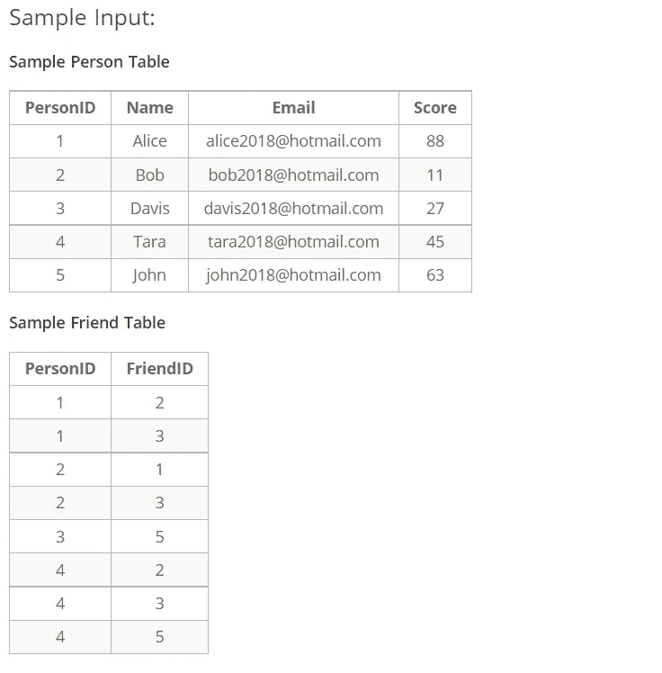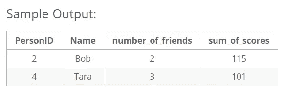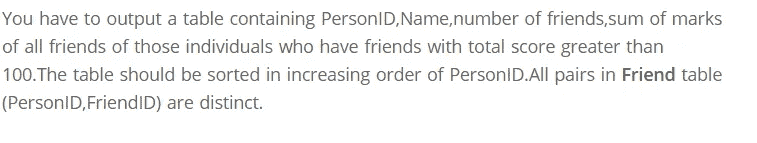

**回答:**

```
select a.personid, a.name, count(b.personid), sum(c.score)
from person a
inner join friend b
on a.personid=b.personid
inner join person c
on c.personid=b.friendid
group by a.personid
having sum(c.score)>100
order by a.personid;
```

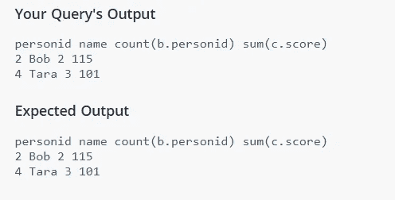

这是一个自连接的问题，这是 SQL 数据分析最重要的主题之一。我建议你彻底练习自我联结。

# 结论

在所有的访谈中，一些常见的问题都与加入后的输出有关。第二高的薪水问题已经被问了 5 次了。内部连接也非常重要。请务必阅读这些主题，并定期练习。