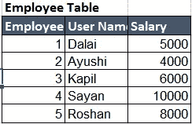
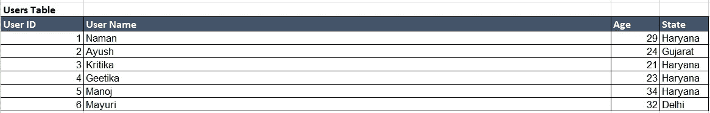
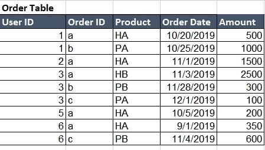
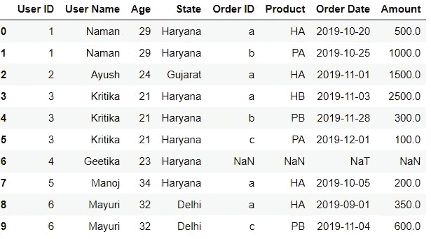
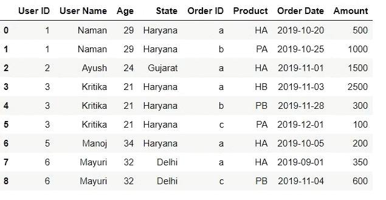
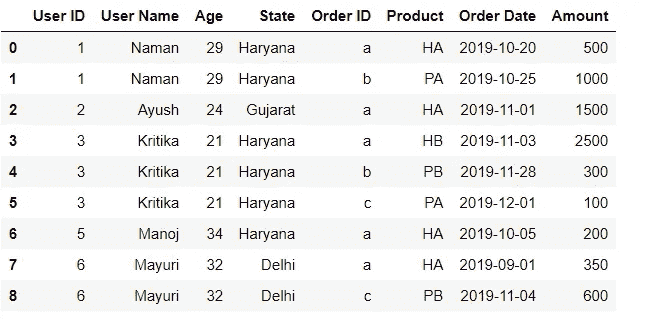

# 如何通过数据分析师面试:第一轮

> 原文：<https://medium.com/nerd-for-tech/how-to-clear-the-data-analyst-interview-round-1-99010a1f93fd?source=collection_archive---------9----------------------->


我称自己为数据分析师，我对现实生活中与地缘政治相关的数据进行数据分析，我也是机器学习 NLP 和计算机视觉方面的专家。然而，我在 5 次数据分析师面试中都失败了。虽然我有点失望，但从好的方面来看，我有 5 个经验来分析我哪里出错了，以及其他人如何从我的经验中学习数据分析师面试。

大多数学生都忘记了一个事实，即公司并不关心你在简历中提到了多少个机器学习项目(老实说，每个人都知道你是从某个地方抄袭来的)，或者你接受了多少像 tableau、PowerBI、Excel 这样的工具的培训。大多数寻找数据分析师的公司只想要一样东西，那就是你对 SQL 的掌握。

> 大多数公司有两轮 SQL 面试，第一轮更容易，大多数问题评估你对连接和聚合函数的了解。第二轮将有窗函数问题。我将在这里发布第一轮问题，在下一篇文章中发布第二轮问题。

# 面试开始

## 问题 1:

我们在大学里听说过这个问题，当时我们对秩函数毫无头绪。令人惊讶的是，在我出现的每一次采访中，这个问题仍然被问到。

编写一个 SQL 查询来查找雇员工资第二高的雇员姓名(不使用 rank，row_number 函数)



**回答**:找到最高工资非常简单，你可以按降序排列，然后选择 Top。然而，要找到第二高的，你将需要排名函数或嵌套查询。

```
SELECT TOP 1 salary FROM ( SELECT DISTINCT TOP 2 salary FROM Employee ORDER BY salary DESC )ORDER BY salary
```

**回答方法 2** :我们可以使用的另一种方法是使用 rank 函数，这也非常简单。

```
**select** salary **from**(**select** salary, dense_rank()over(**order** **by** salary **desc**)rank **from** Employee)**where** rank =2;
```

> 可选问题:秩和密秩的区别？

## 问题 2:

SQL 的执行顺序是什么，SQL 命令是如何执行的？

**回答**:SQL 中最重要的问题之一是执行顺序，如果我们想成为一名数据分析师，我们都应该知道这一点。

查询执行从的**开始，大部分以**的 select** 结束。**

1.  从，包括连接
2.  在哪里
3.  分组依据
4.  拥有
5.  窗口功能
6.  挑选
7.  明显的
8.  联盟
9.  以...排序
10.  极限和偏移

表 1



表 2



以下所有问题都将基于这两个表格。

## 问题 3:

在内部连接、左连接和右连接的情况下有多少行？

**回答** : **左连接**



因为表 1 有所有的数字(1-6 ),所以所有的数据都将显示在表 2 中。1 个用户 ID 为 4 的行将显示空值，因为它不在表 2 中。

**内部连接**:



仔细看这个，用户 id 4 不见了。在内部连接中，我们获取两个表的公共数据。因为 4 在表 2 中不存在，所以它不存在。

**右加入**:



如果你仔细看，右边和内部连接有相同的行数。因为在右连接中，我们从右表中获取所有数据，从左表中获取公共数据，所以用户 id 4 在两个连接中都被留下。

## 问题 4:

编写一个查询来获取用户 Id、2019 年 10 月和 2019 年 11 月购买的产品数量

**回答**:查询是

```
select  count(*), user id
from order
where order date between '10/01/2019' and '11/01/2019'
group by user id;
```

## 问题 5:

编写一个查询来获取在 19 年 11 月购买的来自哈里亚纳邦的用户 id。

**回答**:因为状态细节在表 1 中，而订单细节在表 2 中，所以我们需要首先连接这两个表，然后使用 **where** 条件。

```
select distinct(a.users id)
from users a
JOIN employees b
on a.user id = b.user id
where  state="Haryana" and dte_birth between '11/01/2019' and '11/31/2019';
```

## 问题 6:

编写一个查询来获取用户 ID、他/她的最新订单信息

```
select  user id, max(order date)  as max
from  orders
group by user id;
```

## 问题 7:

哪里和有什么区别？

**答:其中**子句用于根据指定的条件从表中过滤记录。 **HAVING** 子句用于根据指定的条件从组中过滤记录。

**Having** 与 group by 子句一起使用。

# 结论

如果你能回答所有这些问题，你将通过第一轮，恭喜你！第 2 轮会有点难，问题主要与窗口功能有关。我将在第二部分发布这些内容。如果你发现我的任何问题不正确，请评论，所有的解决方案都是我自己写的。我没有使用谷歌或任何其他来源。