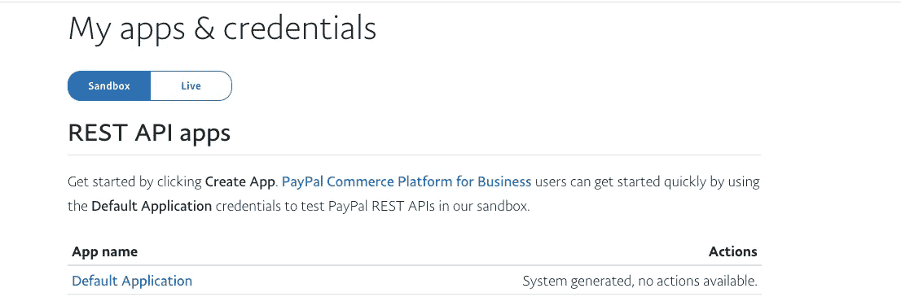
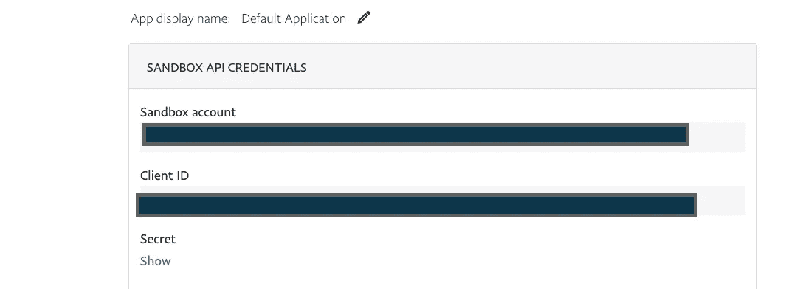
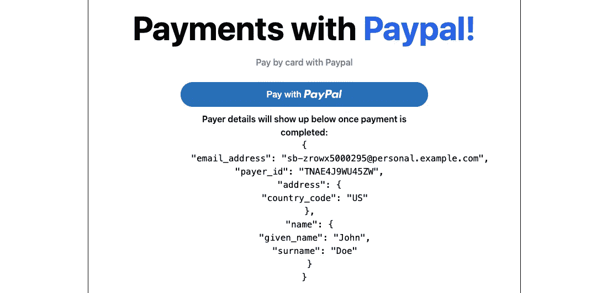

# 如何在 React 应用程序中使用 PayPal 收款

> 原文：<https://medium.com/nerd-for-tech/how-to-collect-payments-with-paypal-in-your-react-application-64ff46135d4d?source=collection_archive---------1----------------------->

我最近建立了一个项目，需要与贝宝集成，以收集用户付款。在花了几个小时尝试使用 Paypal JavaScript SDK 实现 Paypal 支付后，我意识到这将是一项艰巨的任务。谢天谢地，我找到了一个 NPM 包，它已经将 SDK 抽象成 React 组件供我们使用。在本文中，我将向您展示如何在 React 应用程序中使用 Paypal 收款。

# 开始使用—设置您的 Paypal 帐户

先迈出第一步。前往 P [ayPal](https://paypal.com) 创建一个帐户。一旦完成，前往 P [ayPal 开发者屏幕](https://developer.paypal.com/developer/applications/)。

# 获取您的证书

下一步是获取您的凭证，即您的客户端 Id。

导航至**仪表盘>我的应用&凭证。**



点击**沙盒**标签。然后点击**默认应用**链接。它会将您带到一个包含您的 clientId 的页面。



您的**沙盒账户**将是一个电子邮件地址，您可以使用它进行测试支付，而您的**客户 ID** 是 PayPal 用来将您的应用程序连接到您的 Paypal 账户的。

# 设置您的 react 项目

对于这个例子，我们的 React 项目将使用 [NextJS](https://nextjs.org/) 构建。

如果您愿意跟随，您可以通过简单地克隆我的 repo 来跳过接下来的几个步骤。运行*` git clone git @ github . com:one debos/nextjs-paypal-example . git `*命令来执行此操作。然后用 git checkout starter 签出到 starter 分支。如果您克隆 starter repo，您可以跳到**设置项目结构**部分。

否则，下面是要遵循的步骤。

我们将使用一个已经配置了 [tailwindcss](https://tailwindcss.com/) 的 NextJS 示例项目。

运行命令*yarn create next-app-example with-tailwindcss next-paypal-example*创建一个已经配置了 Tailwindcss 的 NextJS 应用程序。

# 设置项目结构

我们将在当前项目中创建一个名为 utils 的新文件夹。在 utils 文件夹中，我们将创建一个 constants 文件夹。在 constants 文件夹中，添加一个 index.js 文件。

您的文件夹结构现在应该看起来像这样

`/utils/constants/index.js`

**安装 Paypal 包**

使用安装 react paypal 包

```
yarn add @paypal/react-paypal-js@4.1.0
```

# 收取付款

是时候开始收款了！

在您的 utils/constants/index.js 文件中，添加您的 **clientId。**

```
export const PAYPAL_CLIENT_ID = { clientId: 'YOUR_CLIENT_ID'}
```

在您的 **_app.j** s 文件中，使用

```
import { PayPalScriptProvider } from “@paypal/react-paypal-js”;
```

然后，用那个标签包装你的组件。

```
import { PayPalScriptProvider } from "[@paypal/react-paypal-js](http://twitter.com/paypal/react-paypal-js)";
import {PAYPAL_CLIENT_ID} from '../utils/constants'
function MyApp({ Component, pageProps }) {
  return(
    <PayPalScriptProvider options= {{"client-id": PAYPAL_CLIENT_ID.clientId }}>
        <Component {...pageProps} />
    </PayPalScriptProvider>
  ) 
}
export default MyApp
```

接下来，进入 pages/index.js 创建收款页面，并引入 PayPal 按钮。

让我们创建一些状态来保存数据。

```
const [succeeded, setSucceeded] = useState(false);const [paypalErrorMessage, setPaypalErrorMessage] = useState("");const [orderID, setOrderID] = useState(false);const [billingDetails, setBillingDetails] = useState("");
```

orderId 是我们关心的最重要的状态。当用户点击 **Pay with PayPal** 按钮时，PayPal 将为订单生成一个 orderId 并返回给我们。在下面的 createOrder 函数中，我们可以看到这一点。

```
// creates a paypal order
  const createOrder = (data, actions) => {
    return actions.order
      .create({
        purchase_units: [
          {
            amount: {
              // charge users $499 per order
              value: 499,
            },
          },
        ],
        // remove the applicaiton_context object if you need your users to add a shipping address
        application_context: {
          shipping_preference: "NO_SHIPPING",
        },
      })
      .then((orderID) => {
        setOrderID(orderID);
        return orderID;
      });
  };
```

除了 createOrder 函数，我们还需要另一个在付款被批准时运行的函数——on approve。

```
// handles when a payment is confirmed for paypal
  const onApprove = (data, actions) => {
    return actions.order.capture().then(function (details) {
      const {payer} = details;
      setBillingDetails(payer);
      setSucceeded(true);
    })
  };// handles payment errors
const onError = (data,actions)=>{ setPaypalErrorMessage("Something went wrong with your payment");
}
```

最后，我们可以从我们的 **react-paypal-js** 包中插入 PayPal 按钮来处理支付。

```
<PayPalButtons
            style={{
              color: "blue",
              shape: "pill",
              label: "pay",
              tagline: false,
              layout: "horizontal",
            }}
            createOrder={createOrder}
            onApprove={onApprove}
    />
```

Paypal 会将用户重定向到一个新窗口来完成支付。



您可以使用 Paypal 开发者仪表板上提供的沙盒电子邮件来测试这一点。

代码的完整回购是这里的[和这里的](https://github.com/onedebos/nextjs-paypal-example)和一个工作示例。