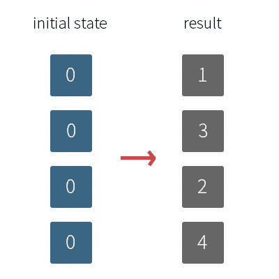
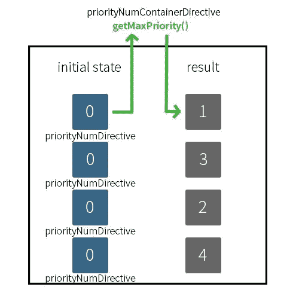

# 如何在 AngularJS 中的指令之间进行通信

> 原文：<https://medium.com/nerd-for-tech/how-to-communicate-between-directives-in-angularjs-ad46b961d918?source=collection_archive---------0----------------------->

## 需要财产

> 注意:我在 2016 年写了这篇文章，它用于存档。有一个新版本的 [Angular](https://angular.io/) 和 [AngularJS](https://angularjs.org/) 现在处于长期支持模式。


照片由[马库斯·温克勒](https://unsplash.com/@markuswinkler?utm_source=medium&utm_medium=referral)在 [Unsplash](https://unsplash.com?utm_source=medium&utm_medium=referral) 上拍摄

最近，当我需要指令从外部(父元素或控制器)获取一些信息时，我在工作中偶然发现了一个问题。想象几个代表指令的按钮。当我点击一个按钮时，它的值应该增加 1。这相当简单，但是我需要这些按钮相互依赖，这样它们就可以连续增加 1 的值，并防止进一步的点击。下图说明了我的意思:



以任意顺序递增按钮中的值

我不知道如何处理这个问题，但是我的同事帮助了我。他向我介绍了指令的一个**‘require’属性，并告诉我我必须创建一个带有控制器的父指令，稍后我们将在 link 函数中使用它。**

下面是按钮指令的代码(姑且称之为 priorityNumDirective):

```
function priorityNumDirective() {
  return {
    restrict : ‘E’,
    scope: true,
    template: ‘<button class=\’btn btn-default\’ type=\’submit\’ ng-    
    click=\’increaseTapIndex()\’>{{tapIndex}}</button>’,
    **require: [‘^prioritynumContainer’,’ngModel’],**
    link : function (scope, elem, attr) {
      // logic to implement
    }
 };
```

我假设您非常熟悉指令，并且知道其他属性，但是我将快速总结一下我们正在做的事情。

*   *restrict: 'E'* :我们将使用元素
*   *作用域:true* :为指令创建一个新的作用域(也继承父作用域)
*   *模板*:定义的按钮元素，具有递增值的功能
*   ***需要:【'^prioritynumcontainer','ngmodel'】***我们这里需要 2 个控制器。第一个是我们马上要创建的父指令的控制器。第二个是 [ngModel 控制器](https://docs.angularjs.org/api/ng/type/ngModel.NgModelController)，它提供了我们将要使用的方法。
    **^前缀使指令在自己的元素或其父元素上寻找控制器；如果没有任何前缀，该指令将只查找自己的元素。**

让我们创建名为 priorityNumContainerDirective 的父指令及其控制器:

```
function priorityNumContainerDirective() {
  return {
    restrict : ‘A’,
    controller: priorityNumController
  };
}function priorityNumController() {
  var priorities = [];    
  return {
    getMaxPriority : function(index) {
      var prioLength = 0;
      priorities.push(index);
      prioLength = priorities.length;
      return prioLength; 
    }
  };
}
```



当我们点击一个按钮时，我们从父控制器调用一个方法，该方法返回一个“最大”数

因此，我们创建了一个父指令及其控制器。我们返回一个函数 *getMaxPriority* ，我们可以在按钮指令(priorityNumDirective)的链接函数中使用它。如上所述，我们需要 2 个控制器，但是为了使用它们，我们还必须使用 link 函数中的第 4 个参数。看看下面的例子:

```
function priorityNumDirective() {
  return {
    restrict : ‘E’,
    scope: true,
    template: ‘<button class=\’btn btn-default\’ type=\’submit\’ ng-    
    click=\’increaseTapIndex()\’>{{tapIndex}}</button>’,
    **require: [‘^prioritynumContainer’,’ngModel’],**
    link : function (scope, elem, attr, **controllerArray**) {
      **var prioritynum = controllerArray[0];
      var ngModelCtrl = controllerArray[1];**
      scope.incremented = false;
      scope.tapIndex = 0;
      scope.increaseTapIndex = function() {
        if(scope.incremented === false) {
          scope.incremented = true;
          scope.tapIndex = 
          **prioritynum.getMaxPriority(scope.tapIndex);**
          ngModelCtrl.$setViewValue(scope.tapIndex);
        };
      }
    };
```

上面这个链接功能并不完整，但是现在应该很清楚如何从父指令中获取控制器，从而与子指令进行通信。希望这对你有所帮助，你也像我一样学到了一些新东西:-)