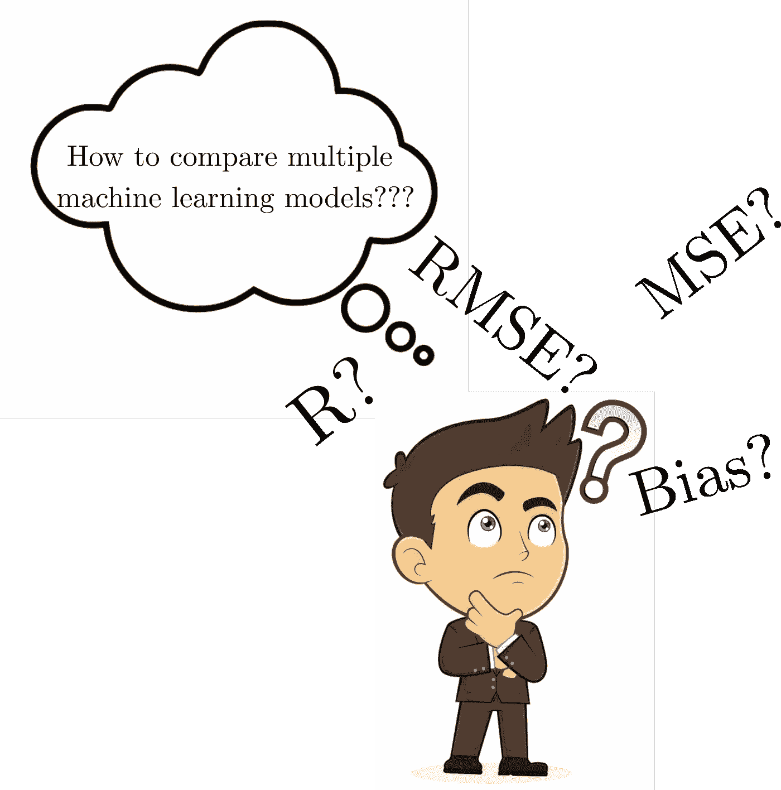
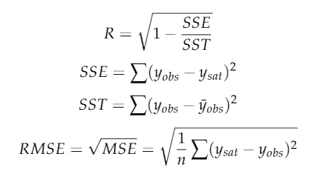
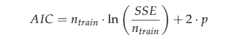
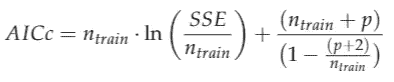
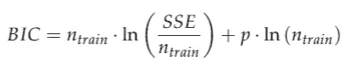
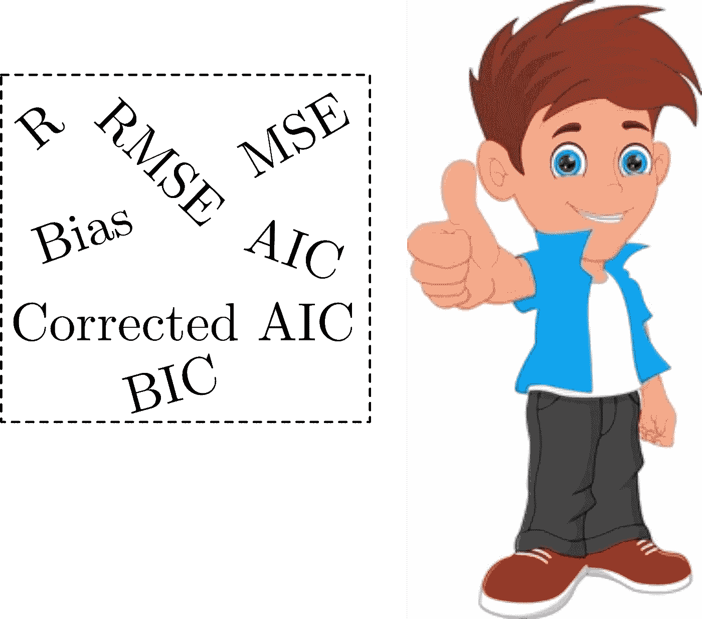

# 如何比较多个机器学习模型？

> 原文：<https://medium.com/nerd-for-tech/how-to-compare-multiple-machine-learning-models-a679f9802e5d?source=collection_archive---------5----------------------->

**图一:**图片来自作者。

在本文中，我们将讨论当我们必须比较多个机器学习模型时必须使用的**性能指标**。性能指标是每个机器学习模型的支柱。他们会告诉我们训练和评估模型的准确性。

在基于回归的机器学习问题中，常用相关系数(R)、均方根误差(RMSE)或 MSE、偏差作为性能度量来评价训练好的机器学习模型的性能( [**Singh et al. 2022**](http://dx.doi.org/10.3390/s22031070) )。下面给出了计算 R、RMSE 和 MSE 的公式；

其中 *SSE* 为误差的平方和， *SST* 为总和的平方和，yobs 为观测值， *ysat* 为预测值。然而，这些指标对于评估单个机器学习模型的性能是很好的。为了比较多个机器学习模型(或与其他基准算法)，我们需要一些其他性能指标来获得可靠的结论。

根据最近的一篇研究文章[**(Singh et al .，2021)**](https://www.mdpi.com/2072-4292/13/19/3794) ，我们需要添加一些额外的性能指标来比较两个或更多的机器学习模型。他们建议，对于多模型比较，建议使用**赤池的信息准则(AIC)** 、**修正的 AIC(AICc)**、**贝叶斯信息准则(BIC)。**所有这些指标都不利于机器学习模型的大量参数。 ***优先选择 AIC、AICc、BIC 值较低的机型。*** 我们将简要讨论这些标准(详细的描述可以在相应的参考文献中找到)。

1.  **赤池的信息准则(AIC)由(赤池 1969) [2]**

2.**修正了(AICc)的(Hurvich 和 Tsai，1989) [3]**

3.**贝叶斯信息准则(BIC)由(施瓦茨 1978)【4】**

其中 *ntrain* 是训练样本数， *p* 是机器学习模型内部评估的参数数。

因此，为了更稳健地比较多个机器学习模型，我们可以使用 AIC、AICc、BIC 以及 R、RMSE 和 bias [**(Singh 等人，2021)**](https://www.mdpi.com/2072-4292/13/19/3794) 。

**图二:**图片来自作者。

**参考文献**

[[1]。Singh Abhilash、Kumar Gaurav、Atul Kumar Rai 和 Zafar Beg“从卫星图像估计表面粗糙度的机器学习”，遥感，MDPI，13 (19)，2021，DOI: 10.3390/rs13193794。](https://www.mdpi.com/2072-4292/13/19/3794)

[【2】。Akaike，H. (1969)，“拟合自回归模型进行预测”。统计数学研究所年报，21，243–247。](https://link.springer.com/article/10.1007/BF02532251)

[【3】。胡尔维希、蔡春林(1989)，“小样本回归与时间序列模型选择”。生物计量学，76，297–307。](https://www.stat.berkeley.edu/~binyu/summer08/Hurvich.AICc.pdf)

[【4】。Schwarz，G. (1978)，“估计模型的维度”。统计年鉴，6461-464。](https://projecteuclid.org/euclid.aos/1176344136)

[[5]辛格，a .，阿穆塔，j .，纳加尔，j .，夏尔马，s .，T34 李，C. C. (2022)。LT-FS-ID:基于对数变换的特征学习和特征缩放的机器学习算法，用于预测使用无线传感器网络的入侵检测的 k 障碍。*传感器*、 *22* (3)、1070。](https://www.researchgate.net/publication/358201341_LT-FS-ID_Log-Transformed_Feature_Learning_and_Feature-Scaling-Based_Machine_Learning_Algorithms_to_Predict_the_k-Barriers_for_Intrusion_Detection_Using_Wireless_Sensor_Network/stats)

***注:*** 如有任何疑问，请写信给我(***abhilash.singh@ieee.org***)或访问我的 [**网页**](https://www.abhilashsingh.net/?source=medium_multi_model_comparison) 。

## [**别忘了订阅我的 YouTube 频道**。](https://www.youtube.com/channel/UC3YYrAOSNRXvG8Tud3XepYA)