# 如何使用 Ansible 在 AWS 上配置 Web 服务的反向代理。

> 原文：<https://medium.com/nerd-for-tech/how-to-configure-a-reverse-proxy-for-web-services-on-aws-using-ansible-playbook-bacc44e692a?source=collection_archive---------12----------------------->

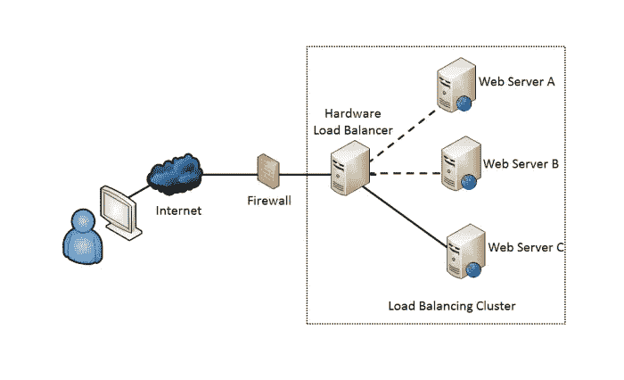

本文将介绍如何为 web 服务提供 ec2 实例，以及如何使用 Ansible 通过 AWS 为这些 Web 服务设置负载平衡器。

在我介绍什么是负载平衡器以及如何为 web 服务配置负载平衡器之前，我们先来看一个场景。

您有一台可以同时管理 1000 台客户机的 web 服务器。突然，对该特定服务器的请求增加到 1500 个客户端。很可能网站会崩溃或者被终止。为了避免这种情况，需要设置另一个目标 web 服务器。在这种情况下，将客户机连接到哪个目标 web 服务器以及如何连接是一个挑战！

为了解决这一挑战，在前端设置了一个主服务器，客户端从不访问目标 web 服务器。相反，他们的请求发送到主服务器，主服务器将请求发送到目标 web 服务器。当目标 web 服务器回复主 web 服务器时，它会被发送回客户端。这个概念被称为**反向代理**。

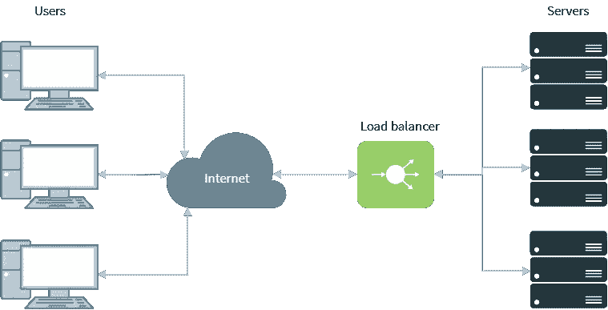

# **T3 什么是负载均衡器？**

负载平衡器是在各种后端服务器之间分配网络流量的有效方式。它也被称为服务器场或服务器池。它将客户端请求或网络负载分配给目标 web 服务器。负载平衡器基于循环概念工作，这确保了高可靠性和可用性。

> 在您的 web 服务器基础设施前放置一个负载平衡器有助于确保任何流量高峰都不会导致站点停机。

# ***【高可用性代理】***


HAProxy 代表高可用性代理，是一个流行的开源软件 TCP/HTTP 负载平衡器，可以配置为反向代理。它最常见的用途是通过在多个服务器(例如，web、应用程序、数据库)之间分配工作负载来提高服务器环境的性能和可靠性。它用于高流量服务，如:GitHub、Imgur、Instagram 和 Twitter。

更多关于哈普洛克西:[https://www.haproxy.org/#desc](https://www.haproxy.org/#desc)

让我们进入配置部分。

在本文中，您将学习如何在 AWS 上创建一个类似如下所示的设置:

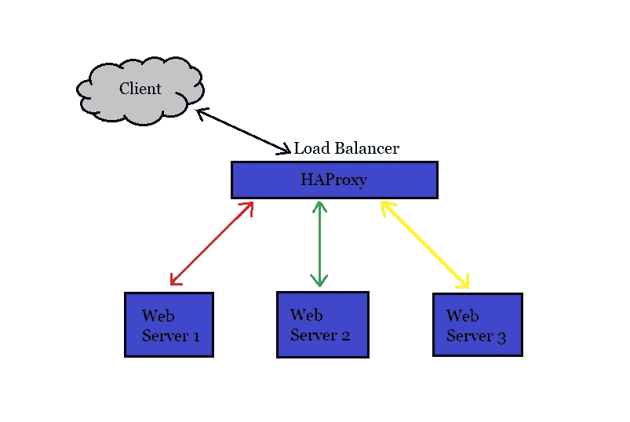

为此，您需要在 AWS 上启动 4 个 ec2 实例，1 个作为主服务器(负载平衡器), 3 个作为后端 web 服务器。我们将要执行的步骤:

1.  使用 Ansible 提供 EC2 实例
2.  使用动态清单的概念检索实例的 IP 地址
3.  使用角色配置 web 服务器。
4.  使用 Ansible 角色配置负载平衡器。
5.  负载平衡器的目标节点应该根据 web 服务器的状态自动更新。

要了解如何在 AWS 上启动 ec2 实例，以及如何使用 Ansible playbook 为 Web 服务器配置 ec2 实例，阅读下面的链接是继续阅读本文的先决条件:

[](https://priyankaa2023.medium.com/automating-provisioning-and-configuration-of-amazon-ec2-instance-ansible-dd34df237a0c) [## Amazon ec2 实例 Ansible 的自动化供应和配置。

### 在本文中，您将了解到我们如何能够自动化启动 ec2 实例到配置它的整个设置…

priyankaa2023.medium.com](https://priyankaa2023.medium.com/automating-provisioning-and-configuration-of-amazon-ec2-instance-ansible-dd34df237a0c) 

## ***1。使用 Ansible*** 提供 EC2 实例

为 webserver 启动 ec2 实例的剧本代码如下所示:

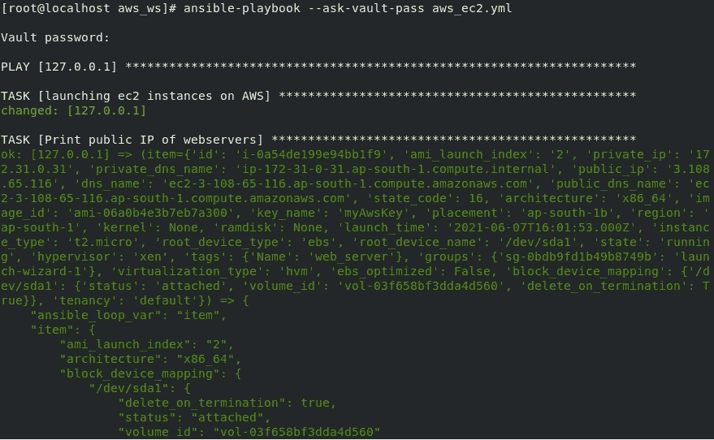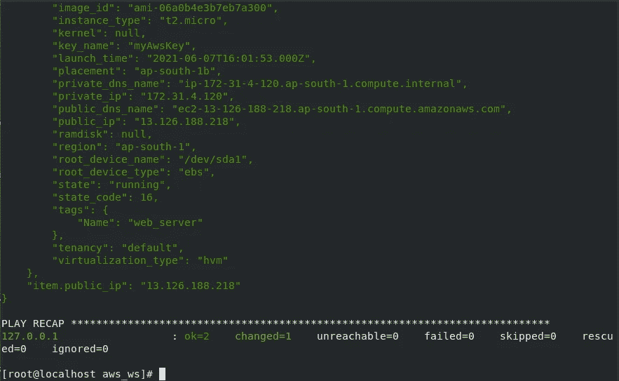

## ***2。使用动态清单的概念检索实例的 IP 地址***

请阅读我下面的文章，了解什么是 Ansible 动态库存以及如何使用动态库存在 AWS 上检索实例的公共 IP。

[](https://priyankaa2023.medium.com/automating-provisioning-and-configuration-of-amazon-ec2-instance-ansible-dd34df237a0c) [## Amazon ec2 实例 Ansible 的自动化供应和配置。

### 在本文中，您将了解到我们如何能够自动化启动 ec2 实例到配置它的整个设置…

priyankaa2023.medium.com](https://priyankaa2023.medium.com/automating-provisioning-and-configuration-of-amazon-ec2-instance-ansible-dd34df237a0c) 

```
To list public IP of instances running on AWS using dynamic inventory **$ ansible ec2 --list-hosts**
```

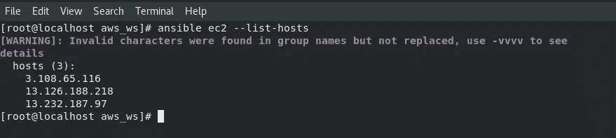

## ***3。使用职责角色*配置 Web 服务器**

为此，您需要创建一个 Ansible 角色来将这些实例配置为 Apache Web 服务器，以作为后端/目标 Web 服务器。 ***使用*** [***可变角色***](https://docs.ansible.com/ansible/latest/user_guide/playbooks_reuse_roles.html) 的目的是，角色让您根据已知的文件结构自动加载相关的变量、文件、任务、处理程序和其他可变工件。此外，将内容按角色分组后，您可以轻松地重用它们并与其他用户共享。

一个角色有一个定义好的目录结构，有八个主要的标准目录。您必须在每个角色中至少包括其中一个目录。您可以省略角色不使用的任何目录。

***为 Apache 创建角色:***

在您的工作区中创建一个名为 roles 的目录。进入目录内部，使用命令`ansible-galaxy init <role_name>`创建一个角色，以创建角色目录结构。

```
#Create ansible role, apache within directory, roles
**$ ansible-galaxy init apache**
```

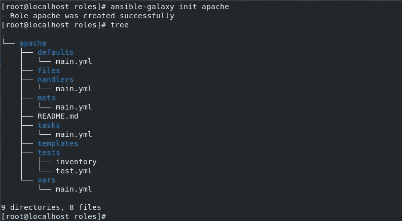

现在你需要在**任务**目录的“main.yml”文件中写下下面的任务脚本，如上图所示:

*   第一步，使用**包**模块，在目标节点上安装 httpd 软件。
*   接下来，使用**复制**模块，将网页从源复制到目的地，/var/www/html。这里的源文件 index.php 需要放到**文件**目录中，以便在运行角色时自动加载。
*   最后，服务模块用于启动和启用 httpd 服务。

你可能已经注意到在上面的 tasks/main.yml 文件中，我已经通知了 handler 来避免不必要的一次又一次重新启动服务，而不是当网页中有变化时 **handler** 会在收到通知时重新启动服务。因此，为此您需要在 handlers/main.yml 文件中为处理程序编写脚本，如下所示(参见上面的角色目录结构)。

现在，您已经编写了所有必需的文件，您还可以从角色目录结构中删除不需要的目录(可选)。

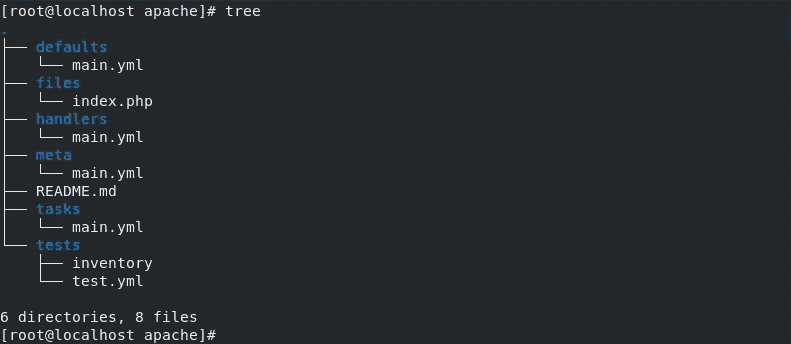

现在，创建完角色后，需要将角色路径更新到/etc/ansible/ansible.cfg 文件中，如下所示:

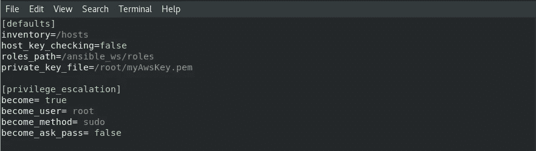

此外，您需要创建一个剧本，其中包括上述 apache 角色，您需要在指定的主机上进行 httpd 配置。要获取有关主机组的信息，请运行如下所示的动态清单 python 脚本:


使用突出显示的组名来配置 web 服务器。运行下面的行动手册代码，为 httpd web 服务器配置这组实例:

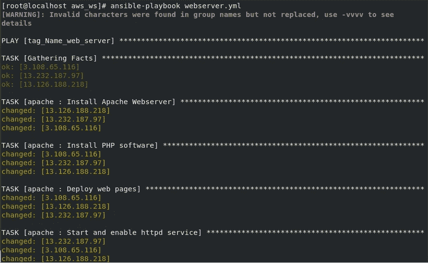

太棒了！！让我们前进到 HAProxy 配置部分！

## **4*。为反向代理*提供 EC2 实例**

要进行 HAProxy 配置，您需要提供一个 ec2 实例，并为 HAProxy 负载平衡器配置它。使用与上面相同的脚本来启动 ec2 实例(只需将上面文件中的标记名更改为“haproxy”并计数为 1，如下所示)。

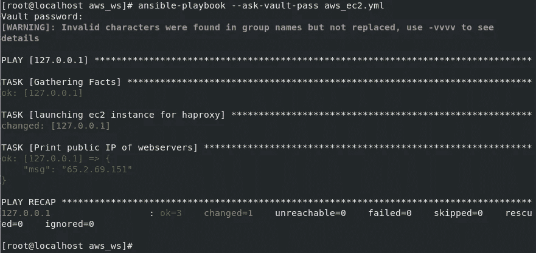

## 5. ***使用角色配置负载平衡器***

随着实例的启动，现在您需要在 Ansible 的帮助下配置它。为此，创建一个 Ansible 角色，就像我们为 web 服务器所做的那样。

***为 HA 代理 LB 创建角色:***

在工作区的同一个“roles”目录中创建一个名为“haproxy”的角色。

```
#Create ansible role, haproxy within directory, roles
**$ ansible-galaxy init haproxy**#To list roles present
**$ ansible-galaxy role list**
```

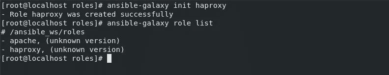

类似地，如前所述，创建任务，将实例配置为 HA 代理负载平衡器，作为反向代理**。**在“任务”目录的“main.yml”文件中写下下面提到的脚本。

*   第一步，使用**包**模块，安装 haproxy 软件
*   接下来，使用**模板**模式将 HA 代理的配置文件 haproxy.cfg 从控制器节点复制到受管节点。 ***模板模块不同于复制模块允许我们使用***[***jinja 2******将模板动态渲染到文件*** 。这里， **notify** 关键字用于通知处理程序在后端服务器有任何变化时重启服务。](https://docs.ansible.com/ansible/latest/user_guide/playbooks_templating.html)
*   最后，**服务**模块用于启动 HAProxy 服务。

现在，您需要创建自己的自定义配置文件 haproxy.cfg，并将其放入角色的 templates 目录中。

***创建自定义 haproxy.cfg 文件:***

您需要在您的控制器节点中有 haproxy.cfg 文件，以将其复制到 **templates** 目录中并进一步自定义。

```
#Copy haproxy.cfg file to templates directory of the haproxy role**cp /etc/haproxy/haproxy.cfg  /<workspace>/roles/haproxy/templates/ haproxy.cfg**
```

默认情况下，前端绑定到端口 5000。将端口号更改为 8080。后端有'应用程序'块，你需要给你的后端服务器的 IP 到后端应用程序。应用一个`for`循环来配置后端 IP。现在，您可以根据需要启动任意数量的 web 服务器，并且不需要手动配置`/etc/httpd/httpd.conf`内部的 IP。它将自动从清单中获取 IP。

```
backend app    
balance     roundrobin 
    
server   app{{ loop.index }} {{ i }}:80 check 

```

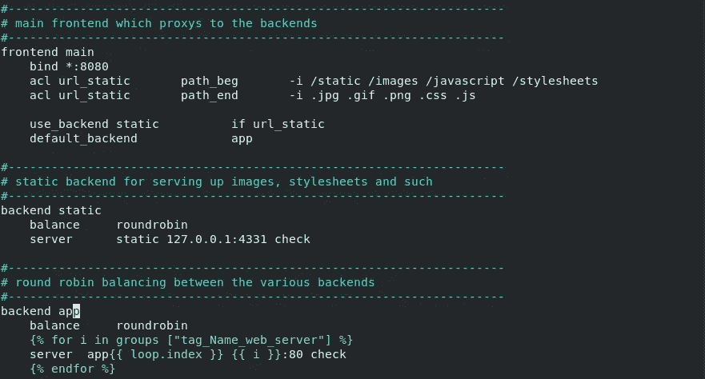

接下来，由于在上面的 tasks/main.yml 文件中我通知了 handler so，为此，我们需要将下面的脚本写入到 main.yml 文件的**角色的**处理程序目录中。

现在您已经创建了所有必需的文件，正如您可以从下面的角色目录结构中检查到的。此外，您可以从角色中删除不需要的目录(可选)。

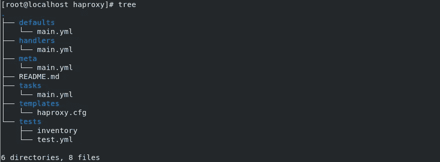

最后，您需要一个剧本来针对负载平衡器的主机组运行。通过运行动态清单 python 脚本获取组名，如下所示:

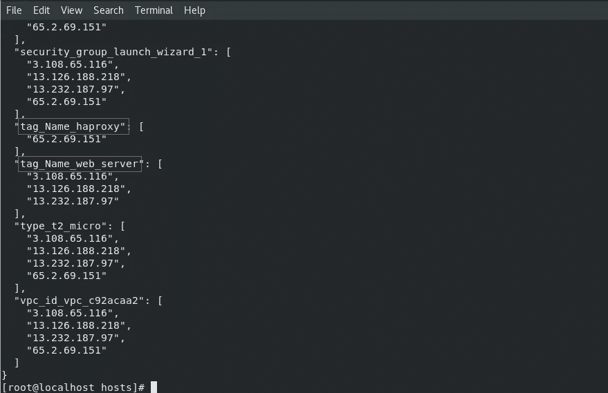

最后，您需要针对主机组“tag_Name_haproxy”编写并运行剧本代码，如下所示，以便为 haproxy 负载平衡器配置实例。

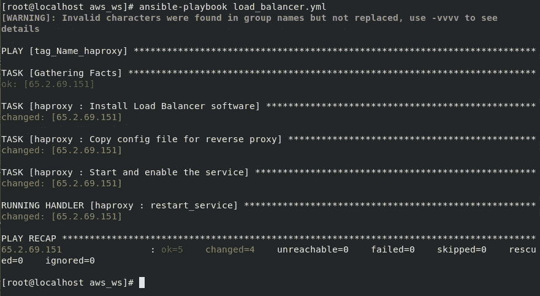

一切就绪！！是时候看 Ansible 大放异彩了！

您可以从 AWS Web 控制台检查所有实例是否都已启动并运行。

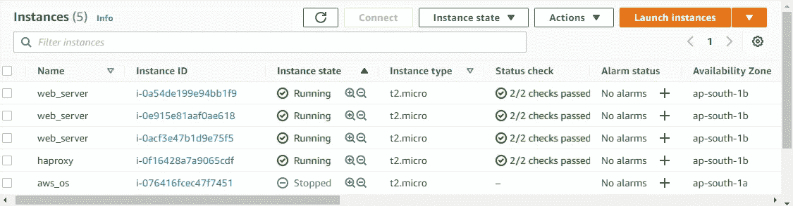

# ***输出***

行动手册成功运行，主 web 服务器可以使用负载平衡器访问三个目标 web 服务器，如下所示:

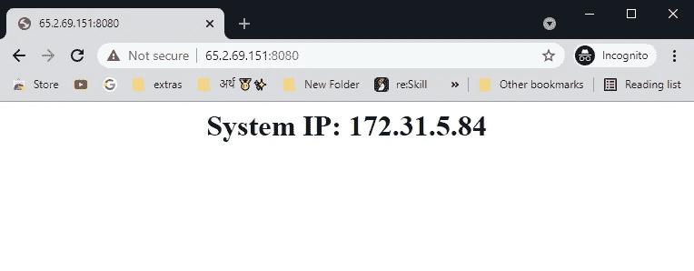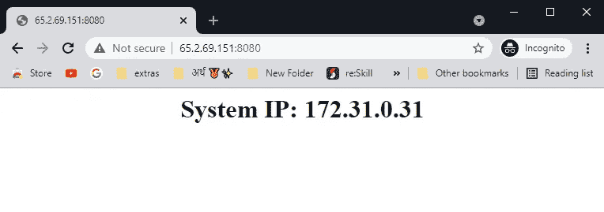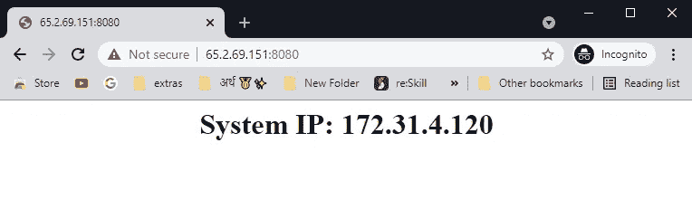

Tada！！你做得很好！

# 下面总结一下你做了什么！

使用 Ansible，我们联系 AWS，启动 Amazon ec2 实例，然后分别为负载平衡器和反向代理配置它们，以获得所需的设置。将 HAProxy 添加到您的基础设施中，不仅提高了 web 服务的可用性，还为后端服务器增加了一层额外的保护。

要弄清楚的一件有趣的事情是，我在自动化工具的帮助下完成了整个设置，甚至没有进入实例。这就是自动化的力量！！

你可以从下面的 GitHub 链接中得到我在上面用过的代码:

[](https://github.com/P-Bharti20/ansible_reverse_proxy) [## p-bharti 20/ansi ble _ reverse _ proxy

### 使用 ansi ble-P-bharti 20/ansi ble _ reverse _ proxy 为 AWS 上的 web 服务配置反向代理

github.com](https://github.com/P-Bharti20/ansible_reverse_proxy) 

感谢您的阅读……如有任何疑问，请在下方留言。您可以通过与我联系:

[](https://www.linkedin.com/in/priyanka-bhartii/) [## Priyanka Bharti -本科生- BIT Sindri | LinkedIn

### 目前是三年级学生在计算机科学与工程领域在 Birsa 理工学院，辛德里…

www.linkedin.com](https://www.linkedin.com/in/priyanka-bhartii/) 

敬请期待如此精彩的内容！

