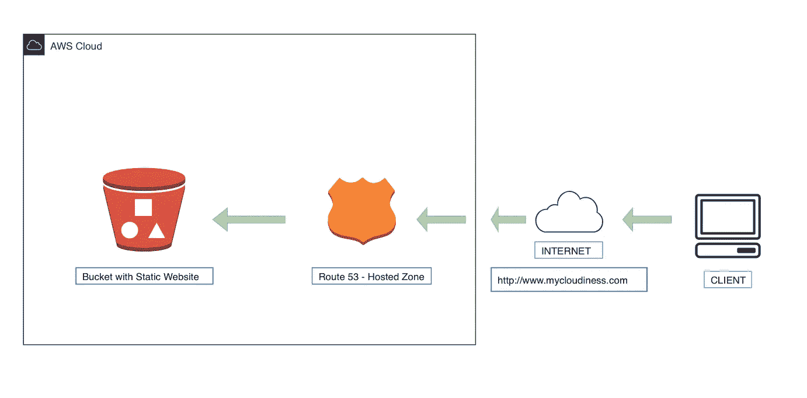
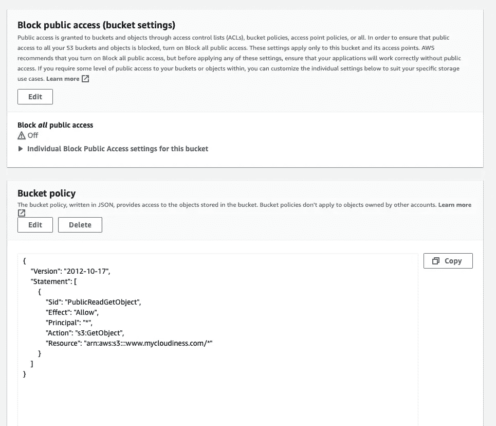
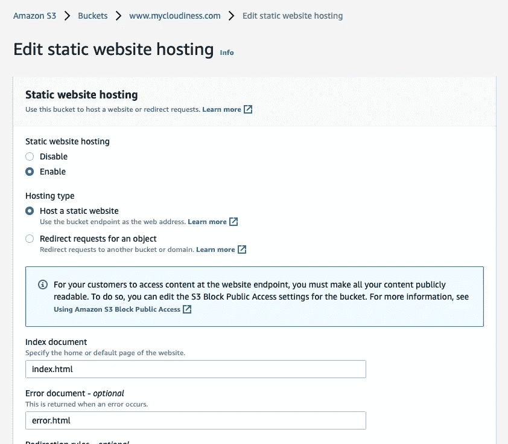
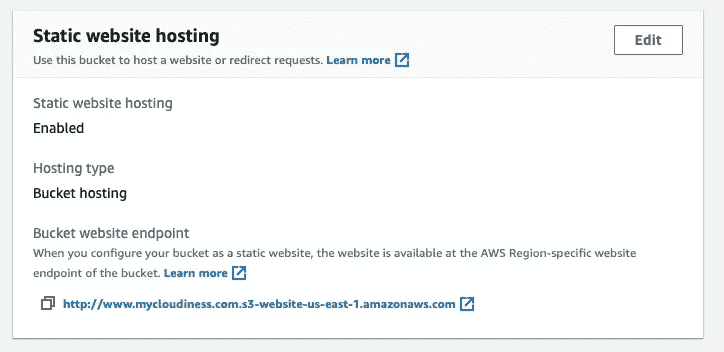
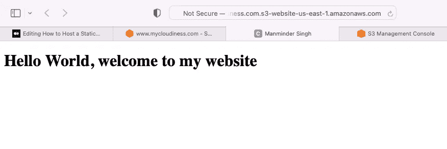
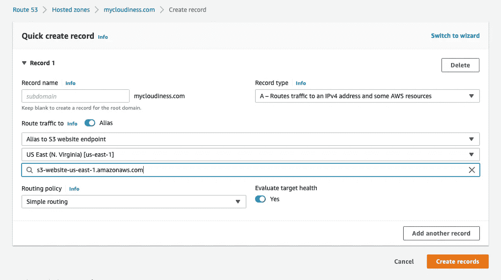

# 如何使用向 Route 53 注册的自定义域配置静态网站

> 原文：<https://medium.com/nerd-for-tech/how-to-configure-a-static-website-using-a-custom-domain-registered-with-route-53-6f633fb86581?source=collection_archive---------1----------------------->



在 AWS 上托管静态网站的云架构

**概述:**
AWS S3(简单存储服务)可以以相当低的成本如每月几美分至几美元托管静态网站。


**第一步:为网站托管配置根域存储桶** 让我们创建一个存储桶，命名为“我的云”，然后添加两个对象 index.html 和 error.html。

对于这篇特别的文章，我在 index.html 和 error.html 添加了下面的代码

```
<!DOCTYPE html>
<html>
<head>
<title>Manminder Singh</title>
</head>
<body>
<h1>Hello World, welcome to my website</h1>
</body>
</html>
```

**进入权限&在这个桶上配置设置** 为了让我们的桶托管静态网站，我们必须做一些设置。

a.转到权限>使存储桶可公开访问
b .添加以下存储桶策略以定义规则集



**转到权限&配置此桶的设置** 现在我们将配置以下属性并启用静态网站托管:添加 index.html 和 error.html 作为主文件和错误文件。



**让我们检查一下目前为止的进度-** 从静态网站选项中获取存储桶 URL



抓取底部提到的桶网址查看

当我们在浏览器中输入 URL 时，我们得到以下输出:-



我们的网站是通过 S3 网址

**步骤 2:为网站重定向配置您的子域存储桶** 为网站托管配置根域存储桶后，您可以配置您的子域存储桶，将所有请求重定向到该域。确保存储段名称应该与域名相同。重复步骤 1 的所有步骤，即上传 index.html 和 error.html 等

**步骤 3: Route 53 设置** 现在，我们将在 Route 53 记录集中添加 s3 端点，以便流量可以重定向到我们的 s3 存储桶。

路由 53 >>选择域" mycloudiness.com " > >创建记录集> >添加别名:s3 网站端点



我们完了！让我们检查我们的网站


使用自定义 URL:mycloudiness.com，我们被重定向到我们的 s3 桶

感谢阅读！继续推动✌🏻