# 如何在 Docker 容器上配置 HTTPD 服务器和设置 Python 解释器并运行 Python 代码？

> 原文：<https://medium.com/nerd-for-tech/how-to-configure-httpd-server-on-the-docker-container-33584bea3101?source=collection_archive---------22----------------------->

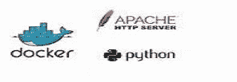

**第一步:-** 首先，我们要安装 docker 软件。为此，我们必须配置 yum 报告列表。

要配置 yum repo，请使用以下命令:-

```
**cd /etc/yum.repo.d/
gedit docker.repo**
```

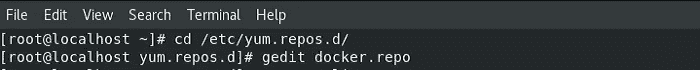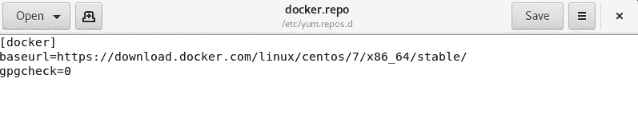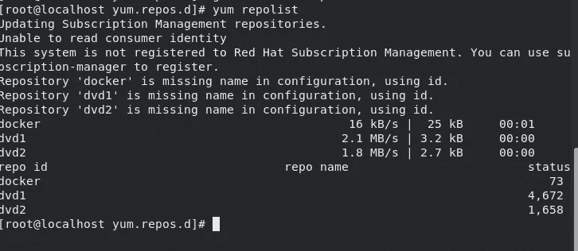

现在，我们可以安装 docker 软件了。使用以下命令安装 docker 软件。

```
**yum install docker-ce — nobest -y**
```

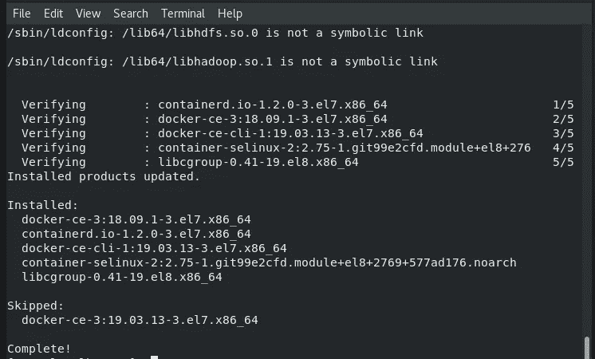

现在，使用以下命令启动 docker 服务

```
**systemctl start docker**
```

我们还可以使用以下命令来检查 docker 的状态:-

```
**systemctl status docker**
```

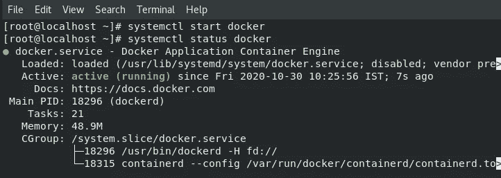

现在，启用 docker 服务，以便 docker 服务在系统重新启动后保持运行。使用以下命令进行相同的操作:-

```
**systemctl enable docker**
```

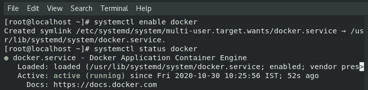

接下来，使用以下命令提取 docker 映像

```
**docker pull *image-name***
```

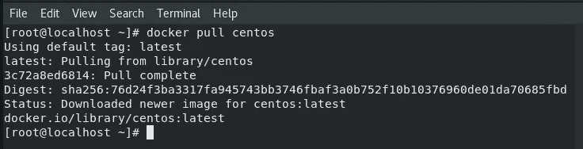

现在，从映像启动 docker 容器。使用以下命令进行相同的操作:-

```
**docker run -it — name webos centos**
```

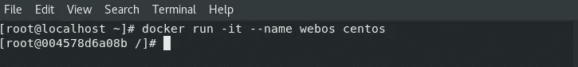

使用以下命令检查容器是否正在运行:-

```
**docker ps**
```


默认情况下，我们拥有的 centos 映像不包含 ifconfig 命令。因此，我们可以安装提供 ifconfig 命令的软件。 ***net-tools*** 是提供 ifconfig 命令的软件。所以，我们可以用 yum 命令安装这个软件。

```
**yum install net-tools -y**
```

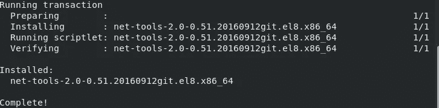

现在，我们可以检查容器的 IP。

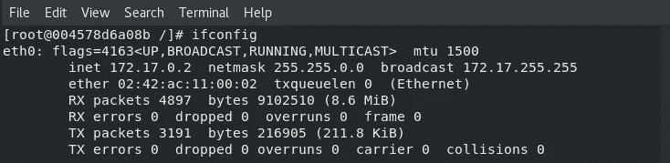

## 在 Docker 容器上配置 HTTPD 服务器

**步骤 2:-** 现在，安装 apache httpd 软件。使用以下命令进行相同的操作:-

```
**yum install httpd -y**
```

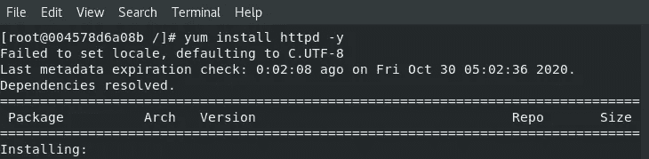

默认情况下，httpd 软件从/var/www/html 目录中读取 HTML 文件。因此，我们必须将 HTML 文件放在/var/www/html 目录中。使用以下命令进行相同的操作:-

```
**cd /var/www/html
cat > index.html
cat index.html**
```

现在，启动 httpd 服务。默认情况下，systemctl 命令不存在。所以，我们可以使用/usr/sbin/httpd 文件，因为 systemctl 内部加载了这个文件来启动服务。

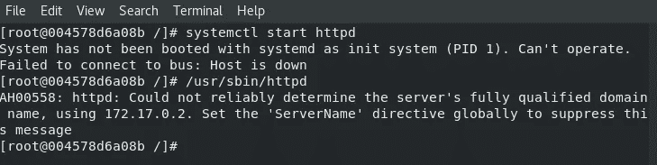

现在，我们可以从浏览器访问网页。

## 安装 Python 解释器&在 Docker 容器上运行 Python 代码

**第三步:-** 现在，我们必须安装运行 python 代码的 python 软件。相同操作的命令如下:-

```
**yum install python3** 
```

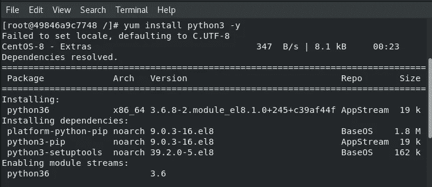

接下来，创建一个文件，并在其中编写 python 代码。

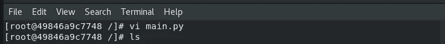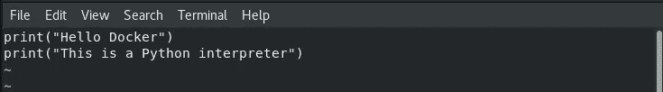

现在，使用以下命令运行 python 代码:-

```
**python3 *file-name.py***
```

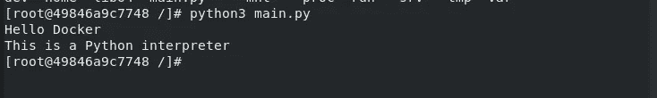

***感谢阅读:)***