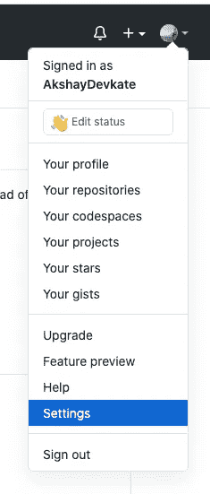
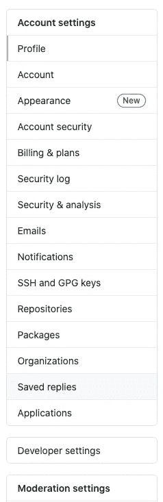
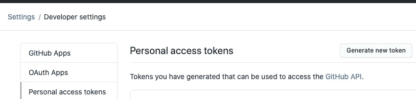
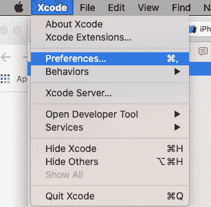
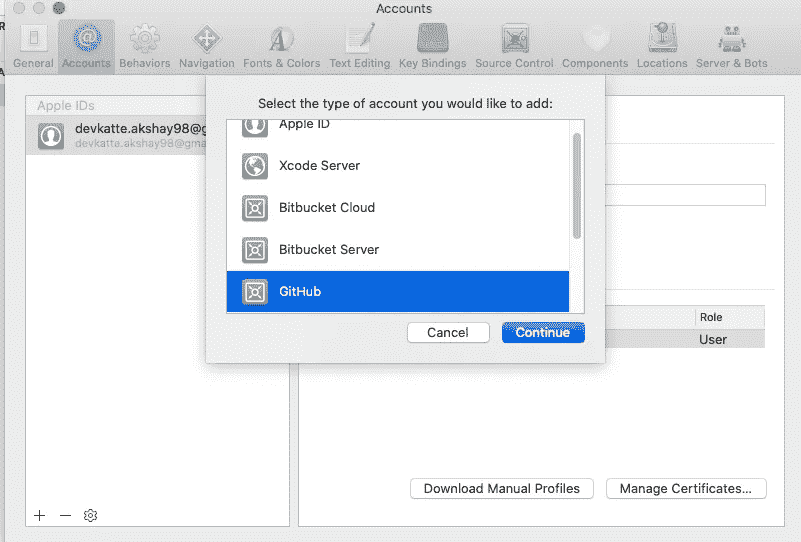
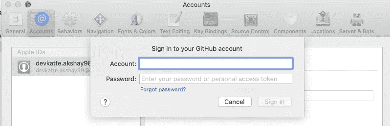

# 如何连接 Xcode 和 GitHub

> 原文：<https://medium.com/nerd-for-tech/how-to-connect-github-and-xcode-499134c62eac?source=collection_archive---------9----------------------->

GitHub 是版本控制软件即服务，提供分布式版本控制、源代码管理、访问控制等等。GitHub 基本上就是用 GUI(图形用户界面)进行版本控制。开发人员在开发应用程序时使用它与其他开发人员协作。

您可能希望在代码被修改到存储库的主分支时就将它推送出去。将 GitHub 与 Xcode 连接起来，可以更容易地让 pull 请求将代码推送到 GitHub。上传和下载软件包和源代码更加容易和方便。

要将 GitHub 与 Xcode 连接，首先您需要创建一个 GitHub 令牌，它将在 Xcode 中用于验证您的 ID。

**第一步:**生成接入令牌

登录你的 GitHub 账户，点击导航栏右上角的图片图标。在那里你可以找到一堆选项，点击设置，如下所示。

然后你会被重定向到一个新的**账户设置**窗口。点击**开发者设置**

点击开发者设置后，导航至**个人访问令牌**并查找**生成新令牌**

创建新令牌后，拷贝它。**你只能看一次 token。**

复制令牌后，请继续下一步。

**步骤 2:** 使用令牌进行认证

打开 Xcode ->点击屏幕左上角的 Xcode->点击 preferences，如下图所示。

现在你将被带到一个新的屏幕。导航到帐户，然后单击应用程序窗口左下角的+ sign。单击+ sign 后，将出现一个新的对话框。搜索 GitHub，然后继续。

现在会出现一个新的对话框，询问您帐户和密码，您需要提供 GitHub 帐户的**用户 Id，在密码中，您需要提供我们在步骤 1 中获得的**访问令牌**。**

一旦您输入了有效的 GitHub ID 和访问令牌，您的 GitHub 帐户将被添加到 Xcode 中。