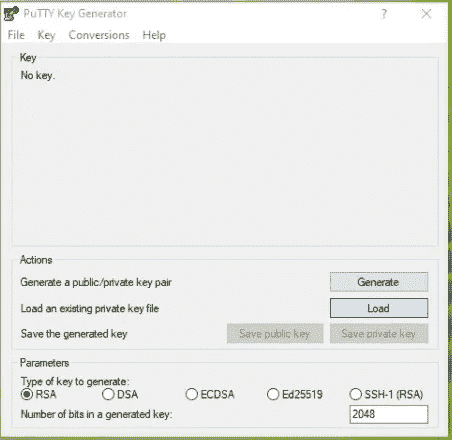
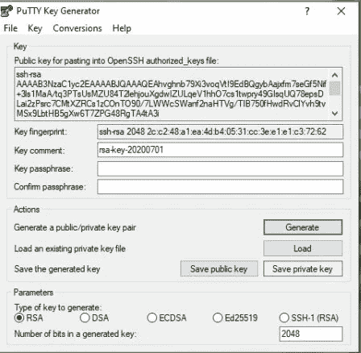
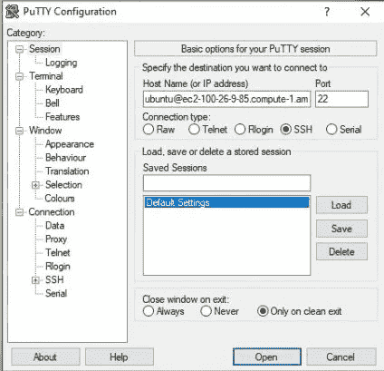
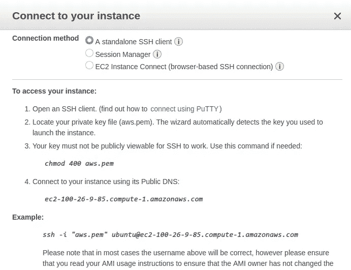
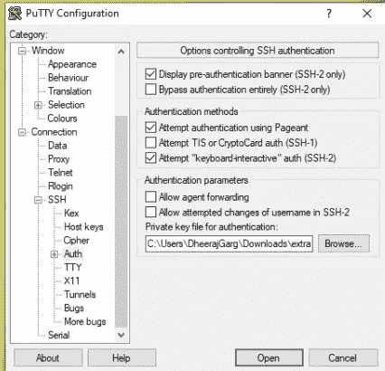
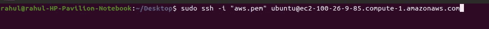

# 如何从 Windows/Ubuntu 连接到 EC2 实例(AWS)

> 原文：<https://medium.com/nerd-for-tech/how-to-connect-to-ec2-instance-aws-from-windows-ubuntu-da97c0cc9c8?source=collection_archive---------1----------------------->

在这里，我们将学习如何从本地机器(Windows/Ubuntu)连接到 AWS EC2 实例。

## 先决条件

1.  考虑到您已经成功创建了一个 AWS 帐户。
2.  您还在您的 AWS 帐户上**创建了**一个 AWS EC2 实例。
    如果还没有？[了解如何在 AWS EC2(弹性云计算)上创建 Ubuntu 20.04 服务器](/@rahul26021999/how-to-create-a-ubuntu-20-04-server-on-aws-ec2-elastic-cloud-computing-5b423b5bf635)
3.  准备好您的私钥文件(。pem)。创建 EC2 实例时生成的。

# 从 Windows 连接 EC2 的步骤

## 1.在本地机器上下载并安装 Putty

从 [PuTTY 下载页面](http://www.chiark.greenend.org.uk/~sgtatham/putty/)下载并安装 PuTTY。如果您已经安装了旧版本的 PuTTY，请更新它，确保安装整个套件。

## **2。使用 PuTTYgen** 转换您的私钥

PuTTY 本身不支持 SSH 密钥的私钥格式。PuTTY 提供了一个名为 **PuTTYgen** 的工具，该工具将密钥转换为 PuTTY 所需的格式。您必须转换您的私钥(。pem 文件)转换成这种格式(。ppk 文件)，以便使用 PuTTY 连接到您的实例。

1.  从**开始**菜单中，选择**所有程序**，然后选择**推杆**。

2.在**生成**的密钥类型下，选择 **RSA** 。如果您使用的是旧版本的 PuTTYgen，请选择 **SSH-2 RSA** 。



3.选择**装载**。默认情况下，PuTTYgen 只显示扩展名为`.ppk`的文件。要找到您的`.pem` 文件，请选择显示所有类型文件的选项。

4.选择你的`.pem` 文件。它将显示一条消息成功导入现在保存您的私钥。



现在，您的私钥格式正确，可用于 PuTTY。现在您可以使用 PuTTY 的 SSH 客户端将连接到您的实例。

## 3.使用 Putty 连接到 EC2

1.启动 PuTTY(从**开始**菜单，选择**所有程序，PuTTY，PuTTY** )。

2.在**类别**窗格中，选择**会话**并填写以下字段:



```
Enter Host_name =  my-instance-user-name@my-instance-public-dns-name
Enter Port = 22
Connection Type = SSH
```

> **用你的**主机名**和**用户名**替换**“我的实例用户名@我的实例公共域名。你可以在 **AWS EC2 仪表盘**上找到这些细节。转到 EC2 **仪表板**。**点击实例上的**。**点击**连接，您将在示例中找到详细信息。



3.在**类别**窗格中，展开**连接**，展开 **SSH** ，然后选择 **Auth** 然后**浏览**并选择您为您的密钥对生成的`.ppk`文件，然后选择**打开。**



4.(可选)如果您计划稍后再次启动该会话，可以保存会话信息以供将来使用。在**类别**下，选择**会话**，在**保存的会话**中输入会话名称，然后选择**保存**。

4.选择**打开**。

> 如果这是您第一次连接到该实例，PuTTY 会显示一个安全警告对话框，询问您是否信任正在连接的主机。选择是。

> 您现在从 Windows 连接到了您的 EC2 实例

# **从 Ubuntu 连接 EC2 的步骤**

**从 Ubuntu 连接到 EC2 实例。**

1.  **开放终端。**
2.  **转到存储您的私钥的文件夹。**
3.  **运行下面的命令来连接到您的 EC2 实例。**

```
$ sudo ssh -i "yourPrivateKey.pem" my-instance-user-name@my-instance-public-dns-name
```

****

**终端示例**

> ****用你的**主机名**和**用户名**替换**“我的实例用户名@我的实例公共 dns 名称”**。你可以在 **AWS EC2 仪表盘**上找到这些细节。转到 EC2 **仪表板**。**点击实例上的**。**点击**连接，您将在示例中找到详细信息。****

****

> **如果这是您第一次连接到此实例，它将显示一条安全警告:选择“是”以连接到 EC2 实例。**

> **现在，您已经从 Ubuntu 连接到 EC2 实例。**