# 如何连接 Xcode 和 GitHub

> 原文：<https://medium.com/nerd-for-tech/how-to-connect-xcode-and-github-b872f6553567?source=collection_archive---------28----------------------->

## 学习直接从 Xcode12 提交

图片由作者提供，背景来自[约书亚·阿拉贡](https://unsplash.com/@goshua13)在 [Unsplash](https://unsplash.com/photos/EaB4Ml7C7fE)

这个循序渐进的教程将教你如何连接 Xcode 和 GitHub，这样你就可以执行项目的控制版本。在继续之前，我假设你有一个 GitHub 账户，如果没有，不要再浪费一秒钟，[去创建一个](https://github.com/join)。

# 1.在 Mac 上配置 GitHub

打开一个新的终端( *cmd + space* ，然后编写 *terminal* ，使用您的 GitHub 用户名和电子邮件粘贴以下命令:

# 2.将您的 GitHub 帐户添加到 Xcode

打开 Xcode 并前往偏好设置:

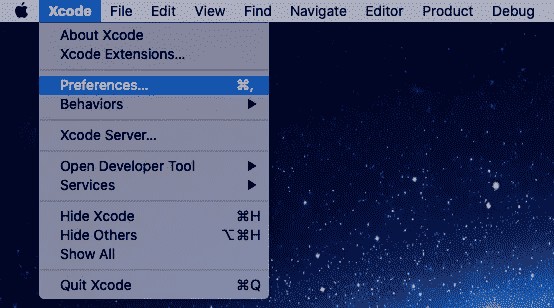

导航到帐户，点击窗口底部的+并选择 GitHub:

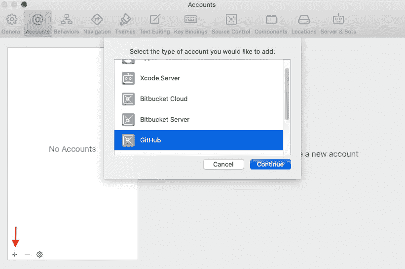

写下你的 GitHub 用户名和令牌？是的，您不能使用您的普通密码，您需要生成一个令牌:

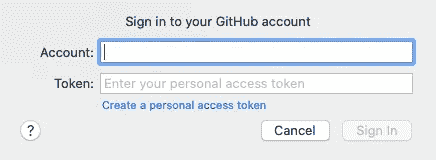

转到 GitHub，点击您的图片>设置>开发者设置>个人访问令牌>生成新令牌:

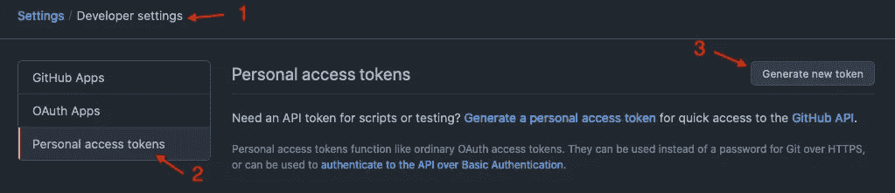

给你的令牌起一个一致的名字，比如 *Xcode* 并选择作用域。我选择: *repo，admin:public_key，notifications，user 和 delete_repo:*

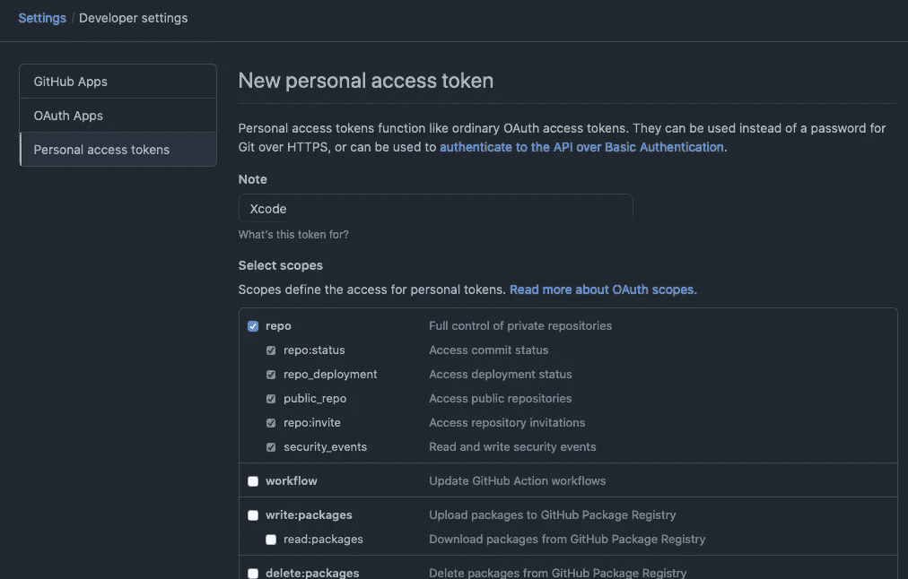

复制剪贴板中的令牌…

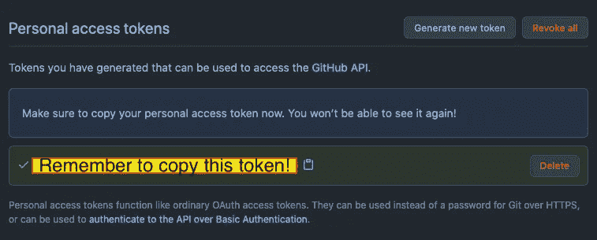

…并将其粘贴到 Xcode 中:

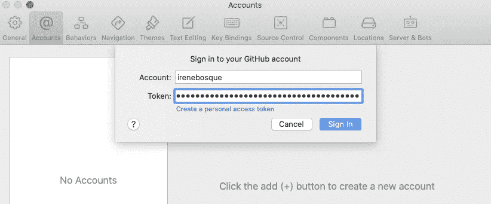

然后，您会看到您的 GitHub 帐户已经添加到 Xcode:

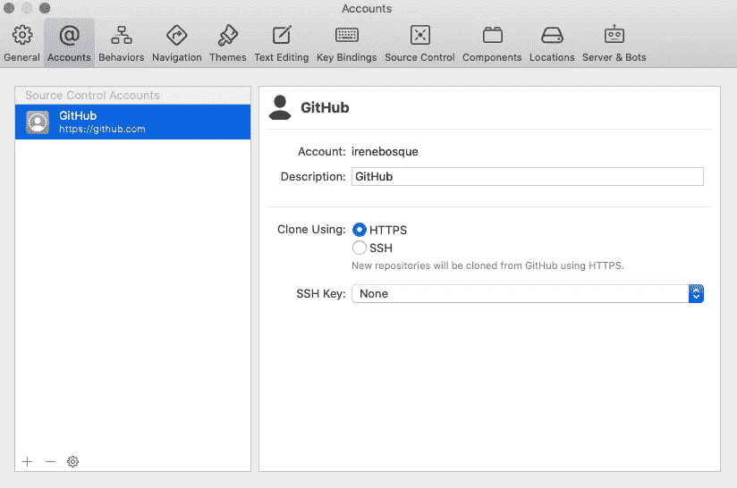

# 3.创建新的 Xcode 项目

是时候创建一个新项目了。转到文件>新建>项目…

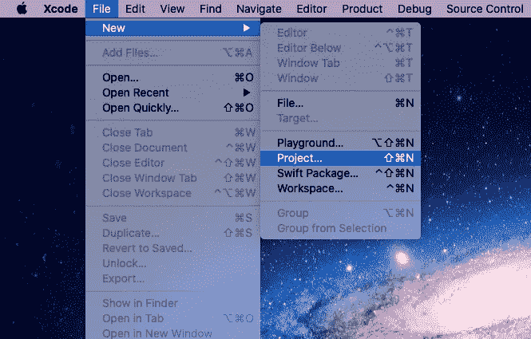

为您的项目选择一个模板，然后单击下一步。我选择了 iOS 应用程序:

填写您的应用程序的名称…

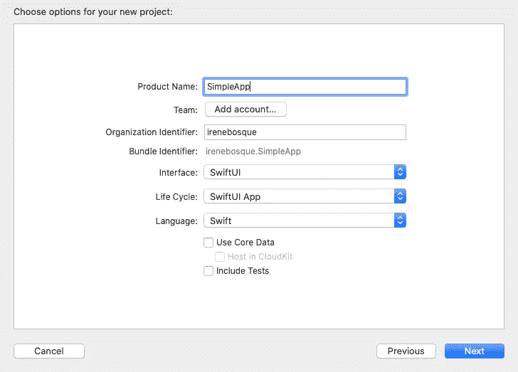

…而且，小心⚠️选择选项*“在我的 Mac 上创建 Git 存储库”:*

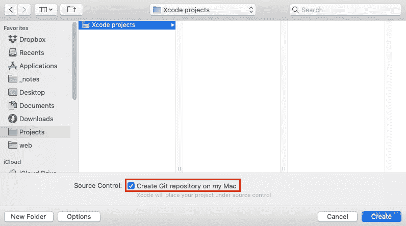

# 4.创建新的 GitHub 存储库(从 Xcode)

我们快到了。显示源代码控制导航器，右键单击 *Remotes* ，然后单击*New“Your app”Remote…*

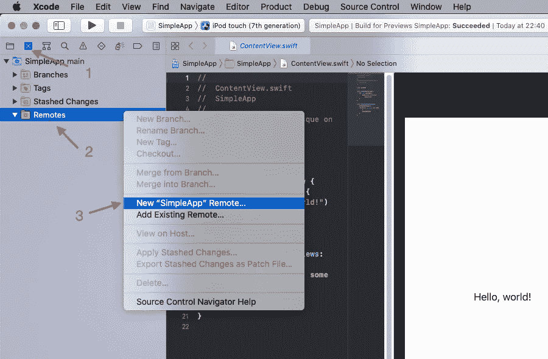

我们可以直接在 Xcode 中完成这项工作，而不是从 GitHub 创建存储库。给你的库起一个好听的名字，添加一些描述，选择可见性，然后点击*创建*:

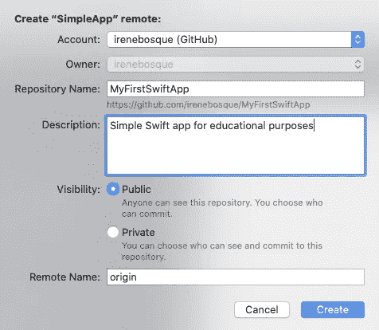

如果你去 GitHub，你会看到你的新仓库在那里等着你，很好🤩！

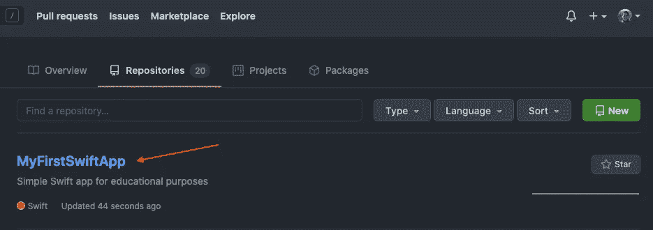

# 5.从 Xcode 提交

在这最后一步，我将向你展示如何直接从 Xcode 提交，不需要打开终端。首先，对代码进行一些修改。我只是改变了默认的 *Hello，world！你好，世界！您可以在文件旁边看到一个小的 **m** ，表示您的存储库中的文件有一些修改。*

转到源代码管理>提交…

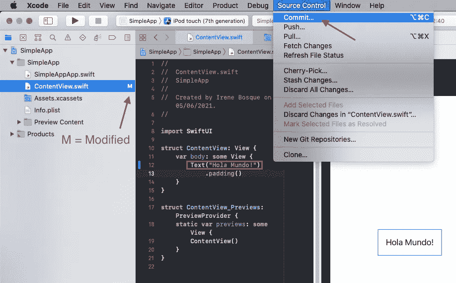

将出现一个新窗口，您可以在其中看到已修改的内容。添加您的提交消息，选择*推送至远程*，最后点击*提交并推送:*

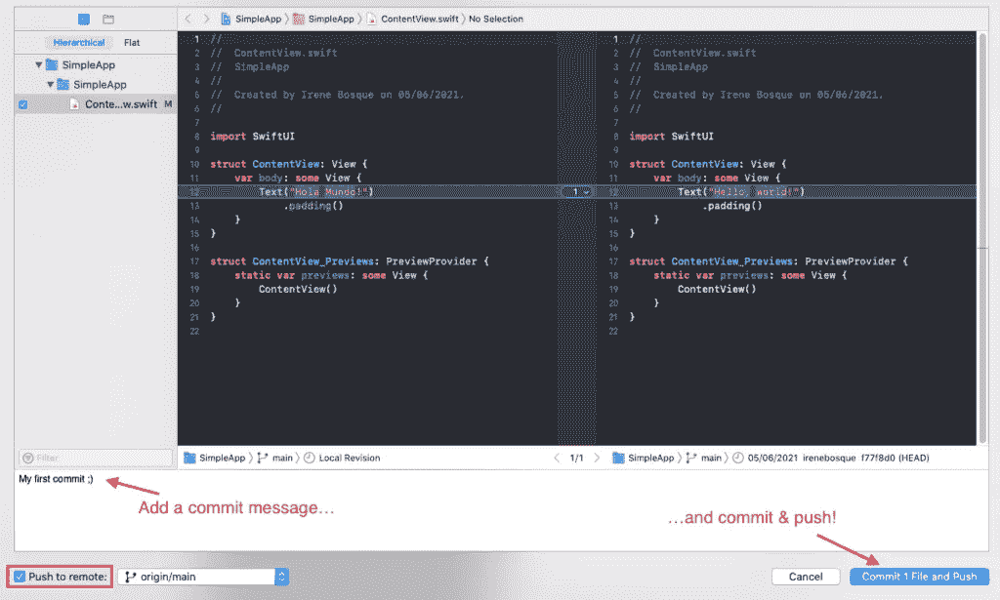

终于！这是你第一次直接从 Xcode 🥳提交🎉

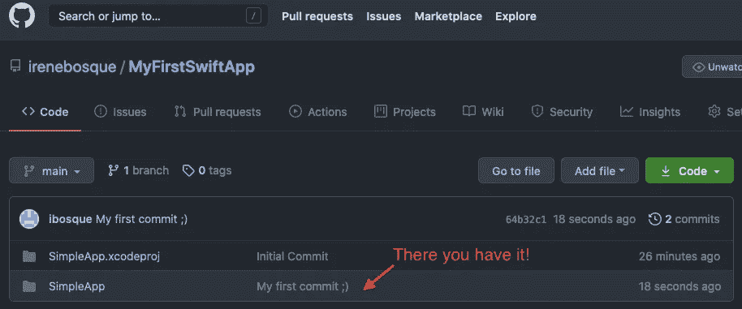

感谢阅读！

# 参考资料:

*   Youtube: [Xcode 教程:GitHub 集成、个人访问令牌和 Xcode 回购创建](https://www.youtube.com/watch?v=m9a6dkqYVS8)
*   中:[如何配合 Xcode11 使用 Github](/swlh/how-to-use-github-with-xcode11-8a93b64ff1bc)

*原载于 2021 年 6 月 11 日 http://irenebosque.com***。**