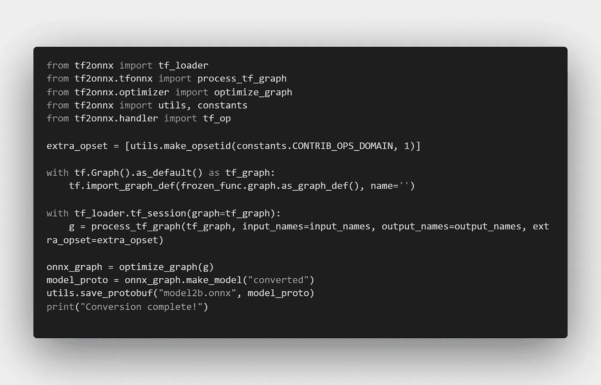

# 有自定义 Ops 时如何使用 tf2onnx 将 Tensorflow2 模型转换为 ONNX

> 原文：<https://medium.com/nerd-for-tech/how-to-convert-tensorflow2-model-to-onnx-using-tf2onnx-when-there-is-custom-ops-6e703376ef20?source=collection_archive---------1----------------------->



## 使用 CustomOps / Extra Opset 将 Tensorflow (PB)转换为 ONNX

# 介绍

转换模型时，在以 UserObjects 错误结束时，转换的 tensorflow 端检测到 ONNX 转换模型元描述中没有实现自定义操作。

我们通常的转换方法是遵循命令行实用程序`tf2onnx.convert`

> 这是必须避免的！！！！！！

# 出路

按照教程将 Tensorflow 模型转换成 ONNX，描述在: [@tf2onnx](https://github.com/onnx/tensorflow-onnx)

```
**python -m tf2onnx.convert --saved-model tensorflow-model-path --output model.onnx**
```

# 定制操作

使用自定义 Ops 需要采用试错法来转换模型。

首先，尝试命令行选项。

## 命令行选项

```
**python -m tf2onnx.convert --saved-model tensorflow-model-path --output model.onnx --extra-ops 'ai.onnx.contrib:1'**
```

然后，在笔记本中尝试，从字面上看，打开一个笔记本来转换为@ [OpenVINO Notebooks](https://github.com/openvinotoolkit/openvino_notebooks/) 存储库地址总是更好。

在笔记本中遵循以下简单步骤:

> **关注本笔记本:**[**https://github . com/Microsoft/onnx runtime-extensions/blob/main/tutorials/TF 2 onnx _ custom _ ops _ tutorial . ipynb**](https://github.com/microsoft/onnxruntime-extensions/blob/main/tutorials/tf2onnx_custom_ops_tutorial.ipynb)

1.  ***加载张量流模型***

```
**model = tf.keras.models.load_model("path/to/model")**
```

**②*。将模型转换为具体函数***

```
**full_model = tf.function(lambda inputs: model(inputs))** **full_model = full_model.get_concrete_function([tf.TensorSpec(model_input.shape, model_input.dtype) for model_input in model.inputs])**
```

***2.1 持久化输入输出参数***

```
**input_names = [inp.name for inp in full_model.inputs]
output_names = [out.name for out in full_model.outputs]
print("Inputs:", input_names)
print("Outputs:", output_names)**
```

***3。冻结模型*和**

```
**from tensorflow.python.framework.convert_to_constants import convert_variables_to_constants_v2****frozen_func = convert_variables_to_constants_v2(full_model)
frozen_func.graph.as_graph_def()**
```

***4。使用额外的 op set[关键代码]*** 单步转换模型

```
**from tf2onnx import tf_loader
from tf2onnx.tfonnx import process_tf_graph
from tf2onnx.optimizer import optimize_graph
from tf2onnx import utils, constants
from tf2onnx.handler import tf_op****extra_opset = [utils.make_opsetid(constants.CONTRIB_OPS_DOMAIN, 1)]****with tf.Graph().as_default() as tf_graph:
    tf.import_graph_def(frozen_func.graph.as_graph_def(), name='')****with tf_loader.tf_session(graph=tf_graph):
    g = process_tf_graph(tf_graph, input_names=input_names, output_names=output_names, extra_opset=extra_opset)****onnx_graph = optimize_graph(g)
model_proto = onnx_graph.make_model("converted")
utils.save_protobuf("model2b.onnx", model_proto)
print("Conversion complete!")**
```

谢谢你。