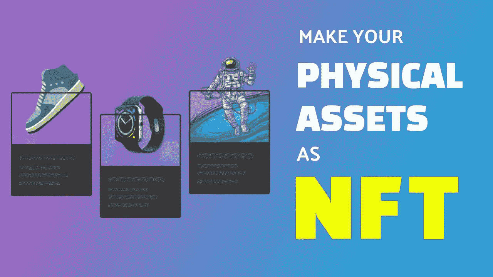

# 如何将你的实物资产转化为 NFT？

> 原文：<https://medium.com/nerd-for-tech/how-to-convert-your-physical-asset-as-nft-2cc3df01bda9?source=collection_archive---------8----------------------->

将您的实物资产转换为 NFT

NFT 正在成为数字领域的热门话题。像华纳兄弟、Instagram 和 Shibo Entertainment 这样的领先公司已经开始涉足 NFT 世界。最近，韩国银行还测试了 NFT 交易，并汇出了 CBDC。NFT 的创造者也很有创新精神，他们也推出了 3D NFTs 来吸引 NFT 的爱好者。NFTs 的另一个吸引世界各地 NFT 爱好者注意的有趣特性是它们能够将物理资产令牌化。将实物资产 [**标记为**](https://bit.ly/3tglH36) 的想法听起来很吸引人。这一概念在领先的公司和 NFT 创作者中迅速得到采纳。

[**现在就令牌化你的资产吧！**](https://www.blockchainappfactory.com/real-estate-tokenization?utm_source=9/11/22&utm_medium=Medium+Nerd+for+tech&utm_campaign=senpagapandian) 👈👈**点击这里**

# **什么是物理 NFT？**

如果买方希望购买现实世界的资产，NFT 保证实物资产的所有权。通常，NFT 与艺术作品联系在一起，但是，现在几乎任何东西都可以被符号化。任何像体育收藏品、古董和商品这样的链外资产都可以被标记为 NFTs。

记号化最好的实践例子之一是房地产记号化。如果你曾经购买过房地产，那么你就会知道它的复杂性和繁琐的文书工作。有了 NFTs，由于所有细节都记录在区块链上，繁重的文书工作过程因标记化而缩短。

## **物理 NFT 的优势有哪些**？

*   物理 NFTs 的最大优势之一是您可以有效地证明资产的真实性和所有权。
*   对应的真实世界资产被伪造和假冒的可能性极小，因为 NFT 提供数据跟踪。
*   NFTs 的主要优势之一是它消除了交易中的中介，为用户提供了金钱利益。
*   区块链的另一个好处是，资产可以分成许多虚拟资产，这些虚拟资产被表示为单个令牌。这增强了资产的整体流动性。
*   除了不变性之外，与 NFT 相关的数据是高度安全的，并且使用加密技术进行了加密。
*   大多数工作流和现实世界的累人流程都是通过标记化实现自动化的。
*   令牌化的数字资产可以用作贷款的抵押品。

## **大品牌进入实物资产令牌化**

*   耐克是一家充分利用 NFTs 的领先公司。这家运动服装公司在涉足数字运动鞋领域后，获得了超过 1.85 亿美元的收入。
*   易贝通过收购 NFT 一家很受欢迎的市场 KnownOrgin 进军 NFT 世界。
*   麦当劳通过发行有限的麦当劳快餐进入 NFT 市场。
*   可口可乐宣布在 2021 年拍卖一个单一的战利品室，并在 2022 年继续发布更多的 NFT。
*   Formula1 通过发布法拉利、红牛和迈凯轮等车队的 NFT 来试验 NFT。
*   华纳兄弟曾宣布将发布与热门系列《权力的游戏》相关的 NFT。

## **物理 NFT 的一些用例**。

**阿迪达斯原创:**阿迪达斯与 NFT 知名品牌 Bored Ape 游艇俱乐部合作，发布了名为“阿迪达斯原创”的 NFT 购买这些 NFT 的用户可以获得实物商品，如帽衫、运动服和豆子。

**rtf kt Studios:**rtf kt Studios 是一家被耐克收购的数字运动鞋巨头。该公司冒险涉足实体鞋类的标记化。它与其他各种密码创作者合作，设计不同的物理项目。

这家公司是由知名数字艺术家迈克·温克尔曼(又名毕普)共同创立的。该公司以 NFT 的形式出售标志性和历史性的时刻。例如，路易威登的第 200 年 NFT 发布为路易 200。

**GAP:** GAP 是一家基于其实体帽衫发布 NFTs 的时尚公司。该系列由 Brandon Sinnes 设计，被称为弗兰克猿收藏帽衫。

**美泰:**美泰通过与企业家加里·维纳查克合作推出 VeeFriends NFT 进入 NFT 市场。该公司宣布将发布更多的 NFT，探索游戏、数字艺术和收藏之间的交集。

## **如何将实物与 NFT** 关联起来？

例如，如果您希望标记一幅作品，您可以开始用专业相机点按这幅画的图片。然后确定与文件相关的元数据，如技术、大小、作者等。被附加到虚拟文件。如果你选择像 OpenSea，Rarible 等受欢迎的 NFT 市场是最好的。，把你的资产铸造成 NFT，在平台上列出来。基于以太坊的令牌自行分配所有权并管理 NFT 的传输。

## **结论**

实物 NFT 对各个领域和行业都产生了积极的影响。随着 NFT 游戏平台、元宇宙 NFT 等的发展，NFT 市场有望在未来几年飞速发展。随着全球 NFT 市场预计到 2028 年达到令人瞠目结舌的 7636 美元，对非功能性测试的需求和价值似乎不会很快停止。如果你想将实物资产转化为 NFT 并获得成功，那么与专业的 NFT 发展公司合作就能成功。