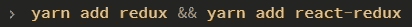
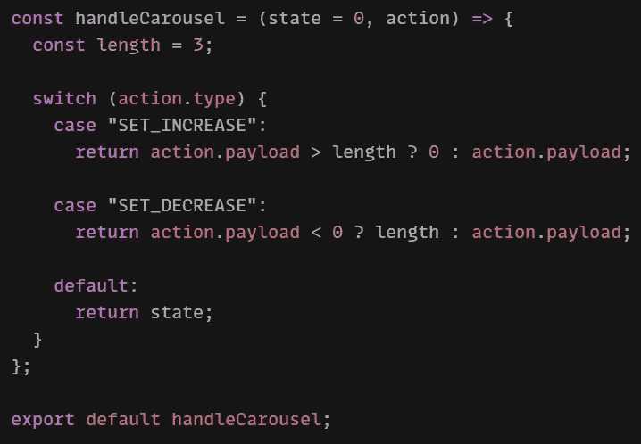
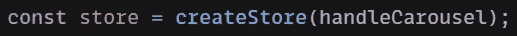
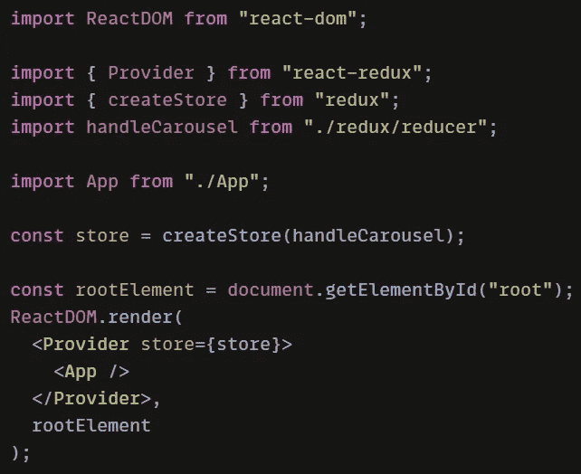
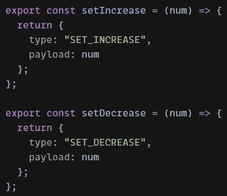
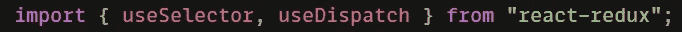
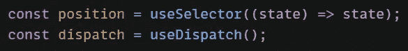
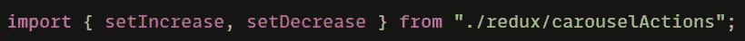
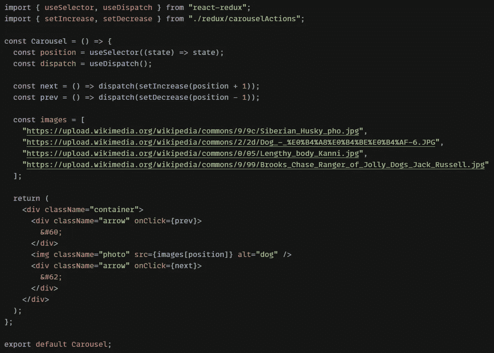

# 如何用 React & Redux 创建一个基本的 Carousel 组件

> 原文：<https://medium.com/nerd-for-tech/how-to-create-a-basic-carousel-component-with-react-redux-516eef5d9b38?source=collection_archive---------9----------------------->

几周前，我在不同的屏幕上查看我的作品集，意识到我对布局经常从手机转向网络并不满意。我决定将我的项目部分切换为使用一个转盘，而不是单独列出它们。通过一些试验和错误，我想通了，但我想我会写这个指南，以节省你一些时间，如果你也在考虑如何做到这一点。

请注意，我将在这个练习的一个新项目中工作。

让我们从添加 react-redux 和 redux 到我们的项目开始，如果它们还没有的话。要将这些依赖项添加到根目录下的项目 cd 中并运行:

或者如果你使用纱线:

一旦安装完毕，您可以将这些行添加到 index.js 文件的顶部

接下来，我们将在一个单独的文件中创建 reducer 函数，该文件将保存减少状态的逻辑。这是我如何设置我的:

我已经将默认状态设置为 0。其工作方式是，整数 0 将作为我们的 carousel 的图像数组的指针。我们将把这个整数加 1 或减 1 来移动转盘。

我将要创建的 carousel 将容纳 4 张图片，所以我已经通过设置一个名为 length 的变量对其进行了硬编码。您看到的“SET_INCREASE”和“SET_DECREASE”的返回逻辑将确保我们永远不会超出图像数组的范围。

回到我们的 index.js 文件……让我们导入这个缩减器，并在创建存储时将其作为参数传递。

现在剩下要做的就是用 Provider 包装我们的应用程序组件，并将我们的商店作为道具传递给它。如果您直接跟随我，您的 index.js 文件现在应该类似于下面这样。

*如果你正在更新一个现有的项目，请做相应的调整。*

让我们继续创建我们将在一个单独的文件中分派给我们的 reducer 的动作。我们马上就要把这些输入传送带。

让我们开始实际的转盘组件的工作。我们将在新文件的顶部导入 useSelector 和 useDispatch，这将使我们能够接收和更新转盘的位置。

在我们的组件中，我们将设置一个变量 position 来跟踪我们在 carousel 中的当前位置，我们还将设置我们的 dispatch。

然后，我们将从操作文件中导入操作。

并创建必要的回调函数，将更新后的位置发送给 reducer 函数。

现在剩下要做的就是建立一个图片链接列表，这是维基百科的简写，用来建立和呈现必要的元素。看看下面的最终代码作为参考:

不要忘记导入和渲染组件！！

如需此的实时版本，请查看此代码沙盒: