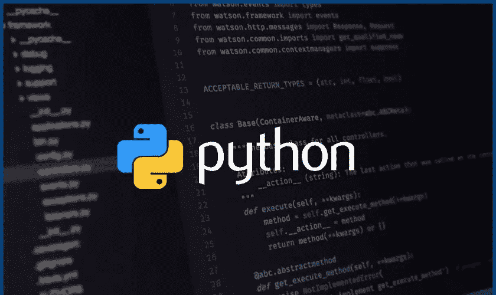
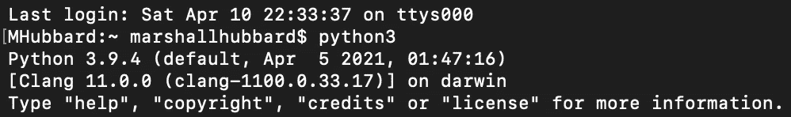
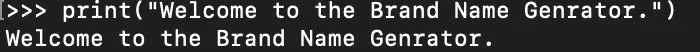
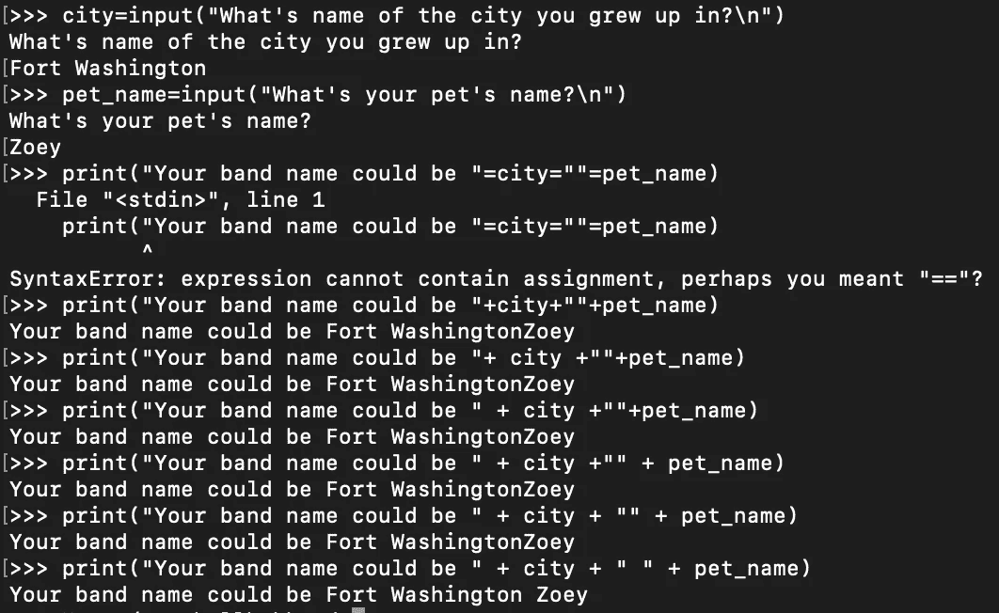
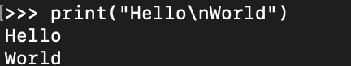

# 如何使用 Python 创建品牌名称生成器

> 原文：<https://medium.com/nerd-for-tech/how-to-create-a-brand-name-generator-using-python-8c360c4c9b31?source=collection_archive---------15----------------------->

欢迎回到我的博客！现在，我们将开始把 Python 添加到我们的剧目中。我希望您能和我一起简要研究一下生成品牌名称的简单 Python 代码。但是在我们开始之前，我想确保你知道 Python 是什么，它是用来做什么的，以及如何下载到你的操作系统上，这样你就可以和我一起学习了。

*在我们开始之前，本博客中任何带下划线的单词都是直接链接到源材料的链接，以便进一步阅读和理解

**Python 是什么，是用来做什么的？** [Python](https://www.python.org/doc/essays/blurb/) 是一种解释性的、面向对象的、具有动态语义的高级编程语言。它的高级内置数据结构，结合了动态类型和动态绑定，使它对于快速应用程序开发，以及作为脚本语言或粘合语言将现有组件连接在一起非常有吸引力。

现在我们已经有了定义，让我们来看看如何将 Python 添加到您的环境中。根据您选择使用的操作系统，我们可以通过几种不同的方式来实现这一点，但我个人建议在您的 CLI 中安装 Homebrew，这就引出了下一个问题…

**什么是家酿啤酒，它有什么用途？** [家酿](https://docs.brew.sh/Installation)是一款免费开源的软件包管理系统，简化了软件的安装。家酿可以下载并在 MacOS、Linux 以及 Windows 10 上使用。在我看来，这是下载任何东西到你的 CLI 的最简单的方法。

一旦安装了 Homebrew，获取 Python 就像输入下面的命令一样简单: **$ brew install python@3.9**

但是，如果您运行的是早期版本的 Windows，要安装 Python，您必须安装 [Chocolatey](https://chocolatey.org/install) ，然后使用以下演练安装 Python:[Python 的搭便车指南](https://python-docs.readthedocs.io/en/latest/starting/install3/win.html)。

一旦你安装了 Python，我们现在就可以开始我们的项目了。

**步骤 1:** 进入 Python 环境

好吧，让我们开始派对吧。在 CLI 中运行命令" **python3** "进入 python 环境。你会知道，你是由于有了“> > >”的箭矢。

**第二步**:创建问候语

一旦你想好了问候语，就把它放在括号内的引号中。这告诉 Python，当它将您的名字打印到屏幕上时，您希望它显示什么。

第三步:提出你的问题

在这里，您将开始创建您希望得到回答的问题。此外，记住你希望它们打印出来的顺序。我个人选择的问题如下:

1.  询问用户他们成长的城市-

**city = input("你长大的城市叫什么名字？\n")**

2.向用户询问宠物的名字-

**pet_name = input("你的宠物叫什么名字\n")**

3.将他们的城市名和宠物名结合起来，并向他们展示他们的乐队名-

**打印("你的乐队名可以是"+城市+ " " +宠物名)**

在这里你会看到我的错误，哈哈。确保引号和加号的开头有一个空格。还要确保命令的其余部分适当隔开，以避免 Python 将您的答案连接在一起。

使用 Python 时要记住几件事:

*   变量前面不能用数字。例如**1 变量**不允许，因为**变量 1** 是。
*   应该在单词之间使用一个 _ 以便 Python 能够正确读取。Ex- **宠物名**
*   组合变量的一个例子是我们输入的命令- **print("您的乐队名可以是"+ city + " " + pet_name)**
*   创建变量的一个例子是我们输入的上面的命令- **city = input("你长大的城市叫什么名字？\n")**
*   \n 在输出中开始新的一行。从；外；离；除；超过；以前的

我的第一个 Python 实验室到此结束。我希望你们能继续和我在一起！