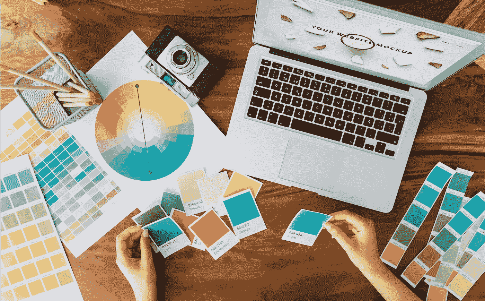
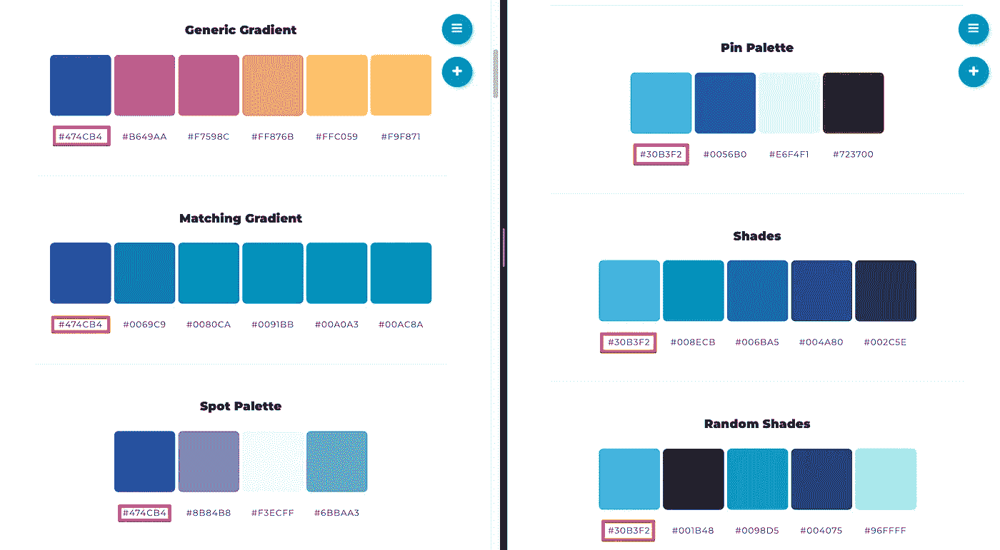
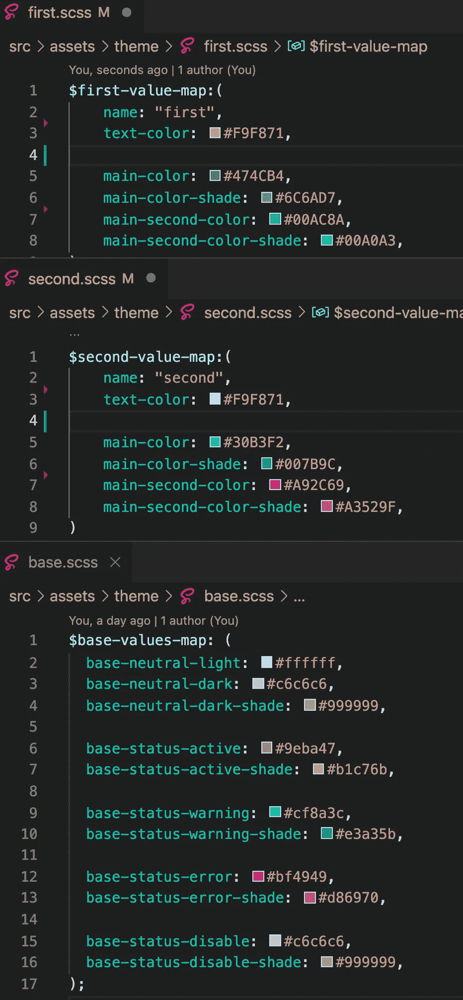
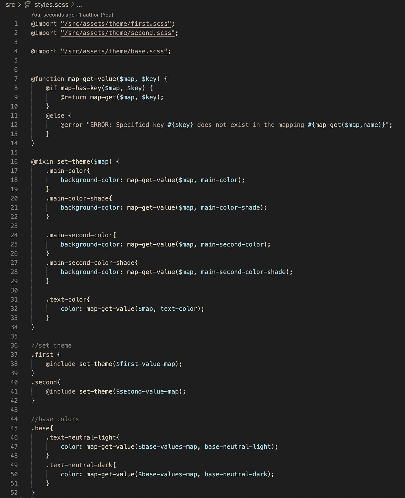
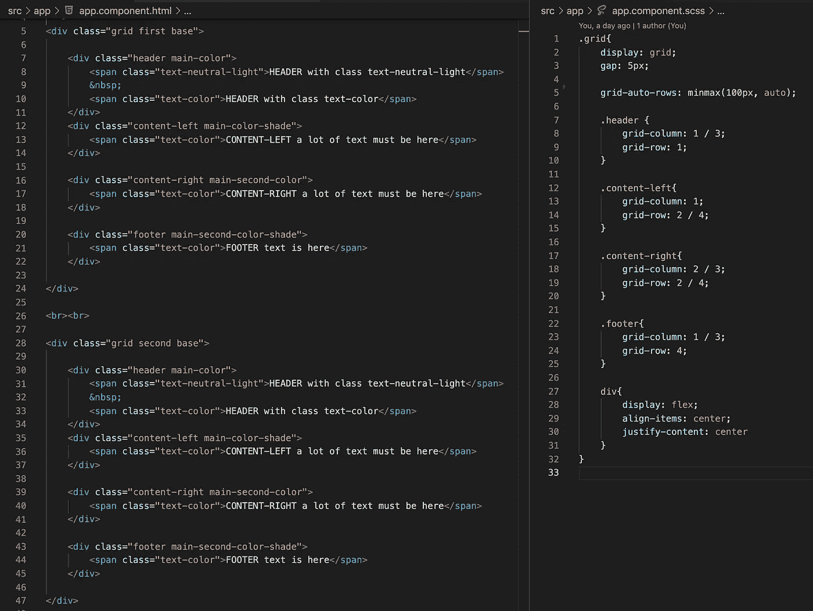
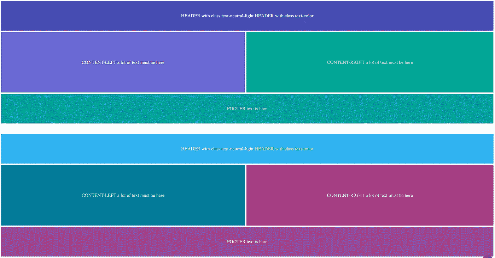

# 如果你不是设计师，如何打造色彩丰富的主题？

> 原文：<https://medium.com/nerd-for-tech/how-to-create-a-colorful-theme-if-you-are-not-a-designer-561ff1c69f02?source=collection_archive---------5----------------------->

开发者提示

如果你是一名开发人员，你可能不知道如何挑选合适的颜色。

我们只需要选择主色调。我会用这个[网站](https://randomcolorgenerator.net/)随机挑选颜色。随机化器给了我们两种颜色#474CB4 和#30B3F2。现在我们有了主色调，我们可以使用 [mycolor 网站](https://mycolor.space/)。这个网站生成了大量互相适合的颜色。我们可以选择任何我们喜欢的颜色。

下一步是为这些颜色创建几个 SCSS 文件。此外，我将创建一个基本的 SCSS 文件，我会把可以在任何主题中使用的常见颜色。

在主 SCSS 文件中，我们使用主题文件中的颜色来创建样式。

所有的准备工作都完成了，是时候在我们的项目中使用所有这些风格了。我们将使用 SCC 网格来模拟一个具有不同内容的网站。

因此，我们有一个丰富多彩的好看的网站。

如果你需要仔细看看这个项目[，这里是链接](https://tomorrowmeannever.wordpress.com/2022/01/20/how-to-create-a-colorful-theme-if-you-are-not-a-designer/.com/8Tesla8/Angular-color-palette)。

*原载于 2022 年 1 月 20 日 http://tomorrowmeannever.wordpress.com**[*。*](https://tomorrowmeannever.wordpress.com/2022/01/20/how-to-create-a-colorful-theme-if-you-are-not-a-designer/)*