# 如何在 CHEF 中创建食谱和食谱

> 原文：<https://medium.com/nerd-for-tech/how-to-create-a-cookbook-and-recipe-in-chef-ae62e9ba8156?source=collection_archive---------9----------------------->

版本:21.3.346

先决条件:[https://bansalkushagra . medium . com/how-chef-works-eb4c 7846819 a](https://bansalkushagra.medium.com/how-chef-works-eb4c7846819a)

**食谱里有什么？**

A.Chefbook = >喜欢。gitignore

B.Kitchen.yml = >用于测试食谱

C.metadata . Rb = > cookbook 的名称、版本、作者姓名等信息。

D.Readme.md = >关于 cookbook 用法的信息

E.食谱= >我们写代码的地方

F.Spec = >它用于单元测试

G.Test = >它用于集成测试

**实现= >**

第一步:

创建 Linux 的 ac EC2 实例，更新实例并下载 chef。

遵循下面的命令

> Yum 更新–y
> 
> Wget[https://packages . chef . io/files/stable/chef-workstation/21 . 4 . 365/El/7/chef-workstation-21 . 4 . 365-1 . el7 . x86 _ 64 . rpm](https://packages.chef.io/files/stable/chef-workstation/21.4.365/el/7/chef-workstation-21.4.365-1.el7.x86_64.rpm)

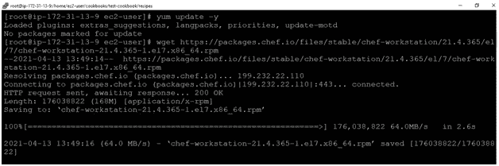

第二步:

。chef-workstation 的 rpm 文件将获得下载。安装填充物。

遵循以下命令= >

> yum install chef-workstation-21 . 4 . 365–1 . el7 . x86 _ 64 . rpm

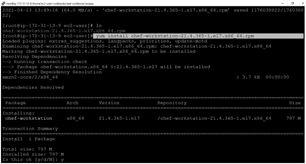

第三步:

要验证安装，必须检查 chef 的版本。

命令:

> 哪个厨师
> 
> 主厨–v

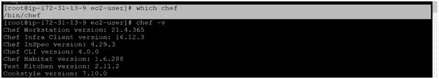

第四步:

创建一个存储所有类型烹饪书数据的烹饪书目录。

命令:

> mkdir 烹饪书
> 
> cd 烹饪书

让我们在这里创建一个特定的食谱:

> 厨师制作食谱<cookbook_name></cookbook_name>
> 
> 厨师制作食谱测试-食谱

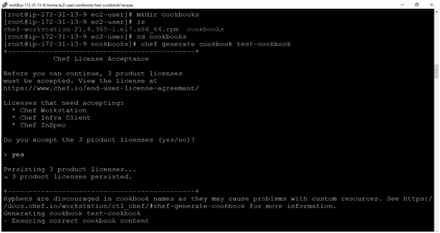

第五步:

让我们来看看我们系统的树形结构。

该树用于以树状格式递归地列出或显示目录的内容。它输出每个子目录中的目录路径和文件，以及子目录和文件总数的摘要。

命令:

> yum 安装树–y
> 
> 树

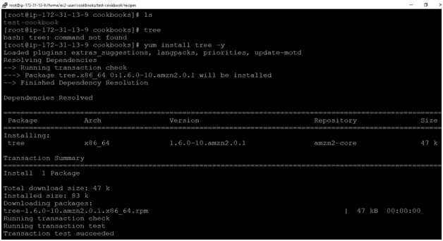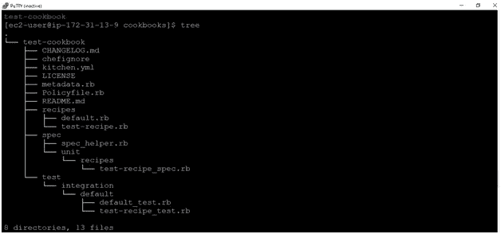

第六步:

为我们的烹饪书创作食谱。

命令:

转到 cookbook 目录，即 test-cookbook，并遵循以下命令。

命令:

> cd 测试-食谱/
> 
> 厨师生成食谱<recipe_name></recipe_name>
> 
> 厨师制作食谱测试-食谱

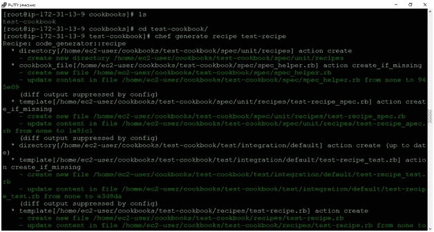

第七步:

让我们修改一个食谱。

或者转到目录，即食谱>测试食谱>食谱，并使用以下命令

> vi 测试-配方. rb

运筹学

> VI cookbook/test-cookbook/recipes/test-recipe . Rb

。rb 扩展是强制性的，如果没有它，将不会创建配方。

在文本编辑器中编写以下代码，并使用“ESC-:wq”命令退出

代码:

> 文件'/myfile' do
> 
> 内容'欢迎来到技术谷'
> 
> 操作:创建
> 
> 结束

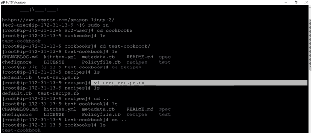

第八步:

让我们执行我们的食谱。它首先调用 ohai，如果配置文件中有任何更新，它将更新 ohai，否则它将显示输出“最新”

命令:

> 厨师-客户-Zr "食谱[ <cookbook_name>:: <recipe_name>]"</recipe_name></cookbook_name>
> 
> 主厨-客户–Zr“食谱[测试食谱::测试食谱]”

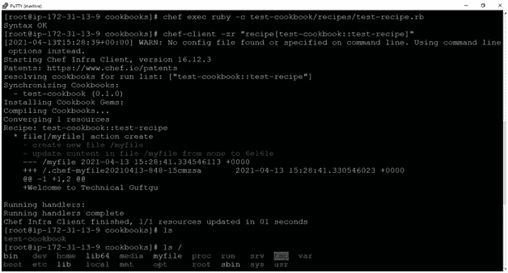

如果我们再次执行配方，它将显示“最新”输出，因为它不会覆盖任何配置。

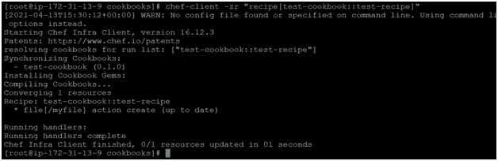

第九步:

让我们更新我们的食谱。

转到测试指南目录

> cd 食谱>测试食谱>食谱
> 
> vi 测试-配方. rb

或者，

转到主目录

> VI cookbook/test-cookbook/recipes/recipe 2 . Rb

编写以下代码

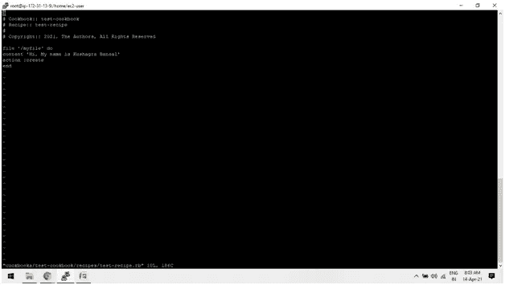

。rb 扩展是强制性的

执行第二个更新的配方，即测试配方

> 主厨-客户–Zr“食谱[测试食谱::测试食谱]”

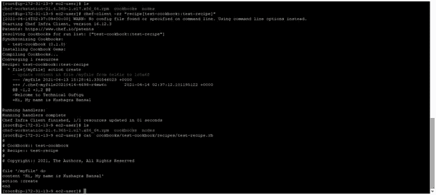

# ##使用 Chef 托管网站

第一步:

创建一个目录，其中将存储所有类型 cookbook 目录。

> Mkdir 烹饪书
> 
> Cd 烹饪书

让我们创作一本食谱

> 厨师制作食谱<cookbook_name></cookbook_name>
> 
> 厨师制作食谱 apache-cookbook

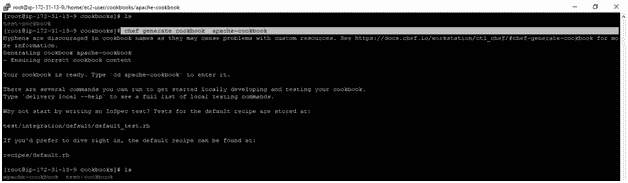

让我们创建一个食谱

厨师制作食谱<recipe_name></recipe_name>

主厨制作配方 Apache-配方

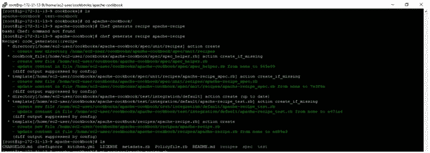

在菜谱中编写以下代码

> vi recipes/apache-recipe.rb

代码:

> 包' httpd' do
> 
> 操作:安装
> 
> 结束
> 
> file '/var/www/html/index . html ' do
> 
> 内容“使用 Chef 托管网站”
> 
> 操作:创建
> 
> 结束
> 
> 服务' httpd' do
> 
> 操作[:启用，:启动]
> 
> 结束

第二步:

执行食谱来主持一个网站

> chef-client -zr "食谱[Apache-cookbook::Apache-recipe]

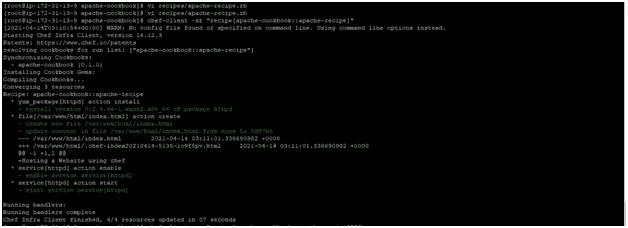

输出:

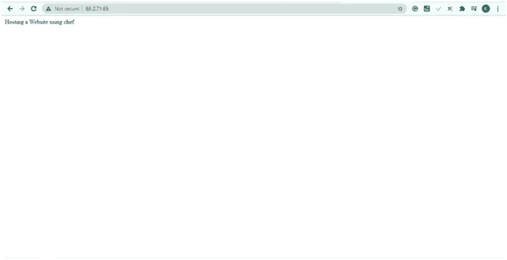