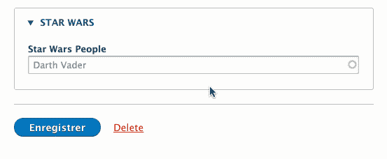

# 如何使用 Drupal 8 表单 API 创建定制的自动完成实体字段小部件

> 原文：<https://medium.com/nerd-for-tech/how-to-create-a-custom-autocomplete-entity-field-widget-using-the-drupal-8-form-api-5593032d1920?source=collection_archive---------2----------------------->

在本文中，我**不会解释** [如何**使用 Drupal 8 表单 API**](https://wengerk.medium.com/how-to-create-a-custom-autocomplete-using-the-drupal-8-form-api-dd64d2eccbed) 创建一个定制的自动完成功能——它应该只在使用 Drupal Admin UI 的定制表单上使用。

在这里，我将尝试向您展示一个**分步**指南，解释如何使用 Drupal 8 Form API 核心特性创建一个定制的自动完成字段小部件**——一个只能在 Drupal Admin UI 表单中使用的自动完成部件(节点、分类法等等)。**

本教程可能在以下情况下对您有所帮助:创建一个**自定义 Drupal 实体字段小部件 Autocomplete** ,它从 Drupal 外部获取数据(例如从 API ),但仍然将最终数据存储和显示到 Drupal 实体中。


如果你正在寻找解释如何实现视图来改变自动完成字段的资源，请参考这个优秀的指南。

另一方面，如果你正在寻找解释如何创建可以在你自己的 Drupal 前端应用程序中使用的自动完成的资源，请参考我之前的博客文章。



这就是你在这个故事的结尾能够实现的目标

> 真理只能在一个地方找到:代码

前几天，我被要求为一个项目中的节点创建一个**定制自动完成字段，它应该从一个定制 RESTfull 端点获取数据。**

让我们看看我是如何做到的。

哦，出于安全原因，我将用[https://swapi.dev/](https://swapi.dev/)替换原来的 restful 端点——一个星球大战 RESTfull API。


# 步骤 1-自定义自动完成字段类型

字段类型将定义我们的数据存储在数据库中的方式。

```
*<?php

namespace* Drupal\swapi\Plugin\Field\FieldType;

*use* Drupal\Core\Field\FieldItemBase;
*use* Drupal\Core\Field\FieldStorageDefinitionInterface;
*use* Drupal\Core\TypedData\DataDefinition;

*/**
 * Provides a field type to store Star Wars people.
 *
 ** ***@FieldType****(
 *     id="swapi_people",
 *     label=****@Translation****("Star Wars - People"),
 *     module="swapi",
 *     description=****@Translation****("Autocomplete field to search for Star Wars people through swapi.dev."),
 *     default_widget="swapi_people_default",
 *     default_formatter="swapi_people_default"
 * )
 */
class* PeopleItem *extends* FieldItemBase {

  */**
   * {****@inheritdoc****}
   */
  public function* isEmpty() {
    *return empty*($this->swid) || *empty*($this->fullname);
  }

  */**
   * {****@inheritdoc****}
   */
  public static function* propertyDefinitions(FieldStorageDefinitionInterface $field_definition) {
    $properties = [];

    $properties['swid'] = DataDefinition::*create*('integer')
      ->setLabel(t('Star Wards Identifier')->__toString());

    $properties['fullname'] = DataDefinition::*create*('string')
      ->setLabel(t('Fullname')->__toString());

    *return* $properties;
  }

  */**
   * {****@inheritdoc****}
   */
  public static function* schema(FieldStorageDefinitionInterface $field_definition) {
    *return* [
      *// Columns contains the values that the field will store.* 'columns' => [
        'swid' => [
          'type' => 'int',
          'not null' => *FALSE*,
        ],
        'fullname' => [
          'type' => 'text',
          'size' => 'tiny',
          'not null' => *FALSE*,
        ],
      ],
    ];
  }

}
```

# 步骤 2—自定义自动完成字段小部件

FieldWidget 将定义表单元素的外观以及数据在保存前的处理方式。

乍一看，您可能会对使用`#entity_autocomplete`字段类型感兴趣——这似乎正是您所需要的。可惜，这不是。事实上，`#entity_autocomplete`不允许你进行任何定制。

所以，你需要老人的`#textfield`和他的表亲属性`#autocomplete_route_name`

```
*<?php

namespace* Drupal\swapi\Plugin\Field\FieldWidget;

*use* Drupal\Core\Entity\Element\EntityAutocomplete;
*use* Drupal\Core\Field\FieldItemListInterface;
*use* Drupal\Core\Field\WidgetBase;
*use* Drupal\Core\Form\FormStateInterface;

*/**
 * Plugin implementation of the 'swapi_people_default' widget.
 *
 ** ***@FieldWidget****(
 *     id="swapi_people_default",
 *     module="swapi",
 *     label=****@Translation****("Default"),
 *     field_types={
 *         "swapi_people"
 *     }
 * )
 */
class* PeopleDefaultWidget *extends* WidgetBase {

  */**
   * {****@inheritdoc****}
   */
  public function* formElement(FieldItemListInterface $items, $delta, *array* $element, *array* &$form, FormStateInterface $form_state) {
    $default_value = *NULL*;

    *// Build a "label (swid)' value that can be parse for storage.
    if* (!*empty*($items[$delta]->swid)) {
      $default_value = *sprintf*('%s (%d)', $items[$delta]->fullname, $items[$delta]->swid);
    }

    $element['data'] = [
      '#title' => $this->t('Star Wars People'),
      '#type' => 'textfield',
      '#autocomplete_route_name' => 'swapi.people.autocomplete',
      '#autocomplete_route_parameters' => [],
      '#placeholder' => t('Darth Vader'),
      '#default_value' => $default_value,
      '#element_validate' => [
        [*static*::*class*, 'validate'],
      ],
    ];

    *return* $element;
  }

  */**
   * {****@inheritdoc****}
   */
  public function* massageFormValues(*array* $values, *array* $form, FormStateInterface $form_state) {
    $item = *NULL*;

    *foreach* ($values *as* $delta => &$item) {
      $item['delta'] = $delta;

      *// Take "label (entity id)', match the ID from inside the parentheses.
      // @see \Drupal\Core\Entity\Element\EntityAutocomplete::extractEntityIdFromAutocompleteInput
      if* (*preg_match*('/(.+\\s)\\(([^\\)]+)\\)/', $item['data'], $matches)) {
        $item['fullname'] = *trim*($matches[1]);
        $item['swid'] = *trim*($matches[2]);
      }
    }

    *return* $values;
  }

  */**
   * {****@inheritdoc****}
   */
  public static function* validate($element, FormStateInterface $form_state) {
    $value = $element['#value'];
    $id = EntityAutocomplete::*extractEntityIdFromAutocompleteInput*($value);

    *if* (*empty*($id)) {
      $form_state->setValueForElement($element, '');

      *return*;
    }

    $response = \Drupal::*httpClient*()->get('https://swapi.dev/api/people/' . $id);

    *if* ($response->getStatusCode() !== 200) {
      $form_state->setError($element, t('This Star Wars person does not exists.'));
    }

    $character = *json_decode*($response->getBody()->getContents(), *TRUE*);

    *if* (!*isset*($character['url'], $character['name'])) {
      $form_state->setError($element, t('This Star Wars person does not exists.'));
    }
  }

}
```

`#autocomplete_route_name`属性将允许您定义一个路由来处理自动完成业务逻辑(根据用户输入返回的数据)。

你也可以添加`#autocomplete_route_parameters`属性，这个属性可以给你的`#autocomplete_route_name`发送一个固定不变的参数，你可以用它来确定返回结果的数量。

# 步骤 3-定义自动完成路线

现在您知道了如何创建自动完成表单，但是您需要一个路径来管理获取数据并返回数据的逻辑。
如何？只需将对路线的引用(数据将从该处检索)添加到您的 *swapi.routing.yml* 文件中:

```
swapi.people.autocomplete:
  path: '/admin/swapi/people/autocomplete'
  defaults:
    _controller: '\Drupal\swapi\Controller\PeopleAutocompleteController::handleAutocomplete'
  requirements:
    _permission: 'administer content types'
```

注意在之前的`#autocomplete_route_name`中使用相同的路线名称(此处为`swapi.people.autocomplete`)。
还有，一定要根据自己的需要更改权限。

# 步骤 4—添加控制器，获取 API 并返回 JSON 响应

现在有了路由和表单，您必须用`handleAutocomplete`方法定义您的定制控制器。
嗯，正是这种方法确保了一旦 Drupal 请求，就能收集到适当的数据并进行适当的格式化。

让我们更深入地研究一下，看看如何精确地处理我们的`textfield`元素的特定 JSON 响应。

1.  在*swapi/src/Controller/people autocomplete Controller . PHP*下设置一个`PeopleAutcompleteController`类文件；
2.  然后，扩展`ControllerBase`类并设置你的句柄方法(在我们的例子中`::handleAutocomplete`见`swapi.routing.yml`)；

```
*<?php

namespace* Drupal\swapi\Controller;

*use* Drupal\Component\Utility\Xss;
*use* Drupal\Core\Controller\ControllerBase;
*use* GuzzleHttp\ClientInterface;
*use* Symfony\Component\DependencyInjection\ContainerInterface;
*use* Symfony\Component\HttpFoundation\JsonResponse;
*use* Symfony\Component\HttpFoundation\Request;

*/**
 * Defines a route controller for SWAPI People autocomplete form elements.
 *
 ** ***@see*** *\Drupal\swapi\Plugin\Field\FieldWidgetPeopleWidget
 */
class* PeopleAutocompleteController *extends* ControllerBase {
  */**
   * The HTTP client to fetch the feed data with.
   *
   ** ***@var*** *\GuzzleHttp\ClientInterface
   */
  protected* $httpClient;

  */**
   * {****@inheritdoc****}
   */
  public function* __construct(ClientInterface $http_client) {
    $this->httpClient = $http_client;
  }

  */**
   * {****@inheritdoc****}
   */
  public static function* create(ContainerInterface $container) {
    *return new static*(
      $container->get('http_client')
    );
  }

  */**
   * Handler for autocomplete request.
   */
  public function* handleAutocomplete(Request $request) {
    $results = [];
    $input = $request->query->get('q');

    *if* (!$input) {
      *return new* JsonResponse($results);
    }

    $input = Xss::*filter*($input);
    $response = $this->httpClient->get('https://swapi.dev/api/people/?search=' . $input);

    *if* ($response->getStatusCode() !== 200) {
      *return new* JsonResponse($results);
    }

    $response = *json_decode*($response->getBody()->getContents(), *TRUE*);

    *foreach* ($response['results'] *as* $person) {

      *// Skip malformed.
      if* (!*isset*($person['url'], $person['name'])) {
        *continue*;
      }

      *// Take id from URL of SWAPI people.
      preg_match*('#^https?://swapi\\.dev/api/people/(\\d+)#', $person['url'], $matches);

      *// Skip when id not extractable from URL of swapi.
      if* (!*isset*($matches[1])) {
        *continue*;
      }

      $results[] = [
        'value' => *sprintf*('%s (%d)', $person['name'], $matches[1]),
        'label' => *sprintf*('%s (%d)', $person['name'], $matches[1]),
      ];
    }

    *return new* JsonResponse($results);
  }

}
```

# 步骤 5—自定义自动完成字段格式化程序

FieldFormatter 定义数据在前端显示的方式。

```
*<?php

namespace* Drupal\swapi\Plugin\Field\FieldFormatter;

*use* Drupal\Core\Field\FieldItemListInterface;
*use* Drupal\Core\Field\FormatterBase;

*/**
 * Plugin implementation of the 'contact_default' formatter.
 *
 ** ***@FieldFormatter****(
 *     id="swapi_people_default",
 *     label=****@Translation****("Default"),
 *     field_types={
 *         "swapi_people"
 *     }
 * )
 */
class* PeopleDefaultFieldFormatter *extends* FormatterBase {

  */**
   * {****@inheritdoc****}
   */
  public function* viewElements(FieldItemListInterface $items, $langcode) {
    $element = [];

    *foreach* ($items *as* $delta => $item) {
      *// Render each element as markup.* $element[$delta] = ['#markup' => $item->fullname];
    }

    *return* $element;
  }

}
```

这差不多就是**你需要**基于 Drupal 8 的文本字段自动完成的所有技巧。

# 来源

本文首次为瑞士洛桑的反静电网络机构的博客撰写。一个我作为全栈 Web 开发人员工作的地方。请随意在这里阅读或在那里查看:[https://antistatique.net/en/node/682](https://antistatique.net/fr/node/682)

检索我的 Gist 上的所有代码:[https://Gist . github . com/WengerK/8360688d 57567 b 60 e 2e ce 28 c8 c 5184d 01](https://gist.github.com/WengerK/8360688d57567b60e2ce28c8c5184d01)

对于大多数好奇的人来说，这里有一些启发了本文创作的额外信息来源。

Purushotam Rai(2016 年 11 月 24 日)。用自定义回调在 Drupal 8 中实现# autocomplete【https://www.qed42.com/blog/autocom...上的[参见](https://www.qed42.com/blog/autocomplete-drupal-8) 

**Stijn Berkers**(2018 年 2 月 28 日)。如何在 drupal 8 中生成一个自定义的自动完成字段
参见 https://lucius.digital/en/blog/drupal...[上的](https://www.lucius.digital/en/blog/drupal-module-conditional-redirect-released-on-drupal-org)

**让我活着**(2014 年 5 月 4 日)。为文本字段添加自动完成功能
请参见 https://drupal.stackexchange.com/.../..[上的](https://drupal.stackexchange.com/questions/200038/adding-autocomplete-for-text-field)

**Stijn Berkers**(2018 年 7 月 18 日)。如何在 drupal 8 中为文本字段添加自动完成功能:定义自定义路线
参见 https://www.optasy.com/blog/how-add-autocom...的[上的](https://www.optasy.com/blog/how-add-autocomplete-text-fields-drupal-8-defining-custom-route)