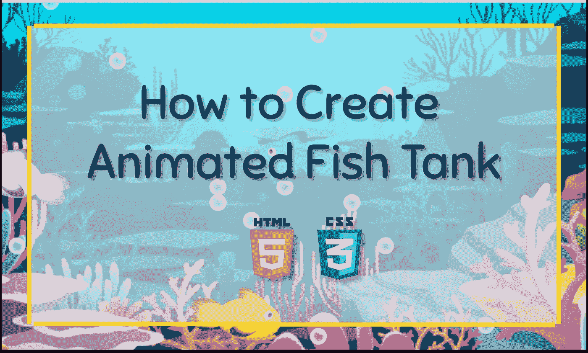
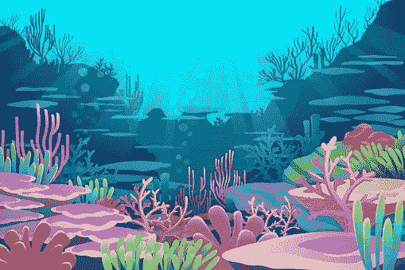

# 如何用 Html & CSS 创建一个鱼缸

> 原文：<https://medium.com/nerd-for-tech/how-to-create-a-fish-tank-with-html-css-c98aca39ae85?source=collection_archive---------1----------------------->

## 3 步指南创建一个鱼缸只使用 HTML 和 CSS。

当你看到一个健康的家庭水族馆时，你很难感到焦虑。有一种东西能抚慰你和你周围的人。这也是为什么在商业、医院等高压力场合可能会看到鱼缸的原因之一。

压力管理对你的整体健康和幸福至关重要。花时间在你的坦克周围不仅可以帮助你放松，而且有一个照顾它的例行公事也可能是好的。

你有没有想过我们可以用编程语言编写一个鱼缸动画设计！！！所以我们走吧…

我想看看只用基本的 HTML、CSS 和 JavaScript 创建鱼缸的动画设计有多简单。

因此，在这篇文章中，我将告诉你如何通过三个步骤来创建它。

## 步骤 01

创建一个 index.html 文件，并编写下面的代码。

## 第二步:

创建一个 style.css 文件来设计样式，并编写下面的代码。

## 步骤 03:

创建一个 script.js 文件，并编写下面的代码。

确保所有的图片和 CSS 文件链接完美。

你可以在这里下载背景图片。

sea.jpg

希望这对你有帮助。如果你在实现这个过程中有任何困难或者你需要任何帮助，请联系我。