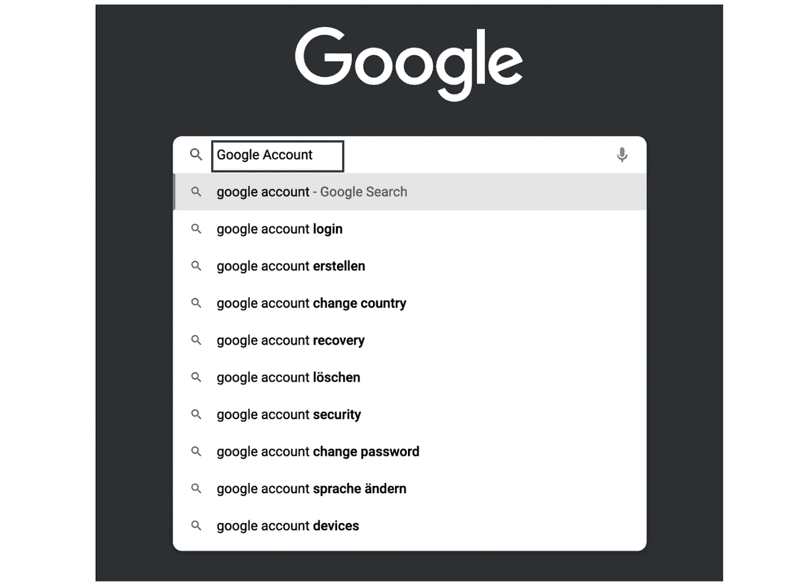
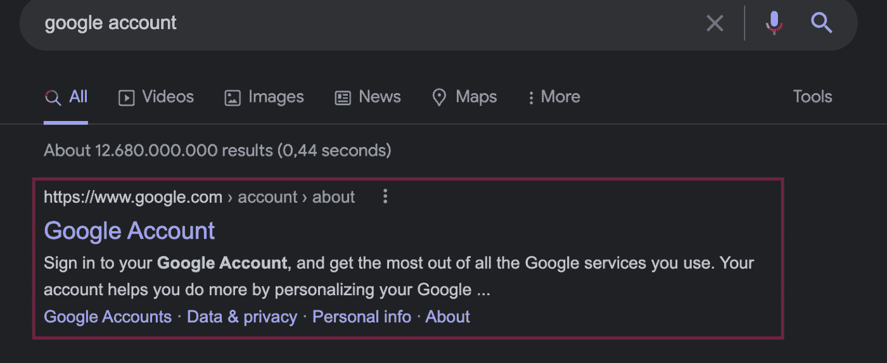
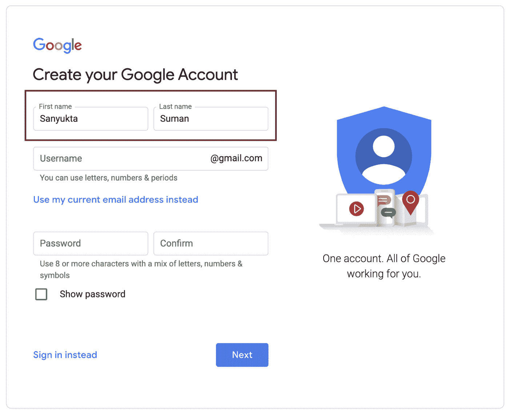
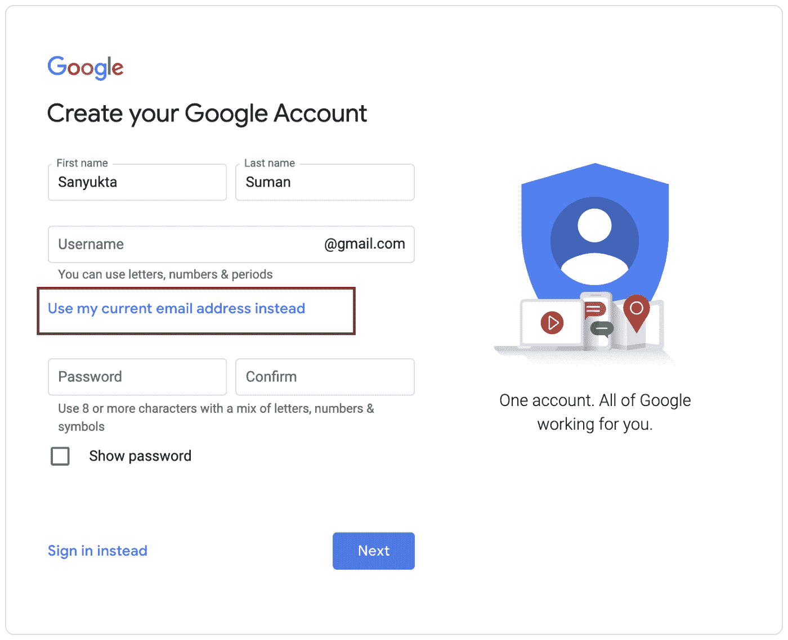
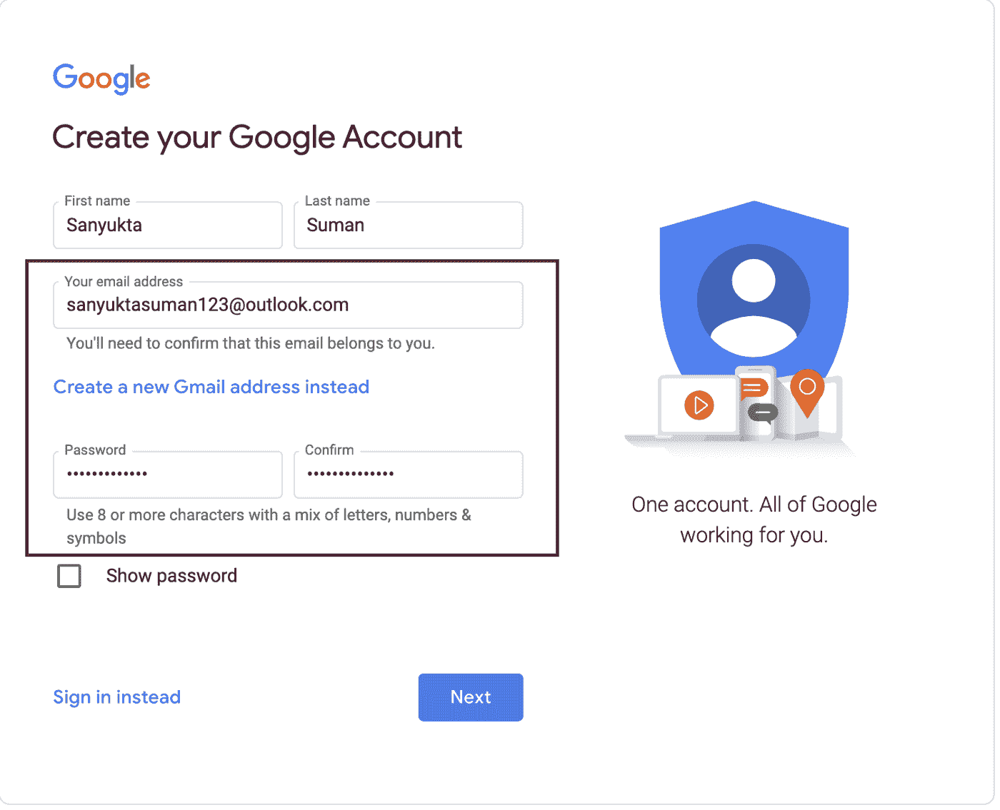
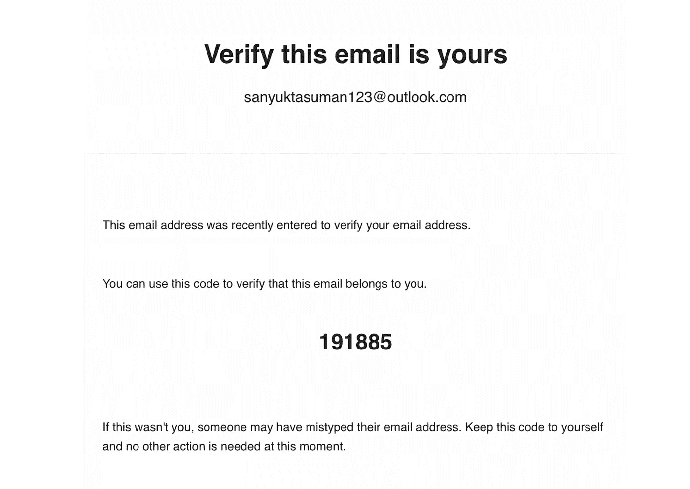
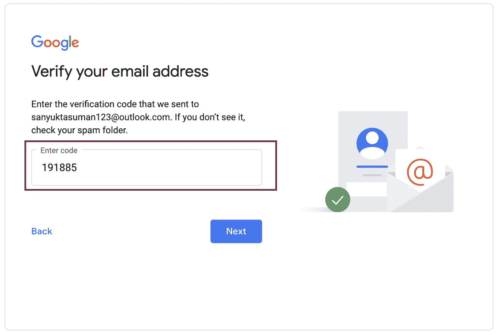
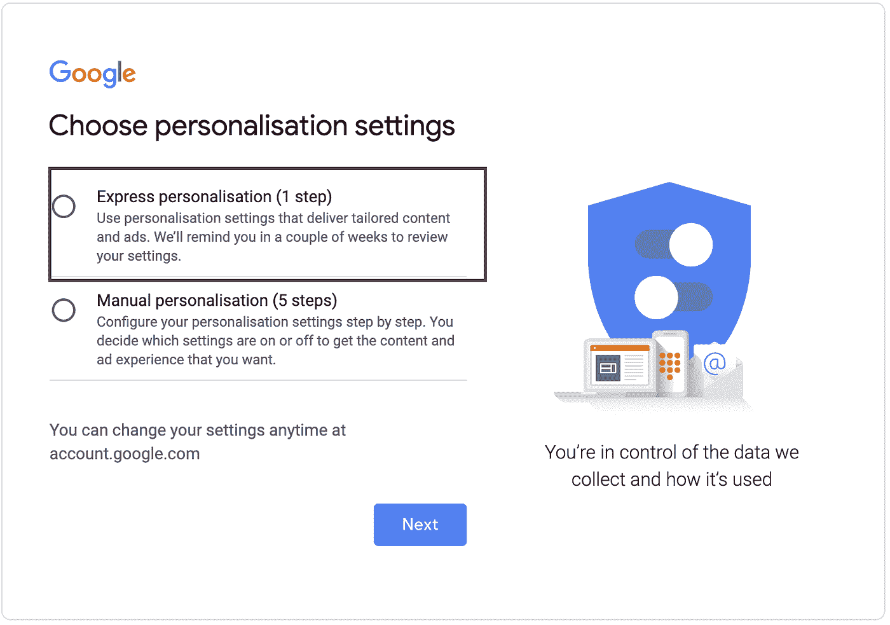
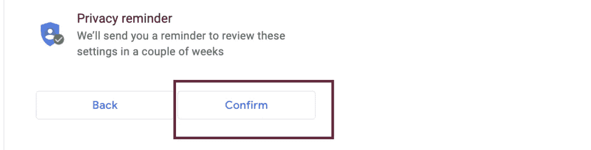
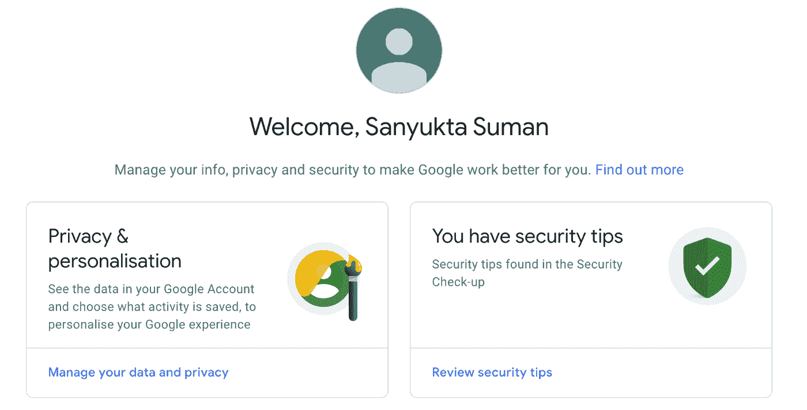

# 如何在没有 Gmail 的情况下创建谷歌账户

> 原文：<https://medium.com/nerd-for-tech/how-to-create-a-google-account-without-gmail-863beeabec88?source=collection_archive---------0----------------------->

不使用 Gmail 创建谷歌账户的分步指南。由苏曼桑尤克塔

Firmbee.com 在 [Unsplash](https://unsplash.com/photos/31OdWLEQ-78) 上[的照片](https://unsplash.com/@firmbee)

想使用谷歌产品，但没有 Gmail 账户？或者想用现有的非谷歌账户使用谷歌产品？

这里有一个不使用 Gmail 创建谷歌账户的分步指南。

# 第一步

去谷歌搜索“谷歌账户”。

# **第二步**

点击第一个选项—[https://www.google.com/account/about/](https://www.google.com/account/about/)。

# **第三步**

接下来，单击位于页面右上角的“创建帐户”选项。

# **第四步**

您将被重定向到创建帐户页面。首先，输入你的名和姓。

# **第五步**

这一步至关重要。点击“使用我当前的电子邮件地址”选项，而不是给出一个新的电子邮件 ID。

# **第六步**

接下来，在用户名字段中键入您现有的非 google 电子邮件地址，并在密码字段中键入一个安全的密码，然后选择下一步。

# **第 7 步**

检查您的电子邮件中的验证码。如果您在收件箱部分没有看到它，请检查您的垃圾邮件文件夹。

# **第八步**

输入您在电子邮件中收到的验证码，然后选择下一步。

# **第九步**

输入您的电话号码(可选)、出生日期和性别，然后选择下一步。

# **第十步**

选择快速个性化或手动个性化，然后选择下一步。在下一页确认隐私设置，然后选择确认。

# **第 11 步**

就是这样！您现在可以使用您的谷歌帐户购买任何谷歌产品。享受使用谷歌及其产品的乐趣。

1.  将这篇文章保存到你的阅读列表中，以备后用📌。
2.  如果你有任何问题，请写在评论区💬。我很乐意回答他们。

# 本月即将发布的 datadice 博客文章

*   [Y42 中的更多数据建模功能(第三部分)](/towardsdev/more-data-modeling-functions-in-y42-part-3-7f0ed123e0c1?source=your_stories_page-------------------------------------)
*   [Looker Studio 中的谷歌分析 4](/towardsdev/google-analytics-4-in-data-studio-f0c8bb0a89a4?source=your_stories_page-------------------------------------)

# **进一步链接**

查看我们的 [LinkedIn](https://www.linkedin.com/company/datadice/) 账户，深入了解我们的日常工作生活，并获得关于 BigQuery、Looker Studio(以前称为谷歌数据工作室)和营销分析的重要更新

我们也从我们自己的 YouTube 频道开始。我们讨论重要的 DWH、BigQuery、Looker Studio(以前称为 Google Data Studio)和许多其他主题。查看频道[这里](https://www.youtube.com/channel/UCpyCm0Pb2fqu5XnaiflrWDg)。

如果你想了解更多关于如何使用 Google Looker Studio 并结合 BigQuery 更上一层楼，请查看我们的 Udemy 课程[这里](https://www.udemy.com/course/bigquery-data-studio-grundlagen/)。

如果您正在寻求帮助，以建立一个现代化的、经济高效的数据仓库或分析仪表板，请发送电子邮件至 hello@datadice.io，我们将安排一次通话。

*最初发布于*[*https://www . data dice . io*](https://www.datadice.io/google-account-without-gmail)*。*