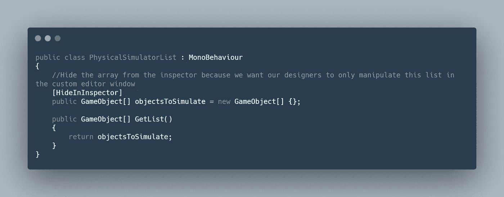
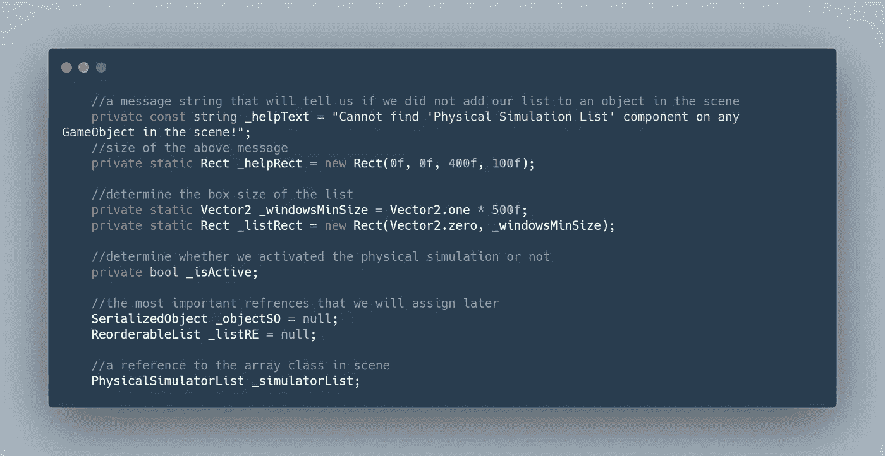
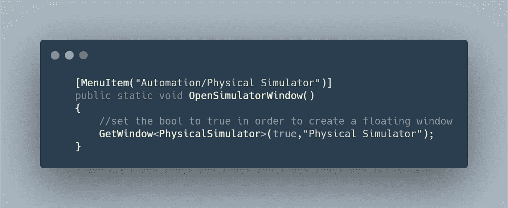
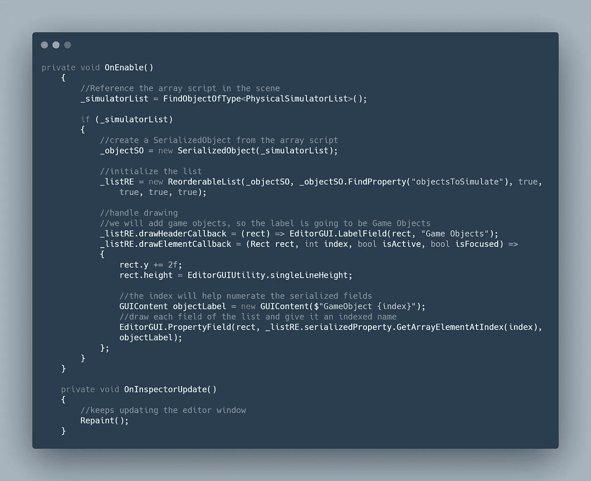
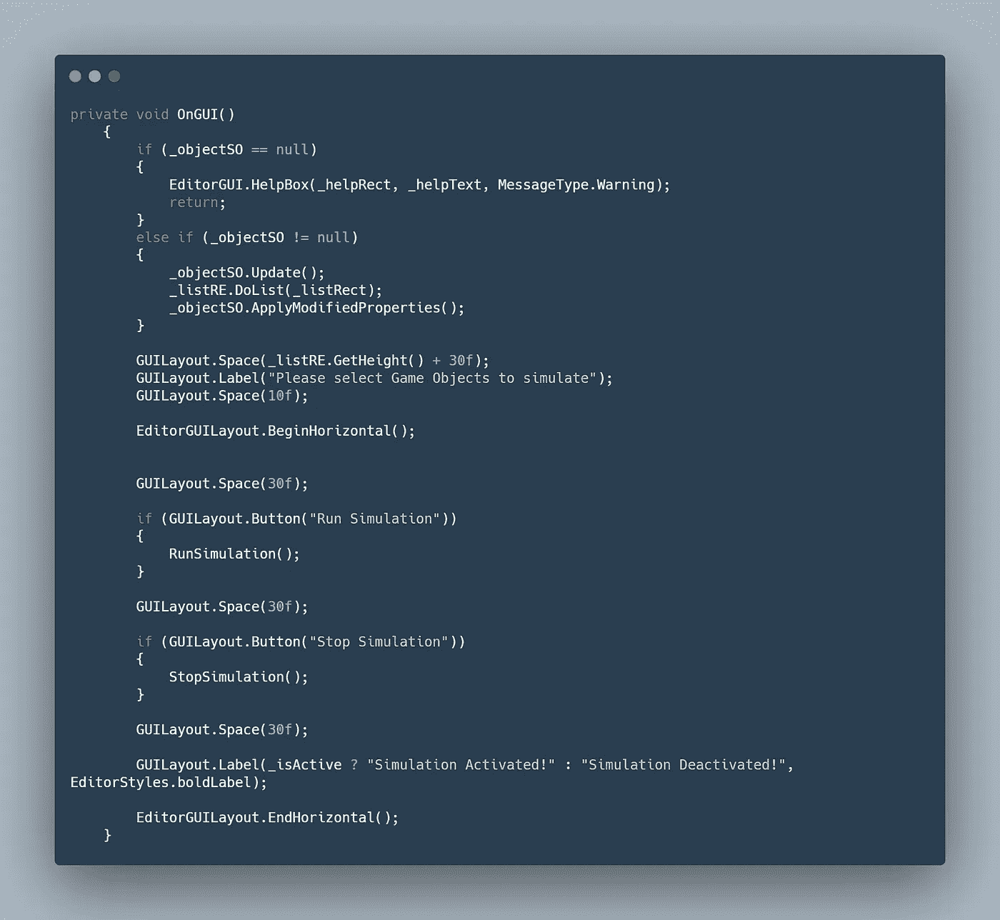
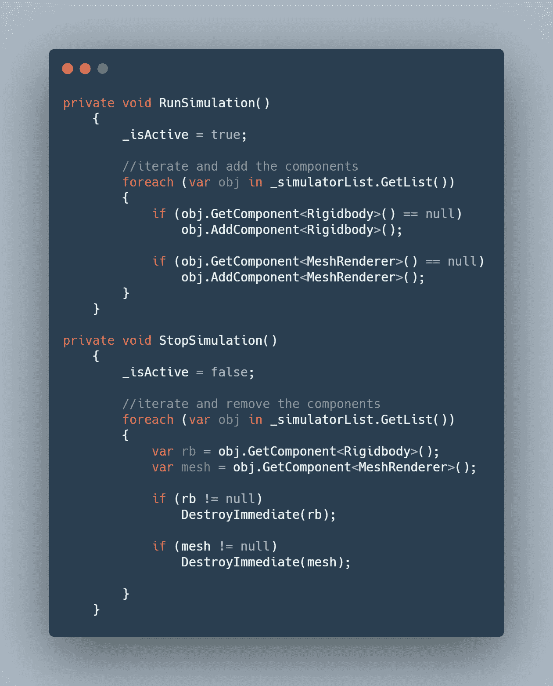
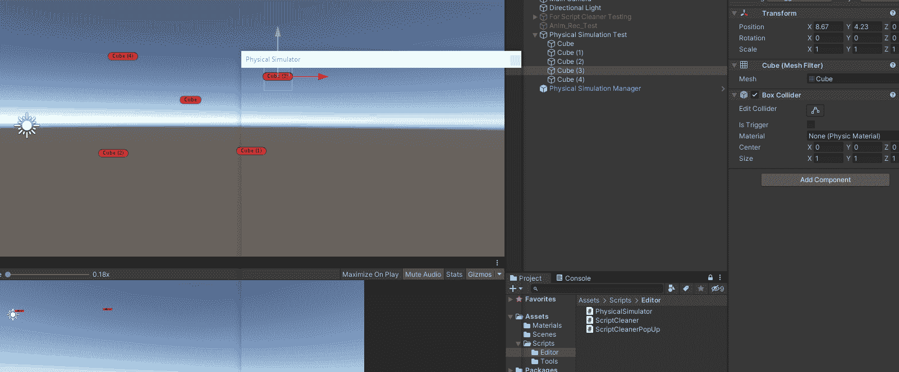

# 如何在 Unity 的自定义编辑器窗口中创建列表

> 原文：<https://medium.com/nerd-for-tech/how-to-create-a-list-in-a-custom-editor-window-in-unity-e6856e78adfc?source=collection_archive---------1----------------------->

正如我在以前关于[菜单项和编辑器](https://novusxdev.medium.com/creating-a-custom-editor-menu-item-in-unity-483ec5ea15c4)的文章中提到的，创建自定义窗口的想法还没有足够的文档记录。如果您想在自定义编辑器窗口中创建一个列表，该怎么办？这个话题越来越少了。

最近，我有机会为我所在地区的一个游戏工作室完成一项技术任务，该工作室需要一个自定义编辑器窗口中的列表，以便在需要时将一些物理应用到该列表中的游戏对象。我是这样解决这个问题的。


> **目标:**在自定义编辑器窗口中创建一个列表，将物理应用到这个列表的游戏对象中。

在解释我是如何做到的之前，我需要快速解释两个非常重要的概念:*序列化对象*和*可重新排序列表*。

***serialized object***类允许 unity 处理 unity 对象上的序列化。这将帮助我们告诉编辑器窗口我们想要将哪个属性或对象序列化到列表中。

***ReorderableList***类将允许我们在自定义编辑器中制作列表。它必须知道我们要列出哪个序列化对象。这个类没有任何来自 Unity 的官方文档(至少我没有发现)，这就是为什么没有多少人知道它。

## 解决办法

首先，我们需要两个脚本:

1.  编辑器脚本我们称之为 PhysicalSimulator，并将其添加到编辑器文件夹中(这是必须做的，否则将无法工作)。此类将从 EditorWindow 类而不是 MonoBehaviour 继承，并且必须使用以下命名空间:UnityEditor 和 UnityEditorInternal。
2.  保存我们将分配给 SerializedObject 的数组的脚本。这个脚本将保持一个 MonoBehaviour，并且必须添加到场景中的游戏对象。

这里的想法是，我们将从 MonoBehaviour 脚本进行反射，并将该数组赋给编辑器脚本中的 SerializedObject 变量，以便我们可以在 ReorderableList 中使用。

**单行为脚本:**

这个脚本很简单，也很短(我们姑且称之为:PhysicalSimulatorList)，它会持有一个公共数组和一个引用这个数组的公共方法。我们将在编辑器脚本中使用这个公共方法。创建这个脚本后，附加到场景中的一个空游戏对象，并确保预设它，并始终将其保留在场景中。



**PhysicalSimulator 编辑器窗口脚本:**

A.创建一些变量:



B.向顶栏添加一个菜单项，并使用 EditorWindow。GetWindow 方法，以便创建可拖动和可关闭的编辑器窗口



C.脚本初始化:

1.  在场景中找到保存数组脚本的对象
2.  从数组脚本创建新的 SerializedObject
3.  创建一个新的 ReorderableList，它将采用上述 SerializedObject 并将引用您在数组脚本中分配的数组的名称。在我们的例子中，它是“objectsToSimulate”。将其 draggable bool、display header bool、display add button 和 display remove button 都设置为 true。
4.  最后处理重新排序列表的绘制



D.将绘制编辑器窗口的 OnGUI 方法

1.  如果你没有将数组脚本添加到场景中的游戏对象，那么我们将显示一条警告消息并停止代码运行。
2.  否则，我们将更新 ReorderableList，创建它，并对它和它所反映的数组应用任何修改。
3.  最后添加两个按钮，一个运行物理模拟，将刚体和网格渲染器添加到列表中的对象，另一个按钮删除这些组件。



E.运行和停止模拟方法。

我在创建这个的时候遇到的一个大问题是，我能在我们刚刚创建的重新排序列表中引用和迭代游戏对象吗？现在我们可以将场景中的任何游戏对象添加到我们的重新排序列表中，但是我们不能直接引用它们。

举个例子，如果你用下面的例子

```
foreach(var obj in _listRE) //_listRE is our ReorderableList
```

如果您尝试运行此代码，将会遇到空引用异常。这是因为 ReorderableList 只引用列表本身，而不能引用附加到它的对象。

这就是为什么我们在 MonoBehaviour 数组类中创建了公共 getter 方法。ReorderableList 基本上是该数组的一个反映，所以我们在 ReorderableList 中所做的每一件事都发生在该数组上。因此，我们将引用数组，而不是引用 ReorderableList。



现在你有了它，按照这个方法，现在你在一个自定义编辑器中有了一个列表，你可以从场景中添加任何对象并操纵它。



带有列表的自定义编辑器窗口

你可以在这里找到完整的代码:[list _ custom _ editor—Pastebin.com](https://pastebin.com/1MnAc1TV)