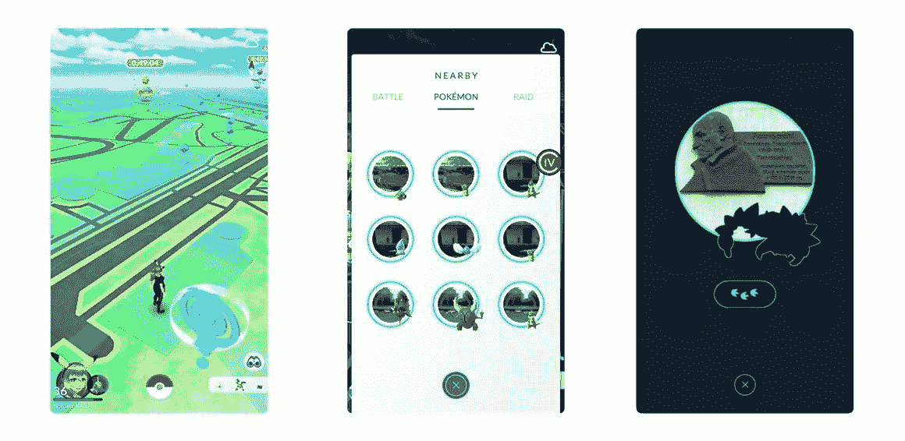
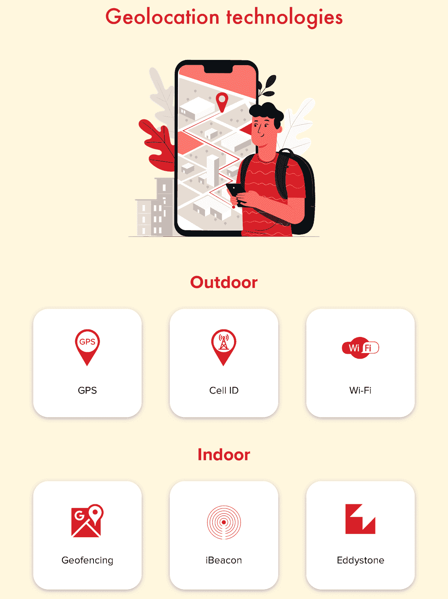
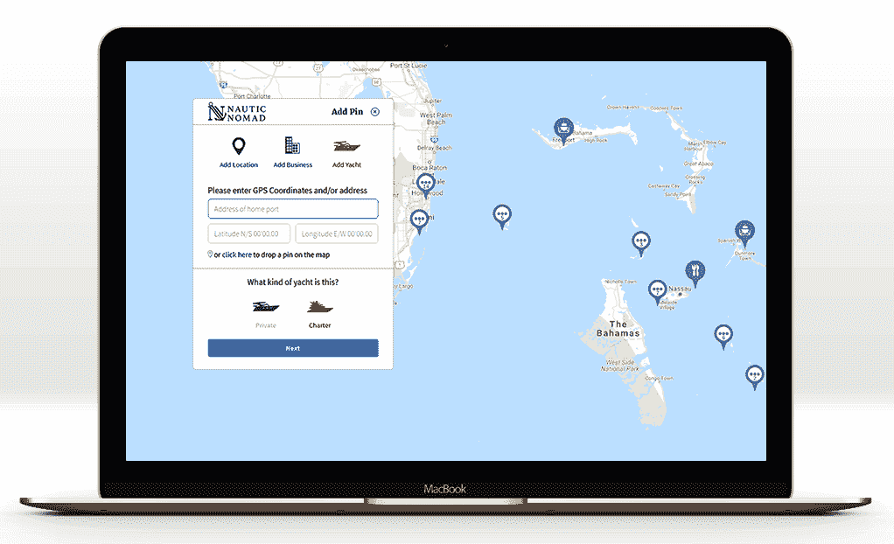

# 如何创建基于位置的应用程序:正确的方法

> 原文：<https://medium.com/nerd-for-tech/how-to-create-a-location-based-app-right-way-d51516789891?source=collection_archive---------14----------------------->

世界上大多数人使用小工具，这解释了对高质量的基于位置的服务应用程序的需求不断增长。根据最新的[研究](https://www.mordorintelligence.com/industry-reports/location-based-services-market)，在未来五年，地理定位服务市场将呈现 23.2%的年均增长率，到 2026 年将达到 1550 亿美元。

这不仅是因为在疫情期间需要保持社交距离。用户总是不仅喜欢安全，而且喜欢充分的便利。能够在附近找到一家餐馆或酒店，拿起订购的食品或叫一辆出租车很快到达你所在的地方总是好的，你不同意吗？

在本文中，您将了解如何使用现代地理定位技术创建基于位置的应用程序。 [7 Devs](https://7devs.co/) 在这方面经验丰富，随时准备与大家分享。

# 基于位置的应用的功能和类型

基于位置的服务(LBS)是基于用户设备的位置提供信息的计算机或移动应用程序。

此类应用允许:

*   确定自己的位置并与他人分享。
*   测量物体之间的距离，并找到最短的路径。
*   创建从一点到另一点的最佳路线。
*   搜索用户感兴趣的最近的对象。
*   根据实际位置提供信息。
*   向产品添加地理标签。

简单的新闻提要界面已经过时了。用户可以实时跟踪更新。你所需要做的就是指出活动或会议的地点。同时，用户仅在需要时收到通知，并且仅针对选定的请求。

该应用程序可以根据喜好、订阅或个人兴趣提供有关事件和新闻的信息。用户可以通过参观某些地方或活动获得积分，然后用积分换取免费门票或折扣。

基于当前位置的应用程序根据几个特征进行分类。

**用户的位置**:

*   里面；
*   外面。

**服务类型**:

*   专业；
*   一般用途。

**按行业和用户兴趣**(不同领域的基于位置的服务示例):

*   导航和制图(Waze、Glympse、谷歌地图、家庭定位器)
*   社交网络(Instagram，脸书)
*   约会应用和网站(Tinder)
*   按需服务(UberEats、Zomato、Yelp、[洗车搜索](https://7devs.co/projects/car-wash-finder/)、冲浪&瑜伽)
*   快速消费品和电子商务(易贝、宜家、塔吉特、沃尔玛、路边店)
*   健康和健身(Runtastic、Runkeeper、Nike Running Club、MyFitnessPal)
*   运输、物流(DHL 货物移动跟踪、优步、Citymapper)
*   休闲和旅游(Expedia、猫途鹰、Airbnb、预订)
*   天气(雅虎天气，苹果天气)
*   位置查找和照片共享(Snapchat)
*   娱乐业(精灵宝可梦 GO)
*   网上银行、IT 和电信服务

开发成本取决于功能和所需时间。然而，许多行业正积极受益于 LBS 的使用。

# 地理定位应用给企业带来的好处

## 与目标受众建立联系

企业主可以将应用程序与公司系统同步，以便及时向客户提供促销信息。这些应用程序可以收集关于客户行为的有价值的数据，并基于这些数据形成营销计划。

**个性化体验**

可定制的移动应用被用作强大的移动广告工具。当您的客户在您附近时，您可以通过推送通知发送折扣优惠、优惠券和其他营销信息。事实证明，这种个性化的方法很受客户欢迎。

**最佳导航和虚拟旅游**

公司可以使用增强现实(AR)。通过在真实物体上叠加虚拟元素，他们可以为客户提供互动体验。

**消费者分析**

公司可以根据可用数据分析用户行为，并建议购物选项。在本地拆解产品和品牌更容易。

**服务效率**

应用程序有助于快速准确地提供服务。知道了准确的位置，就可以在最短的时间内发货，增加客户的信心。

网上购物有它的缺点:买家必须等待购买的东西到达。有时候你甚至不确定你要等多久。通过基于位置的应用程序，客户购买产品，找到最近的实体店，然后去取货。该应用程序为零售商提供了一种快速简便的方式来销售更多商品。

地理定位功能可以将物流解决方案提升到一个新的水平。该应用程序提供车辆到达目的地的位置、速度、时间等实时信息。这有助于建立核算，控制和提高运输效率。

没有地理定位功能的酒店预订应用没有生存的机会。旅行者需要一张地图，描述他们可以在哪里停留以及如何到达那里。执行得越好，越有可能被预定。

# 使用了哪些技术

几乎所有类别的应用都以某种方式使用位置识别功能。

# 户外地理定位

**GPS**

卫星全球定位系统是最常见的技术。如果移动设备有内置模块，这是获得精确位置数据的最快方法，尽管最耗能。

**A-GPS**

辅助 GPS 使用卫星信号和蜂窝数据。高速和高效的功耗使该技术成为最受欢迎的技术之一。

**细胞 ID**

当 GPS 停止工作时，手机 ID 就会出现。最近的移动服务塔接收你的智能手机的坐标，并帮助确定准确的位置。不幸的是，没有 GPS 精确。

# 内部定位

**BLE**

蓝牙低能量(BLE)技术用于确定建筑物内的位置。遍布整个建筑的信标检测和分析信号，并确定智能手机的当前位置。这种信标易于安装；尽管它们需要不断的监测。该技术由 iBeacon 和 Eddystone 使用。

室外和室内检测

**Wi-Fi**

Wi-Fi 网络检测用户的大概位置。它覆盖的面积相对较小，这就是它不如上述技术精确的原因。

# 地理围栏

这种方法结合了全球定位系统、手机和无线网络数据。当智能手机越过虚拟“边界”时，用户会收到推送通知。比如亚马逊 Alexa 可以让你自定义套路或者提醒(开灯、关门等。)当用户穿过生活空间的特定区域时出现。

这项技术用于广告和营销。只有客户收到优惠券、折扣或优惠，而不是提醒。地理围栏不太准确，但它是一个非常有用的工具，可以吸引人们到商店或任何你的企业。

# 基于位置的应用程序开发:循序渐进

现在来说说如何搭建一个 GPS app。我们将考虑您需要采取的五个重要步骤。

# 市场调查

确定你想要开发的应用类型，然后对市场和竞争对手进行研究。你的解决方案必须让人们感兴趣，足够独特，能够成功地经受住竞争。

1.  定义你的用户，他们是谁，他们有什么问题，以及你的应用程序如何帮助解决这些问题。
2.  看看现有的解决方案。找出最受欢迎的应用程序提供了什么，它们缺少什么。

通过研究和评估你的竞争对手，你可以看到他们的优势和劣势。这将让您了解哪些功能可以改进。

# 寻找可靠的技术合作伙伴

选择技术合作伙伴时，寻找最佳的质量价格比。注重开发者体验。从检查公司的投资组合开始。了解他们以前是否使用过地理定位应用程序，在什么行业，以及他们使用什么技术。

# 你的应用程序应该有一个很棒的设计，所以最好聘请同一家公司的开发人员和 UI/UX 设计师。

# 技术方面的阐述

该应用程序应该有一个用户友好的移动界面和一个安全的内部数据库。选择正确的技术组合需要专业的方法。以下是我们的工程师使用的一些工具:

**互联网**

HTML5 API 地理位置

**iOS**

谷歌地图 API

核心位置 API

SDK 谷歌地图

苹果地图工具包

谷歌地址 API

**安卓**

android.location 功能包

谷歌地理定位 API

谷歌地图 API

谷歌地图方向 API

谷歌距离矩阵 API

MapView 类

Yandex 地图

开放街道地图

地图框

# 安全性

随着数据保护法变得越来越严格，记住该应用适用的国家的法律法规非常重要。安全性是重中之重，这就是为什么您需要努力保护您的数据。

咨询隐私和数据保护律师，确保你的技术团队了解这个问题。QA 测试将有助于检测错误和安全漏洞。以下是我们的一些建议:

1.  使用多因素身份验证，这使得入侵帐户变得更加困难。
2.  使用加密通信和 SSL 证书、网络安全配置(Android)或应用传输安全(iOS)。
3.  不要在用户设备上存储机密数据，也不要使用 AES-256 或 RSA 等算法对其进行加密。

# 估价

应用程序开发和测试需要一定的资金投入。根据自己的经济能力选择开发团队。建立基于位置的应用程序的成本因国家而异。平均来说，一个简单的应用程序要花 2 万美元，一个复杂的应用程序要花 15 万美元。

# 结论

如今，基于位置的应用程序开发势在必行。它会让你在市场上站稳脚跟，甚至发现一个新的利基，最终取得商业上的成功。

如果你决定投资这样一个应用程序，你必须有一个可行的商业想法，了解应该添加的地理位置功能，并清楚地了解用户友好的界面和数据安全。或者，您可以借助经验丰富的第三方开发人员，他们可以为您解决所有问题。