# 如何使用 Bootstrap 5 创建登录表单！！！！

> 原文：<https://medium.com/nerd-for-tech/how-to-create-a-login-form-using-bootstrap-5-75c4d5de5273?source=collection_archive---------4----------------------->

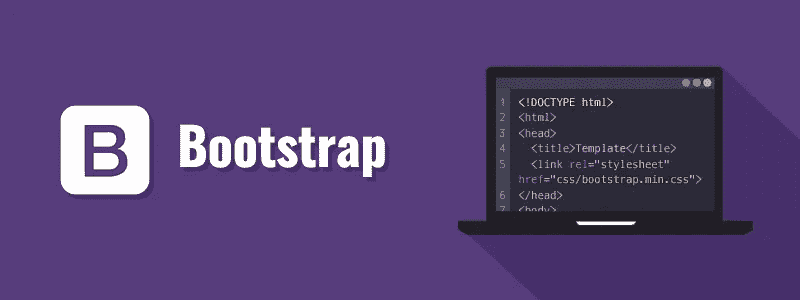

> Bootstrap 是最流行的 **CSS 框架**，用于开发响应迅速、移动优先的网站。
> 
> 代码编辑器和 Windows 机器我用的是 Visual studio 代码。在本文中，我完全专注于初学者的 bootstrap 没有花太多时间来设计更有吸引力的表单。你绝对可以设计出比我好得多的表格。

# 1.创建 HTML 模板:

在使用 bootstrap 之前，让我们用样板 html 模板创建一个空白 html 文件。

index.html

# 2.引导安装:

要在你当前的项目中使用 bootstrap，首先访问 [Bootstrap](https://getbootstrap.com/) 的官方网站。你可以从这里下载引导程序，但是我建议你现在没有必要下载任何东西，只要按照我的指示去做就可以了。

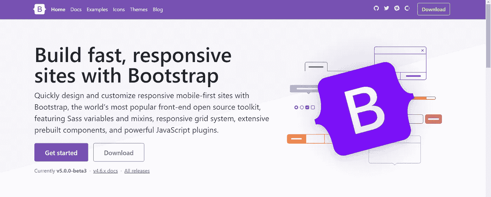

现在点击**开始**

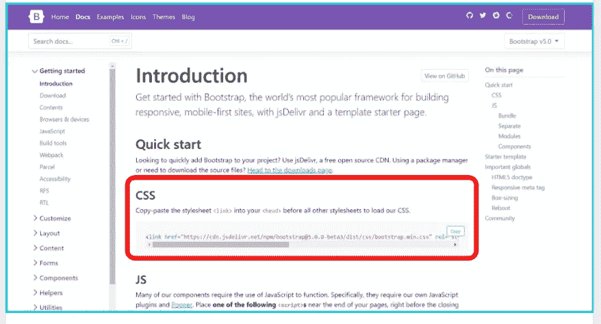

在这里你将得到一个 CSS 链接&一个 Javascript buddle 链接。

首先复制那个 **CSS 链接**，并将其粘贴到您的代码中的 **< /title >** 标签之后。像这样:

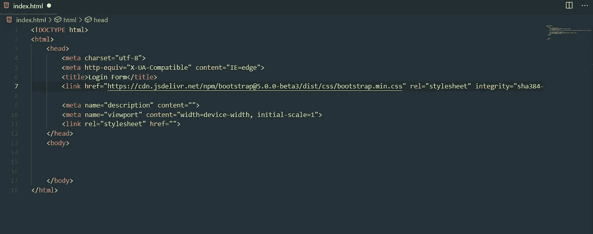

就像你只需要在代码中复制并粘贴 javascript buddle 链接一样

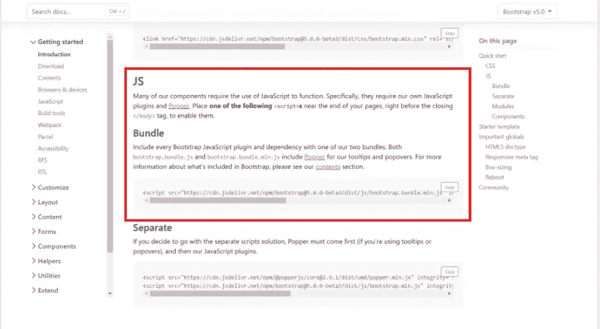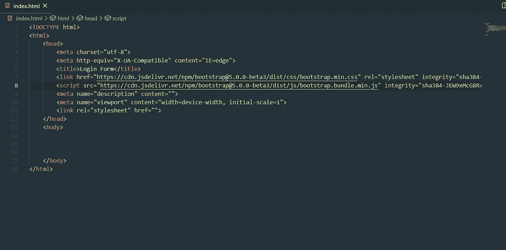

现在你的代码应该是这样的。在引导页面中提供了一个单独的 Javascript 链接，我们不需要在代码中复制和粘贴它。至此，我们已经完成了项目中的引导安装。

# 3.创建表单:

我们必须在搜索部分搜索一个 From。

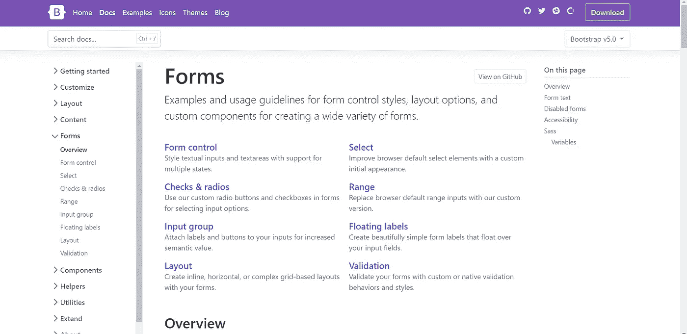

在这里，你可以看到有各种类型的形式可供我们使用。现在向下滚动一点。我们必须选择这个:

这是我们的登录表格

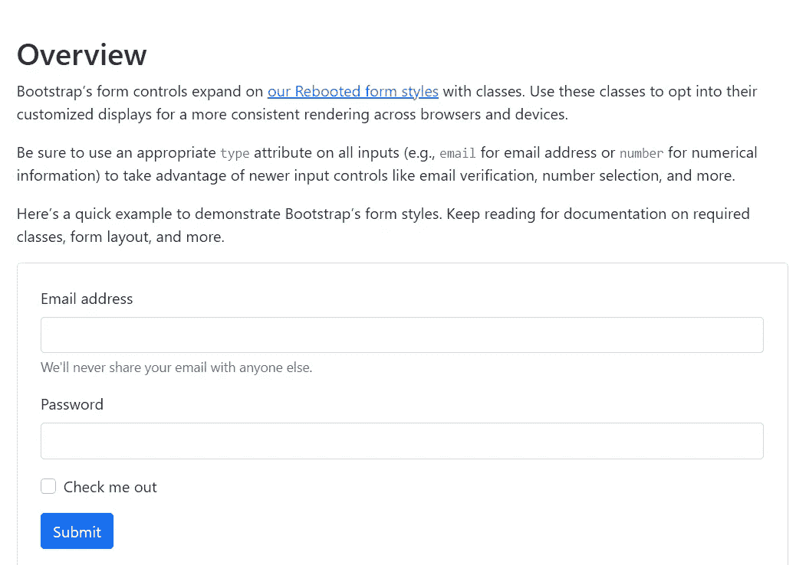

只需复制提供的代码，并将其粘贴到您的代码中的 **< /body >** 标签之后。

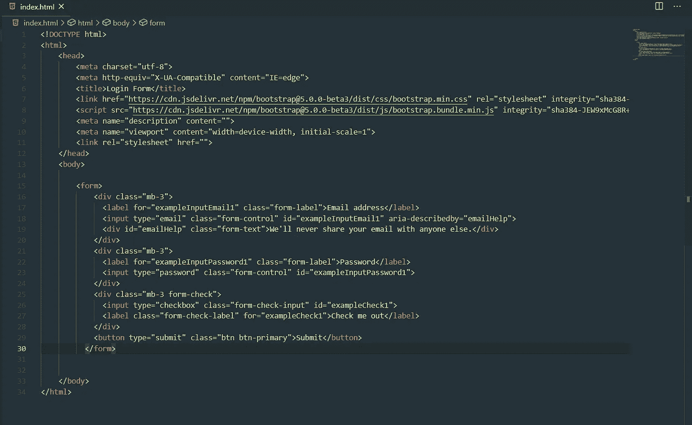

如果您现在保存代码并在浏览器中打开它，您将看到以下内容:

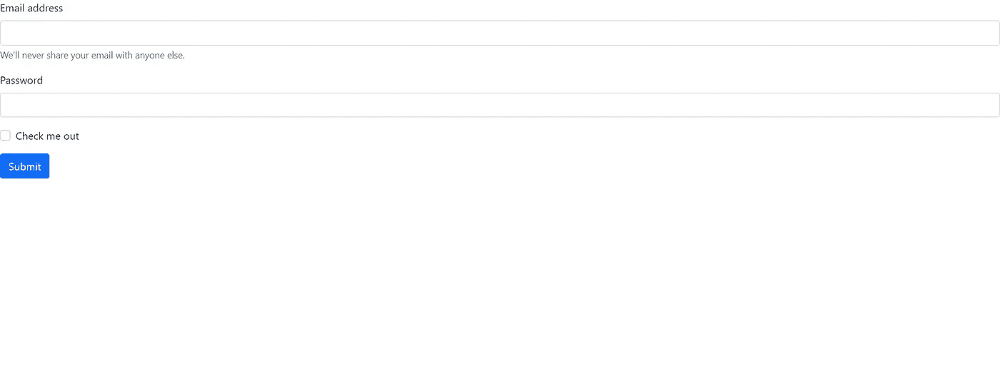

**就是它了！！！**

我们完成了表单。现在，如果您想正确地对齐它，并改变表单的外观和感觉，您可以随意这样做。

而其中最重要的一点，也就是表单在本质上是完全**响应的**。

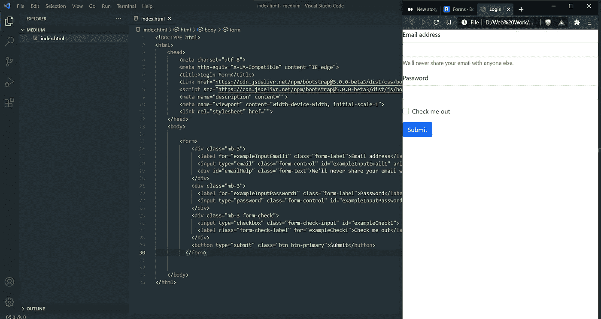

非常感谢您的阅读！！

> 随便问任何问题。