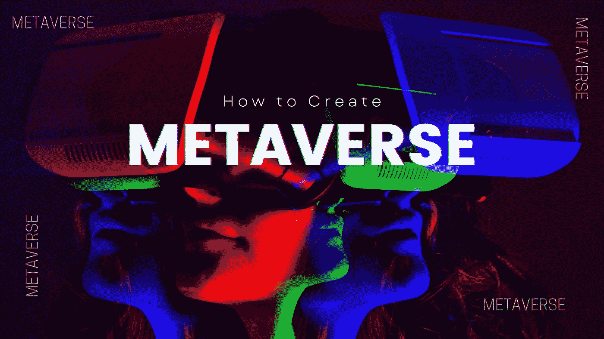

# 如何创建一个元宇宙虚拟世界？

> 原文：<https://medium.com/nerd-for-tech/how-to-create-a-metaverse-platform-for-nft-game-land-and-real-estate-96eabb062608?source=collection_archive---------0----------------------->

数字领域的下一个大事件是元宇宙。大多数人对“元宇宙”这个词都很陌生。这是新兴技术领域的研究人员的热门话题。它是 AR 和 VR 技术的混合体。脸书的首席执行官最近宣布，公司的名称将改为 META，这是一个更现代的技术和商业名称。

**那么，元宇宙到底是什么？**

元宇宙是一个虚拟的 3D 世界，在这里，来自世界各地的人们以数字方式联系在一起。简单地说，它是一个虚拟的世界，个人可以在其中互动和玩游戏。

**听起来不错！**

一些人已经开始涉足这个元空间。拥有元宇宙世界使得赚钱变得简单。要了解更多关于如何创造元宇宙的知识，请阅读像尼尔·斯蒂芬森的《冰雪奇缘》这样的流行作品。

**如何投资元宇宙？**

如果你是投资者或公司所有者，马上投资像元宇宙这样的百万美元行业。投资元宇宙的潜在成功已经有了更多的可能性。

**你如何利用元宇宙赚钱？**

*   利用你的虚拟房地产。
*   广告是要走的路。
*   投资多种行业。
*   NFT 在元宇宙。
*   玩并赢得元宇宙游戏。
*   元宇宙的市场。

[**如何创建一个元宇宙**](https://bit.ly/3GLa8p1) **？** *这里是一步一步创建你自己的元宇宙虚拟世界的过程，*

1.  选择元宇宙的正确使用案例。
2.  为您的平台创建用户界面。
3.  编写可操作的智能合同。
4.  创建 IPFS 存储系统。
5.  制作元宇宙数据库。
6.  开发核心人工智能和虚拟现实功能
7.  集成智能合同、IPFS、前端和后端。
8.  进入测试阶段，确保平台没有 bug。
9.  发布该平台的测试版。
10.  部署元宇宙平台。

如果你是投资者或公司所有者，马上投资像元宇宙这样的百万美元行业。投资元宇宙的潜在成功已经有了更多的可能性。

**最终想法**

未来几年，元宇宙将会占领每一个行业。因为迈向下一代的下一步是元宇宙。每个企业家都开始通过元宇宙平台拥有一个虚拟世界。在这个平台上，每个人都有自己的 id 在这个平台上玩元宇宙王国。

此外，许多元宇宙开发公司正在市场上涌现。企业家们正在积极寻找合适的元宇宙发展公司来推出他们自己的元宇宙平台。

> 在这里获取详细的 2022 指南， [**如何打造元宇宙？**](https://maticz.com/how-to-create-metaverse)