# 如何创建微服务

> 原文：<https://medium.com/nerd-for-tech/how-to-create-a-microservice-c7bfc6325038?source=collection_archive---------6----------------------->

在我们之前的博客中，我们已经了解了什么是微服务，以及它与整体架构有何不同。我们甚至研究了它相对于单片应用程序的优势。在这篇文章中，我们将更深入一层，看看如何在你的 Visual Studio 中创建微服务。

Sub 系好安全带，准备好打造自己的微服务吧。

**目录**

1.  如何创建微服务？
2.  包扎

# 如何创建微服务？

要创建微服务，我们需要使用以下工具-

1.  Visual Studio(用于为服务实现基于 C#的代码)
2.  SQL 数据库服务器和 studio(用于为应用程序创建数据库和表)。

此外，如果您想将应用程序容器化，您可能需要 docker。

这个想法是创建一个 API 来完成所有的用户服务，其中有一个单独的数据库来存储所有与用户相关的信息。

首先，我们将创建将由 API 使用的数据库。为了创建数据库，我们将使用 SQL Server Management Studio。

右键单击数据库并选择“新建数据库”选项。

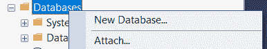

点击它，弹出窗口询问数据库名称。

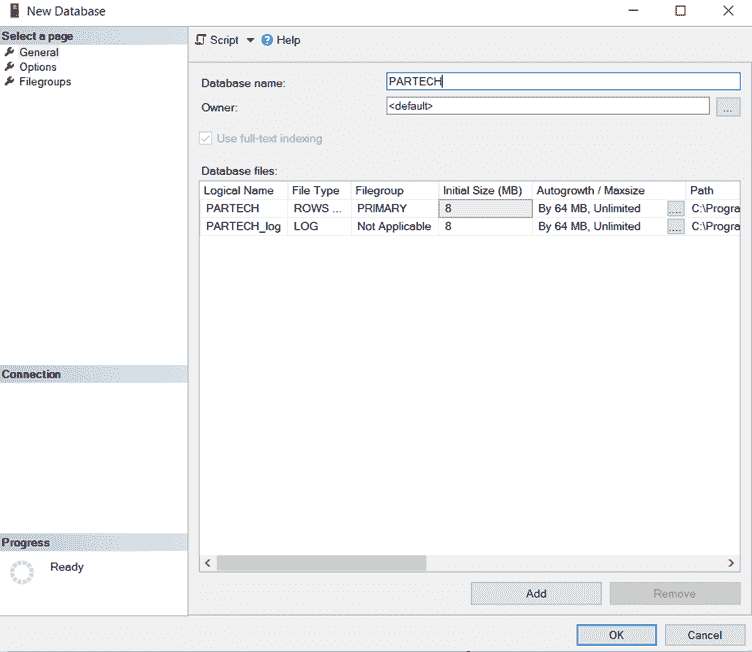

一旦创建了数据库，下一步就是创建用于存储记录的表。要创建它们，右键单击已创建的数据库中的表文件夹，并选择其中的“新建”选项和“表”选项。

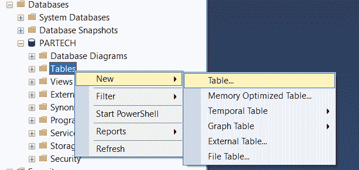

尽管完全从 API 中执行 CRUD 操作是可能的，但是在 API 中将只实现 read 操作。为此，我们将手动向表中添加数据。要添加数据，请右键单击该表并选择“编辑前 200 行”选项。

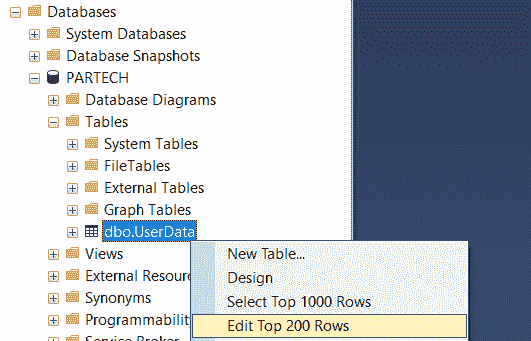

根据需要添加数据。

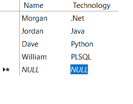

这就是我们的应用程序所需的数据库。

下一步是创建一个 API，它可以使用创建的数据库并响应来自邮递员的调用。要创建 WebAPI，让我们选择“ASP。NET 核心 Web 应用程序”作为项目。

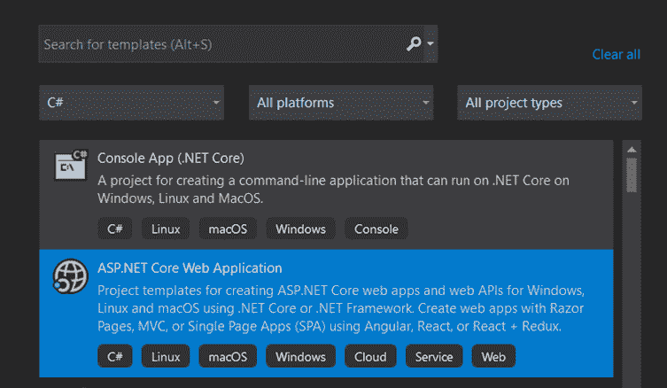

和‘API’作为项目的模板。

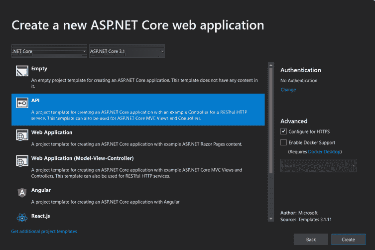

创建完成后，项目如下所示。

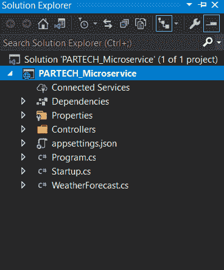

第一步是创建两个文件夹，“上下文”和“模型”，用于存储数据库上下文的类文件和数据库的实体文件。

要创建一个文件夹，右键单击项目，转到“添加”并寻找“新文件夹”

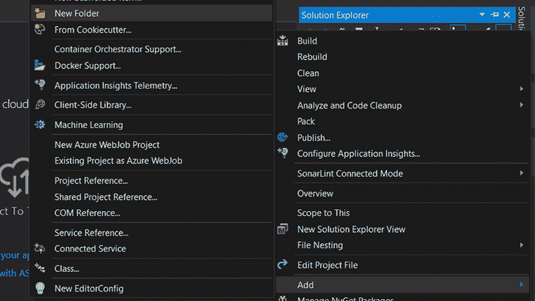

这里，我们将使用实体框架方法来连接代码和数据库。为了能够使用 EF，我们需要安装下面两个 NuGet 包。

*   微软。EntityFrameworkCore.SqlServer
*   微软。EntityFrameworkCore.tools

要安装 NuGet 包，右键单击项目并寻找“管理 NuGet 包”选项。因为我们在使用。Net Core 3.1，两个包我们都选择了 3.1.14 版本。

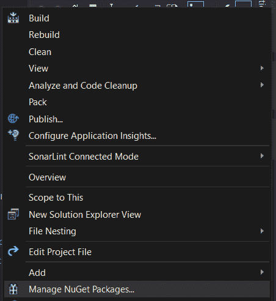

下一步是将数据库连接到代码。为此，我们需要通过运行下面的命令，自动将数据库表和其他对象移植到代码中。

Scaffold-DbContext "Server=。；Database = PARTECHTrusted _ Connection = True 微软。SqlServer -OutputDir 上下文

它表示搭建的输出将存储在上下文文件夹中。

在搭建之后，实体文件应该手动移动到 Models 文件夹中，名称空间必须更改为 Models。之后，项目的文件夹结构如下图所示。

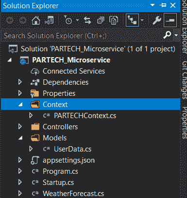

现在，数据库已经拉到代码了。让我们在这里实现一些业务逻辑。为此，我们创建了另一个名为“Services”的文件夹来存放实现业务逻辑所需的类和接口文件。

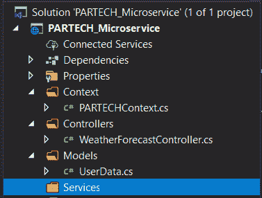

下一步是添加接口和类文件。要将它们添加到“服务”文件夹中，请右键单击该文件夹并转到“添加”选项，然后选择“类别”选项。创建两个类文件，一个名为 IUserService，另一个名为 UserService。

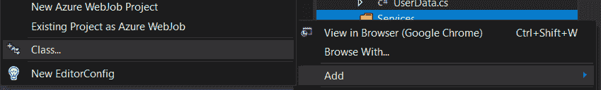

打开“IUserService.cs”文件，并编辑该类以实现如下图所示的界面。

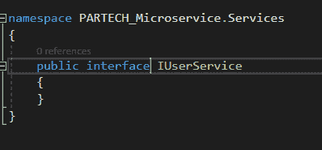

打开“UserService.cs”文件，继承 IUserService 作为接口，如下图。

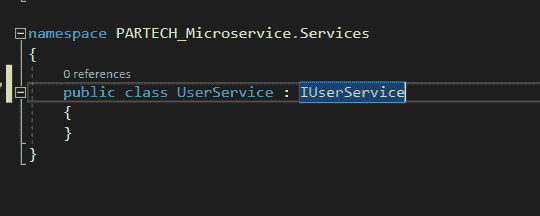

现在，我们将实现两种方法来获取用户数据。一个用于通过指定 id 获取它，另一个用于获取所有记录。

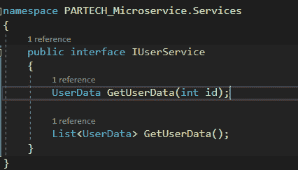

在接口文件中创建两个方法的声明。并在 UserService.cs 文件中做两个方法的定义。

这里，UserService.cs 文件依赖于数据库上下文，我们期望它作为构造函数注入的一部分。

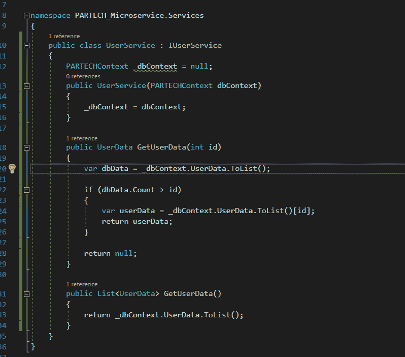

实现业务逻辑后，转到 appsettings.json 文件。我们将在这里配置数据库连接字符串，该字符串将在应用程序内部被访问。

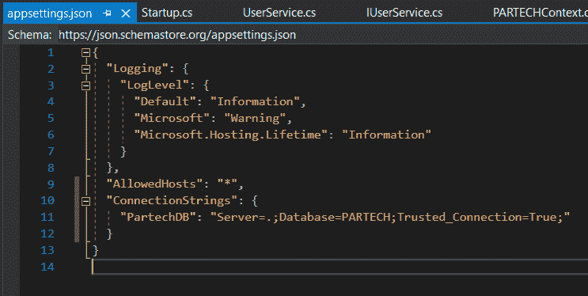

打开 Startup.cs 文件，转到配置服务方法。这里，为 dbcontext 添加注入，并使用需要从配置文件中引用的配置。此外，将完成对 UserService 的注入，这将在调用它的控制器中使用。

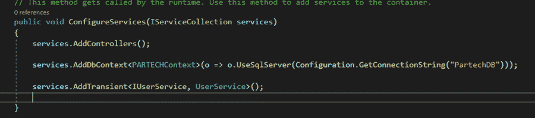

现在，我们已经有了数据库的业务逻辑和连接字符串。剩下的唯一部分是创建可以从外部世界消费的端点。

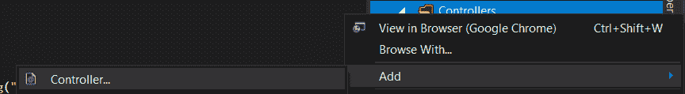

右键单击控制器文件夹，然后单击添加->控制器。并选择选项— API 控制器。

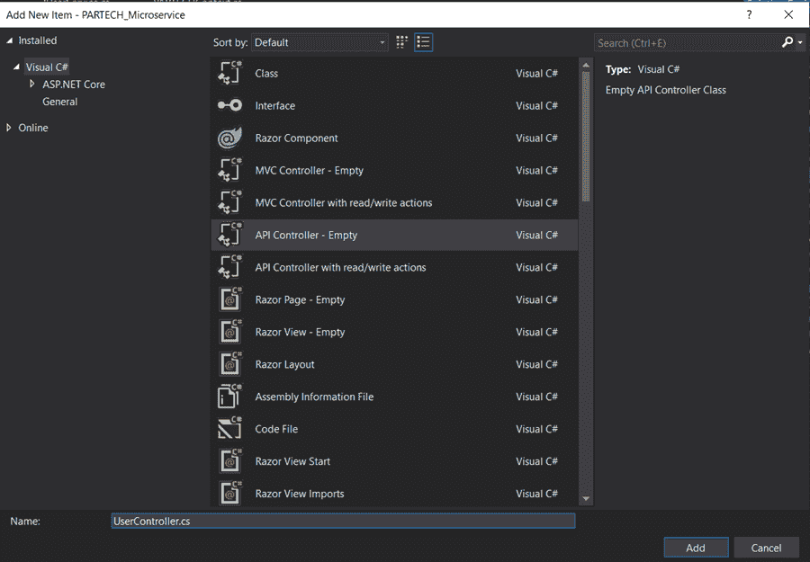

默认情况下，控制器文件带有这些选项。

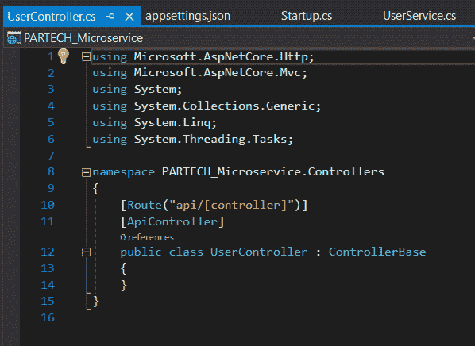

现在，添加需要 IUserService 对象的构造函数。另外，创建一个新的 HttpGet 端点，它使用 IUserService 对象来调用我们在 UserService.cs 文件中创建的 GetUserData 方法。

运行应用程序的编码部分已经完成。现在，让我们运行应用程序。你看到默认的天气控制器在浏览器中打开了吗？

将其基本 URL 复制到端口号(https://localhost:xxxxx)。现在，使用 append /API/user 并更改 HTTP 方法来获取 postman 并发送请求。

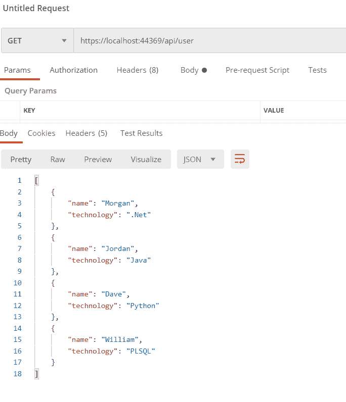

您是否看到数据库中的数据被我们的应用程序获取，并作为 JSON 对象显示在 postman 的响应部分？如果是，那么恭喜你，你已经创建了你的第一个微服务！

除此之外，您甚至可以为这个项目实现 docker，并在本地将其作为 docker 映像运行。

# 包扎

微服务不仅轻便，而且支持更快的部署选项，并限制了测试范围。这个博客给你一个在你的系统中创建和测试微服务的步骤。所以继续尝试吧，在评论中告诉我们。

*原载于*[*https://www . partech . nl*](https://www.partech.nl/nl/publicaties/2021/04/how-to-create-a-microservice)*。*