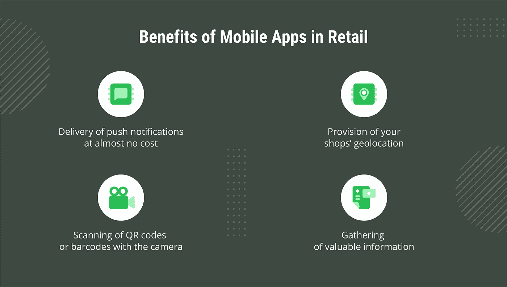
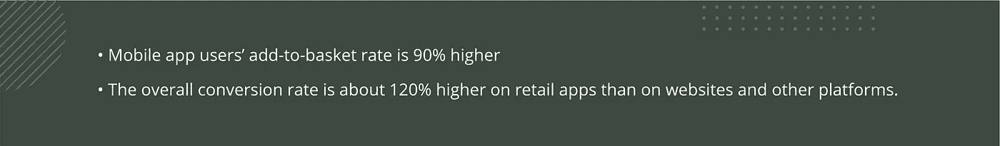
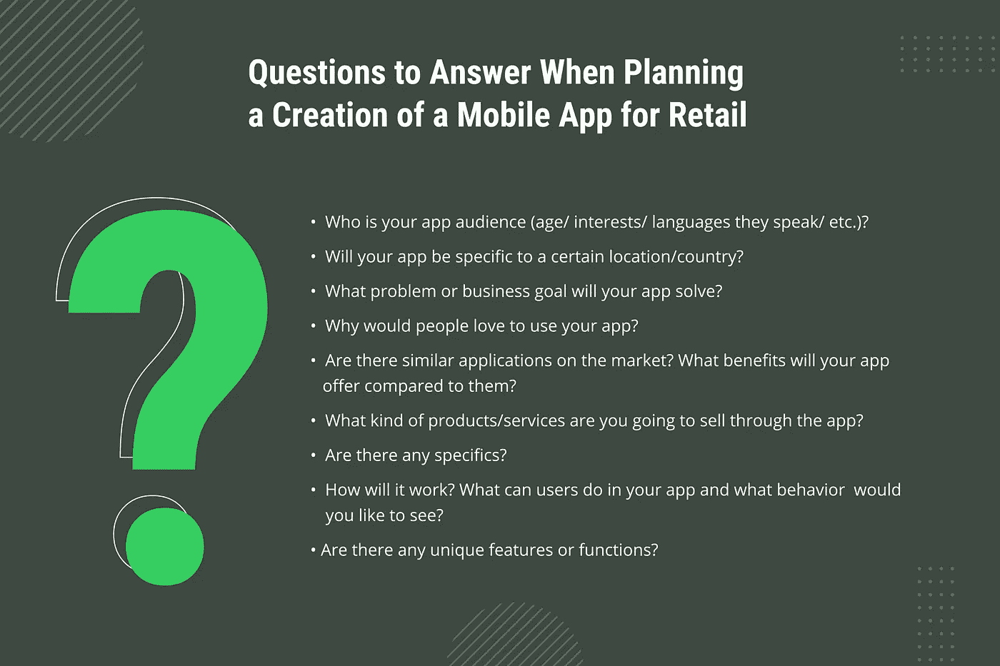
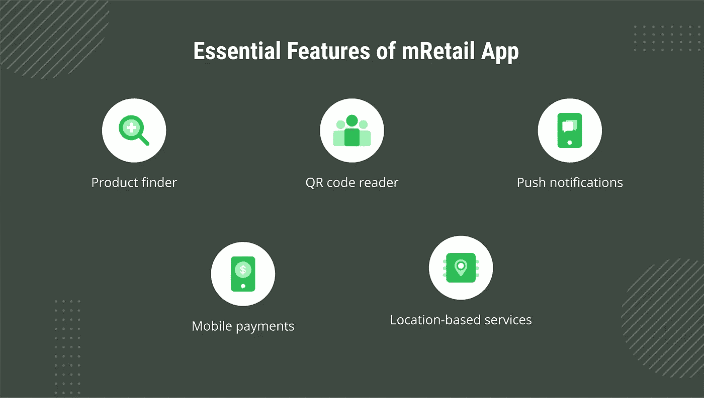

# 如何创建面向零售的移动应用来实现业务现代化

> 原文：<https://medium.com/nerd-for-tech/how-to-create-a-mobile-app-for-retail-to-modernize-your-business-53c8329726a2?source=collection_archive---------5----------------------->

首先，让我们承认电子商务可能是与数字化齐头并进的最大市场之一。说到移动商务，这个市场正以令人难以置信的速度增长。

**未来几年，移动商务** [**的年均增长率预计将达到 27%**](https://www.mordorintelligence.com/industry-reports/m-commerce-market) **，智能手机的总体增长率不低于 10%。**

这些统计数据对零售企业主来说意味着什么？答案是，由于对 mCommerce 解决方案的需求不断增长，零售移动应用程序的地位从潜在的有益选择转变为必需品，这将使它们在未来几年保持竞争力，无论是通过释放现代技术的力量还是允许用户虚拟探索产品。

现在，让我们更深入地探讨这个话题，看看移动应用为零售业务带来的确切好处是什么，什么是优秀的现代应用，以及如何估计其开发成本。

# 移动应用给线下零售带来的好处

今天，我们见证了一个共同的信念，即线下零售正在成为过去，并随着时间的推移被网上购物所取代。虽然这种想法是有根据的，例如数据显示 51%的美国人更喜欢网上购物，但事实是大多数零售企业主仍然从拥有线下商店中获利。怎么会？

答案可以通过 [Retail Dive](https://www.retaildive.com/news/why-many-shoppers-go-to-stores-before-buying-online/441112/) 提供的数据来说明，在线下商店触摸、测试和查看产品的能力是实体模式相对于在线商店的一个重要竞争优势。尽管如此，零售商需要解决顾客行为的一些变化。

例如，[Business.com](https://www.business.com/articles/brick-and-mortar-vs-ecommerce-stores/)的研究显示，三分之二的网下购物者习惯在购买前在网上查看产品价格。事情不仅仅在于价格。人们喜欢与时俱进的感觉，这种感觉是由技术解决方案以及蛋糕顶部添加的额外便利赋予的。

那么，零售应用程序如何帮助线下企业拉近与客户的距离呢？

除了上述好处之外，面向零售的移动应用还能提升您的业务现代化程度，从而提高潜在客户的兴趣、参与度和转化率。美好的事情不会就此结束。

# 零售应用如何帮助改善您的业务

零售企业可以通过更多方式从拥有自己的应用中受益，无论是关于提高销售额、忠诚度还是利用数据分析的能力。现在，让我们来看看零售中利用的移动应用程序所提供的优势要素。

## 覆盖更广泛的受众

为你的零售业务开发一款移动应用程序，不仅可以接触到住在你商店附近或偶然走到附近的人，还可以接触到所有拥有和使用手机的人，从而拓展你的视野。

## 提高销售额

如果你需要证据证明移动应用有助于增加销售额，[看一下数字](http://www.prnewswire.com/news-releases/its-a-cross-device-world-criteos-q4-mobile-commerce-report-reveals-top-companies-bet-big-on-mobile-consumers-300221060.html):

导致销售额增加的另一个因素是，移动应用程序允许及时向你的观众介绍忠诚度计划，当然，这是一个很大的竞争优势。

## 提高对品牌的忠诚度

移动零售应用程序可以通过多种方式增加你的品牌知名度:通过忠诚度计划增加你的客户对使用你的应用程序的兴趣，或者通过访问独家内容。后者可以用某种应用内货币来表示，比如[星巴克应用](https://app.starbucks.com/)中的星星。这个想法是这样的:你的顾客每次光顾你的商店，每次购买，或者参加你公司提供的活动都会得到这种货币。之后，他们可以使用这种应用内货币来支付商品或获得折扣。

## 客户行为分析

移动零售应用提供的最有用的东西之一是访问购买统计数据，允许分析每个客户的购物数据。您可以使用这些数据来创建符合目标的个性化优惠，因为它们是基于以前的购买和当前浏览请求的信息。

增加产品个性化的更多统计数据包括:

*   在应用上花费的平均时间
*   购物车废弃率
*   将商品添加到购物车和购买商品之间的时间

# 如何创建零售应用程序和功能

移动应用程序开发与制作大片非常相似:如果你想让它变得很棒，你需要专业的帮助。一个可能的选择是将移动应用程序开发外包给一家在零售应用程序开发方面有良好记录的软件公司，这家公司可以带你经历零售应用程序开发的所有阶段。

尽管如此，即使在与值得信赖的技术合作伙伴(如您的同事 Emerline)合作时，一项重要的“工作”仍然在您的身边，它是提供问题的答案，这将帮助您的提供商创建一个清晰的画面，确切地说，您想要让您最聪明的想法变成现实。

那么这些问题是什么呢？

对这些问题有明确的答案是很重要的，因为这将有助于软件开发公司给你一个准确的项目评估。

现在，解决列表中的最后一个问题，让我们看看现代零售应用程序的基本功能，这样你就可以创建一个它应该是什么样子的图片。提前计划一些独特的功能会更容易。

## **产品查找器**

如果你的企业提供许多不同的产品，明智的做法是在你的应用程序中加入智能搜索功能，这样你的用户就能够在特定的特征(颜色、尺寸、系列等)下找到他们想要的产品。)并避免没完没了地、烦人地滚动目录的所有页面。你的用户可能会欣赏的另一个好功能是基于摄像头的搜索。

## **二维码阅读器**

借助二维码扫描功能，您的客户将能够在几秒钟内找到该产品的所有重要信息(价格、评论、购物率)。人们确实喜欢这样的东西，因为它们不仅节省时间，而且有助于提高购物体验的满意度。

## **推送通知**

如果您希望您的客户了解所有促销活动和新闻，并确保他们及时收到个性化的产品，那么推送通知功能就是您所需要的。为了从通知中获得更多好处，您可以使您的通知具有交互性，建议您的客户采取某些行动，例如，出于收集信息的目的，这些信息同样可以转化为更加个性化的产品。

## **移动支付**

因为您的客户喜欢以不同的方式支付产品或服务，所以将您的零售移动应用程序与所有领先的支付服务(包括 PayPal、Apple Pay 和 Android Pay)相集成非常重要。

## **基于位置的服务**

另一种让你的客户与你的企业保持密切联系并尽快通知他们所有特别优惠的方法是使用 iBeacons。这项技术确保信息在正确的时间、正确的地点到达用户手中:例如，当客户进入商店时发送问候，或者根据以前的购买情况提供产品。

为了总结这一部分，让我们指出零售商的应用程序必须确保购物者的一致用户体验，无论他们选择哪种购买方式——移动、在线或店内。这需要将零售商店应用程序与零售商店网站、库存管理和零售公司中使用的其他系统集成。该应用程序可能还需要一个管理面板来管理应用程序用户，添加新产品，查看统计数据等。

# 那么开发一个零售 App 要多少钱呢？

这是许多客户问软件公司的问题，答案是开发成本从一个基本应用程序的几千美元到一个复杂的精明解决方案的数万美元不等。那么，决定构建零售应用成本的关键因素是什么？

## 应用程序的大小和规模

很明显，你想要添加的功能越多，这些功能就越先进，应用程序应该针对的设备和平台就越多，需要与第三方服务的集成就越多，需要的应用程序管理系统就越精细，应用程序开发成本就越高。

## 设计和开发的小时费率

虽然应用程序的大小和规模决定了制作它所需的时间，但开发人员的工资差别很大(从每小时 15 美元到每小时 200 美元以上)。因此，在相同的时间框架和质量水平下，不同公司开发一个应用程序的最终成本可能会有所不同。

## 测试和调试

虽然设计和开发占了大部分费用，但测试也构成了应用程序创建预算的一个显著部分。QA & testing 是开发过程的一部分，以确保对所有可能的问题进行持续监控，也是在应用程序发布之前检查所有要求是否得到满足。

在任何情况下，都不可能给出创建一个假设的零售应用程序的估计。每个项目都有其特殊性，需要一个单独的方法。您向开发人员提供的细节越多，您得到的估计就越真实。因此，如果你有一个开发应用程序的想法，并想知道它会花你多少钱，你可以随时联系我们的专家进行评估。

在 Emerline，我们知道如何正确开发零售应用程序，利用创新的力量，并确保设计能够让您的客户愿意使用您的解决方案。我们最近交付给一家零售公司的项目之一是一款 AR 购物应用程序，它允许客户忘记购物噩梦，并使用增强现实作为“试穿”工具，从各种选项中轻松做出选择。

您可以[了解关于产品](https://emerline.com/portfolio/ar-shopping-app)及其开发过程的更多信息，从而更清楚地了解我们如何为您的业务成功做出贡献。随时[联系我们](https://emerline.com/contact-us)，了解价格估算、咨询或任何其他您想澄清的零售应用开发服务方面的问题。

*最初发表于*[*https://emerline.com。*](https://emerline.com/)