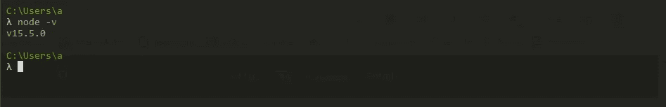
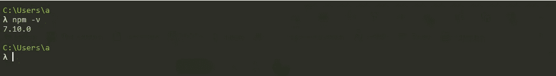
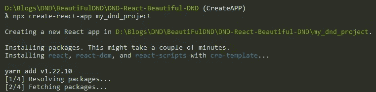
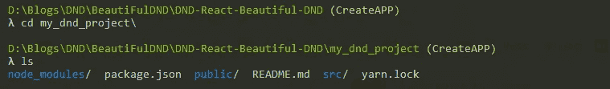
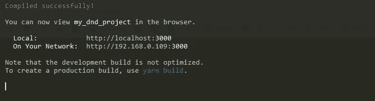
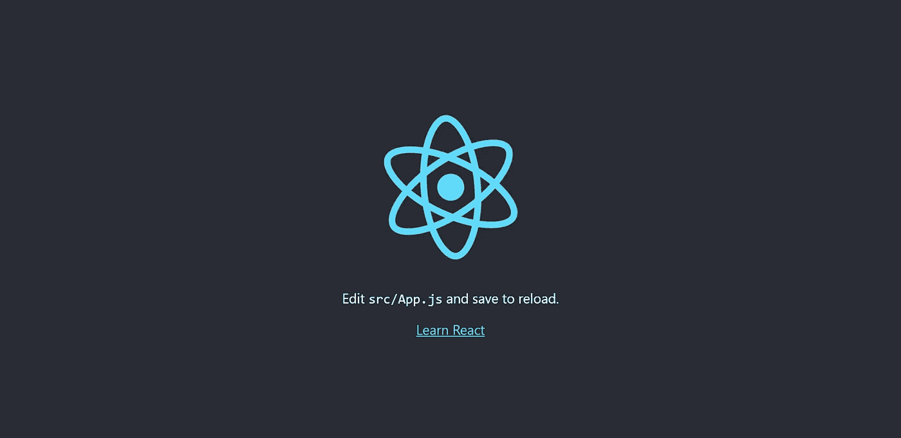

# 第 1 部分:如何用简单的步骤创建新的 React 应用程序

> 原文：<https://medium.com/nerd-for-tech/how-to-create-a-new-react-app-3286a37e2189?source=collection_archive---------6----------------------->

关于如何创建新的 REACT 应用程序并在本地运行它的详细分步指南。有关文档，请点击链接 [REACT DOCS](https://reactjs.org/docs/getting-started.html) 。

# 其他 ReactJS 教程的快速链接

1.  第 1 部分:如何创建新的 React 应用程序
2.  [第 2 部分:创建 ReactJS 组件的简单方法](/@ashikthulungrai7/part-2-easy-way-to-create-reactjs-components-7d458b577c67)
3.  [如何使用 REACT BEAUTIFUL DND 库创建拖放组件&](/@ashikthulungrai7/drag-drop-react-beautiful-dnd-328e00797f27)

# **创建新 React 应用程序的步骤**

1.  打开命令提示符(**Ubuntu 中的终端，Windows 中的 CMD 等)。**)
2.  安装**节点**和 **NPM**
3.  创建 React 应用
4.  运行 React 应用服务器

> **npx** 不是错别字——它是 npm 5.2+ 附带的[包运行器工具。](/@maybekatz/introducing-npx-an-npm-package-runner-55f7d4bd282b)

# 2.安装节点和 NPM

用于创建 React 项目的 Create React 应用程序由**脸书**维护，可以在任何**平台**上运行，例如 macOS、Windows、Linux 等。为了能够使用 Create React App 创建项目，您应该已经安装了版本≥ 8.10 的 ***节点和版本≥ 5.6 的***NPM

> 按照链接安装节点和 NPM:[链接 1](https://phoenixnap.com/kb/install-node-js-npm-on-windows) 、[链接 2](https://docs.npmjs.com/downloading-and-installing-node-js-and-npm)

## 2.1.检查节点和 NPM 版本

检查节点版本的命令: **node -v**

检查 NPM 版本的命令: **npm -v**

# 3.创建 React 应用

Create React App 由**脸书**维护，可以在任何**平台**上工作，例如 macOS、Windows、Linux 等。[创建 React App](https://github.com/facebookincubator/create-react-app) 是**学习 React** 的舒适环境，也是在 React 中开始构建**一个新的** [**单页**](https://reactjs.org/docs/glossary.html#single-page-application) **应用**的最好方式。

它设置您的开发环境，以便您可以使用最新的 JavaScript 特性，提供良好的开发人员体验，并针对生产优化您的应用程序。你需要在你的机器上安装 [**节点> = 10.16 和 npm > = 5.6**](https://nodejs.org/en/) 。

> **使用命令** `**npx create-react-app my-app**`创建 React App

使用命令创建 React 应用程序:**npx create-React-App my _ App**

应用程序创建完成后，你会在终端中看到如下消息

**react app 创建成功后**

**3.1 安装完成后，将目录更改为 create app**

更改目录后，您将看到创建的文件，如下图所示。

**app 安装完成后创建的文件。**

# 4.现在运行服务器

执行下面的命令来运行服务器。您的默认浏览器将自动打开，您的应用将在默认端口 3000 本地运行

> **运行服务器的命令:**

一旦您的服务器成功启动，您就会看到这一点

**服务器成功启动后**

服务器启动后，您的应用程序将在默认浏览器中启动，这是默认页面。

服务器成功启动后的默认页面

下一篇文章: H [如何创建 React 组件并将道具传递给组件。](/@ashikthulungrai7/part-2-easy-way-to-create-reactjs-components-7d458b577c67)

# 阅读更多我关于 React 应用程序开发和其他令人敬畏的 React 包的文章

> [第 2 部分:创建 ReactJS 组件的简单方法|作者 ki HSA Rai | 2021 年 7 月| Medium](/@ashikthulungrai7/part-2-easy-way-to-create-reactjs-components-7d458b577c67)
> 
> [1。拖&降:REACT BEAUTIFUL DND | by ki HSA Rai | 2021 年 7 月|中](/@ashikthulungrai7/drag-drop-react-beautiful-dnd-328e00797f27)
> 
> [Learning ReactJS:双向数据绑定|由 KIHSA Rai | May 年 5 月| Medium](/@ashikthulungrai7/learning-reactjs-two-way-data-binding-5c5ce1ab9b3d)