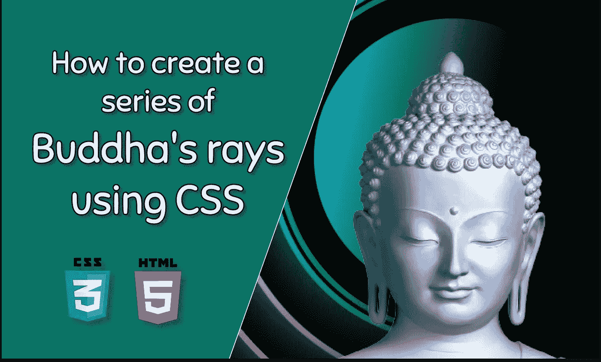
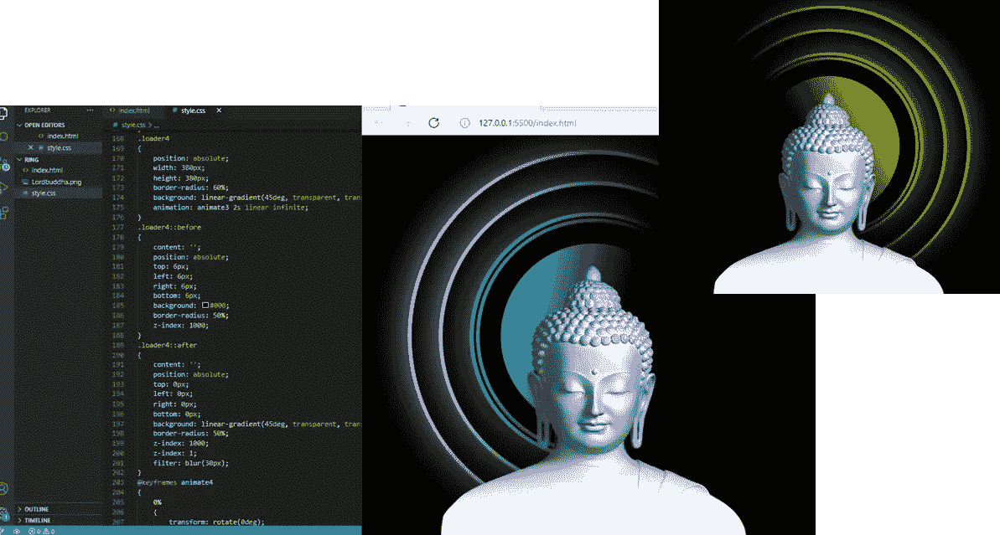

# 如何使用 CSS 创建一系列佛光

> 原文：<https://medium.com/nerd-for-tech/how-to-create-a-series-of-buddhas-rays-using-css-abcf338e3aa5?source=collection_archive---------4----------------------->

## 仅使用 HTML 和 CSS 创建佛光的两步指南。

> 佛陀，也被称为乔达摩悉达多，是一位佛教老师、哲学家和精神领袖，通常被认为是佛教的创始人。在他的冥想中，他得到了他一直在寻找的所有答案，他获得了完全的意识，把自己变成了佛陀。

你有没有考虑过我们可以用计算机语言创作出动画版的佛光？？？那么，让我们开始吧…

我想向你展示只用基本的 HTML 和 CSS 就能为佛光创建一个动画设计是多么容易。

因此，在这篇文章中，我将向你展示如何通过 2 个步骤来创建它。

# 步骤 01

创建一个 index.html 文件，并编写下面的代码。

# 第二步:

创建一个 style.css 文件来设计样式，并编写下面的代码。

确保所有的图片和 CSS 文件链接完美。

你可以在这里下载佛祖的图像。

Lordbuddha.png

希望这对你有帮助。如果你在实现这个过程中有任何困难或者你需要任何帮助，请联系我。