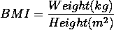
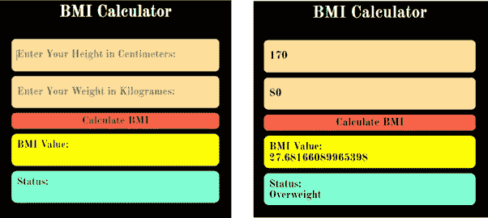
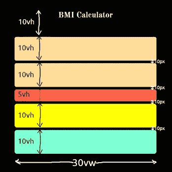
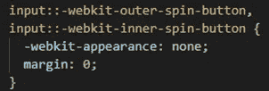
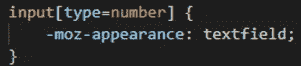
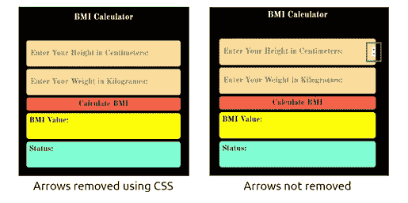

# 如何使用 HTML CSS 和 JavaScript 创建一个简单的身体质量指数计算器

> 原文：<https://medium.com/nerd-for-tech/how-to-create-a-simple-bmi-calculator-using-html-css-javascript-ce0fc4531e0?source=collection_archive---------2----------------------->

弗洛里安·克拉姆在 [Unsplash](https://unsplash.com?utm_source=medium&utm_medium=referral) 上拍摄的照片

今天我们将学习如何使用 HTML、CSS 和 JavaScript 创建一个简单的身体质量指数计算器网络应用程序。身体质量指数代表身体质量指数，它是衡量成年人身体脂肪的指标。

身体质量指数的计算是一个相当简单的过程，

# **简介**

为了创建我们的 web 应用程序，我们将使用，

超文本标记语言

半铸钢ˌ钢性铸铁(Cast Semi-Steel)

JavaScript (JS)

应用程序的 HTML 和 CSS 部分只是用来创建用户界面。JavaScript 让我们的 web 应用变得实用。

**先决条件**

对 HTML、CSS 和 JS 有基本的了解。

**这就是我们努力实现的目标，**

身体质量指数计算器

**HTML 部分**

身体质量指数计算器— HTML 部分

第一行帮助浏览器理解这一点。html 文件是用 HTML 5 写的。

第二行说明了这个网页所使用的语言。虽然这不是 put 的必要条件，但是强烈推荐使用，因为 put 有很多优点。欲了解更多信息，请访问[**https://www.w3.org/International/questions/qa-lang-why**](https://www.w3.org/International/questions/qa-lang-why)

标签包含重要的元数据(关于数据的数据)和一些其他关于网页的重要信息。

charset 属性设置文档(HTML 页面)中使用的字符编码。根据定义，“UTF-8(U from Universal Character Set+Transformation Format—8 位)是一种字符编码，能够对 Unicode 中所有可能的字符(称为码位)进行编码。编码是可变长度的，使用 8 位代码单元。”

标签定义了浏览器标签上显示的标题。

<link>标签用于链接显示该网页所需的外部文件。“rel”表示外部文件与这个 HTML 文档的关系。在 main.css 的情况下，该文件是这个 HTML 文档的外部样式表，因此“rel”属性的“stylesheet”值。

解析意味着读取 HTML 源代码(index.html ),这种读取是由浏览器逐行完成的。

最后两个<link>标签用于包含我们的网页所使用的字体。我们正在使用谷歌字体[https://fonts.google.com/](https://fonts.google.com/)。因为我们是从网上下载字体，所以当你离线浏览网页时，这些字体是看不到的。

为了计算身体质量指数，我们需要用户的两个输入，

高度(厘米)

重量(千克)

我们使用两个标签从用户那里获取这两个输入。这些输入标签的“id”属性用于识别用户分别给出的两个输入。“type”属性将用户对这些输入字段的输入限制为只有数字。还有字母“e”(由于数学原因—指数)和句号。被允许。

placeholder 属性定义了当没有用户输入时在输入字段中显示的文本。

标签

在我们的示例中，这个函数称为“Calculate()”，它是在 script.js 文件中定义的。

**CSS 部分**

身体质量指数计算器— CSS 代码

由于我们显然不能讨论整个 CSS 文件，所以让我们只讨论 CSS 网格部分，我们用它来显示两个输入字段、两个显示标签和一个布局如此漂亮的按钮。

我们用“容器”类将所述元素包含在

中。我们正在使用类选择器”。容器”，以获取对。css 文件。我们将显示属性设置为网格。要非常清楚地了解 *justfiy-content* 和 *align-content* ，请访问[https://open classrooms . com/en/courses/5295881-create-web-page-layouts-with-CSS/5415181-align-items-and-justify-content](https://openclassrooms.com/en/courses/5295881-create-web-page-layouts-with-css/5415181-align-items-and-justify-content)。

*最小高度*属性设置这个<分区>的最小高度。“vh”表示“相对于 1%的视口高度”(“vw”表示“相对于 1%的视口宽度”)。

*grid-template-columns* 属性指定列数和每列的大小。属性的空格分隔值的数目指定列的数目。每个空格分隔的值本身就是相应列的宽度。因为我们在这里只需要一列(宽度为视窗宽度的 30%)，所以对于 *grid-template-column* 我们只有一个值。

网格布局

*grid-template-rows* 属性就像 *grid-template-columns* 属性一样，只是针对行。我们可以单独定义每一行，但更容易的是，我们可以使用 repeat(3，10vh)等来重复类似高度的行，其中 3 代表要生成的行数，10vh 指定每一行的高度(这里是视口高度的 10%)。之后，由空格分隔的 5vh 指定一个高度为 5vh 的单行。同样，我们有一个 repeat 语句，由一个空格分隔，它生成两行垂直高度为 10vh 的行。

grid-gap 属性定义了网格的行和列之间的间距。这里的网格间隙是 10 个像素。

虽然这里没有讨论，但是其他 CSS 代码位只是用来美化文本输入、标签和使用颜色的按钮。

当我们选择输入类型为“数字”时，这个代码片段将删除文本输入字段中的箭头符号。这段代码是依赖于浏览器的。因此，我们必须为 Chrome 和 Firefox 等编写单独的代码片段。分开。

隐藏 Chrome 浏览器箭头的代码，

在 Firefox 浏览器上隐藏箭头的代码，

**JavaScript 部分**

我们的 script.js 文件只包含一个函数，即“Calculate()”。这个脚本中需要注意的一点是 document.getElementById()方法。这个方法用于获取对我们的 web 页面的 DOM 中的特定元素的引用。完成之后，我们可以使用 innerHTML 属性更改该元素的值。

根据公式，我们将计算出的身体质量指数值设置为变量“结果”。

然后我们在通过“isNaN(result)”检查计算出的结果是否“不是一个数”。请注意“！”在实际代码中的 isNaN(结果)之前。这是因为如果变量 result 是一个数字，isNaN(result)表达式将返回 false。因此，要执行“if”语句中的代码，我们需要将“！”在此之前，当变量“结果”为数字时，使“if”语句计算的表达式为逻辑 *true* 。

我们通过 document . getelementbyid(" h-input ")获取相应的用户输入高度值。value 属性，权重值由 document . getelementbyid(" w-input ")指定。

然后，我们将高度值赋给变量“height”，将重量值赋给变量“weight”。

parseFloat()是一个函数，用于将字符串解析成浮点数。这样做是因为文本输入字段的值是字符串类型。

***你可以从这里下载源文件*** 。[https://github.com/Wanuja97/BMI-Calculator](https://github.com/Wanuja97/BMI-Calculator)

# **结论**

这就是如何使用 HTML、CSS 和 JS 创建一个简单的身体质量指数计算器。希望它值得一读，如果是这样，请考虑在社交媒体上分享这篇文章。

2021 年 10 月 19 日在[https://programming ster . com/post/How-to-Create-a-Simple-身体质量指数计算器使用 HTML-CSS-JavaScript](https://programmingster.com/post/How-to-Create-a-Simple-BMI-Calculator-Using-HTML-CSS-JavaScript) 重新发布。

# 感谢阅读！❤️

给我买杯咖啡