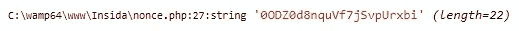
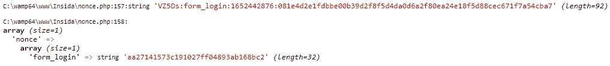
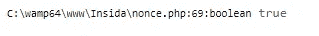

# 如何在 PHP 中创建一个简单的随机数

> 原文：<https://medium.com/nerd-for-tech/how-to-create-a-simple-nonce-in-php-a5afe046beee?source=collection_archive---------0----------------------->


随机数是仅使用一次的数字或令牌。

你可以在你的页面或表格中使用 Nonce 来为你的应用程序增加额外的安全层，它的一个功能是**区分人类和机器人**。

今天，我将向您展示如何用 PHP 创建一个简单的 Nonce，以及如何验证它。

# 我们开始吧

首先，我们将创建一个**类**，它将拥有**私有和公共方法**，这些方法将基于我们将要定义的秘密散列来生成和验证我们的 Nonce。

# 我们班

现在我们需要设置一个**私有函数(方法)**，它将生成随机字符，也就是我们的 **salt** ，直到我们将在其长度参数中指定的字符。

当我们测试运行代码时，让我们将这个方法作为一个公共函数。

这是完整的代码

让我们使用 new 关键字创建该类的一个实例，并调用**generates salt()方法**。

```
$nonce = new Nonce();var_dump($nonce->generateSalt(22));
```

这是我们的结果，注意随机字符是按照我们指定的长度生成的。



现在我们需要另一个私有方法来利用$_SESSION，使用表单 ID 存储生成的随机数。

接下来，我们需要创建另一个方法，将我们的 salt、我们的秘密和特定的过期时间作为令牌进行散列**。然后我们将生成一个 nonce，用冒号**分隔每个令牌**并**使用 **storeNonce** 方法将它存储在一个会话变量**中。**

这是完整的代码

因此，让我们调用 generateNonce()方法，传入 **5 作为第一个参数**(这将用于生成我们的 salt)，传入 **form_login** 作为第二个参数(这将是我们希望使用 Nonce 的表单)，传入 **10 作为第三个或最后一个参数**(这将是我们的 nonce 将持续多长时间，以分钟为单位)。

```
$nonce = generateNonce();
var_dump($nonce->generateNonce(5, "form_login", 10));var_dump($_SESSION);
```

这是我们的 nonce 和它在会话中存储的值。



您可以看到，在生成的 nonce 中，我们用冒号**分隔每个**令牌**，并通过使用 **md5()** 对其进行哈希运算，将它存储在会话中。**

现在我们需要编写一个**公共方法**，它将验证一个 nonce 并返回一个**布尔值(真或假)**，这取决于 nonce 是否有效。

在我们编写这个方法之前，您需要理解:

*   我们的随机数存储在$_SESSION 中
*   我们的标记由冒号分隔($salt : $form_id : $time : $hash)
*   我们将使用与生成随机数相同的秘密来验证它。

所以我们在上面的方法中有一些条件来检查随机数。该方法仅在检查成功时返回 true，在一个或多个检查失败时返回 false。

这是支票:

*   如果令牌不完整，随机数无效
*   如果 Nonce 没有存储在会话中，则 Nonce 无效
*   如果存储了 Nonce，但值不匹配，则 Nonce 无效
*   如果时间已经过去，则 nonce 无效
*   如果哈希有改动，随机数就无效

让我们创建一个 nonce 并验证它，以确认我们的类是否工作，我们也可以用私有函数替换**公共函数 generates salt()**，这样它就只能在我们的类中**访问**。

这是完整的代码

所以我生成了一个 nonce，并把它作为一个字符串传递给这个方法，它工作得非常好！

要验证你的 nonce，注意如果返回**真**，就意味着 nonce 是**仍然有效**，但是如果返回**假**，就意味着 nonce **无效**。

所以我们的功能运行得很完美！为了使用这个 nonce，您需要将类放到一个文件中，并使用 **require()** 关键字将该文件包含到您的页面中。

然后创建该类的新实例，并生成一个 nonce

所以你有它



# 令人惊奇不是吗？


通过使用一个非常强大的秘密使它适合你的项目。

注意到[克里斯·史密斯](https://medium.com/u/1c56ff92f057?source=post_page-----a5afe046beee--------------------------------)的回应，我能够更新这篇文章的安全性。谢谢你，克里斯！

请随意在下面留下您对本文的建议和/或回复。

您已经到达我更新文章的结尾。

# 额外的

我目前正在测试一个 SAAS 应用程序，我建立这个程序是为了帮助收集和管理你的网站或企业的客户评论和评级。你介意检查一下吗？我正在寻找这个大项目的合作伙伴。

非常感谢您的反馈。

[查看 Givemeastar(GMAS)](https://givemeastar.com/)

谢谢你