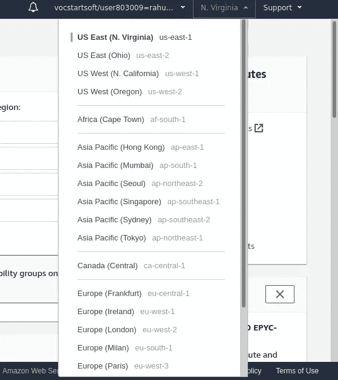
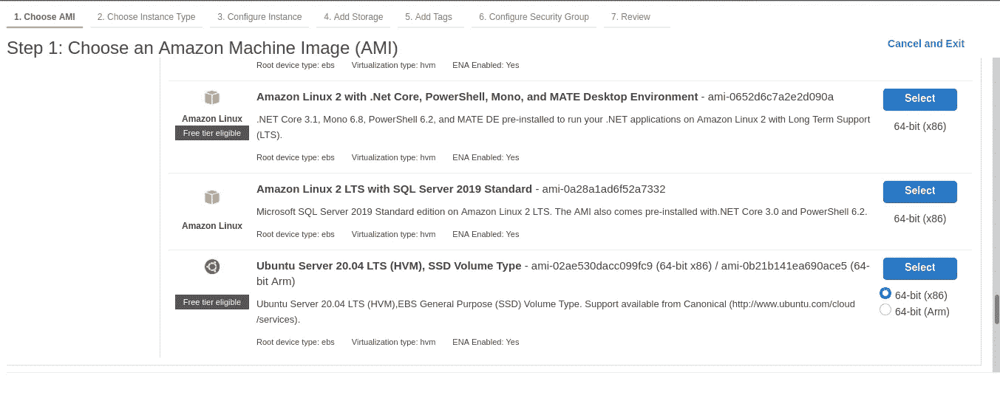
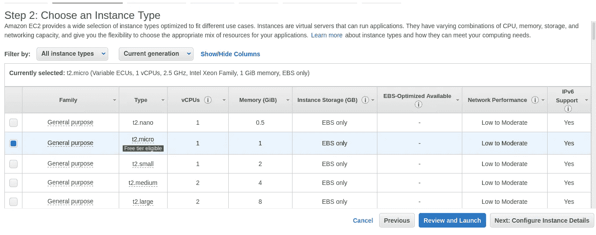
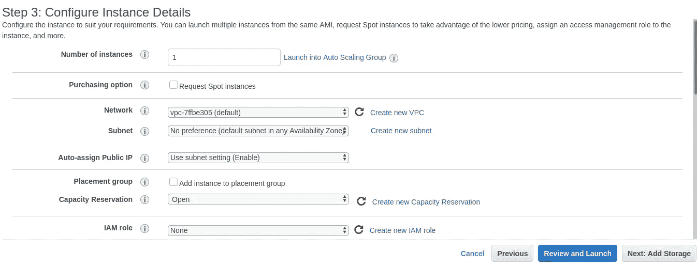
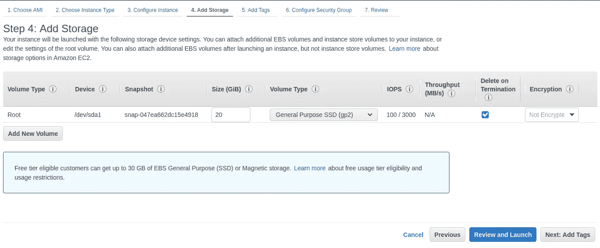
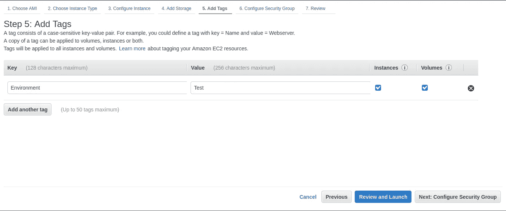
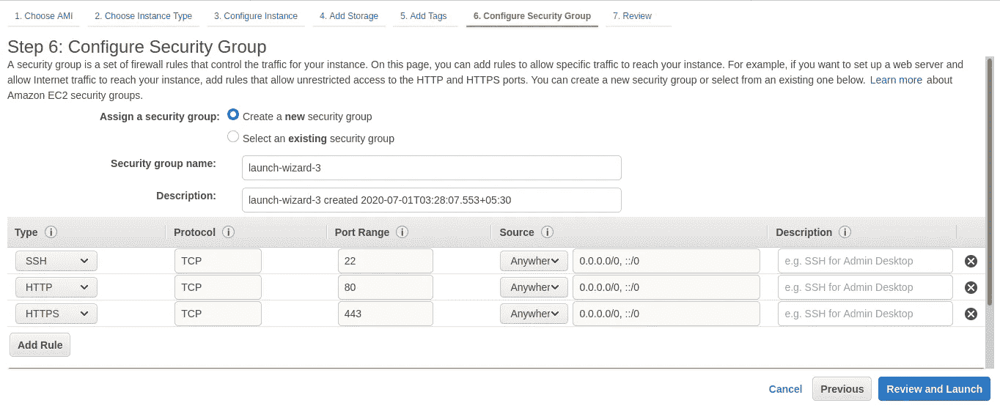
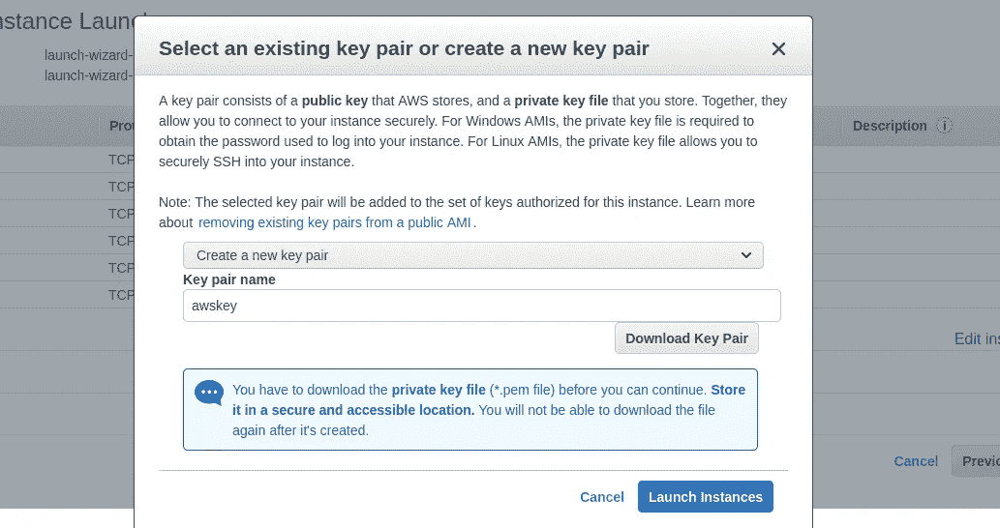
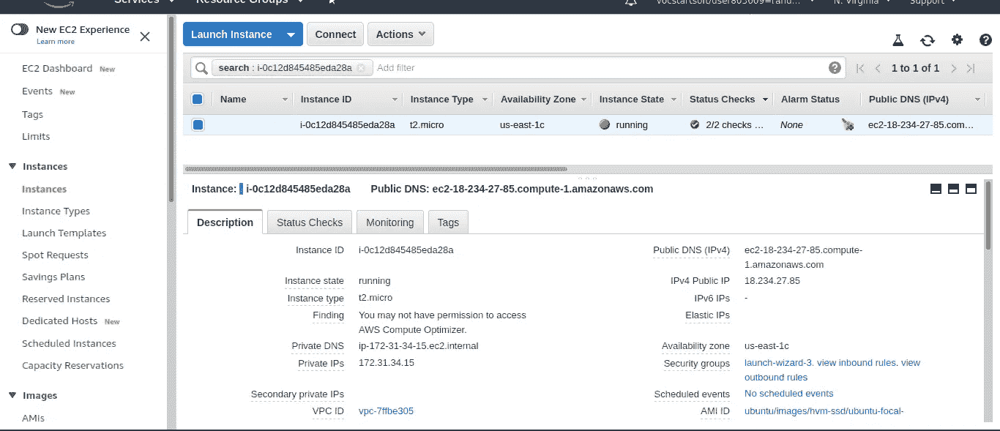

# 如何在 AWS EC2(弹性云计算)上创建 Ubuntu 20.04 服务器

> 原文：<https://medium.com/nerd-for-tech/how-to-create-a-ubuntu-20-04-server-on-aws-ec2-elastic-cloud-computing-5b423b5bf635?source=collection_archive---------0----------------------->

在这里，我们将了解如何在 AWS EC2 上创建一个 **Ubuntu 20.04 LTS** 服务器。
所有这些都是[自由等级](http://aws.amazon.com/free/)符合条件:
1。亚马逊 **EC2 免费等级**向您提供 **12 个月**。
2。**亚马逊 EC2 在单 AZ db.t2.micro 实例中每月 750 小时**。

**先决条件** 创建 AWS 账户。

# 创建 Ubuntu 实例的步骤

1.使用您的 AWS 帐户登录并转到**控制台。**

2.在服务中搜索 **EC2** 并转到 EC2。

3.(可选)在 Amazon EC2 的右上角，选择您想要创建 EC2 实例的 ***区域*** 。



4.点击**启动 **EC2 仪表板**上的**实例。

5.选择 **AMI** (亚马逊机器镜像)即选择 **Ubuntu 20.04 LTS** 。



6.选择和实例类型在这种情况下我们将选择**通用 t2.micro** 。因为那是**自由层合格**。现在，单击下一步:配置实例详细信息。



7.(可选)配置实例。在这种情况下，我们可以通过指定 **IAM Role** 来指定实例数量和这些实例的用户角色。



8.添加存储:在这里我们可以改变 EC2 实例的**大小**。自由层有资格获得高达 **30GB 的存储**。



9.(可选)添加标签:我们可以在这里添加一些标签来指定实例类型。



10.配置**安全**组**组**

在这里，我们将创建一个新的**安全组，其中我们将指定哪些**端口**将为 EC2 实例打开。**

我们将为 EC2 实例添加 **HTTP** 、 **HTTPS** 和 **SSH** 端口。HTTP 和 HTTPS 允许来自世界任何地方的 web 请求到达我们的实例。并且 SSH 到**将**从**本地** **机器**连接到我们的 EC2 实例。

```
HTTP   80   Anywhere 
HTTPS  443  Anywhere
SSH    20   Anywhere or Custom
```



11 .**审核**和**启动**实例

12 .创建一个**密钥对**到**将**从本地机器连接到我们的 EC2 实例。**下载**密钥对并安全保存**。稍后它将用于连接 EC2 实例**。****

********

****13 .点击**启动实例。******

********

> ****您的 EC2 实例已经**可以**使用了。请稍等片刻，直到**实例状态**变为**运行**并且**状态检查**完成**。现在，
> [**从本地机器(**窗口** / **Ubuntu** )**](/@rahul26021999/how-to-connect-to-ec2-instance-aws-from-windows-ubuntu-da97c0cc9c8) 将连接到您的 EC2 实例******

# **也学习**

1.  **[如何在 EC2 AWS 上部署 Laravel 项目。](/@rahul26021999/how-to-deploy-laravel-project-on-ec2-aws-6d004a57bb1f)(创建 Apache 服务器、mysql 服务器和部署 laravel 项目的完整参考)**
2.  **[如何在 AWS RDS(关系数据库服务)上设置 mysql 数据库](/@rahul26021999/how-to-setup-mysql-database-on-aws-rds-relational-database-service-f5a186ccbadb)**