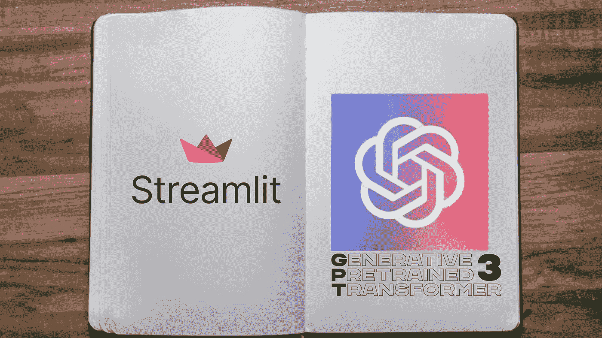
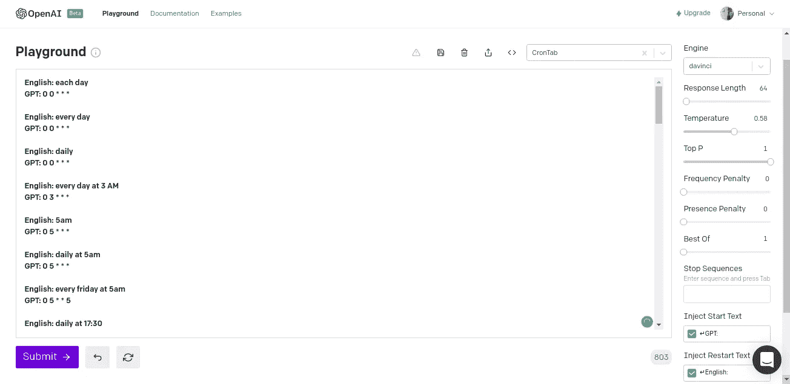
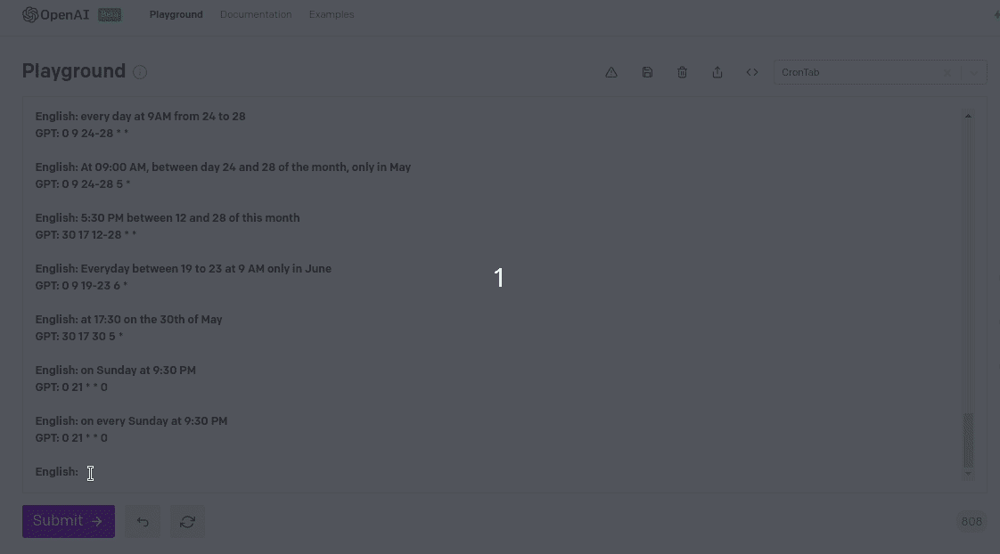
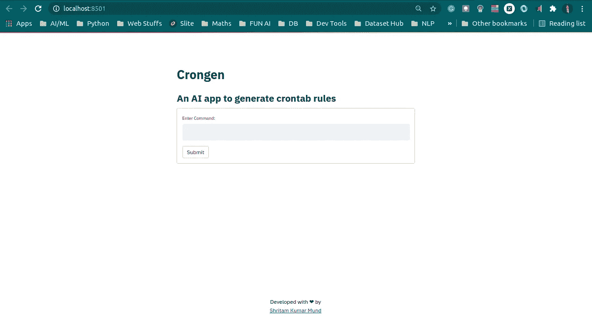
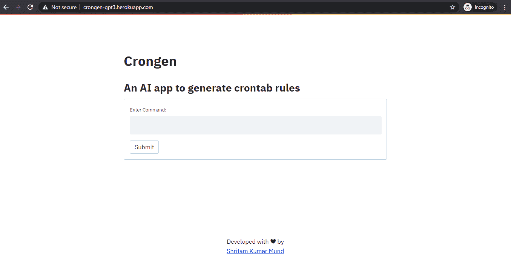

# 如何使用 OpenAI 和 Streamlit 创建一个 AI 应用程序来生成 Crontab 规则

> 原文：<https://medium.com/nerd-for-tech/how-to-create-an-ai-app-to-generate-crontabs-using-openai-and-streamlit-23aacbf20a9c?source=collection_archive---------12----------------------->

## 创建和部署您自己的人工智能应用程序



**如果想做一个深度学习 app，能有多难？**

> 这完全取决于您用来构建模型和应用程序的工具，对吗？

在笔记本电脑环境之外引入机器学习模型，并将其转化为漂亮的数据产品，过去需要做大量工作。幸运的是，有很多工具正在开发中。而其中一个就是 [**细流**](https://streamlit.io/) 。Streamlit 是一个开源的 Python 库，用于构建定制的 web 应用。

在本教程中，我将向您展示我如何创建一个应用程序来从原始文本生成 crontab 规则。下面我们来看一个快速演示。


点击[此处](https://crongen-gpt3.herokuapp.com/)查看 app。请注意，这个应用程序的成本为每个请求我。因此，几天后您的命令可能就不可用了。反正我要教你怎么能把自己的 app 做成这样。那么，我们开始吧。

# 什么是 OpenAI GPT3 模型？


由埃隆·马斯克和彼得·泰尔等人共同创立的 OpenAI 曾经是一个非营利组织。它在过去几年里取得了巨大的进步，弥合了人工智能和普通人类智能之间的差距，今天已经商业化。生成式预训练变压器 3 ( **GPT-3** )是一个自回归语言模型，它使用深度学习来产生类似人类的文本。

从安装[开口](https://pypi.org/project/openai/)开始。这将安装 openai，并让我们访问一些有用的函数，我们将在本教程的后面使用。

```
pip install openai
```

现在让我们安装 [Streamlit](https://docs.streamlit.io/en/stable/#welcome-to-streamlit) 。

```
pip install streamlit
```

导入相关库，

```
import openai
import streamlit as st
```

你可以在 https://beta.openai.com 找到你的 OpenAI API 密匙。

# **构建 Crontab 生成器模型**

众所周知，要建立一个人工智能模型，我们必须遵循收集数据的古老传统。所以，我采用了 crontab.guru 提供的所有例子来训练我的 GPT3 模型。

然后开始在开放操场上训练我的模型。



酷！我们已经完成了模型的训练。让我们评估我们的模型



哇！我们的模型可以为给定的文本输入正确地生成 Crontab。

OpenAI Python 库提供了从用 Python 语言编写的应用程序对 OpenAI API 的方便访问。它包括一组预定义的 API 资源类，这些 API 资源从 API 响应中动态初始化自己。

# 部署 GPT3 模型

耶！现在，我们可以开始部署我们刚刚培训的模型了。下面的脚本是我们创建一个从原始文本生成 Crontab 规则的 Streamlit 应用程序所需要的全部内容。

## 以上代码的详细信息:

*   **st.set_page_config()** :设置页面标题，显示在浏览器页签中。这必须是应用程序中使用的第一个 Streamlit 命令，并且只能设置一次。
*   **st.title() :** 设置页面的页眉标题。
*   **st.form** 和**ST . form _ submit _ button:**`st.form`可以放在 Streamlit 应用程序的任何地方，以表格的形式接受用户的输入。一个`st.form_submit_button`是一个特殊的按钮，一旦提交就采取行动。

运行应用程序。将在您的默认浏览器中打开一个新选项卡。

```
streamlit run app.py
```



# 在云平台上部署应用程序:

最后，让我们将所有代码部署到 Heroku 中。

[**Heroku**](https://www.heroku.com/) 是一个平台即服务(PaaS)，使开发者能够完全在云中构建、运行和操作应用。



在[这个库](https://github.com/ishritam/crongen)中，你可以随意使用我用来创建这个应用的代码。

# 结论

恭喜你！您刚刚学习了如何创建一个应用程序，通过使用 OpenAI 和 Streamlit 给出几个词来生成 crontab 规则。使用 OpenAI 和 Streamlit 这样的工具，您可以获得很大的学习曲线来部署具有深度学习的 web 应用程序。

希望这篇文章能给你创造一个动力，让你创建自己的深度学习应用。

# 感谢您的阅读！

[通过 Medium](/@shritam) 关注我的最新动态。😃

# 参考

1.  [https://www . twilio . com/blog/ultimate-guide-open ai-GPT-3-language-model](https://www.twilio.com/blog/ultimate-guide-openai-gpt-3-language-model)
2.  [https://blog . streamlit . io/introducing-submit-button-and-forms/](https://blog.streamlit.io/introducing-submit-button-and-forms/)