# 如何为高可用性创建 EC2 实例的自动扩展组！

> 原文：<https://medium.com/nerd-for-tech/how-to-create-an-auto-scaling-group-of-ec2-instances-for-high-availability-2931042789ad?source=collection_archive---------0----------------------->

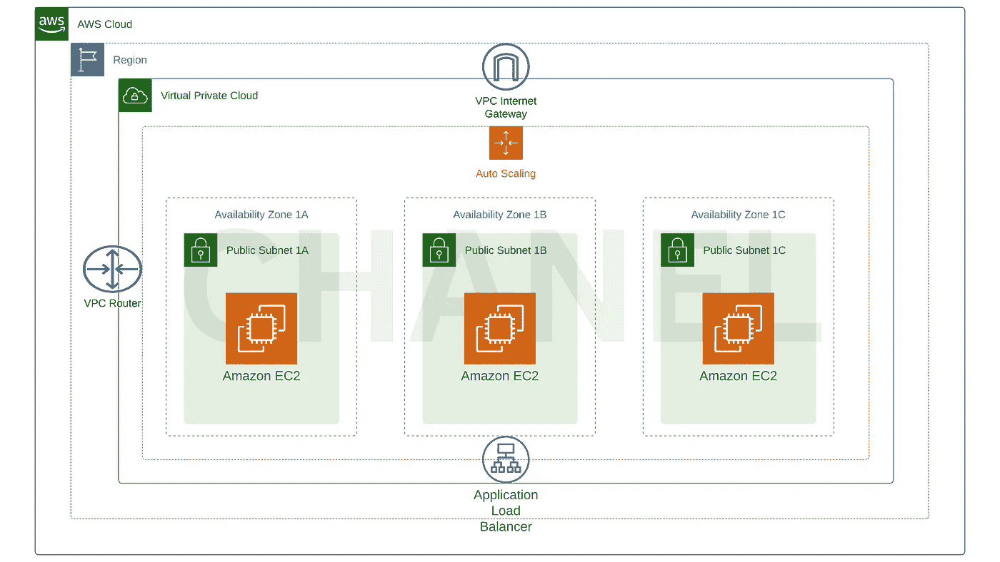

我们将使用一个真实世界的例子来帮助我们理解标题和实际情况。想象一下，像耐克这样的大公司宣布，他们将推出一款人人都在期待的运动鞋，或者像碧昂斯这样的大艺术家宣布，她的门票销售将在某一天在她的网站上直播。自然，我们可以推断，这些网站的流量将从他们每天看到的正常流量飙升。这就是自动缩放所能提供的帮助。

如果耐克和碧昂斯将他们的网站放在 EC2 实例中，并附加一个自动缩放组来适应流量的急剧上升，这可能有助于防止他们的网站崩溃！这就是为什么自动缩放很重要，我将一步一步地向您展示如何为 EC2 实例创建自动缩放组！

***免责声明:所有例子都是虚构的，作者不代表 Nike、Beyonce、Beyhive 或任何附属于这些组织的实体***

**你需要什么来开始:**

*   亚马逊网络服务帐户

> 步骤 1:使用 CIDR 10.10.0.0/16 创建 VPC

一个 **VPC 或虚拟私有云**是一个区域内云的逻辑隔离部分，所以基本上是你自己的互联网的一部分。每个 VPC 都有自己的 IP 地址块，称为 CIDR 地址块。 **CIDR** 代表无类域间路由，是描述 IP 地址块的符号。如果你不知道，每一个使用互联网的设备都需要一个 IP 地址，从你的 iPhone，Apple Watch，你的智能冰箱和你的门铃系统…一切。

首先，我们将在 AWS 管理控制台中创建一个 VPC。只需在搜索栏中搜索“ **VPC** ”，然后点击 VPC。然后在左侧点击“**您的 VPCs** ”。您将看到一个默认的 VPC 已经存在，但我们将通过单击“**创建 VPC** ”来创建我们自己的。

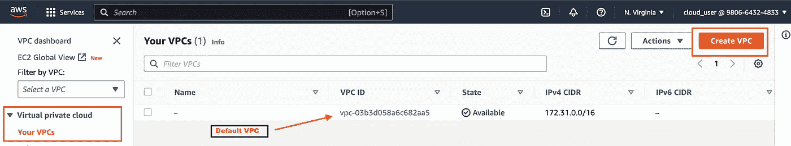

对于 VPC，我们将有以下设置。您可以选择任何您喜欢的名称，但是要确保 **IPv4 CIDR 是 10.10.0.0/16** 。

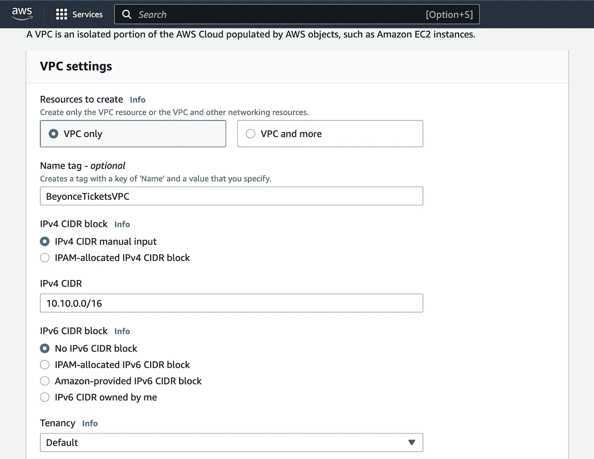

VPC 设置

最后，进入“**操作**选项卡，下拉选择“**编辑 VPC 设置**”，向下滚动并点击复选框**启用 DNS 主机名**，点击保存。

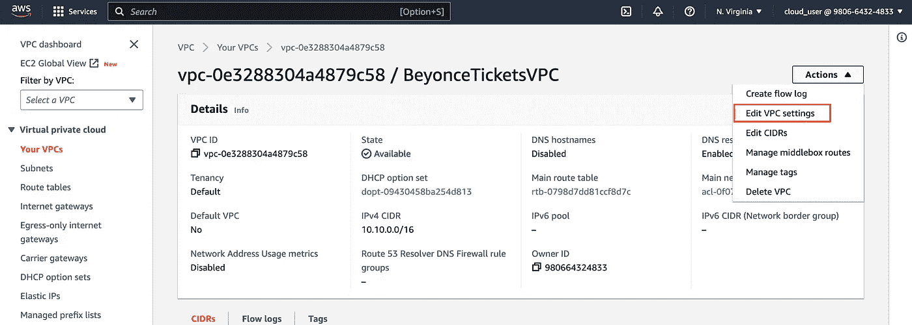

> 步骤 2:创建 3 个公共子网

**公共子网**在可访问互联网的可用区域内创建。这意味着一个子网不能跨越多个可用性区域，但是您可以使用多个子网将工作负载分布到多个可用性区域。

例如，Beyonce 可以在美国东部(N.Virginia region)拥有一个 VPC，但在该区域内，她希望在不同的可用区域拥有不同的子网，因此如果一个子网的流量过大，另一个子网将被访问，这就是我们要创建 3 个公共子网的原因。

在同一页面上，单击左侧的“**子网**”。默认子网已经存在，但我们将通过点击右上角的“**创建子网**来创建我们自己的子网。

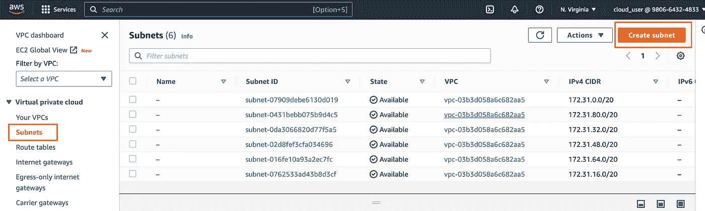

子网创建

我们必须首先将我们的 VPC 连接到子网，因此我们将选择我们的 VPC…

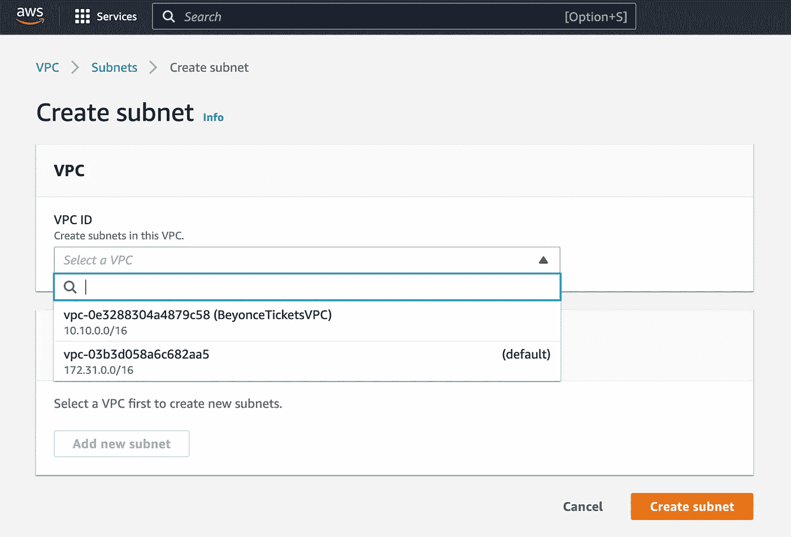

我们能够同时创建所有三个子网。确保您输入第一个子网的信息后，只需点击左下角的“**添加新子网**”，而不是橙色的“**创建子网**”按钮。我们将对我们的 3 个子网使用以下设置…

> **子网#1:**

*   子网名称:公共 1A
*   可用区域:美国东部-1a
*   IPv4 CIDR 块:10.10.1.0/24

> **子网#2:**

*   子网名称:公共 1B
*   可用区域:美国东部-1b
*   IPv4 CIDR 块:10.10.2.0/24

> **子网#3:**

*   子网名称:Public-1C
*   可用区域:美国东部-1c
*   IPv4 CIDR 块:10.10.3.0/24

在创建最后一个子网时，我们现在可以选择“**创建子网**

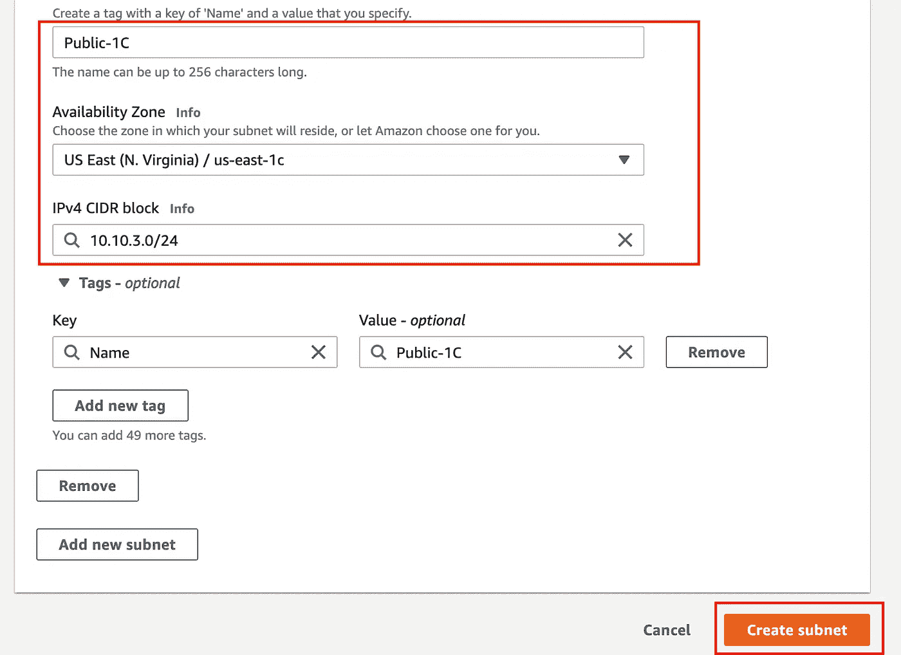

您应该会收到一条消息，表明您已经成功创建了 3 个子网。


最后，我们要进入每个子网，单击标有“**启用自动分配公共 IPv4 地址**”的方框。我们将通过单击“**操作**”选项卡并单击“**编辑子网设置**”来完成此操作。对所有 3 个子网执行此操作。

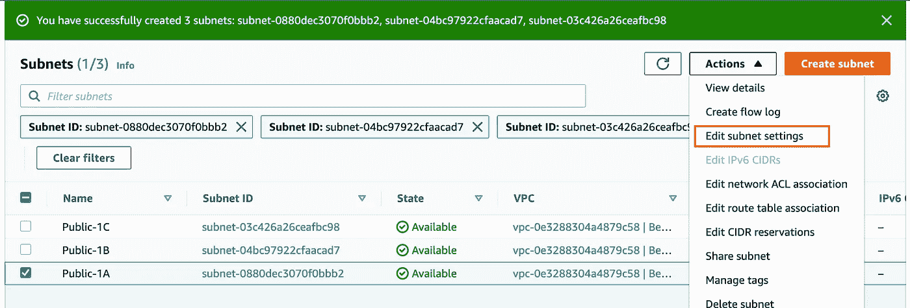

我们希望我们的**公共子网**中的资源能够访问互联网，因此我们必须创建一个所谓的**互联网网关**。如果我们有任何私有子网，我们将使用 NAT 网关，使我们的私有子网能够到达互联网。

我们将在左侧选择“**互联网网关**”，然后单击“**创建互联网网关**”(同样会有一个已填充的默认网关，请创建您自己的网关)。

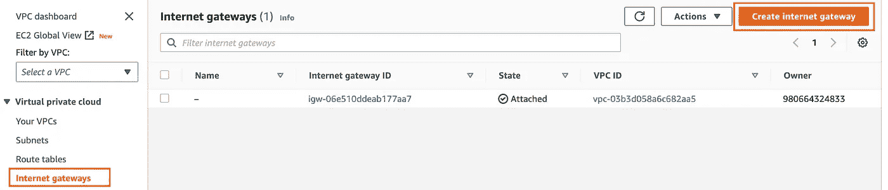

创建互联网网关

命名您的互联网网关，然后选择橙色的“**创建互联网网关**”…

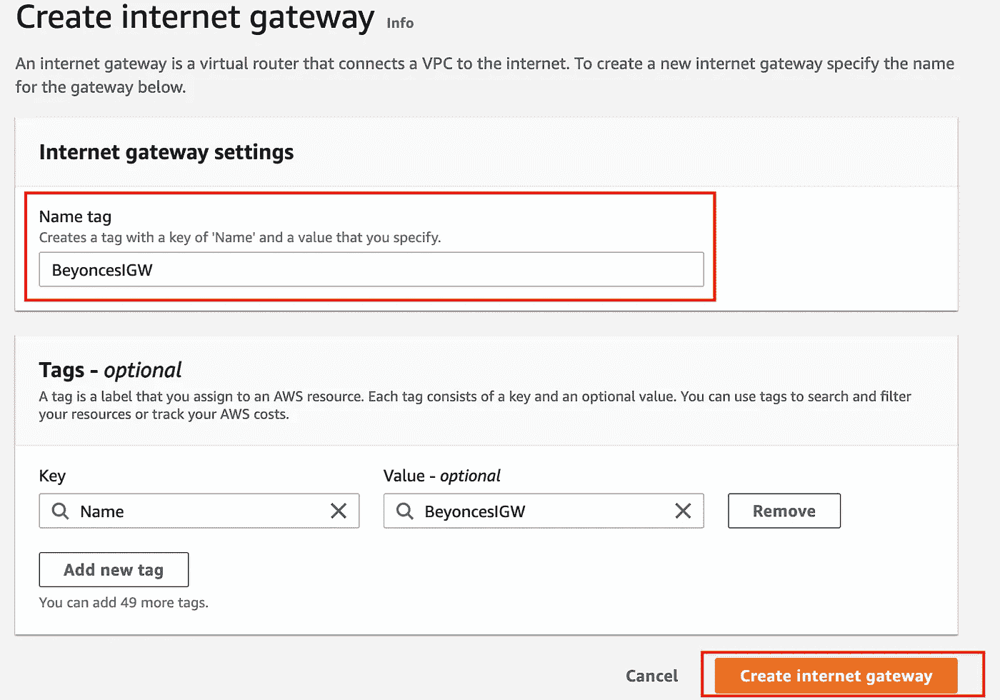

一旦您创建了互联网网关，它会立即通知您连接到 VPC。如果碧昂斯的网站不能上网，她的粉丝怎么能拿到她的票呢！我们要把 BeyoncesIGW 附加到 BeyoncesVPC 上。

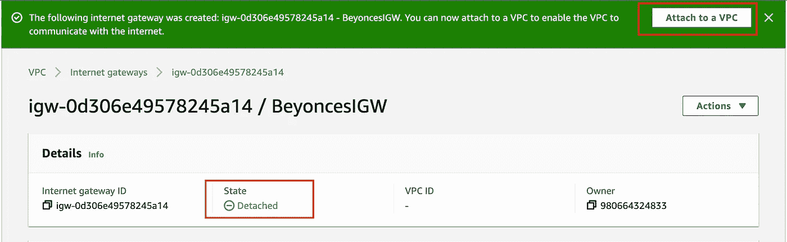

在下拉菜单中选择 VPC 并点击“**连接互联网网关**”。

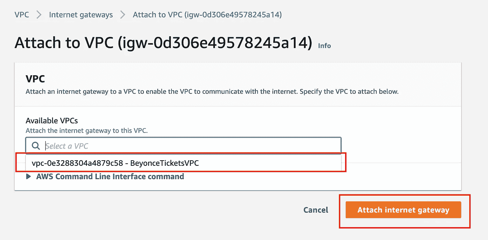

我们的路由表是自动创建的，但请记住，互联网网关是我们访问互联网的途径，我们必须将它添加到路由表中。

这几乎就像你家里有一台笔记本电脑(接入互联网的设备)和一个无线路由器。您可以同时拥有这两种设备，但在您将设备连接到路由器之前，您无法访问互联网。

我们将通过点击“**路由表**，然后**选择我们的路由表**，将互联网网关添加到路由表中。你可以通过寻找你的 VPC 名字来找到它。如果您看不到全名，只需选择它并查看全名的详细信息。

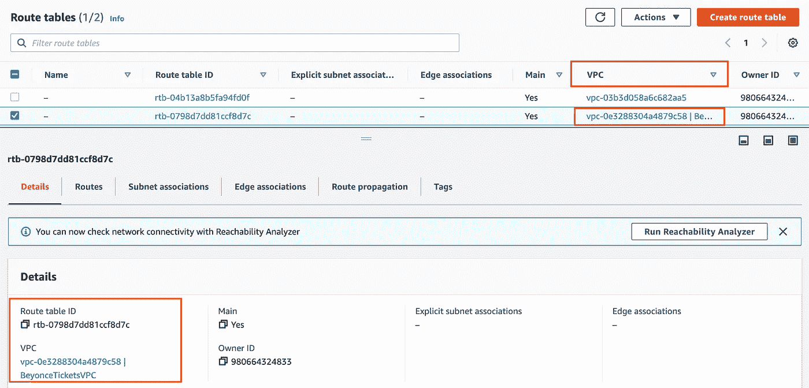

选择路由表后，点击“**路线**，选择“**编辑路线**

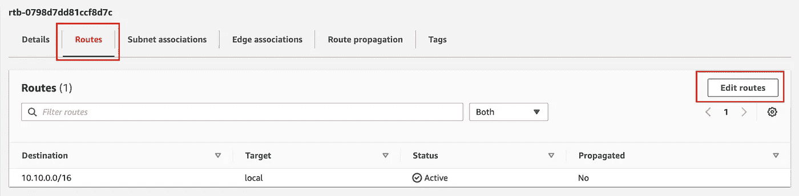

选择“**添加路由**，然后输入 0.0.0.0/0(所有 IP 地址)，然后选择您的 IGW 并保存更改。

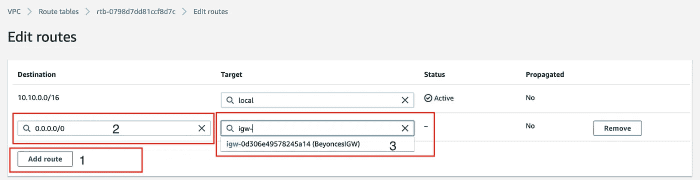

将 IGW 添加到路由表

> 步骤 3:创建自动缩放组

首先，我们将创建一个启动模板。在 EC2 仪表盘的 Instances 下选择“**启动模板**”，然后点击橙色按钮“**创建启动模板**

> 保留所有默认设置，并更改以下内容:

1.  **启动模板名称:**您的模板名称
2.  **应用和操作系统映像(亚马逊机器映像):**快速入门>亚马逊 Linux
3.  **实例类型:** t2.micro(符合自由层条件)
4.  **密钥对:**生成一个新的密钥对(RSA/。pem)
5.  **网络设置:**通过附加您的 VPC 并添加 HTTP 的入站规则来创建安全组，如下所示…

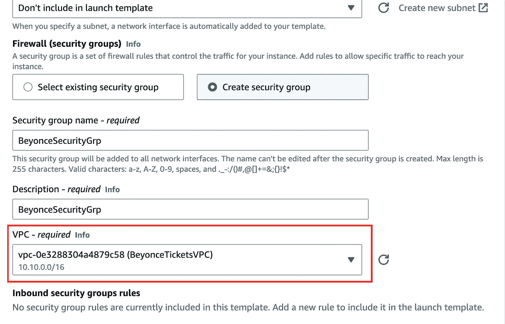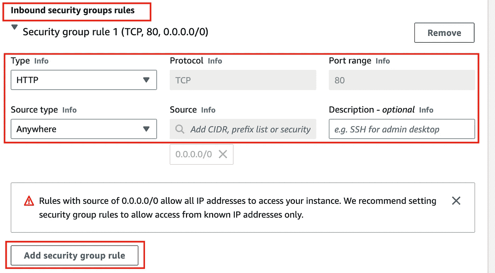

入站安全组设置

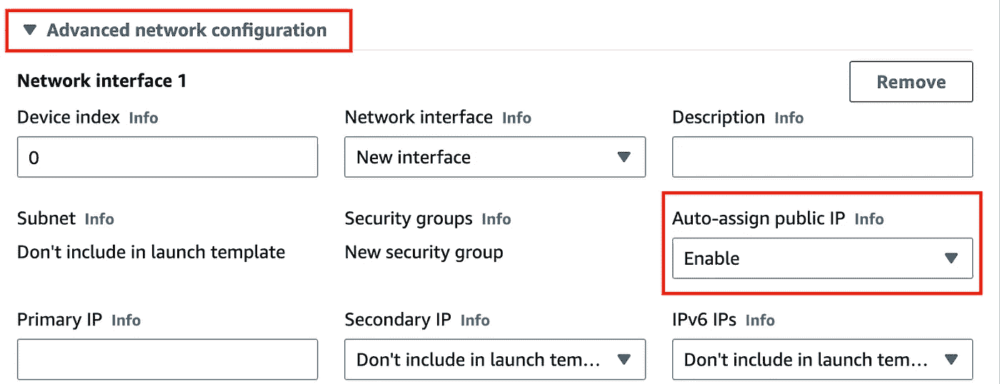

在高级网络配置下，选择启用

6.**预付款明细>用户数据:**

```
#!/bin/bash
yum update -y
yum install -y httpd
systemctl start httpd
systemctl enable httpd
EC2AZ=$(curl -s http://169.254.169.254/latest/meta-data/placement/availability-zone) 
echo '<center><h1>This Amazon EC2 instance is located in Availability Zone: AZID </h1></center>' > /var/www/html/index.txt
sed "s/AZID/$EC2AZ/" /var/www/html/index.txt > /var/www/html/index.html
```

7.点击橙色“**创建启动模板**

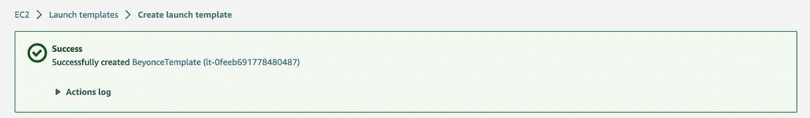

成功启动模板

在 EC2 仪表板上，我们将选择左侧底部的“**自动缩放组**，然后单击橙色的“**创建自动缩放组**”。命名你的自动缩放组，选择你刚刚制作的模板，点击**下一个**。

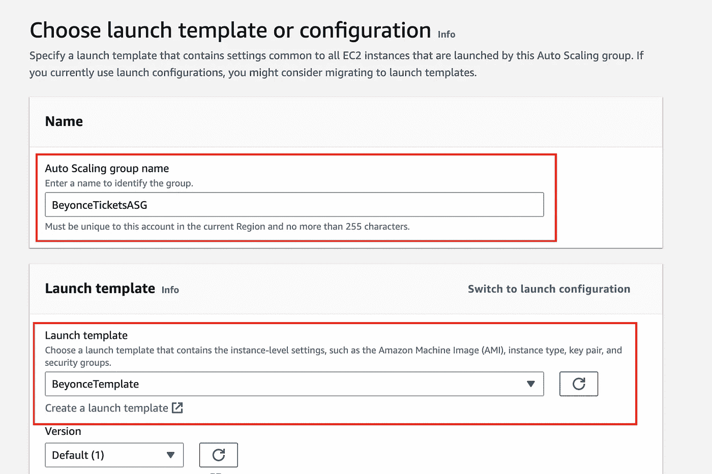

可能会选择**默认网络**，因此请确保选择您的 VPC，然后选择我们之前创建的 3 个公共子网，并单击“**下一步**”。

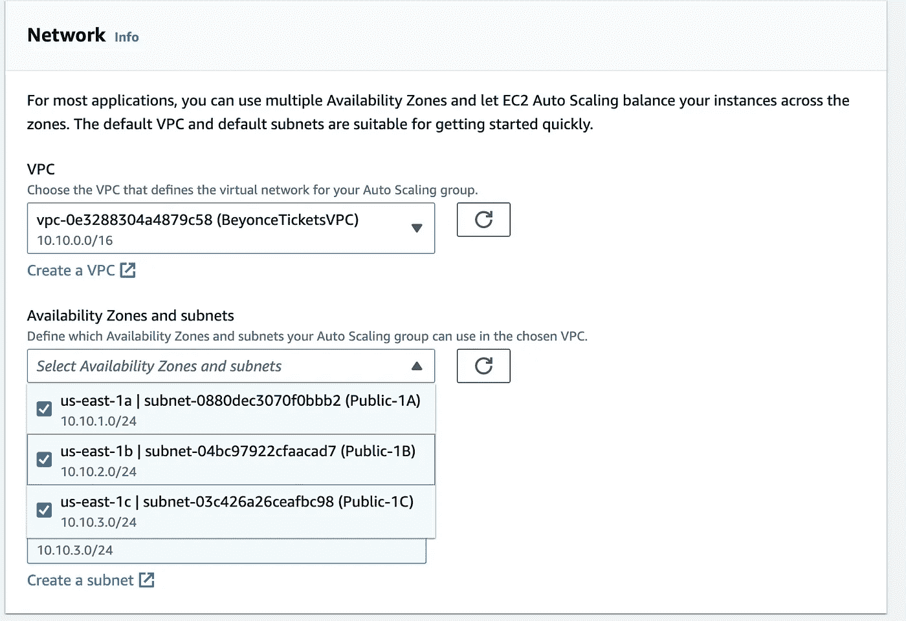

对于下一个屏幕，保留所有默认设置，点击“**下一个**”。

由于碧昂斯非常受欢迎，我们希望确保当她出售门票时，存放她的网站的 EC2 实例可以处理流量，因此最小值将设置为 2 个实例，当流量增加时，最大值将增加到 5 个。

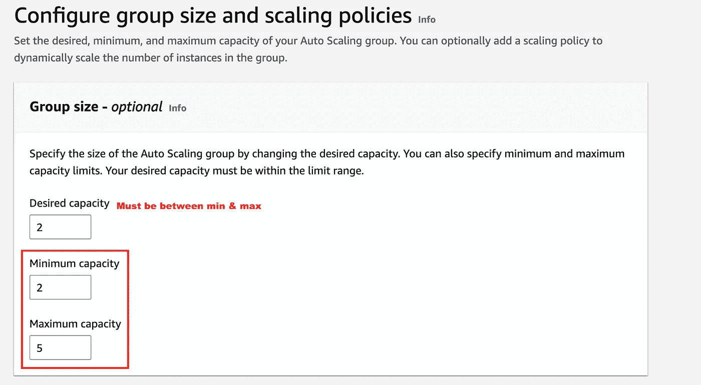

单击“next ”(下一步),直到到达最后一页，即“review ”(审查)页，然后单击“ **Create Auto Scaling group** ”(创建自动扩展组】”,您应该会看到一个确认页，如果您查看 EC2 控制面板，您会看到我们已经调配了 2 个实例，因为这是我们想要的最小数量。

我们的实例状态显示为 running，我们的状态检查也显示为绿色，但是您可以从每个实例获取公共 IP，以确保信息填充正确。

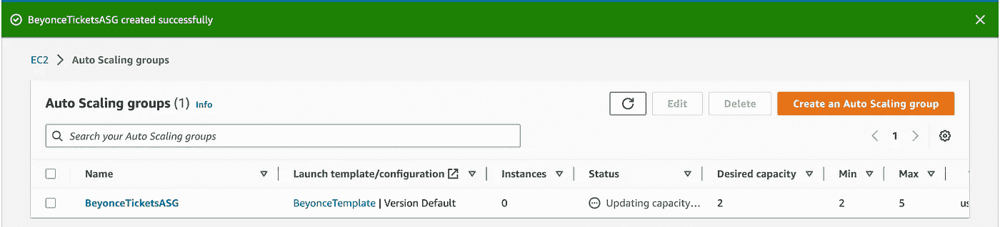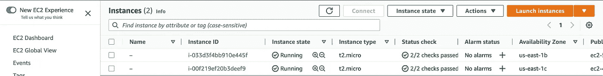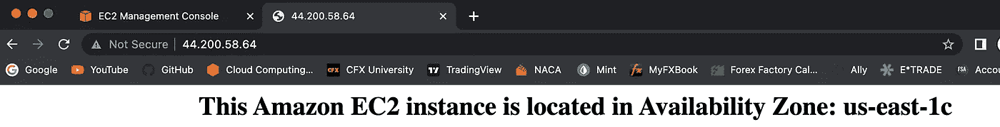

> 步骤 4:创建应用程序负载平衡器

在创建应用程序负载平衡器之前，我们需要创建一个目标组。在左侧的 EC2 仪表板中，我们将一直向下滚动到“**负载平衡**”下，选择“**目标组**”，然后单击橙色按钮“**创建目标组**”。

离开目标类型为"**实例**"选择一个目标组名，协议和端口将为 **HTTP & 80，**选择你的 VPC，然后点击"**下一步**"。

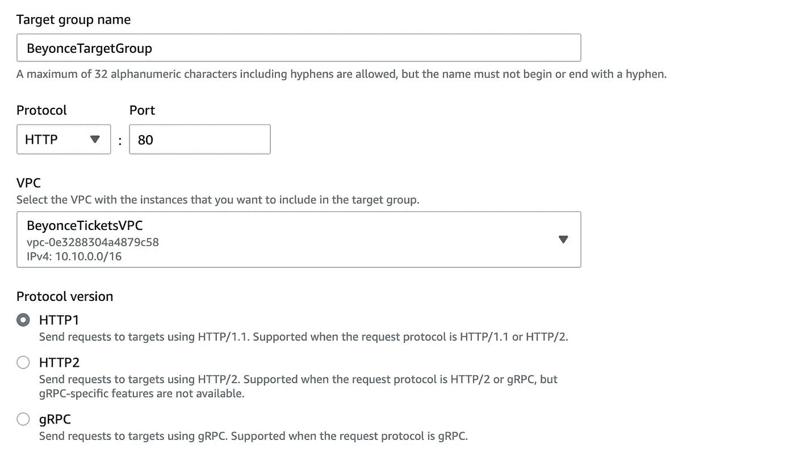

**不要选择**实例，只需选择右下角的**创建目标组**。返回到左侧的“**负载平衡**”下，选择“**负载平衡器**，并选择应用程序负载平衡器(ALB)下的“**创建**”，设置如下…

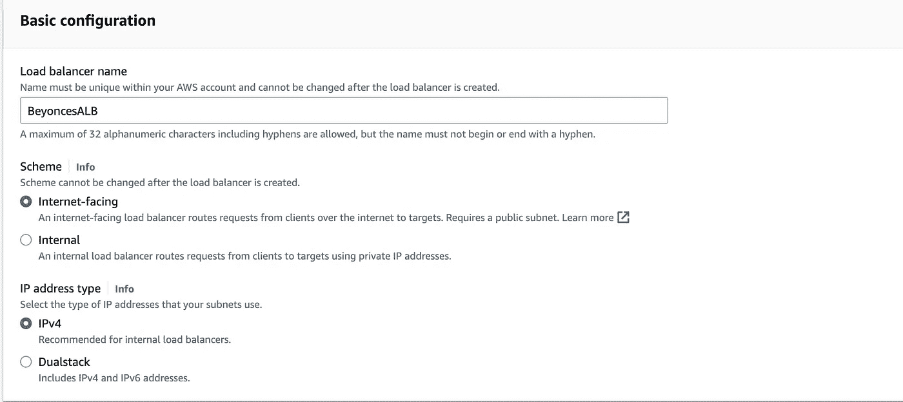

向下滚动并确保选择您的 VPC，在“mappings”下选择您的所有 3 个公共子网，删除默认设置(如果适用)并选择您创建的安全组。

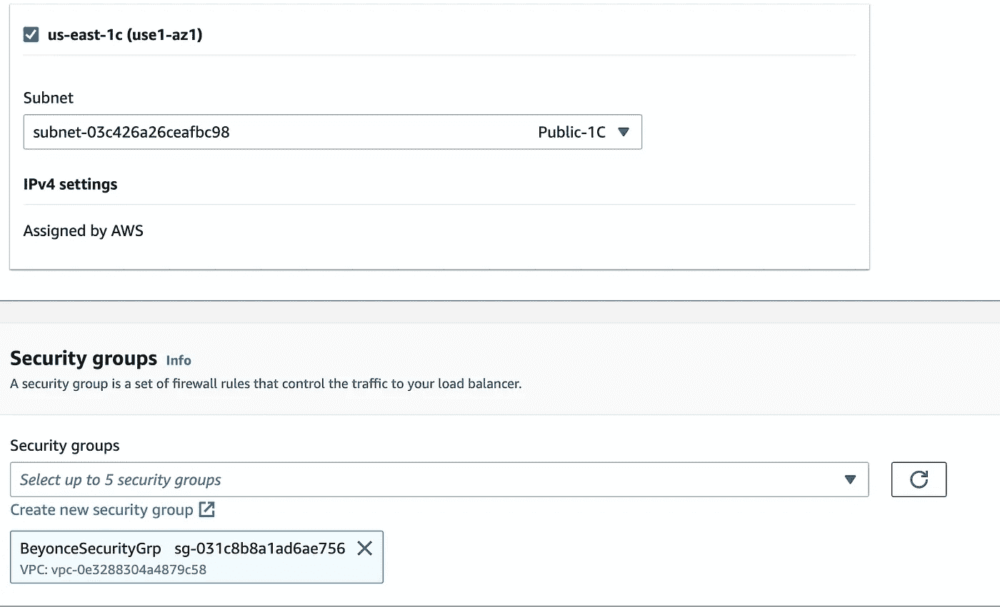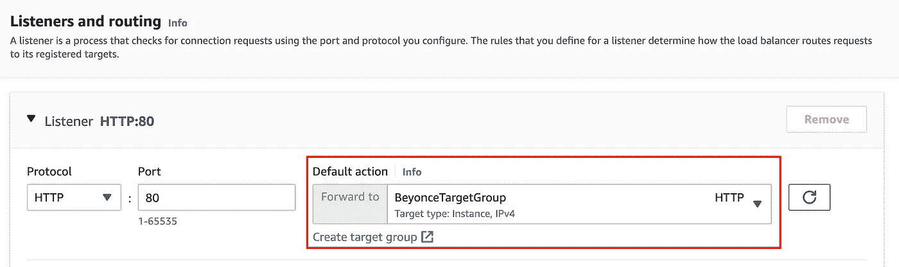

选择也在端口 80 上的目标组

选择监听器和路由部分的默认操作后，滚动到底部并选择右下角的“**创建负载平衡器**”。

我们现在需要将负载平衡器连接到自动扩展组。点击**自动缩放组**，点击您的自动缩放组名称。

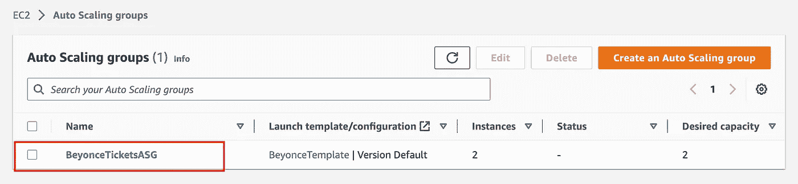

向下滚动到负载平衡并点击“**编辑**”，选择以下选项并选择更新…

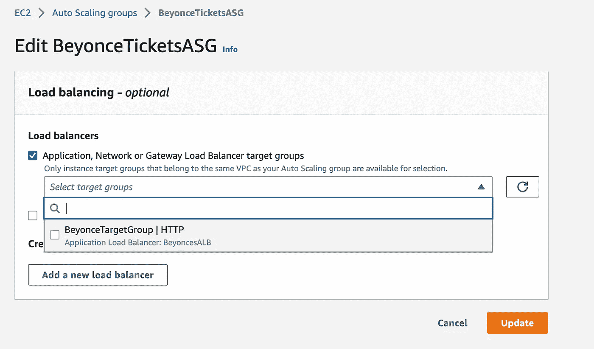

如果我们单击**目标组**并单击我们的目标组名称，我们应该看到两个正常运行的实例，如果它们不正常，则存在配置问题。

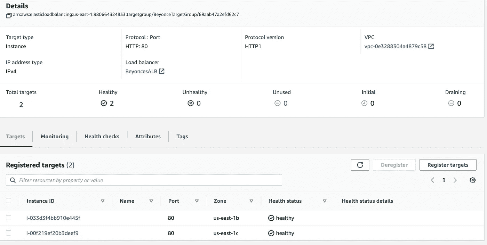

健康的实例

我知道你想知道这到底是怎么回事。**我们将模拟 EC2 实例停机，看看会发生什么。**转到 EC2 仪表板，我将有目的地终止其中一个实例。

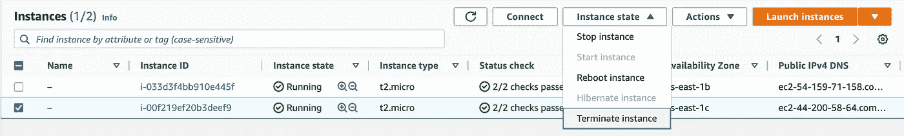

返回并选择“**自动缩放组**”，然后选择“**活动**”。

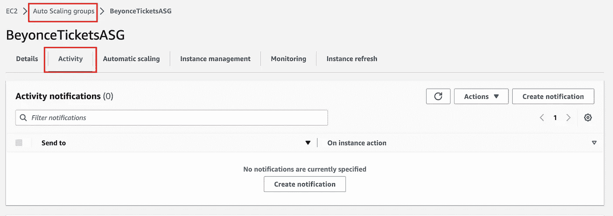

在 activity 选项卡中，它不仅告诉您在运行状况检查期间发现 EC2 实例被终止或停止后，该实例被停止服务，而且还启动了一个运行状况良好的实例来替换它。为什么？因为我们在设置中设置的最小实例数是 2 个实例一直在运行！

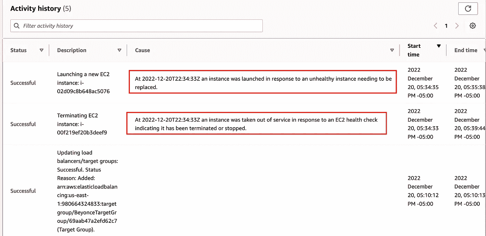

我们也可以回去检查我们的目标群体。它表明我们又有了两个健康的实例。记得我们的区域在 1b 和 1c。一旦 us-east-1c 终止，自动扩展组将提供另一个 EC2 实例，但位于 1a 区域。

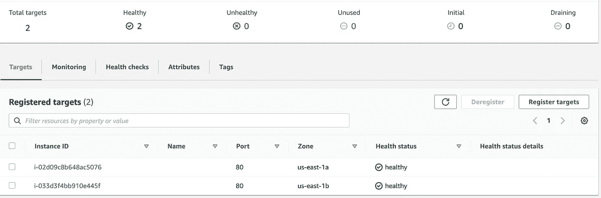

如果你已经走到这一步，非常感谢你坚持和我在一起，如果你想继续我的旅程，请在 LinkedIn 上和我联系！

谢谢你，香奈儿