# 如何从 CLI 创建自动扩展组

> 原文：<https://medium.com/nerd-for-tech/how-to-create-an-autoscaling-group-from-the-cli-4022c79c534b?source=collection_archive---------13----------------------->

感谢您的加入！本实验的目的是了解配置您的环境的不同方法，而不是仅仅依靠控制台。这个项目将记录如何从命令行界面(CLI)创建一个自动缩放组，但也将教你如何创建其他资源，如实例，安全组等所有从 CLI。要完成本实验，我们需要具备以下条件:

1.  已经通过 AWS 控制台配置的 VPC(虚拟私有云);
2.  已经有了 Linux 操作系统，下载 PuTTy 在你的 Windows 电脑上访问 Linux 或者在你的 Mac 上访问终端；
3.  已经创建了一个 IAM 角色，具有完全的管理编程和控制台访问权限(我将简要地向您介绍这一步)；
4.  下载到您的终端的 AWS CLI 和
5.  访问 AWS CLI 文档。

在我们开始这个聚会之前，让我们简单回顾一下 AWS CLI 是什么。AWS CLI 是一种工具，可帮助您在管理控制台和 API 之外管理 AWS 服务。AWS CLI 使用户能够通过 Linux、MacOS 和 Windows 远程访问 AWS 服务。只需一步安装和最少的配置，您就可以通过 Linux Shells 和 Windows 命令行远程(通过 SSH 或 PuTTy)使用 AWS 管理控制台提供的所有功能。对于 AWS 帐户中有大量数据的开发者或用户来说，这是一件大事。使用正确的命令，使用 AWS CLI 只需几秒钟就可以完成您希望完成的整个任务，而不是不断地在多个服务中搜索您的数据。

**在我们开始之前，给你一些建议:**

*   我已经把 AWS CLI 下载到我的终端上了，但是如果你没有，我建议你使用这个链接在你的终端上安装家酿软件，【https://brew.sh/】T2。一旦家酿被下载，你可以“brew 安装”各种不同的资源到你的终端，包括 AWS CLI。就像我的导师会说的，“自制是必须的。”
*   此外，在您完成本实验和未来的 AWS CLI 工作时，我强烈建议您在计算机上打开记事本应用程序，保存您的 VPC ID、子网 Id、实例 Id 和所有其他信息，以便更容易地复制和粘贴，而不是不断地寻找。我还用它来标记我的步骤到一个特定的终点，这样我就不会跳过任何重要的东西。以下是我在记事本应用程序中记下相关信息的一个典型例子:

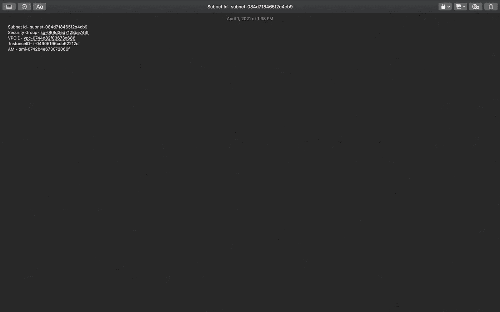

**第一步**:创建你的 IAM 角色

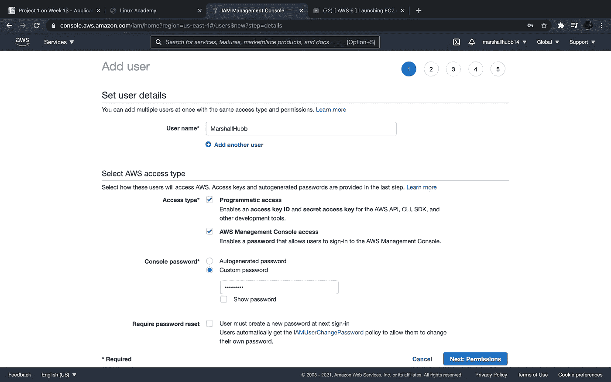

1a)对于此步骤，请转到 AWS 控制台顶部的搜索栏，搜索 IAM。然后点击“用户”链接，然后点击“添加用户”,这将把你带到这个页面。

1b)命名您的用户，然后为用户提供编程和控制台访问权限，并为他们提供自定义密码。我未选中密码重置选项，因为创建此角色的唯一目的是完成本实验。但是，最佳做法是选中该选项，以便用户可以在登录时创建自己的个人密码。完成后，检查权限，并完成接下来的步骤。

**步骤 2:** 在您的环境中创建资源

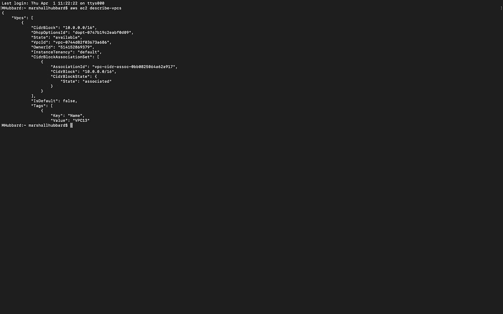

2a)一旦在您的终端上安装了 AWS CLI，请使用下面列出的以下命令来确保列出您当前的 VPC。如果是，我们可以继续使用下面的命令来创建您的环境。

**aws ec2 describe-vpcs**

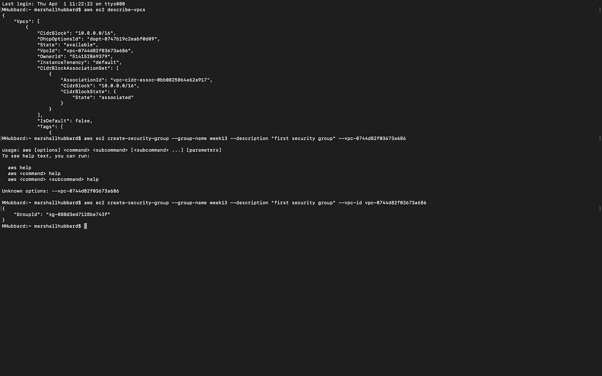

2b)使用下面列出的命令为 VPC 创建安全组。

**AWS ec2 create-security-group-group-name<name>-description "<description>"-VPC-Id<VPC Id>**

2c)列出安全组 ID 后，将其保存到记事本中。我还运行了下面列出的命令来打开安全组上的端口 22 和 80。

**AWS ec2 authorize-security-group-ingress \
—group-name my security group \
—protocol TCP \
—port<您要打开的端口> \
— cidr <您的 IP >**

*如果您需要帮助找到您的 IP 地址，亚马逊有一个网站，您可以使用“[**http://checkip.amazonaws.com/**](http://checkip.amazonaws.com/)”。

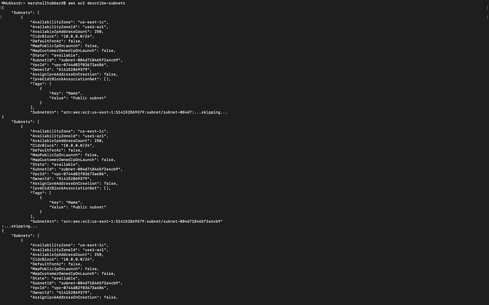

2d)“我”做的下一步是使用下面列出的命令，列出子网后，我将它们保存到记事本中。这一步是可选的，但是我强烈建议您将所有的资源标识符都放在记事本上，而不是为了一个命令而不断地查找它们。

**aws ec2 描述-子网**

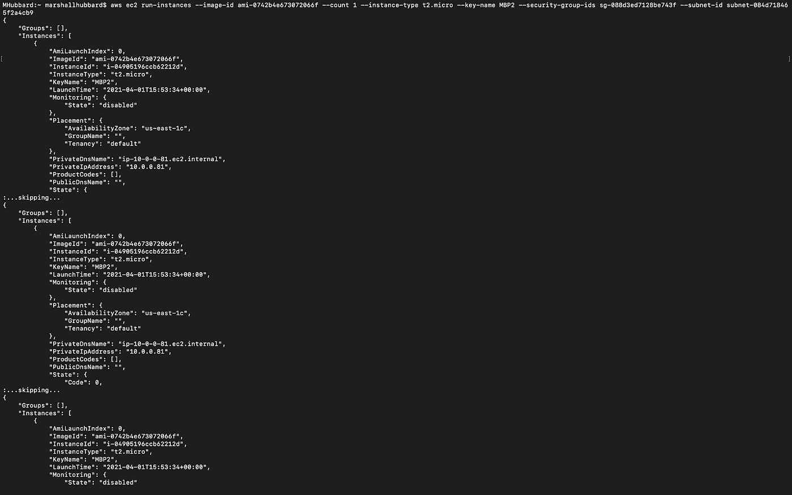

2e)然后，我使用下面列出的命令来创建我的实例并强制它运行。这就是保存先前信息的重要之处，因为现在您必须将它复制并粘贴到该命令中。对于映像 ID，我从控制台获取了 AMI2 空闲层 ID，并将其放入该命令中。

**AWS ec2 run-instances—image-id<imageid>—count 1—instance-type T2 . micro—key-name<key>—security-group-ids(<security group>)—subnet-id<subnet>**

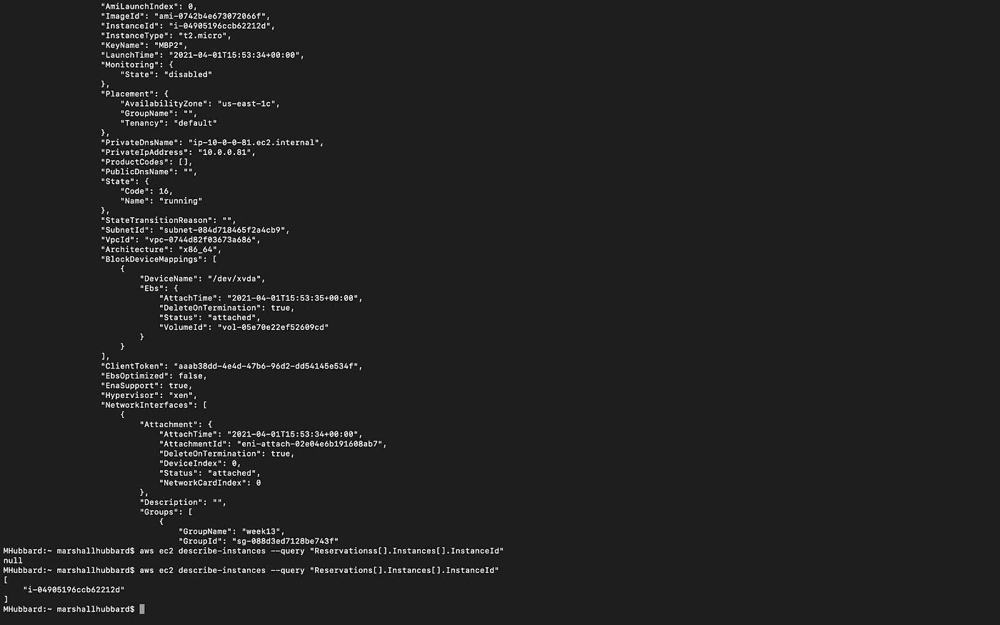

2f)然后，我使用下面列出的命令来验证我的实例是否已经启动，并用 AWS 控制台中的实例 ID 再次检查。一旦完成这一步，我们就能够继续前进。

**AWS ec2 describe-instances-query " Reservations[]。实例[]。实例 Id"**

**步骤 3:** 创建您的发布模板

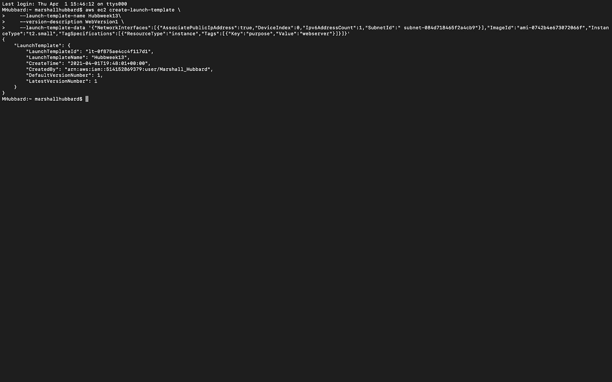

3a)在此步骤中，我们将创建发布模板。使用记事本中的信息运行下面列出的命令来启动它。此外，创建一个唯一的模板名称，因为这是下一步所需要的。一旦这一步完成，你不会像我在截图中几次看到的那样得到错误信息，哈哈，继续下一步。

**AWS ec2 create-launch-template \
—launch-template-Name<Name>\
—version-Description<Description>\
—launch-template-data ' { " network interfaces ":[{ " AssociatePublicIpAddress ":true，" DeviceIndex":0，" Ipv6AddressCount":1，" SubnetId":"subnet-7b16de0c"}]，" ImageId":" < image AMI >，" InstanceType:" "**

**步骤 4:** 创建您的自动缩放组

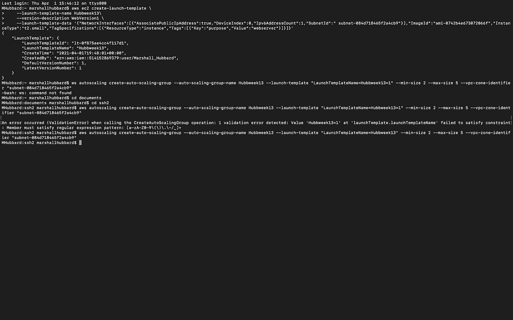

4a)好吧，不要介意这一步的错误信息，lol。运行下面列出的命令，并确保使用您刚刚创建的模板名称。使用您已经保存到记事本中的信息填写括号。一旦你顺利完成这一步，继续下一步。

**AWS auto scaling create-auto-scaling-group-auto-scaling-group-name<name>-launch-template " launch template name =<launch template name =>"-min-size<size>-max-size<size>-VPC-zone-identifier " subnet-<subnet>**

第五步:检查你的工作

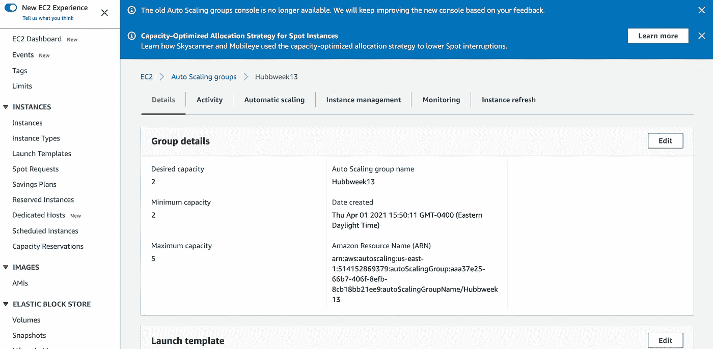

5a)在通过 CLI 运行所有命令后，我进入控制台，验证一切都已成功配置。如您所见，我的自动扩展组是根据我所需的容量创建的。

第六步:清理你的环境

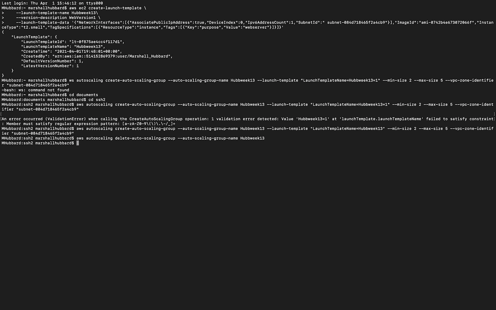

6a)我们要做的最后一件事就是破坏我们的环境，以避免任何进一步的费用。使用以下命令拆除您的 ASG:

**aws 自动缩放删除-自动缩放组-自动缩放组名称<名称>**

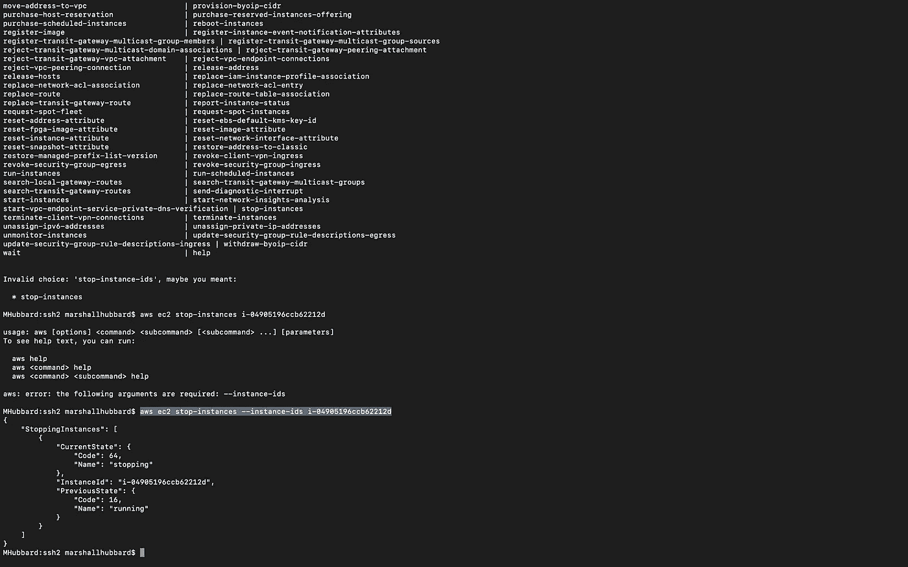

6b)从这张截图可以看出，下一个命令花了一些时间才弄明白，哈哈。运行下面列出的命令，等待它停止后再移动。

**aws ec2 停止实例—实例标识<实例标识>**

6c)实例停止后，运行命令终止实例。

**aws ec2 终止实例—实例 ID<实例 ID >**

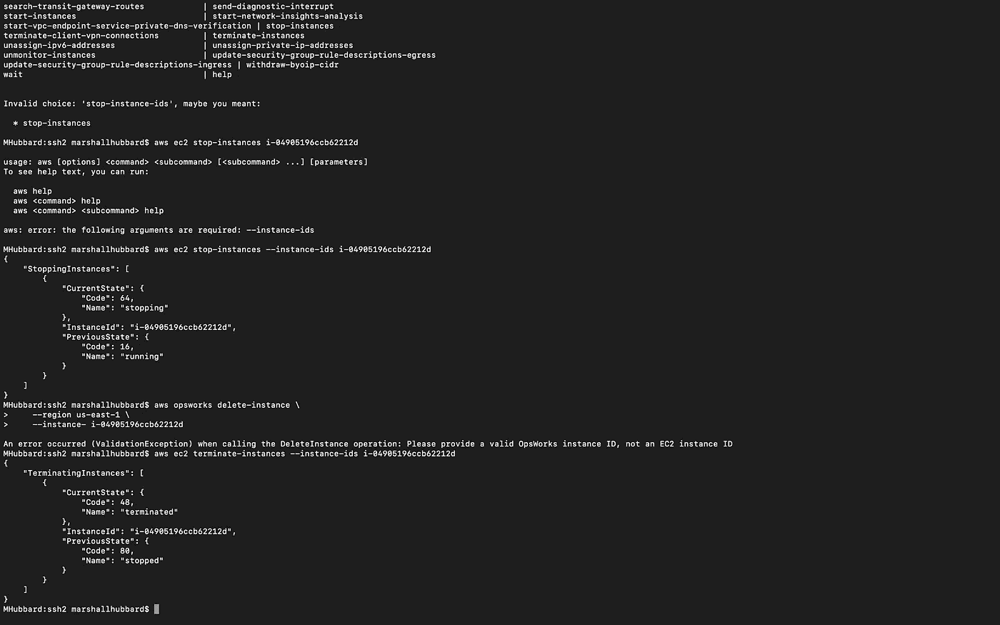

6d)拆除我们创建的环境的最后一步是运行下面列出的命令来完全终止您的实例。一旦这一步完成，你的环境将和我的环境一样清晰，就在真实的 VPC 之外。我没有删除我的 VPC，因为在另一个项目中使用了同一个 VPC。但是，如果您想要删除您的，您可以查看 AWS CLI 文档来删除您的资源、Internet 网关、安全组、路由表，然后删除 VPC 本身。每个命令都可以在其单独的 AWS CLI 文档页面中找到。

**aws ec2 终止实例—实例标识<实例标识>**

我的实验室到此结束。**感谢阅读！**