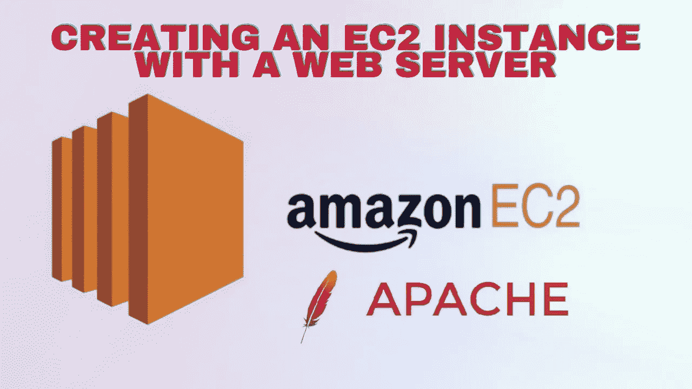
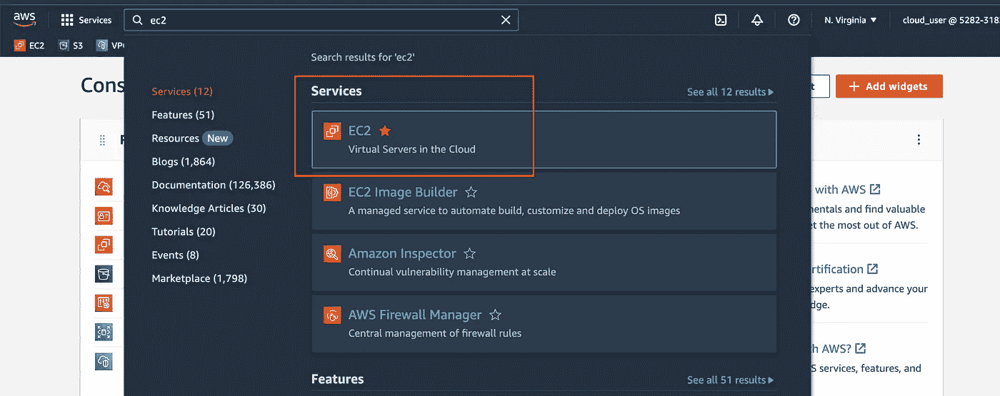
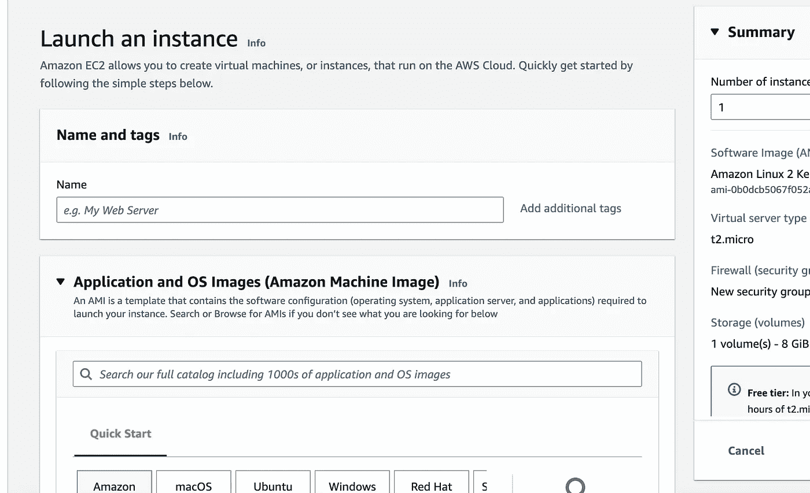
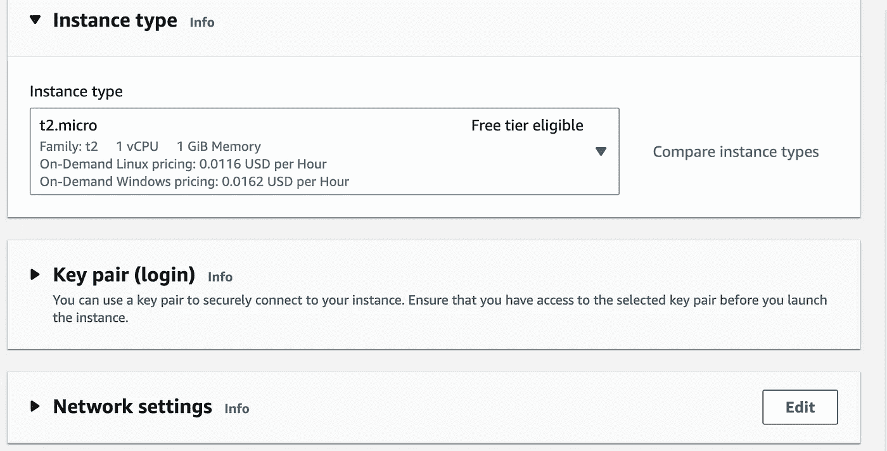
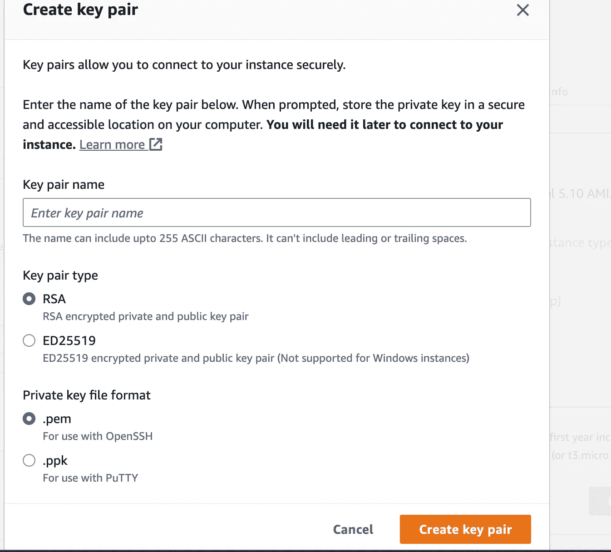
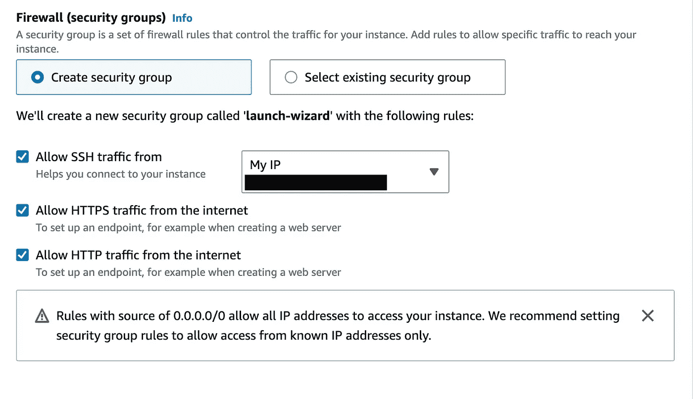
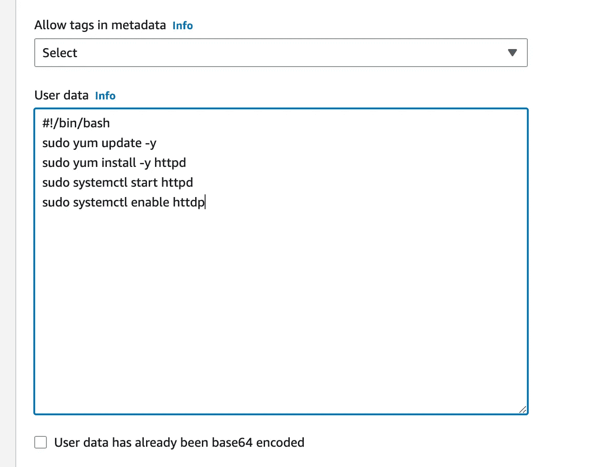
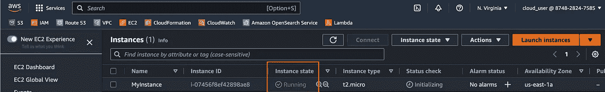
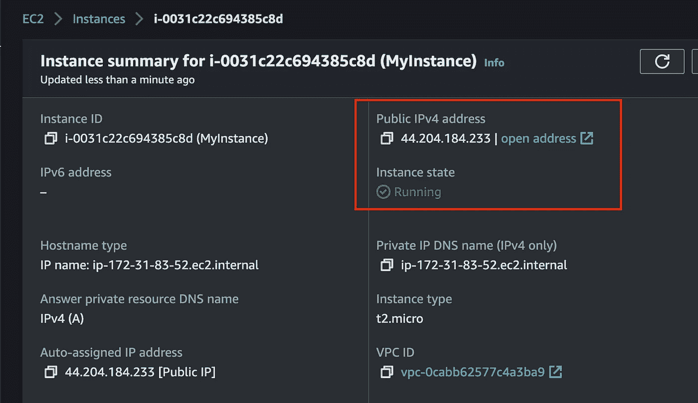
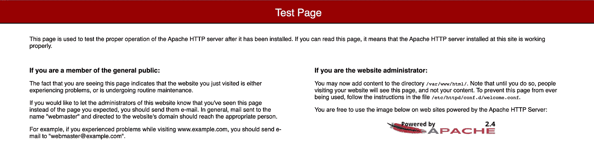

# 如何一次性创建 EC2 实例和 Web 服务器！

> 原文：<https://medium.com/nerd-for-tech/how-to-create-an-ec2-instance-and-a-web-server-in-one-shot-8bd65a2ba2b4?source=collection_archive---------1----------------------->



您可以用 web 服务器创建一个 EC2 实例，几乎不需要任何时间。有时，您可能希望实例启动时已经包含信息，AWS 允许这是一项简单的任务。首次调配实例时，您可以在用户数据字段中输入不同的代码，并在启动时填充这些代码，我们将详细介绍具体的操作方法。

**你需要什么来开始:**

🔹Linux 命令的基本知识

🔹亚马逊网络服务账户

首先，我们将访问亚马逊管理控制台，并创建我们的 EC2 实例，您只需在搜索栏中搜索“ **EC2** ，然后单击它即可进入仪表板。



在 EC2 仪表板上，我们将向下滚动页面，在左侧您应该会看到一个橙色按钮，指向“**启动实例**”。点击它。



您要做的第一件事是命名您的 EC2 实例。它可以是像“ **MyInstance** 这样简单的东西，然后你可以选择任何你喜欢的操作系统，但要确保它是免费的。

**请注意**如果您选择使用不同的操作系统，请注意安装 web 服务器的代码可能会略有不同。Debian 和 Ubuntu 系统的安装不同于从 Red Hat 派生的 Linux 系统。

将**实例类型**保留为符合 t2.micro 的自由层



接下来生成密钥对…



命名您的密钥对，将密钥对类型保留为 **RSA** ，将私钥文件格式保留为**。pem** 并点击橙色按钮“**创建密钥对**”。

**注意:** MAC 用户，将文件拖到你的桌面或系统上的某个地方。不要让它下载在 finder 窗口中，因为系统将无法找到它。

在“网络设置”下，我们将选择以下选项…



安全设置

在创建实例之前，我们要做的最后一件事是将创建 web 服务器的代码输入到**用户数据字段**中。

如果您向下滚动到**高级部分，高级部分中的**将一直向下滚动到用户数据。这是我们将要输入代码的地方。

*因为我们正在安装一个 apache web 服务器，所以代码看起来如下…*



```
#!/bin/bash
sudo yum update -y
sudo yum install -y httpd
sudo systemctl start httpd
sudo systemctl enable httpd
```

在右下角只需选择“**启动实例**”，您应该会得到一条成功消息…


> 步骤 2:测试您的公共 IP 地址

当我们转到 EC2 仪表板中的 Instances 页面时，我们希望确保我们的实例状态不再是 pending，而是 running。



单击实例 ID，您应该会看到一个显示您的公共 IP 地址的窗口。



那是你的公共 IP 地址！点击它并测试它，你应该得到 Apache 测试页面！



恭喜你！那太简单了！

感谢您远道而来，如果您想继续关注我的旅程，请通过 [LinkedIn](https://www.linkedin.com/in/chaneljemmott/) 与我联系！

谢谢你，香奈儿