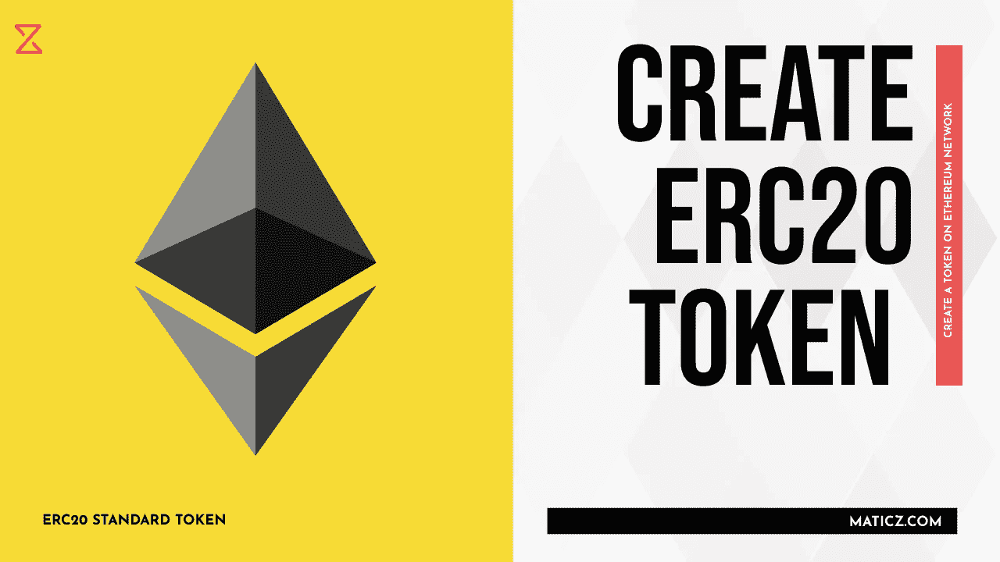

# 如何创建 ERC20 令牌？

> 原文：<https://medium.com/nerd-for-tech/how-to-create-an-erc20-token-acc34098eb43?source=collection_archive---------2----------------------->

创建一个 ERC20 令牌

以太坊区块链是创建加密令牌的最佳网络。许多商业人士开始在市场上推出 ERC20 标准令牌。那你呢。

**在制作你的以太坊 ERC20 代币之前，你应该了解一些关于以太坊的趣事，以及如何制作一个 ERC20 代币。我们开始吧！**

以太坊是世界上第二大加密货币，被称为以太(ETH)。以太坊网络，支持在自己的网络上构建智能合约和 ist 应用程序。它也被称为本国货币。Eth 网络能够存储事务和在智能合同下运行的虚拟机。

ERC20 标准令牌用于在以太坊区块链网络上创建和发布智能合约。制造者、基本注意力令牌、占卜者和 OMG 加密货币是在 ERC20 标准令牌中使用的最佳示例

**每个密码创业者都需要了解 ETH 网络**

>>以太币令牌可以在智能合约代码中创建，智能合约代码负责创建以太币令牌、管理交易以及跟踪交易者的交易余额。

>>智能合约一旦部署，就不能再更改。

>>每个代币合同都可以与其他合同完全不同

> > ERC 代表以太坊征求意见，20 是他们分配给一个提案的数字，该提案将创建一些结构。

>>它表示智能合约应该实现的 6 个强制功能和 3 个可选功能。

>>可选，指示，令牌名称，符号，您可以管理，以及多少小数它支持您的令牌。

>>强制功能出现在创建令牌时的一些技术术语中。

# [如何创建 ERC20 令牌？](https://maticz.com/how-to-create-erc20-token)

*创建以太坊 ERC20 代币的前 7 个步骤。*

**步骤(I)** 首先，你要决定你要在市场上供应的代币总数

**步骤(II)** 设计您的加密货币令牌符号

**步骤(III)** 设置您的令牌名称

**步骤(IV)** 编写智能合约代码，用于创建由以太网供电的令牌

**步骤(V)** 进入测试和部署流程。

**步骤(VI)** 完成部署方法后，您可以列出您的加密货币令牌。

**步骤(VII)** 在令牌组学市场中预测您的加密令牌价值。

以上是创建以太坊 erc20 令牌的步骤。如今，以太坊 ERC 代币成了镇上的热门话题。因此，许多商业人士正在以太网上创建一个加密令牌，增强他们的加密业务。 **Maticz** 是领先的 [**令牌开发公司**](https://maticz.com/token-development) ，在全球范围内提供最顶级的令牌开发服务。在一小时内创建您自己的以太坊令牌。