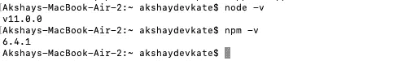
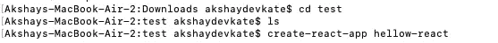
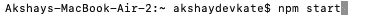

# 如何在 macOS 上创建并运行 react.js 应用

> 原文：<https://medium.com/nerd-for-tech/how-to-create-and-run-react-js-app-on-macos-a92115f9ee31?source=collection_archive---------6----------------------->

[Firos nv](https://unsplash.com/@firosnv?utm_source=medium&utm_medium=referral) 在 [Unsplash](https://unsplash.com?utm_source=medium&utm_medium=referral) 上的照片

本文将带您逐步了解在 macOS 上运行 react.js 应用程序的指南。React 是一个基于浏览器的前端库，由脸书创建和维护。这个库和大多数其他库一样，可以在 Apache 等 web 服务器上运行，也可以在 PHP 或 Rails 等后端上运行。它有一个 ReactDOM 库，是为使用浏览器的 DOM 而设计的，它是为使用 web 浏览器而创建的。然而，它现在已经被改进为 React Native，这是一个被 iOS 和 Android 开发人员广泛使用的跨平台框架。

**指数**

1.  安装 node.js 和 npm
2.  安装 IDE
3.  安装 React.js
4.  创建第一个 react.js 应用程序

*   **安装 node.js 和 npm**

Node.js 是一个跨平台的运行时环境，用于构建免费开源的服务器端和网络应用程序。Node.js 应用程序用 JavaScript 编写，使用 Node.js 运行时在 OS X、Microsoft Windows 和 Linux 上运行。Node.js 还附带了一个大型 JavaScript 模块库，这极大地方便了 Node.js web 应用程序的构建。NPM 代表节点包管理器。作为开发人员，你需要一些外部库或依赖来支持你的项目。Node.js 是一个 JavaScript 运行时，允许 JavaScript 在浏览器之外执行。在命令行上，底层节点包管理器(NPM)用于将框架和库安装到您的项目中，如 React.js。您可以从以下网站下载并安装 node，也可以使用终端直接安装。使用“终端”,您需要在 mac 上安装 homebrew。

 [## 下载| Node.js

### Node.js 是基于 Chrome 的 V8 JavaScript 引擎构建的 JavaScript 运行时。

nodejs.org](https://nodejs.org/en/download/) 

点击 macOS 安装程序开始下载。一旦你下载了。pkg 文件。打开它。这将启动 node.js 安装程序。请看[博客](/nerd-for-tech/how-to-download-and-install-node-js-and-npm-on-macos-e58ae1506d71)的逐步指南。

安装 node.js 和 npm 后，通过在终端中键入以下命令来测试安装。

node -v(用于检查节点版本)

npm -v(用于检查节点程序包管理器版本)

*   **安装 IDE**

IDE(集成开发环境)是一个工具集合，它使编写程序变得更加容易。它是一个软件应用程序，为计算机程序员提供完整的 Web 开发功能。IDE 中通常包括源代码编辑器、构建自动化工具和调试器。利用 IDE 的最好的方面是你能多快和多有效地编码。ide 的另一个奇妙的特性是智能感知自动完成，这使得编码变得轻而易举。因为 IDE 有内置的编译器，所以由 IDE 来把程序翻译成机器码或者字节码。它能帮你节省很多时间。有各种 IDE 可供使用，Visual studio 代码在许多 web 开发人员中很流行。您可以通过以下链接下载 Visual Studio 代码 IDE。

 [## 下载 Visual Studio 代码- Mac、Linux、Windows

### Visual Studio 代码是免费的，可以在您喜欢的平台上获得——Linux、macOS 和 Windows。下载 Visual Studio…

code.visualstudio.com](https://code.visualstudio.com/download) 

*   **安装 react.js**

React 是创建可重用组件的优秀框架，这些组件可用于构建复杂的用户界面。NPM 是一个非常棒的工具，可以创建可重用的模块，并让全世界的开发人员在线使用。

只需在终端中运行以下命令，就可以安装 react.js。

> sudo npm 安装-g 创建-反应-应用程序

安装完成后，你可以在终端输入以下命令来检查你的反应版本

> 创建-反应-应用程序--版本

*   **创建首个 react 应用**

您可以使用以下命令创建第一个 react 应用程序(首先，您需要导航到要创建应用程序的文件夹)

切换到项目目录，使用 npm start 命令运行应用程序，如下所示。

npm start 命令启动 webpack 开发服务器，然后完成构建过程，打开一个浏览器窗口，并加载应用程序的地址，默认情况下是 http://www.localhost3000.org/的。