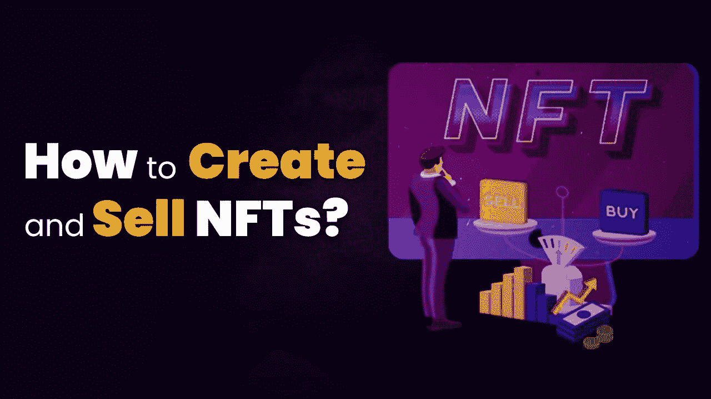

# 如何创造和销售 NFT？

> 原文：<https://medium.com/nerd-for-tech/how-to-create-and-sell-nft-49e12c83f0fe?source=collection_archive---------7----------------------->

如何创造和销售 NFT

许多艺术家和设计师正在寻找一种新的方式来创造和销售他们自己的 NFT。创建自己的 NFT(GIF 或图像)很容易，不需要任何秘密知识。NFT 艺术品可以用来制作收藏品，如数字交易卡。

# 如何创建 NFT

以太坊，BSC，多边形，创，等等。每个区块链都有自己的 NFT 令牌标准、兼容的钱包服务和市场。例如，如果您在 BSC 上创建 NFT，您可以在支持 BSC 资产的 NFT 平台上销售它们。所以你不会被允许在像基于以太坊的 NFT 市场的 OpenSea 上出售它们。

以太坊拥有一个全面的 NFT 生态系统，这里是你在以太坊区块链上 [**创建自己的 NFT**](https://www.clarisco.com/nft-token-development) 艺术品、音乐或视频所需的东西:

*   ERC-721 是基于以太坊的 NFT 令牌标准，支持以太坊钱包，如元掩码、信任钱包或比特币基地钱包。
*   足够付油费的乙醚。你可以从你的比特币基地钱包里用美元、英镑和其他法定货币购买乙醚。否则，你将不得不从加密货币交易所购买乙醚。

一旦你有了这些，你就可以把你的钱包连接到一些以 NFT 为中心的平台，上传你想制作成 NFT 的图片或文件。

以下是基于以太坊的 NFT 市场

*   OpenSea
*   稀有的
*   可铸造的

允许您创建自己的 NFTs，但您必须首先在网站上注册为列表艺术家，这些市场在右上角有一个“创建”按钮。

让我们来看看 OpenSea 最大的基于以太坊的 NFT 市场的工作流程。

点击创建按钮，选择我的收藏，然后点击创建按钮。将出现一个窗口，上传您的作品或文件，添加名称，并包括描述。

这基本上就是创建一个文件夹来存储新创建的 NFT。

现在你已经准备好创建你的第一个 NFT 了。单击“添加新项目”按钮，用您的钱包为另一封邮件签名。

将会打开一个新窗口，您可以在其中上传您的 NFT 照片、音频、GIF 或 3D 模型。

OpenSea 和其他市场允许您添加特殊的特征和属性，以增加 NFT 的独特性和稀缺性。可以向创建者添加仅购买者可访问的可解锁内容。它可能是允许您访问某些服务、折扣代码或联系信息的密码。

完成后，点击底部的“创建”。为了确认 NFT 的创作，你现在应该可以看到你收藏的艺术品了。

# 如何销售 NFT

您需要在您的收藏中找到您的 NFT，然后点击它们找到“出售”按钮。这将打开一个定价页面，您可以在其中设置销售条款，以运行固定价格或拍卖。

您可以出售您的 NFT 来换取常见的加密货币，如以太和其他 ERC-20 代币。然而，一些 NFT 平台仅支持它们被开发的区块链的本地令牌。

点击编辑按钮，在 OpenSea 上编辑收藏图片。你可以用版税编程，也可以选择在出售 NFT 时获得哪个 ERC-20 代币。

每当一项资产被出售给另一个人时，NFT 创作者就可以获得版税。这为艺术家和其他内容创作者创造了持续一生的被动收入流。

有时，在市场上列出 NFT 需要付费。尽管并非每个平台都是如此，但在创建 NFT 时，您应该注意这一点。

# **如何购买 NFT**

在你匆忙购买 NFT 之前，有三件事要记住。

*   您想从哪个市场购买 NFT？
*   连接平台买 NFTs 需要哪个钱包？
*   要完成交易，你需要哪种加密货币来支付你的钱包？

## **总结**

NFT 继续流行。2022 年前五天，NFT 在 OpenSea 上的销售额超过 7 亿美元。这主要是由于无聊猿游艇俱乐部和突变猿游艇俱乐部的收藏。有更多的区块链竞争提供更好的 NFT 服务。选择一个，现在是创造和销售 NFT 的好时机。