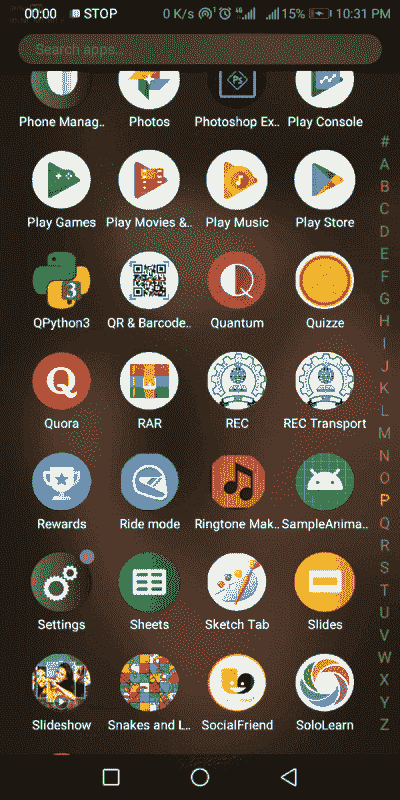
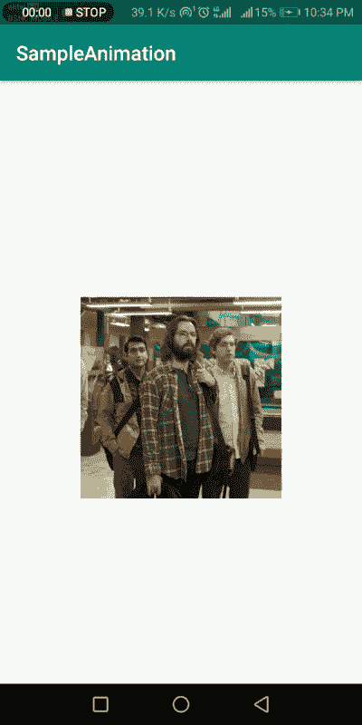

# 如何为你的 Android 应用创建动画和过渡

> 原文：<https://medium.com/nerd-for-tech/how-to-create-animations-and-transitions-for-your-android-app-2bdd31e533a3?source=collection_archive---------0----------------------->

> 动画不是运动的绘画艺术，而是运动的艺术。—诺曼·麦克拉伦

**动画**和**过渡**改善用户体验，并在各种活动之间过渡时提供平滑度。在这篇文章中，让我们看看如何在 android 中创建动画/过渡。

首先，我们需要组织文件结构来放置与动画相关的文件。所以，创建一个名为 **anim 的新资源目录。**

现在，让我们看看如何在活动之间切换时创建过渡效果。所以，现在右键点击 **anim** 目录，创建一个新的*动画资源文件*。将文件命名为 **fadein.xml** 。

此外，我们需要创建另一个名为 **fadeout.xml.** 的动画资源文件

现在，我们可以简单地使用这些动画资源文件来创建淡入和淡出过渡效果，如下所示:

在调用 **setContentView()** 方法之前，将调用**overridePendingTransition()**方法。

所以，现在当活动启动时，可以清楚地看到*过渡*。

所以，完成了过渡效果！现在，让我们深入一些可以应用于活动元素的动画。

例如，我们可以为**按钮或文本视图**创建动画中的*滑动，也就是说，它们在活动启动时滑动。此外，我们可以创建浮动动画，应用于**按钮或图像视图**。所以，让我们开始吧！*

> 动画就是想象！

再次右键单击 **anim** 资源目录，创建一个名为 **animation.xml** 的新资源文件。

因此，我们可以在动画中进行滑动，并应用于任何元素，如按钮。让我用**来说明一下**。

在动画中滑动

现在，让我们继续看看如何创建浮动动画效果。

创建一个名为 **floatinganimation.xml.** 的新动画资源文件

现在，上面的动画可以应用于按钮和 ImageViews 等元素。参见下图所示的**插图**:

浮动动画

您能在 ImageView 上看到浮动效果吗？惊人的正确！

如果您有任何疑问，请在下面的**评论**部分发帖。在 [LinkedIn](https://www.linkedin.com/in/vaidhyanathansm/) 上与我联系。此外，如果你想看看我开发的惊人的应用程序集，别忘了查看[谷歌 Play 商店](https://play.google.com/store/apps/developer?id=Programmers+Gateway)。

更多了解我[这里](https://vaidhyanathansm.tech/)。

话虽如此，感谢阅读我的文章和*快乐编码！*