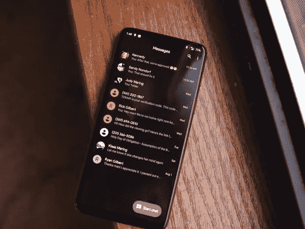

# 如何在 Android 中创建黑暗主题

> 原文：<https://medium.com/nerd-for-tech/how-to-create-dark-theme-in-android-55a84c9a3caa?source=collection_archive---------1----------------------->

在他们使用的任何应用程序中，大多数人更喜欢深色主题而不是浅色主题。所以，在这篇文章中，我将带你经历为你的 *android 应用*创建一个黑暗主题的过程。

所以，让我们开始吧！

我们希望让用户能够轻松地在亮暗模式之间**切换**。因此，我们将在**设置活动**中为此创建行动号召。

首先打开/创建您的 **activity_settings.xml** 来设计您的活动。

现在我们需要在 **styles.xml** 中为黑暗模式设置样式主题，如下所示:

另外，请参考下面给出的用于创建黑暗主题的 **colors.xml** 文件的*片段*:

现在，当点击开关“**黑暗模式**时，它应该在黑暗模式和光明模式之间切换。为此，让我们前往 SettingsActivity.java。此外，每次再次打开应用程序时，都需要反映用户的偏好。所以，我们需要创建**共享参考**。创建一个名为“ **SharedPrefs** 的类，如下所示:

现在，在**SettingsActivity.java**文件中，我们实现了我们的**拨动开关**，如下所示:

要为每个活动应用主题*，在调用 **setContentView()** 之前，转到该活动并在 **onCreate()** 方法中键入以下代码:*

首先创建一个类 **SharedPrefs** 的对象:

然后在 **onCreate()** 方法内部，我们需要检查*用户的首选项*中是否设置了黑暗模式。

所以，通过这种方式你可以为你的 android 应用程序实现黑暗主题。

如果您有任何疑问，请在下面的**评论**部分发帖。在 [LinkedIn](https://www.linkedin.com/in/vaidhyanathansm/) 上与我联系。此外，如果你想看看我开发的惊人的应用程序集，别忘了查看谷歌 Play 商店。

更多了解我[这里](https://vaidhyanathansm.tech/)。

话虽如此，感谢阅读我的文章和*快乐编码！*