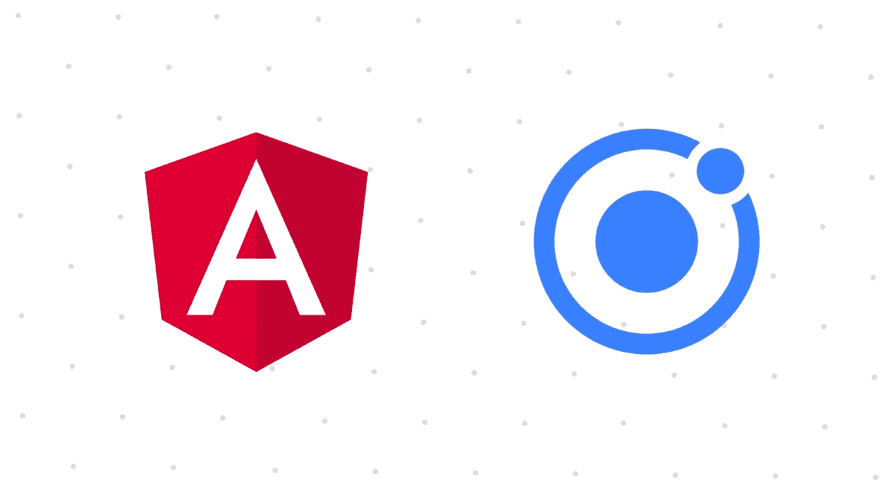

# 如何用角度创建离子工程

> 原文：<https://medium.com/nerd-for-tech/how-to-create-ionic-project-with-angular-af5a64aa4593?source=collection_archive---------0----------------------->

# **什么是离子框架？**

Ionic framework 是一个开源 UI 工具包，用于使用 HTML、CSS 和 JavaScript 等 web 技术构建高性能、高质量的**移动应用**、桌面应用和渐进式 **web 应用**。它允许开发人员构建一次，然后在任何地方运行。

Ionic 框架主要关注前端用户体验或 UI 交互，它处理你的应用程序的所有外观和感觉。它简单易学，可以与其他库或框架如 **Angular** 、 **Cordova** 等集成。它也可以作为一个独立的没有前端框架使用一个简单的脚本包括。

官方说法是，Ionic 框架已经集成了 **Angular、React** 和 **Vue。**

# **如何安装 Ionic 框架？**

Ionic 应用程序主要是通过 Ionic 命令行实用程序创建和开发的。Ionic CLI 是首选的安装方法，因为它提供了广泛的开发工具和帮助选项。它也是运行应用程序并将其连接到其他服务(如 Ionic AppFlow)的主要工具。

要安装 Ionic，请确保您的系统中已经安装了 Node JS。如果没有，那么你可以[点击这里](https://nodejs.org/en/)下载并安装 node。

安装节点后，您可以打开您的终端/命令提示符并开始。

要使用 npm 安装 Ionic CLI:

> $ npm install -g @ionic/cli

如果之前安装了 Ionic CLI，由于软件包名称的更改，需要将其卸载

> $ npm 卸载-g ionic
> 
> $ npm install -g @ionic/cli

# **启动一个 app**

使用一个预制的应用程序模板创建一个 Ionic 应用程序，或者使用一个空白模板重新开始。三种最常见的启动器是*空白*启动器、*标签*启动器和*侧菜单*启动器。

我们将创建一个*选项卡*菜单的 Ionic app。为此，请在您的终端中键入:

> $ ionic 开始我的应用选项卡

运行此命令后，它会要求您选择一个 JavaScript 框架，我们将选择 *Angular。*

下一个问题是将*电容*与您的应用集成。您可以选择*是*或*否*(取决于您的要求)。现在我们将选择*号*

# **发球离子 app**

设置完成后，您现在可以使用 ionic 应用程序了。

> $ cd 我的应用程序
> 
> 爱奥尼亚发球

一旦您的项目编译成功，您的浏览器将在 [*http://localhost:8100 打开。*](http://locahost:8100.)