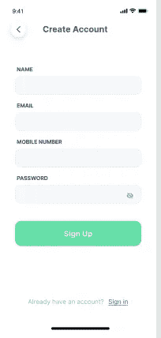
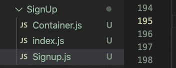

# 如何在 react native 中创建注册用户界面

> 原文：<https://medium.com/nerd-for-tech/how-to-create-signup-ui-in-react-native-867419114689?source=collection_archive---------15----------------------->

嗨，在本教程中，我将指导你如何在 react native 中创建注册用户界面。

我们需要做什么？



我总是喜欢创建一个文件夹，并在其中创建这些文件。



所以在 index.js 中，我写道

```
export {default} from ‘./Container’;
```

然后我创建 container.js

这个 container.js 是一个基于类的组件。

```
import React, { Component } from “react”;import SignUpComponent from “./Signup”;export default class ContainerSignUp extends Component {render() {return <SignUpComponent />;}}
```

注册. js

这是基于功能的组件。

```
import React, { useState } from “react”;import {Text,View,Image,Keyboard,ScrollView,KeyboardAvoidingView,TouchableOpacity,ImageBackground,TextInput,Platform,} from “react-native”;import { DFont, DHeight, DWidth } from “../../../common/SizeUtils”;import { KeyboardAwareScrollView } from “react-native-keyboard-aware-scroll-view”;import { AppColors } from “../../../common/Colors”;import MyHOC from “../../../component/TouchableView”;import { goBack, navigate } from “../../../navigation/NavigationService”;import AppHeader from “../../../component/AppHeader”;import VectorIcon from “../../../component/VectorIcon”;import { getScreenWidth } from “../../../common/Utils”;export default function Signup() {const [eyeIcon, setEyeIcon] = useState(true);return (<KeyboardAwareScrollViewkeyboardShouldPersistTaps={“handled”}// contentContainerStyle={{flex: 1}}style={{ flex: 1, backgroundColor: AppColors.WHITE }}><AppHeaderonBackPress={() => goBack()}isBackIconRequiredisHeaderTitleRequiredheaderTitle={“Create Account”}/><View style={{ flex: 1 }}>{/* <View style={{}}> */}<Viewstyle={{marginTop: DHeight(70),// justifyContent: ‘center’,width: “80%”,alignSelf: “center”,}}><Text style={{ fontWeight: “700”, marginLeft: DWidth(7) }}>{“NAME”}</Text></View><Viewstyle={{width: “80%”,marginTop: DHeight(8),alignSelf: “center”,flexDirection: “row”,}}><TextInputautoFocusautoCapitalize={false}// value={this.state.userName}placeholderTextColor={“black”}// onChangeText={(userName) =>// this.formatePhoneNumber(userName, “username”)// }style={{padding: 15,width: “100%”,backgroundColor: “#F7F8F9”,borderRadius: 10,fontSize: 18,}}/></View><Viewstyle={{marginTop: DHeight(8),// justifyContent: ‘center’,width: “80%”,alignSelf: “center”,}}><Text style={{ fontWeight: “700”, marginLeft: DWidth(7) }}>{“EMAIL”}</Text></View><Viewstyle={{marginTop: DHeight(7),width: “80%”,alignSelf: “center”,flexDirection: “row”,}}><TextInputautoFocusautoCapitalize={false}// value={this.state.userName}placeholderTextColor={“black”}// onChangeText={(userName) =>// this.formatePhoneNumber(userName, “username”)// }style={{padding: 15,width: “100%”,backgroundColor: “#F7F8F9”,borderRadius: 10,fontSize: 18,}}/></View><Viewstyle={{marginTop: DHeight(8),// justifyContent: ‘center’,width: “80%”,alignSelf: “center”,}}><Text style={{ fontWeight: “700”, marginLeft: DWidth(7) }}>{“MOBILE NUMBER”}</Text></View><Viewstyle={{marginTop: DHeight(7),width: “80%”,alignSelf: “center”,flexDirection: “row”,}}><TextInputautoFocusautoCapitalize={false}// value={this.state.userName}placeholderTextColor={“black”}// onChangeText={(userName) =>// this.formatePhoneNumber(userName, “username”)// }style={{padding: 15,width: “100%”,backgroundColor: “#F7F8F9”,borderRadius: 10,fontSize: 18,}}/></View><Viewstyle={{marginTop: DHeight(20),width: “80%”,alignSelf: “center”,}}><Text style={{ fontWeight: “700”, marginLeft: DWidth(7) }}>{“PASSWORD”}</Text></View><Viewstyle={{marginTop: DHeight(7),width: “80%”,alignSelf: “center”,flexDirection: “row”,backgroundColor: “#F7F8F9”,borderRadius: 10,justifyContent: “center”,alignItems: “center”,}}><TextInputsecureTextEntry={eyeIcon}autoCapitalize={false}// value={this.state.password}placeholderTextColor={“black”}// onChangeText={(password) =>// this.formatePhoneNumber(password, “password”)// }style={{// padding: 15,paddingVertical: 15,width: “85%”,// borderWidth: 1,backgroundColor: “#F7F8F9”,borderRadius: 10,fontSize: 18,// justifyContent: ‘center’,}}/><VectorIconfamilyName={“Feather”}status={eyeIcon}primaryName={“eye-off”}secondaryName={“eye”}onPress={() => setEyeIcon(!eyeIcon)}/></View><View style={{ width: “75%”, alignSelf: “center”, marginTop: 25 }}><TouchableOpacityonPress={() => navigate(“TermAndConditionPage”)}style={{paddingHorizontal: 20,borderRadius: 17,padding: 20,backgroundColor: “#3DDEA8”,}}><Textstyle={{alignSelf: “center”,color: “white”,fontSize: 18,fontWeight: “bold”,}}>Sign Up</Text></TouchableOpacity></View><Textstyle={{marginTop: getScreenWidth() / 2.5,color: “#97ADB6”,alignSelf: “center”,margin: 30,}}>Already have an account?{“ “}<TextonPress={() => navigate(“LoginWithEmail”)}style={{ color: “#1152FD”, textDecorationLine: “underline” }}>Sign In</Text></Text></View></KeyboardAwareScrollView>);}
```

通过查看主 signup.js 组件，您可以更好地理解我创建组件 UI 和其他内容的方式。

问候