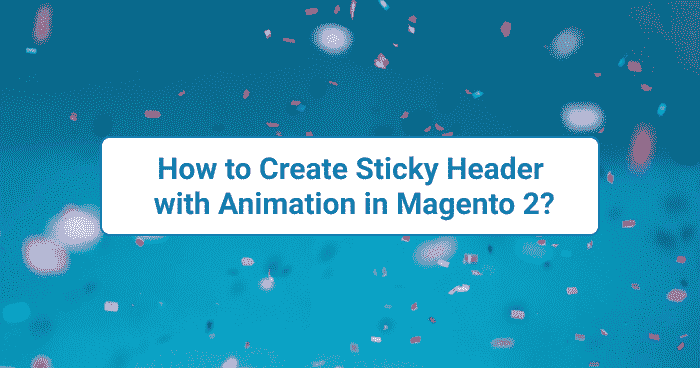

# 如何在 Magento 2 中创建带动画的粘性头？

> 原文：<https://medium.com/nerd-for-tech/how-to-create-sticky-header-with-animation-in-magento-2-3f8c26fd02f5?source=collection_archive---------13----------------------->



如何在 Magento 2 中创建带动画的粘性头？

# 如何添加自定义 Js 文件？

要编写 jQuery 代码，我们应该添加一个定制的 Js 文件。如果已经添加了 Js 文件，请跳过这一步。

在***app/设计/前端/ <厂商> / <主题>/Magento _ Theme/尤拉* t** /中添加***default _ head _ blocks . XML*文件**

```
<?xml version="1.0"?>
<page xmlns:xsi="[http://www.w3.org/2001/XMLSchema-instance](http://www.w3.org/2001/XMLSchema-instance)" xsi:noNamespaceSchemaLocation="urn:magento:framework:View/Layout/etc/page_configuration.xsd">
    <head>
        <script src="js/custom.js" />
    </head>
</page>
```

**JS 内容:**

```
requirejs(['jquery'], function( $ ) {
    $(window).scroll(function () {
        //variables    
        var getHeaderHeight = $('.page-header').innerHeight(); 
        var scroll = $(window).scrollTop(); if(scroll >= getHeaderHeight) {
            $(".page-header").addClass("sticky active");
        } 
        else 
        {
            $(".page-header").removeClass("sticky active");
        }
    }); 
});
```

# 如何添加 CSS/LESS 文件？

## 在较少的文件中更新

在***app/design/frontend/<vendor>/<theme>/web/CSS/source/***中的**_ extend . less**文件中添加代码

***_ extend . less*的内容:**

```
.page-wrapper {
   .page-header.sticky.active {
       position: fixed;
       z-index: 999;
       background: #fff;
       width: 100%;
       box-shadow: 0px -5px 11px rgba(0,0,0,.5);
       animation: scroll .3s ease-in-out;
   }
}
[@keyframes](http://twitter.com/keyframes) scroll {
   from {
       top: -100%;
   }
   to {
       top: 0px;
   }
}
```

## 在 CSS 文件中更新:

**如何添加 CSS 文件？**

在***app/design/frontend/<vendor>/<Theme>/Magento _ Theme/layout***/中添加***default _ head _ blocks . XML*文件**

```
<?xml version="1.0"?>
<page xmlns:xsi="[http://www.w3.org/2001/XMLSchema-instance](http://www.w3.org/2001/XMLSchema-instance)" xsi:noNamespaceSchemaLocation="urn:magento:framework:View/Layout/etc/page_configuration.xsd">
    <head>
        <script src="js/custom.js" /> 
        <css src="css/custom.css" />
    </head>
</page>
```

在***app/design/frontend/<vendor>/<theme>/web/CSS/***中的文件中添加代码

```
.page-wrapper .page-header.sticky.active {
      position: fixed;
      z-index: 999;
      background: #fff;
      width: 100%;
      box-shadow: 0px -5px 11px rgba(0,0,0,0.5);
      animation: scroll .3s ease-in-out;
 }[@keyframes](http://twitter.com/keyframes) scroll {
     from {
          top: -100%;
     }
     to {
          top: 0px;
     }
}
```

希望这篇文章能帮助你理解如何在 Magento 2 中创建带有动画的粘性标题？。如果您有任何疑问，您可以直接发邮件到[**【aryansrivastavadesssigner@gmail.com】**](mailto:aryansrivastavadesssigner@gmail.com)询问我，或者在这里 联系我 [**。**](https://desssigner.in/contact/)

如果你想要一个现场会议，请直接在 LinkedIn 上联系我，我会在周末安排一个在线会议。

如果你喜欢这篇文章，你可以给我买杯咖啡[给我买杯咖啡](https://www.buymeacoffee.com/aryansrivastava)。

*原载于 2021 年 7 月 7 日*[*https://desssigner . in*](https://desssigner.in/how-to-create-sticky-header-with-animation-in-magento-2/)*。*