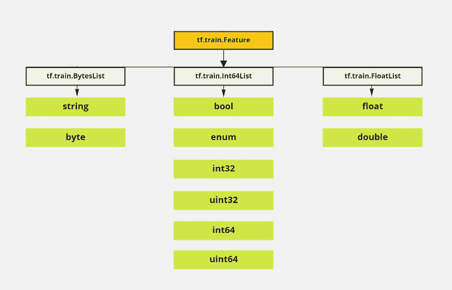
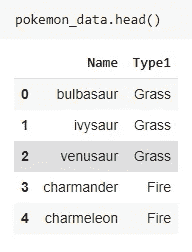

# 如何从任何数据集创建张量流 tfrecords:

> 原文：<https://medium.com/nerd-for-tech/how-to-create-tensorflow-tfrecords-out-of-any-dataset-c64c3f98f4f8?source=collection_archive---------1----------------------->

## 一个完整的一步一步的教程，绝对初学者与例子


图片由 [dlanor_s: Unsplash](https://unsplash.com/photos/2xEQDxB0ss4)

W 在处理深度学习模型时，我们经常使用非常大的数据集。以占用较少空间的二进制文件格式存储它们非常有用，这样可以缩短训练时间。TFRecord 格式是 tensorflow 中用于存储二进制记录序列的简单格式。我将一步一步地完成创建 tfrecord 的过程。但是在我们深入研究之前，我们需要了解一个叫做协议缓冲区的东西

# 那么，什么是协议缓冲区？

协议缓冲区(或 protobuf)用于结构化数据的高效序列化。假设您有两个用两种不同语言编写的服务。现在你需要在它们之间传递数据和通信。有一个问题，两种语言可能使用不同的格式来存储数据。所以我们需要一种中立的方式来传递数据。这正是 protobuf 所做的。它有助于序列化数据和在服务之间传递消息，确保类型一致性。这是一种跨平台、跨语言的库方式，用于结构化数据的高效序列化

【GIPHY 的 gif

> 注意:如果你想了解更多关于协议缓冲区的知识，我发现这个[视频](https://www.youtube.com/watch?v=BywIOD_Y3CE)非常有用

# **将数据集转换为 tfrecord:**

Tensorflow 有一个名为 **tf.train.Example** 的东西，它保存我们希望 tfrecords 保存的 protobuf 消息(数据)。 **tf.train.Example** 是一个{ " string ":**tf.train.Feature**}映射，其中 TF . train . feature 保存一个特征值。我们将这些 tf.train.Examples 写入 tfrecord 数据集。

## 创建 tfrecord 有三个步骤:

1.  将每个观测值转换为 tf.train.Feature 可接受的格式

**2。**使用 tf.train.Example 映射特性并创建特性消息

**3。**将的 tf.train.Example 消息序列化成 tfrecord 文件。

## 步骤 1:将每个观测值转换成 tf.train.Feature 可接受的格式:

tf.train.Feature 可以接受三种类型，它们是 BytesList、Int64List 和 FloatList



作者图片

根据我们观察到的值的类型，我们必须首先将它们转换成 BytesList、Int64List 或 FloatList。Tensorflow [docs](https://www.tensorflow.org/tutorials/load_data/tfrecord) 为我们提供了三个超级简单的快捷函数来帮助转换。

[来自 Tensorflow 文档的代码](https://www.tensorflow.org/tutorials/load_data/tfrecord)

这段代码返回一个 tf.train.Feature，其中包含我们观察到的值。所以如果我对这些值调用这个函数:

```
**print(_bytes_feature(b'test_string'))
print(_bytes_feature(u'test_bytes'.encode('utf-8')))

print(_float_feature(np.exp(1)))

print(_int64_feature(True))
print(_int64_feature(1))**
```

这是我会得到的回报

```
**bytes_list {
  value: "test_string"
}

bytes_list {
  value: "test_bytes"
}

float_list {
  value: 2.7182817459106445
}

int64_list {
  value: 1
}

int64_list {
  value: 1
}**
```

扎实！既然我们已经有了 tf.train.Feature 值，现在可以将它们映射到 tf.train.Example 中

## 步骤 2:映射特性并使用 tf.train 创建特性消息。示例:

这一步非常简单，老实说，和你如何映射一个普通的字典没有什么不同。一旦您映射了所有内容，您需要使用 tf.train.Example 创建一个特征消息。

[来自 tensorflow 文档的代码](https://www.tensorflow.org/tutorials/load_data/tfrecord)

太好了！我们现在有一个观察的 tf.train.Example。这是一条原始消息。下一步是将这个观察结果写入 tfrecord

## 步骤 3:将 tf.train.Example 消息序列化为 tfrecord 文件:

tf.train.Example 中的消息可以使用`.SerializeToString`方法序列化为二进制字符串。让我们把上面的两个步骤放在一个函数中。这个函数返回我们观察的序列化消息。

[来自 tensorflow 文档的代码](https://www.tensorflow.org/tutorials/load_data/tfrecord)

最后一步当然是将我们的 proto 消息写入 tfrecord。为此，我们首先初始化一个编写器。

```
**filename = 'test.tfrecord'**
**writer = tf.data.experimental.TFRecordWriter(filename)**
```

filename 参数接受您想要存储 tf 记录的路径。您现在要做的就是将序列化的消息传递给编写器

```
**writer.write(example.SerializeToString())**
```

就是这样！恭喜，我们已经成功地将观察结果写入 tfrecord。要添加所有的观察值，您所要做的就是迭代您的数据集，并逐个写入它们。

[来自张量流文档的代码](https://www.tensorflow.org/tutorials/load_data/tfrecord)

# 编写 tfrecord 的端到端示例:

我现在将向你展示一个我如何将 kaggle 的 pokemon 数据转换成 tfrecord 的例子。数据由单独文件中的标签和图像组成。我通常喜欢将 tfrecords 存储在我的驱动器中，并从那里使用它。



像往常一样，我首先复制粘贴助手函数来转换数据，并编辑上面的`serialize_example.py`方法来根据我的数据改变映射。

作者代码

***注:*** *我喜欢把我的图片转换成像素值的平面数组，并发送给 help 函数进行转换。在这种情况下，在 _int64_feature* 的返回语句中

`*tf.train.Feature(int64_list=tf.train.Int64List(value=[value]))*` *，去掉 value 中的方括号，因为你已经在传递一个数组*

> `*tf.train.Feature(int64_list=tf.train.Int64List(value=value))*`

我们做到了！我们成功地将数据集转换成可以存储和使用的 tfrecords。

## 资源:

1.  tfrecords 的 Tensorflow [docs](https://www.tensorflow.org/tutorials/load_data/tfrecord)
2.  协议缓冲区上的此[视频](https://www.youtube.com/watch?v=BywIOD_Y3CE)