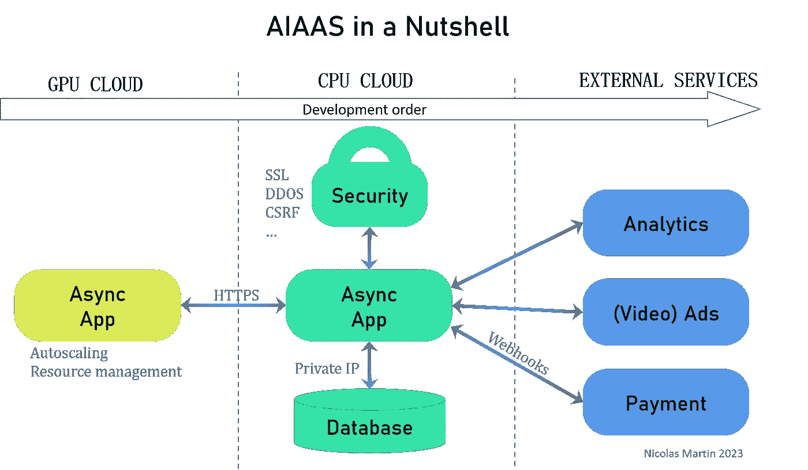
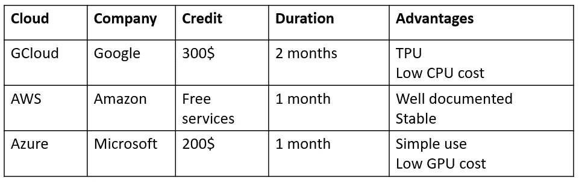
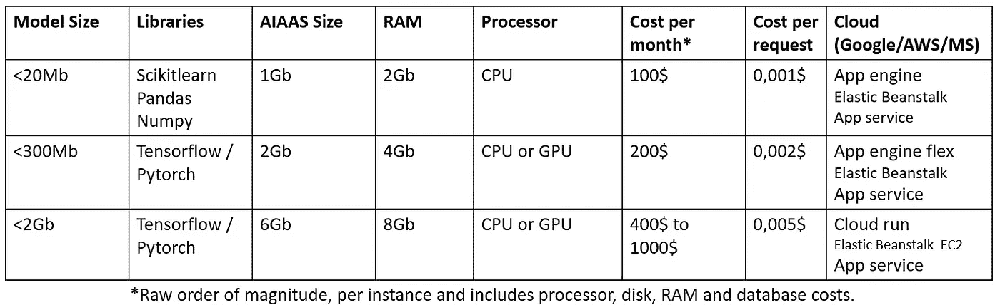
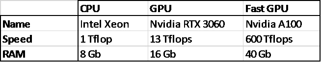
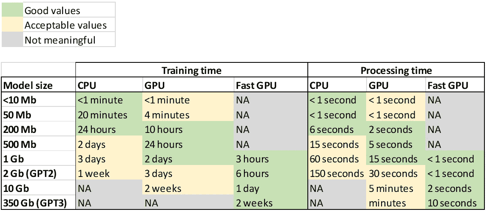
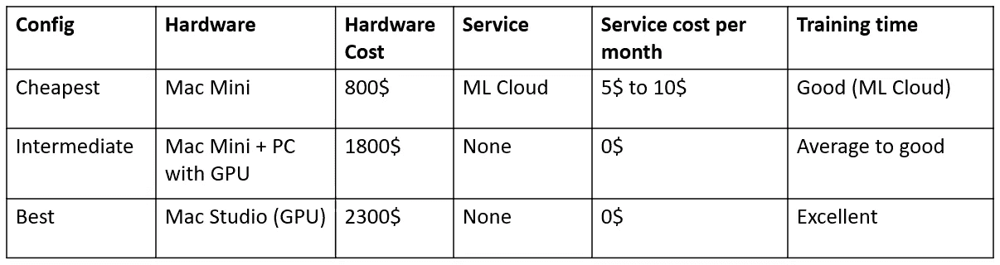
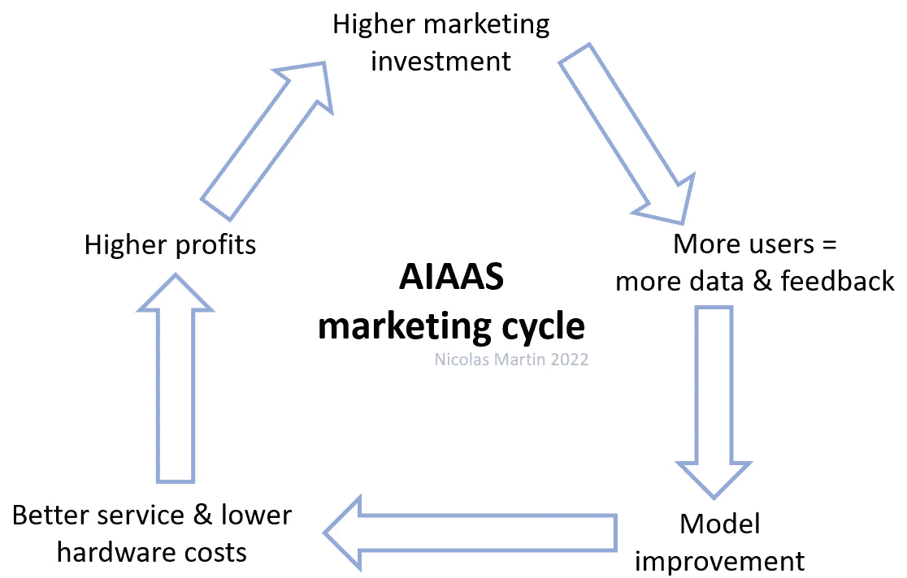
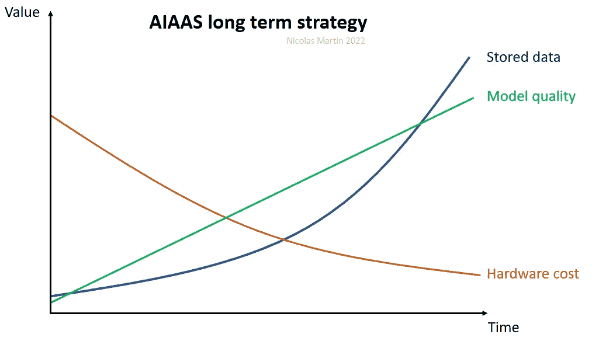

# 如何创建您的第一个大型 AIAAS？

> 原文：<https://medium.com/nerd-for-tech/how-to-create-your-first-large-scale-aiaas-1cd2225fd0f2?source=collection_archive---------1----------------------->

*最后更新:2023 年 1 月 31 日。*

*2022 年是* [*人工智能即服务年*](https://www.oreilly.com/radar/whats-ahead-for-ai-vr-nfts-and-more/) *(AIAAS)，许多令人兴奋的服务还在后头。然而，开发 AIAAS 仍然很棘手，因为许多人工智能模型需要大量的内存或计算能力，通常两者都需要。让我们看看如何应对这些挑战，即使是大规模的公共服务。*

AIAAS 架构。图片由作者提供。

## 使用异步框架

我希望我以前就知道使用 100%异步框架。大多数 ML 流程都很长，可以并行处理以同时回答几个客户的问题。如果是覆盖主要需求(用户管理、数据库、支付系统等)的简单 app。)，我推荐 [FastAPI](https://fastapi.tiangolo.com/) 搭配[乌龟 ORM](https://tortoise.github.io/) 。否则， [Django](https://docs.djangoproject.com/en/4.1/topics/async/) 是一个很好的解决方案，但是需要额外的扩展来管理异步。如果你使用一个同步框架，整个服务将在一个 ML 进程中被阻塞，其他用户只能在进程完成后才能使用服务，这很不幸。

## 云服务

谷歌、亚马逊和微软的三个主要云服务具有相似的功能。这就是为什么很难说哪个是最好的。

以下是对三种主要云服务的概述，以及一些明显的优势。

主要云服务。图片由作者提供。

对于 AIAAS，1 或 2 个月的信用或免费试用是简洁的，因为你的 AI 模型和其他服务之间的开发周期比经典服务更长。因此，如果您想在云中实现 AIAAS 之前降低成本**，强烈建议您在本地花费更多时间准备模型和服务**。另一个好主意是开始与 2 或 3 个云服务合作，看看哪个最适合你的需求。

这三种云服务在全球范围内都有大量的服务器，这对于让您的 AIAAS 随时随地快速可用至关重要。

也有很多其他云公司提供有吸引力的价格和服务，但它们可能不适合大规模的 AIAAS 部署。

在所有情况下，对合同条款和服务费用非常小心是至关重要的。由于对服务费用的错误评估，许多用户已经损失了很多钱。

领先的云服务提供了许多功能，但它们有时只适用于 GPU 机器。许多云服务提供具有竞争力的价格、许多不同的机器和良好的可扩展性特性的 GPU，但大多数没有围绕三个主要 CPU 云服务的所有服务。
因此，可能有必要为处理 ML 任务的 GPU 提供一个云服务，并为处理 CPU 任务提供一个云服务。

## 云成本

经典 SAAS 使用不需要大量硬件资源的库。AIAAS 的情况则远非如此: **AI 模型在几兆到几千兆之间，大规模应用会有相当大的成本。**

记住，那些模型**必须由通常占用大量磁盘空间的库来处理。**例如，TensorFlow 占用大约 1Gb 的磁盘空间，在许多情况下，超过两倍的 RAM 空间。

云**服务使用类似于 [Unicorn](https://www.unicorn-engine.org/docs/) 的仿真器**，这进一步增加了磁盘空间和 RAM。这就是为什么云中的部署会由于非常不同的基础设施而不同于本地部署。

然而，**云服务可以根据新客户的到来自动扩展所需的硬件资源**，使 AIAAS 成为可能。自动扩展意味着根据当前的硬件容量覆盖率添加或删除服务器的实例(例如，如果服务器达到其 GPU 容量的 70%，云服务将创建一个新的实例以避免服务降级或崩溃)。

云服务提出了许多硬件设置，从低内存/计算能力到高。**根据服务模式的不同，您必须尽可能使其与硬件相适应。**

每个模型大小和实例的云服务平均成本。图片由作者提供。

上表显示了每个实例每月的成本，应该非常仔细地评估。每月花费 500 美元的实例相对便宜，因为它可以覆盖 10000 次或更多的访问，用这 10000 次访问中的 1%产生 1000 美元的销售额。

此外，有许多解决方案可以减少内存、[训练时间](/towards-data-science/how-to-reduce-the-training-time-of-your-neural-network-from-hours-to-minutes-fe7533a3eec5)和运行模型所需的计算，如[修剪](https://towardsdatascience.com/scooping-into-model-pruning-in-deep-learning-da92217b84ac)、[冻结](https://towardsdatascience.com/freezing-a-keras-model-c2e26cb84a38)，或更轻的结构，如 [TensorFlow-lite](https://towardsdatascience.com/tensorflow-on-mobile-tensorflow-lite-a5303eef77eb) 或 [ONNX](/microsoftazure/accelerate-your-nlp-pipelines-using-hugging-face-transformers-and-onnx-runtime-2443578f4333) 。在许多情况下，拥有非常快的 AIAAS 可能还不够；这就是为什么您必须处理特定的 AIAAS 约束:时间。

照片由 [Hannah Busing](https://unsplash.com/@hannahbusing?utm_source=medium&utm_medium=referral) 在 [Unsplash](https://unsplash.com?utm_source=medium&utm_medium=referral) 上拍摄

## 培训时间

培训时间可能会更长或更短，这取决于您正在处理的数据科学流程。

**这主要取决于最终的模型大小和硬件**，但也与模型复杂性和数据类型(图像、文本、声音等)有关。).

下面是 3 台机器的简单对比。它没有涵盖所有场景(自然语言处理、图像分类等。).它**只是给出了一个大概的数量级。**

3 2022 年 AIAAS 主要硬件配置。图片由作者提供。

下表列出了与型号尺寸相比的一些**持续时间值。**

使用 3 个硬件配置的训练和处理时间的大致数量级。图片由作者提供。

一些型号可能像 GPT-3 一样巨大，需要像英伟达 A100 这样强大的硬件。这篇[文章](https://towardsdatascience.com/meet-m6-10-trillion-parameters-at-1-gpt-3s-energy-cost-997092cbe5e8)描述了一些关于能源消耗、成本和替代能源的有趣的事情。

其他硬件设置通常用于市场或云平台。

## 处理时间

经典的 web 服务必须在不到一秒的时间内回答；否则，大多数用户会退出。

这就是为什么人工智能流程比传统流程更长，可能会被视为服务的障碍。

然而，如果人工智能仍然比人类更快，人们会等待，如果这种好处值得耐心的话。这就是为什么有必要展示为什么这个过程需要几秒钟，这要归功于一个**清晰的解释**(例如加载动画 gif)，或者，如果很长，要归功于一个**点播服务**，结果将在几分钟或几小时内发送。否则，**云服务有快速的 GPU 来进行非常快速的计算**，但这会增加整体成本。要小心，因为**沉重的硬件设置可能会导致成本激增**。云成本模拟器就是为此而生的。取决于你找到正确的平衡。

帕特里克·沃德在 [Unsplash](https://unsplash.com?utm_source=medium&utm_medium=referral) 上拍摄的照片

除此之外，还有其他时间需要考虑:**模型安装和加载时间**。无论是否自动部署服务或添加新实例，都会发生这种情况。当您必须处理需要几分钟时间来安装或加载的较大模型时，这可能是一个问题。在这种情况下，**使用固态硬盘**进行快速安装可能会很有意思。

## 硬件促进发展

尽管一切都可以在网络服务上运行，但我们不能忽视的是，世界上使用的大多数设备都在 Android 和 iOS 上运行，如果我们的 AIAAS 不在智能手机上运行，我们将失去一个重要的市场份额，即使网络服务适用于智能手机。事实是，大多数人更喜欢在应用程序中获得服务，而不是在网页窗口中。

遗憾的是，即使 Mac 有优化的硬件架构，但没有快速的 GPU 也不是训练模型的最佳选择。另一方面，由于 Mac 政策，PC 不能用于 iOS 开发。

这就是为什么**覆盖 100%设备市场**的最便宜的解决方案是使用最新但负担得起的 Mac 来开发带有 XCode 的 iOS 应用程序，以及像 [Paperspace](https://www.paperspace.com/) 这样的 ML 云服务来训练带有 GPU 的模型。

注意:即使是 Kotlin 或 Flutter 等多平台语言，也需要一台 Mac 来开发 iOS 应用。

覆盖 100%全球市场的硬件成本。图片由作者提供。

请记住，有适合于 [iOS](https://developer.apple.com/machine-learning/core-ml/) 和[安卓](https://www.tensorflow.org/lite/guide?hl=en)智能手机的深度学习库，但是如果这个模型太大，你可以通过一个安全的网络套接字从应用程序远程访问它。

## 安全

**aias 比经典的 SAAS** 要求更高的安全性，因为使用黑客行为获取免费请求时，处理成本会很高。这就是为什么 Recaptcha、CSRF 保护和所有云安全规则都是强制性的。

当然，支付系统必须使用**数字签名** [**网络钩子**](https://en.wikipedia.org/wiki/Webhook) **来完全保护。**

强烈建议使用安全的云服务，例如 **GCloud、Azure 或 AWS** :它们不会保护您免受各种欺诈，但它们至少会**保护数据库、模型和接口之间的所有内部连接，而且它们以较低的价格提供保护选项(例如:每月 1 美元，抵御 DDOS 攻击)。**

[米卡·鲍梅斯特](https://unsplash.com/@mbaumi?utm_source=medium&utm_medium=referral)在 [Unsplash](https://unsplash.com?utm_source=medium&utm_medium=referral) 上拍摄的照片

## 收益性

在某些情况下，广告可能很有趣，但浏览量必须非常高，才能让这项服务盈利。这就是为什么广告通常不适合友邦保险的原因，因为高处理成本不能被它们补偿。他们只能通过视频广告得到补偿。

像许多现代软件即服务一样，最好的选择往往是免费试用几次，并提出每月或每年订阅的建议。一般来说，大约 1%或 2%的访问者会根据服务的吸引力每月付费。

大多数模型都可以通过参数进行调整，并可以为服务增加价值。让服务有利可图也意味着找到创新的方式来调整模型，从而提高客户的兴趣。

型号也需要不断改进，以保持竞争力并吸引新客户。因此，您的友邦保险应该充分考虑**客户的反馈:即使反馈在现在没有用，将来也可能有用。因此，您的可靠业务模型应该包括**持续模型改进策略。****

盈利的最佳设置是免费账户和订阅计划的视频广告。

欲了解更多信息，请参阅文章 [AIAAS 盈利能力](/nerd-for-tech/aiaas-profitability-13a85faf0981)。

## 营销

有几种现代方式来宣布您的 AIAAS:

*   社交网络中的自动聊天机器人回答可能感兴趣的特定人，总体而言，如果服务是基于 NLP 的。
*   大多数报纸都愿意发布最新的技术趋势，任何新的 AIAAS 都是受欢迎的。
*   社交媒体影响者。
*   广告服务。

营销对友邦保险来说并不简单。你必须处理硬件成本和模型改进。图片由作者提供。

AIAAS 数据通常比标准 SAAS 更有价值。您收集的数据越多，您就越能改进您的模型，也越能通过降低硬件要求和提高客户满意度来提高您的投资回报。

收集的数据和反馈可以提高模型质量，从而降低硬件成本并增加收入。图片由作者提供。

因此，在开始阶段投资营销以增加数据可能是一个非常好的策略。AIAAS 比标准 SAAS 复杂得多，但也更灵活和动态。

如果您的服务在全球范围内都可以使用，那么在不同的地区或州，结果可能会有很大的不同。随意在许多国家投资，看看哪些国家有最好的结果，从而提高你的数字。

从品牌的角度来看，你应该提出你的服务的所有积极点，突出良好的隐私政策，因为人们在与人工智能打交道时仍然存在一些不信任。如今，高质量的服务意味着高安全性和高隐私策略。所有的优势都应该呈现出来，所有的恐惧都要尽可能的减少。

## 复用性

**AIAAS 的开发非常困难，但是风险越高，你得到的经验和成功的机会就越多。**

事实上，在构建 AIAAS 的过程中，并没有无用的经验。其实恰恰相反！一旦您完成了一个 AIAAS，许多组件可以很容易地在新项目中重用，并大大缩短它们的上市时间。因此，即使第一批 AIAAS 的结果没有预期的好，在可重用性和从这次经历中学到的技能方面，您仍然有很大的优势。他们也增加了未来项目或工作的成功机会。

## 结论

由于云平台和强大的硬件，AIAAS 现在已经成为可能，但它需要一个非常好的商业模式才能足够盈利。这就是为什么，除了通过以动态方式使用模型参数或创新营销方法的创造力之外，不断的模型改进是必要的。这种更高的复杂性使得 AIAAS 更具挑战性，但也更有趣。AIAAS 的赢家不仅要有好的模型，还要有好的设计、盈利能力、安全性、营销、硬件和改进策略。