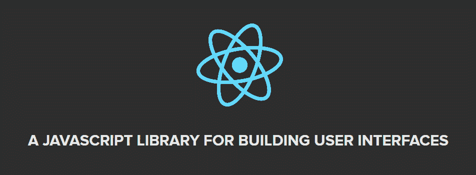
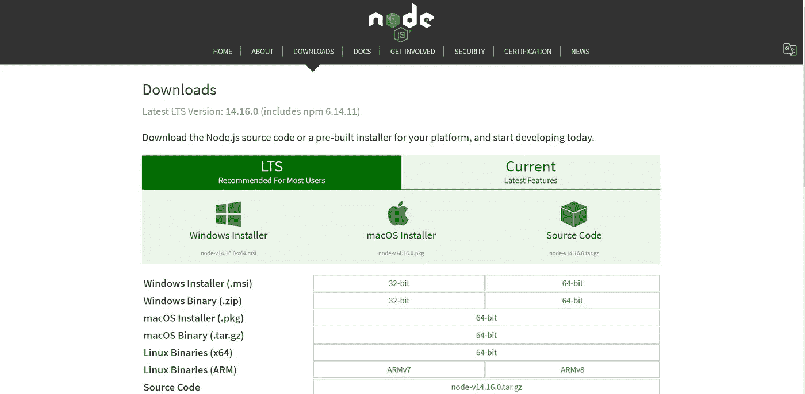
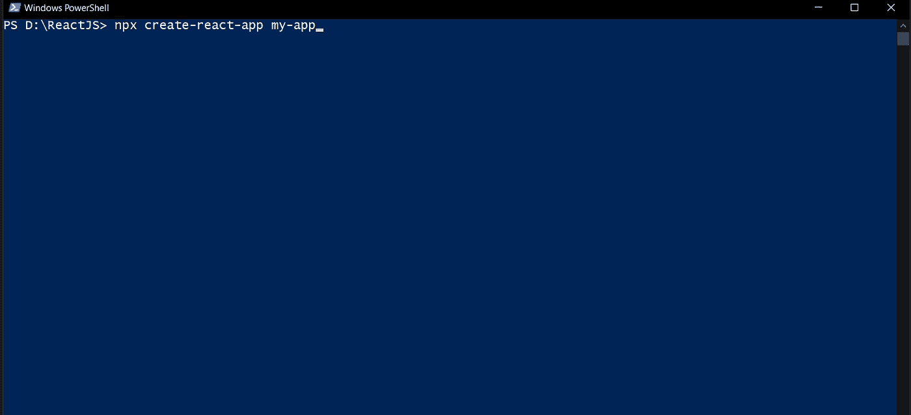
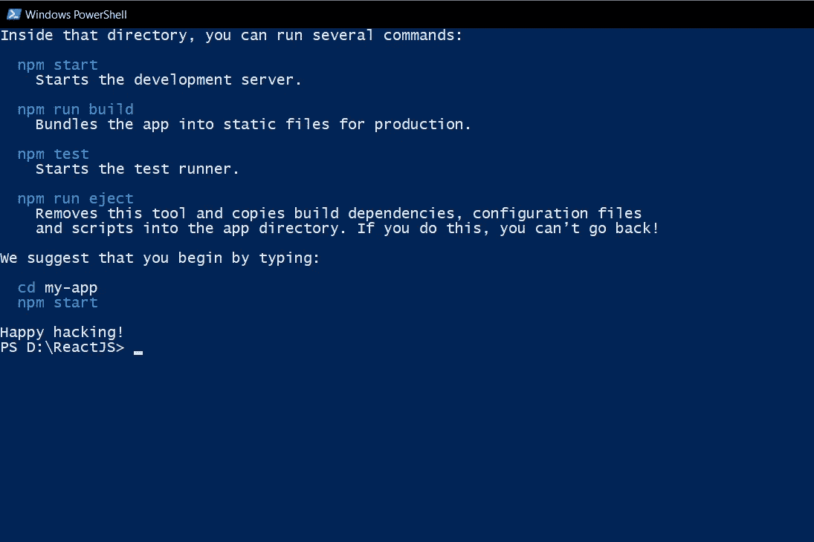
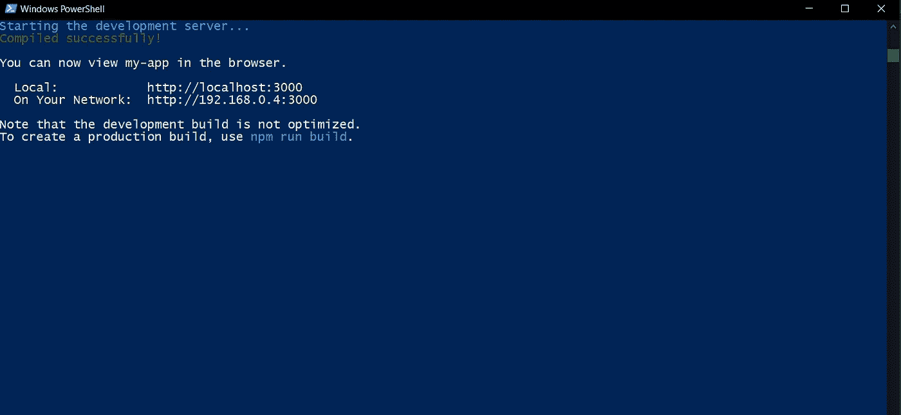

# 如何创建您的第一个 React 应用程序

> 原文：<https://medium.com/nerd-for-tech/how-to-create-your-first-react-app-66ae2fd39ba2?source=collection_archive---------13----------------------->



ReactJS 为前端编程的一些最持久的问题提供了优雅的解决方案，允许您轻松地构建动态和交互式的 web 应用程序。它快速、可伸缩、灵活、强大，并且拥有一个正在快速增长的强大的开发人员社区。这是学习反应的最佳时机。

## 安装:

> 我用的是 Windows 10 的机器。

首先，您需要在您的机器上安装 Node.js。下载链接[这里](https://nodejs.org/en/download/)。



# 创建 React 应用:

[创建 React App](https://github.com/facebookincubator/create-react-app) 是**学习 React** 的舒适环境，也是在 React 中开始构建**新** [**单页**](https://reactjs.org/docs/glossary.html#single-page-application) **应用**的最佳方式。

它设置您的开发环境，以便您可以使用最新的 JavaScript 特性，提供良好的开发人员体验，并针对生产优化您的应用程序。你需要在你的机器上有[节点> = 10.16 和 npm > = 5.6](https://nodejs.org/en/) 。要创建项目，请运行:

```
npx create-react-app your-app-name
```



在安装完所有的包和依赖项之后，查找创建这个应用程序的目录。



并运行以下命令:

```
cd my-app
npm start
```

在此之后，您应该会在您的 power shell 中看到以下内容:



嗯！！我们刚刚创建了您的第一个 react.js 项目。现在访问提供的地址，查看您的第一个 react 应用程序:


如果你正确地遵循了每一步，你应该会看到这个，这是 react 应用程序的样板模板。

## 感谢您的阅读！！

> 如有任何问题或困扰，欢迎在 Instagram 上联系我( [@ankan_designer](https://www.instagram.com/ankan_designer/) )